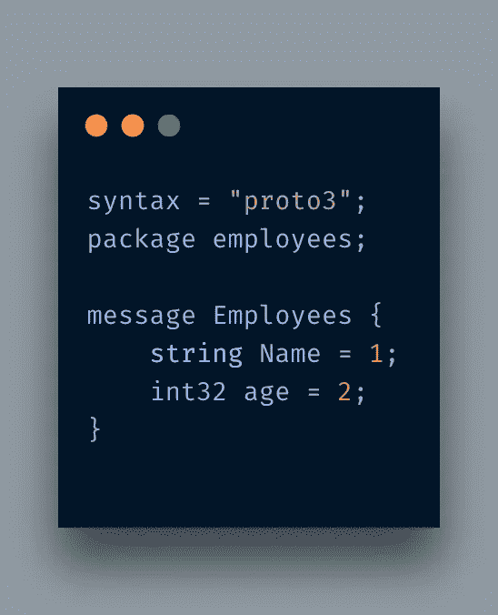

# Protobuffer 和 Python 入门

> 原文：<https://itnext.io/getting-started-with-protobuffer-and-python-2ea749924412?source=collection_archive---------0----------------------->


在这篇文章中，我将讨论 [Proto Buffers](https://developers.google.com/protocol-buffers) 以及如何在 Python 中使用它们在网络间传递消息。简而言之，协议缓冲区或 *Porobuf* 用于数据序列化和反序列化。在讨论 Protobuf 之前，我想先讨论一下数据序列化和序列化。

# 数据序列化和反序列化

根据维基百科

> 串行化是将[数据结构](https://en.wikipedia.org/wiki/Data_structure)或[对象](https://en.wikipedia.org/wiki/Object_(computer_science))状态转换成可以存储(例如，在[文件](https://en.wikipedia.org/wiki/Computer_file)或内存[数据缓冲区](https://en.wikipedia.org/wiki/Data_buffer)中)或传输(例如，通过[计算机网络](https://en.wikipedia.org/wiki/Computer_network))的格式，并在以后重构(可能在不同的计算机环境中)

简而言之，您将简单和复杂的数据结构和对象转换成字节流，以便它们可以传输到其他机器或存储在某些存储器中。

数据反序列化是恢复原始格式以备将来使用的相反过程。

数据序列化和数据序列化都不是谷歌发明的。大多数编程语言都支持它。Python 提供 [pickle](https://docs.python.org/3/library/pickle.html#:~:text=%E2%80%9CPickling%E2%80%9D%20is%20the%20process%20whereby,back%20into%20an%20object%20hierarchy.) ，PHP 提供 [serialize](https://www.w3schools.com/php/func_var_serialize.asp) 函数。类似地，许多其他语言也提供了类似的功能。问题是这些序列化/反序列化机制没有标准化，只有当源和目标使用相同的语言时才有用。需要一种标准格式，可以在整个系统中使用，而不管底层的编程语言是什么。

您可能会想，嘿，为什么不直接使用 XML 或 JSON 呢？问题是，这些格式是文本形式，如果数据结构很大，它们可能会变得很大，如果通过网络发送，可能会使事情变得很慢。*另一方面，Protobuf* 是二进制格式，如果发送大量数据，其大小可能会更小。

另一方面，Protobuf 不是第一个二进制格式的数据序列化格式。[MongoDB 开发的 BSON](https://bsonspec.org/) (二进制 JSON)和 [MessagePack](https://msgpack.org/index.html) 也支持这样的设施。

谷歌的 Protobuf 不仅仅是数据交换。它还提供了一组规则来定义和交换这些消息。除此之外，它还被大量用于 gRPC，Google 的方式*远程过程调用*。因此，如果你计划用任何编程语言在 gRPC 上工作，你必须有写`.proto`文件的想法。

# 装置

为了使用基于`.proto`的消息，你必须在你的机器上安装一个原型编译器，你可以根据你的操作系统从[这里](https://github.com/protocolbuffers/protobuf/releases)下载。由于我在 macOS 上，我就简单的用*自制*安装了。一旦安装正确，你可以运行命令`protoc --version`来测试版本。截至目前，我的机器上安装的是最新版本的`libprotoc 3.9.1`。

现在让我们编写第一个原型消息。



第一行指出您应该使用哪个版本的 *protobuf* 消息。如果你不指定一个，它将是版本 2。第二行是关于包装你的信息，以避免任何冲突。对于这个特别的消息，你可以忽略它。代码生成后，`package`行在不同的编程语言中表现不同。在 Python 中，它没有任何区别，而在 Go 和 Java 语言中，它被用作包名，而在 C++中，它被用作名称空间。

下一行以`message`开始，后跟消息类型。在我们的例子中是`Employee`。然后，它由字段及其类型组成。例如，它是`string`和`int32`类型字段。如果你使用过像 C 和 Go 这样的语言，你会发现它和`struct`很相似。

这里提到了两个字段:`string`类型的`Name`和`int32`类型的`age`。您可以通过在数据类型名称前添加`required`来使字段成为强制字段。默认情况下都是`optional`。有三种类型的规则:

*   *必填* :-表示该字段为必填。
*   *可选* :-您可以离开该字段。
*   *重复*:该字段可以重复 0 次或多次。

你会注意到每个字段都被分配了一个编号。这不是一个典型的变量赋值，而是用于标记识别和[编码](https://developers.google.com/protocol-buffers/docs/encoding)目的。只是澄清一下，这种编号[并不像许多人建议的那样是出于排序的目的](https://developers.google.com/protocol-buffers/docs/encoding#order)，你不能保证这些字段将以何种顺序编码。

好了，消息已经准备好了，现在我们必须序列化它。为此，我们将使用`protoc`编译器，它可以生成多种语言的代码。由于我使用的是 Python，所以我将使用以下命令:

`protoc -I=. --python_out=. ./test.proto`

*   **-I** 用于查找各种依赖关系和原型文件的路径。我提到了一个点(。)获取当前目录。
*   **-python_out** 用于存储生成的 python 文件的路径。同样，它是在当前文件夹中生成的。
*   最后一个未命名的参数是传递原型文件路径。

当它运行时，它生成一个格式为 **<的文件，原始文件名> _pb2.py.** 在我们的例子中，它是`test.proto`，所以生成的文件名是`test_pb2.py`。

此时您不需要担心生成的文件。现在，你所要关心的是如何使用这个文件。我正在创建一个新文件，`test.py`，它包含以下代码:

```
import test_pb2 as Testobj = Test.Employees()
obj.Name = 'Adnan'
obj.age = 20
print(obj.SerializeToString())
```

这很简单。我导入了生成的文件，并从那里实例化了`Employees`对象。这个`Employees`来自我们在`.proto`文件中定义的消息类型。然后，您只需为字段赋值。最后一行是打印对象值。当我运行程序时，它会打印:

`b'\n\x05Adnan\x10\x14'`

如果我把年龄设为字符串呢？它给出了错误:

```
Traceback (most recent call last):
  File "test.py", line 5, in <module>
    obj.age = "20"
TypeError: '20' has type str, but expected one of: int, long
```

太棒了，所以它也在验证是否传递了正确的数据。现在让我们将这个输出保存在一个二进制文件中。

如果我们用 JSON 格式保存类似的东西呢？代码现在看起来如下所示:

```
import test_pb2 as Testobj = Test.Employees()
obj.Name = 'Adnan'
obj.age = 20
print(obj.SerializeToString())with open('output.bin','wb') as f:
    f.write(obj.SerializeToString())json_data = '{"Name": "Adnan","Age": 20}'with open('output.json','w',encoding='utf8') as f:
    f.write(json_data)
```

现在，如果我做一个`ls - la`，结果如下:

```
➜  LearningProtoBuffer ls -l output*
-rw-r--r--  1 AdnanAhmad  staff   9 May 13 18:05 output.bin
-rw-r--r--  1 AdnanAhmad  staff  27 May 13 18:05 output.json
```

JSON one 的大小为 **27 字节**，而 *protobuf* one 仅占用 **9 字节**。你很容易就能看出谁是赢家。想象一下发送一个 JSONified 数据流，它肯定会增加延迟。通过以二进制格式发送数据，你可以压缩许多字节，提高系统的效率。

# 结论

在这篇文章中，您了解了如何使用协议缓冲区高效地发送和存储大量数据，协议缓冲区可以生成多种语言的代码，从而使数据交换更加容易，而不必担心底层编程语言。

*原载于 2021 年 5 月 13 日*[*http://blog . adnansiddiqi . me*](http://blog.adnansiddiqi.me/getting-started-with-protobuffer-and-python/)*。*