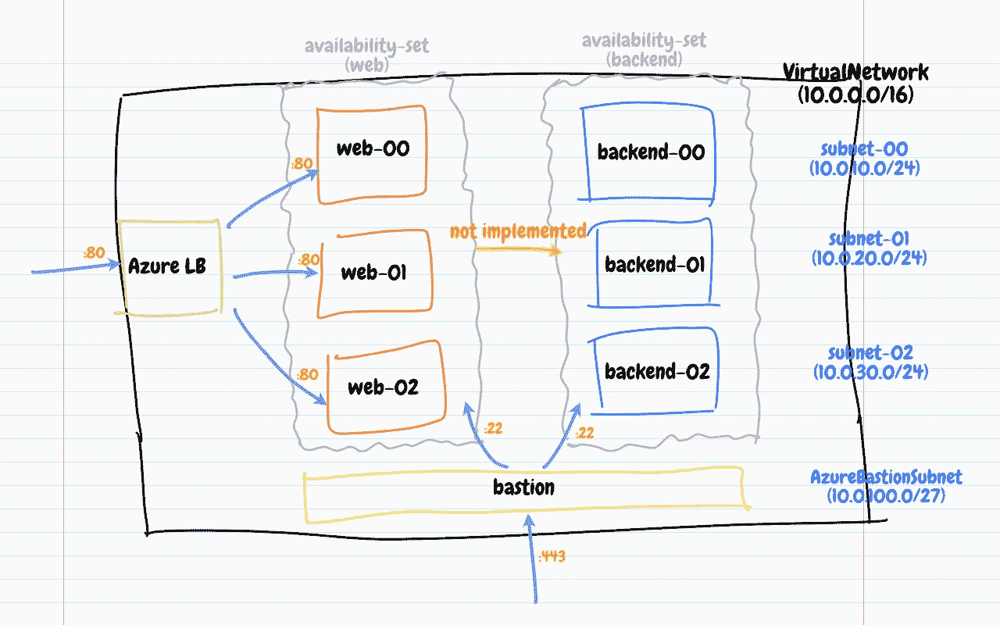

# Pulumi SDK —关键概念

> 原文：<https://itnext.io/getting-started-with-pulumi-sdk-22dc0b7ab83f?source=collection_archive---------3----------------------->

这篇文章是对 Pulumi SDK 的一些关键概念的总结。如果你也在使用 Pulumi，我希望这篇文章的内容对你有用。

最近，我完成了我的第一个 [Pulumi](https://www.pulumi.com/) 程序，其中我使用 Pulumi 在 Azure 上提供一些资源。该程序管理一个具有 3 个私有子网的虚拟网络、一些通过可用性集分组并连接操作系统磁盘的私有虚拟机、一个 L4 [负载平衡器](https://docs.microsoft.com/en-us/azure/load-balancer/load-balancer-overview)来处理外部 HTTP 流量，以及一个 [Azure Bastion](https://azure.microsoft.com/en-ca/services/azure-bastion) 服务来实现安全的外部 SSH 访问。

这是我的虚拟网络拓扑的样子:

虚拟网络拓扑([https://github.com/ihcsim/pulumi-azure](https://github.com/ihcsim/pulumi-azure))

我将这篇文章分为以下几个部分:

*   使用熟悉的编程语言
*   我们在哪里存储资源配置
*   了解输入和输出类型
*   理解应用
*   单元测试我们的代码
*   结论

# 使用熟悉的编程语言

Pulumi 允许我们用我们已经熟悉的编程语言(即 Go)来表达我们的资源供应工作流。我们可以利用 Go 的内置结构，如模块、包、条件、循环、goroutines、通道、错误处理等。编写可读、可测试和可维护的代码。

例如，如果我们想要添加一组新的虚拟机，我们可以将新的规范附加到[现有虚拟机配置](https://github.com/ihcsim/pulumi-azure/blob/14845e52639dcb150a1f428cf81d89a99f492da3/Pulumi.dev.yaml#L188-L212)中。当前的[计算供应逻辑](https://github.com/ihcsim/pulumi-azure/blob/14845e52639dcb150a1f428cf81d89a99f492da3/pkg/component/compute/compute.go#L55-L146)已经知道如何通过 Pulumi 与 Azure `compute` API 交互，以确保新的虚拟机及其依赖关系得到相应的供应。如果需要向构造函数中添加新字段，只需更改一个代码点。如果我们新添加的不正确，虚拟机[单元测试](https://github.com/ihcsim/pulumi-azure/blob/14845e52639dcb150a1f428cf81d89a99f492da3/pkg/component/compute/compute_test.go#L14-L91)可以快速发现这些问题。

所以不需要学习新的 DSL👍👍！

# 我们在哪里存储资源配置

许多现有的[示例](https://github.com/pulumi/examples)显示了资源配置(例如，子网 CIDR、端口号、管理凭证等。)可以内联在`main`程序中。

例如，以下代码片段创建了一个包含两个子网的 Azure 虚拟网络:

使用内联配置值创建子网

这种方法的明显局限性是，复制粘贴代码的数量会随着子网数量的增加而增加。此外，机密在代码中以纯文本的形式公开。

由于程序是用 Go 编写的，我们可以使用一个简单的`for`循环来干燥代码:

干燥子网配置代码

但是第二行的`subnetInputs`片从何而来？该片的创建将涉及从配置源读取子网配置，无论源在哪里。

虽然有一些地方可以作为资源配置源，但是在搜索了 Pulumi 的文档和 *Slack* 历史之后，看起来 [stack](https://www.pulumi.com/docs/intro/concepts/stack/) 配置是一个合理的选择。

> 📝栈是一个独立的、可独立配置的 Pulumi 程序实例。

可以通过 [Pulumi CLI 或 SDK](https://www.pulumi.com/docs/intro/concepts/config/#config-stack) 将新配置添加到堆栈中。此外，[结构化配置](https://www.pulumi.com/docs/intro/concepts/config/#structured-configuration)可用于以连贯的方式组织配置。

例如，我们可以以合理的方式构建子网配置，并使用以下命令将它们添加到`dev`堆栈中:

将子网配置添加到堆栈

> 📝堆栈的配置存储在 Pulumi- <stack>中。yaml 文件。</stack>

要将堆栈配置读入 Pulumi 程序，我们可以使用`[config](https://godoc.org/github.com/pulumi/pulumi/sdk/go/pulumi/config)` [包](https://godoc.org/github.com/pulumi/pulumi/sdk/go/pulumi/config)中的 API。`pulumi.TryObject()`功能可用于水合自定义`SubnetInput`类型，如下所示:

使用“pulumi . try object”API 来合并 SubnetInput 对象

为了保护敏感数据，可以通过使用`--secret`标志将它们标记为机密来加密配置。如果嵌套字段被标记为机密，则整个所属资源配置将被加密。

例如，我的`OSProfile`和`OSProfileLinux`配置在状态记录中显示为加密的，因为它们的一些[字段](https://github.com/ihcsim/pulumi-azure/blob/14845e52639dcb150a1f428cf81d89a99f492da3/Pulumi.dev.yaml#L133-L151)被标记为机密。

Pulumi 控制台中显示的加密状态

最后，通过将相关部分复制到新堆栈的 YAML 文件中，将资源配置存储在堆栈中使我们能够在另一个堆栈中重用它们。

> ⚠️由于 Pulumi 使用每个栈的加密密钥来加密秘密，所以不可能在不同的栈中重用秘密。更多信息见本[问题](https://github.com/pulumi/pulumi/issues/1583)。

# 了解输入和输出类型

`[pulumi](https://godoc.org/github.com/pulumi/pulumi/sdk/go/pulumi)` [包](https://godoc.org/github.com/pulumi/pulumi/sdk/go/pulumi)定义了一个非常全面的`Input`和`Output`类型列表。对于新用户来说，理解这些类型的正确用法是很重要的。例如，共有 17 个`string`相关的`Input`和`Output`类型。

看了很多例子后，我想我明白了…🤔

记住，

> 📝`Input`类型在构造函数中用作创建和更新资源的参数。
> 
> 📝`Output`类型在结构中显示为导出字段，以便程序的其他部分可以使用它们。类似于[的工作承诺](https://en.wikipedia.org/wiki/Futures_and_promises)，一旦拥有的资源被完全提供，最初未知的资源属性将变得可用。

此外，

> 📝`Output`类型用于建立资源之间的依赖关系。

以`[compute.VirtualMachine](https://godoc.org/github.com/pulumi/pulumi-azure/sdk/go/azure/compute#VirtualMachine)`类型为例，`[compute.NewVirtualMachine()](https://godoc.org/github.com/pulumi/pulumi-azure/sdk/go/azure/compute#NewVirtualMachine)`构造函数接受一个`[compute.VirtualMachineArgs](https://godoc.org/github.com/pulumi/pulumi-azure/sdk/go/azure/compute#VirtualMachineArgs)`参数:

虚拟机构造函数的输入参数

注意，`compute.VirtualMachineArgs`结构中的所有字段都是某种形式的`Input`类型。**这些是您提供给构造器以创建虚拟机的输入字段。**

如果我们检查`compute.VirtualMachine`结构，我们可以看到它的所有导出字段都是`Output`类型:

虚拟机结构的输出字段

这些是输出字段，程序的其他部分可以使用它们来创建下游资源。

让我们再深入一点…

请注意，`compute.VirtualMachineArgs`结构的`OsProfile`字段属于类型`VirtualMachineOsProfilePtrInput`类型，这是一个 Go 接口:

VirtualMachineOsProfilePtrInput 接口

通过搜索`compute`包文档，发现以下类型实现了`compute.VirtualMachineOsProfilePtrInput`接口:

*   `compute.VirtualMachineOsProfileArgs`
*   `compute.VirtualMachineOsProfileOutput`
*   `compute.VirtualMachineOsProfilePtrOutput`

😱 😱 😱迷惑？其实也没那么糟糕…

记住，

> 📝一个`Args`结构由`Input`字段组成，这些字段是 Go 接口。`Input`类型通常由其他`Args`或`Output`类型实现。这些字段可以被赋予原始类型的值，如`pulumi.String`、`pulumi.Bool`、`pulumi.Int`等。，或来自其他资源的`Output`类型。

如果你想知道一个类型的底层类型，查看它的`ElementType()`方法。举个例子，

OSProfile 参数和输出 ElementType()方法

让我们将这些知识应用到前面的`VirtualMachine`和`OSProfile`例子中:

使用提供的操作系统配置文件参数创建新的虚拟机

由于`compute.VirtualMachineOsProfile`没有构造函数，我们可以直接创建`compute.VirtualMachineOsProfileArgs`，并将其传递给`compute.VirtualMachineArgs`的一个实例。然后，`compute.VirtualMachineArgs`实例成为传递给`NewVirtualMachine()`构造函数的参数。

如果排序很重要，那么可以使用`VirtualOsProfileArgs.ToVirtualMachineOsProfileOutput()`方法将`VirtualOsProfileArgs`实例转换成`VirtualOsProfileOutput`实例。当直接传递给`VirtualMachineArgs`实例时，`VirtualOsProfileOutput`在虚拟机和操作系统配置文件资源之间建立依赖关系。

希望这有助于弄清楚如何使用`Input`和`Output`类型。

# 理解应用

因为`Output`的工作像[承诺](https://en.wikipedia.org/wiki/Futures_and_promises)，像条件和循环这样的普通结构对它们不起作用。

假设我们想从虚拟网络拥有的子网列表中找到一个子网:

无法迭代子网输出列表

第 21 行的`for`循环不起作用，因为我们不能迭代`network.VirtualNetworkSubnetArrayOutput`类型。

这就是`[OutputState.Apply(applier func(interface{}) (interface{}, error))](https://godoc.org/github.com/pulumi/pulumi/sdk/go/pulumi#OutputState.Apply)`方法及其兄弟方法的用武之地。当相关的`Output`字段的值可用时，Pulumi 将调用`applier`回调函数。

如果我们想找到逻辑名为`subnet-00`的子网的 ID，我们可以这样做:

使用 OutputState。ApplyString()获取最初未知的子网 ID

> ⚠️由`OutputState.ApplyString()`方法返回的`subnetID`是`pulumi.StringOutput`的类型，而不是`string`。

`applier`回调函数可以有以下两种格式之一:

应用程序函数签名

类型`U`必须可从调用`applier`的`Output`的`ElementType`分配。在上例中， `[virtualNetwork.Subnets](https://github.com/pulumi/pulumi-azure/blob/a1fe3c6965c7696327847be477acd70e6999b5a9/sdk/go/azure/network/pulumiTypes.go#L10146-L10148)`的`[ElementType](https://github.com/pulumi/pulumi-azure/blob/a1fe3c6965c7696327847be477acd70e6999b5a9/sdk/go/azure/network/pulumiTypes.go#L10146-L10148)` [是与`subnets`参数类型相匹配的`[]network.VirtualNetworkSubnet`。如果我们使用`ApplyString()`，自然`T`就是`string`类型。](https://github.com/pulumi/pulumi-azure/blob/a1fe3c6965c7696327847be477acd70e6999b5a9/sdk/go/azure/network/pulumiTypes.go#L10146-L10148)

关于`OutputState.Apply()`方法要知道的最后一件事是，它是非阻塞的。查看我的[单元测试](https://github.com/ihcsim/pulumi-azure/blob/f641b93d5d77d359581e5d25e2d6d2284f40a8c5/pkg/component/network/network_test.go#L39-L98)，看看我如何利用 Go 的`sync.WaitGroup`来确保`applier`函数在比较测试结果之前返回。

# 单元测试我们的代码

这篇文章将总结一个技巧来覆盖由`pulumi.WithMocks()`函数生成的默认`pulumi.RunInfo`元数据对象。

有许多[单元测试示例](https://www.pulumi.com/docs/guides/testing/unit/)展示了如何通过将`pulumi.WithMocks()`函数的返回值传递给`pulumi.RunErr()`函数，用模拟来伪造 Pulumi 的资源供应逻辑。

这个默认模拟的主要限制是只有少量的元数据被设置。特别是，存储所有堆栈配置的`Config`映射仍然为空。因为我们所有的资源配置都存储在堆栈中，所以我们需要一种用模拟数据填充`Config`地图的方法。否则，任何对`pulumi.TryObject()`函数的调用都会在单元测试中失败。

下面的代码片段展示了我们如何使用一个自定义函数来覆盖传递给`pulumi.Run()`函数的`pulumi.RunInfo`元数据对象:

将配置注入 RunInfo 结构

# 结论

在这篇文章中，我分享了我使用 Pulumi 的 Go SDK 的“入门”经验。我们可以利用熟悉的编程语言在 Pulumi 程序中表达我们的资源供应工作流。这些语言提供的内置结构帮助我们编写可测试和可维护的代码。第一眼看上去，`Input`和`Output`类型的综合列表可能会让人不知所措。要记住的关键是`Input`类型被用作资源构造函数的参数来创建和更新资源。`Output`类型确保资源属性最终可供程序的其余部分使用。当一个资源`Output`在另一个资源构造器中被用作`Input`时，它在两个资源之间建立了依赖关系。`pulumi.Apply()`及其所有兄弟函数允许我们操作`Output`类型的异步原始值。围绕应用程序交付的内容是未来帖子的潜在素材。