# Red Hat ansi ble for Google Cloud Platform 入门

> 原文：<https://itnext.io/getting-started-with-red-hat-ansible-for-google-cloud-platform-fa666c42a00c?source=collection_archive---------2----------------------->

在本帖中，我们将探索由 Red Hat 赞助的开源社区项目 [Ansible](https://www.ansible.com/#) 的使用，以自动化[谷歌云平台](https://cloud.google.com) (GCP)上的资源供应、配置、部署和测试。我们将从使用 Ansible 配置应用程序并将其部署到现有的 GCP 计算资源开始。然后，我们将扩展 Ansible 的用途，使用 Ansible/GCP [与](https://www.ansible.com/integrations/cloud/google-cloud-platform) [GCP 模块](https://docs.ansible.com/ansible/latest/modules/list_of_cloud_modules.html#google)的本地集成来供应和配置 GCP 计算资源。


## 红帽 Ansible

Ansible，[于 2015 年 10 月被 Red Hat 收购](https://www.redhat.com/en/about/press-releases/red-hat-acquire-it-automation-and-devops-leader-ansible)，它在单个平台中无缝地提供了配置管理、供应和应用部署的工作流编排。与类似工具不同，Ansible 的工作流自动化是无代理的，依赖于[安全外壳](https://en.wikipedia.org/wiki/Secure_Shell) (SSH)和 [Windows 远程管理](https://docs.microsoft.com/en-us/windows/desktop/winrm/about-windows-remote-management) (WinRM)。Ansible 发布了一份关于[无代理架构的优势](https://www.ansible.com/hubfs/pdfs/Benefits-of-Agentless-WhitePaper.pdf)的白皮书。

根据 [G2 人群](https://www.g2crowd.com/products/ansible/reviews)，Ansible 在[配置管理软件](https://www.g2crowd.com/categories/configuration-management?segment=all)类别中是一个明显的领导者，排在 [GitLab](https://about.gitlab.com/) 之后。Ansible 在该类别中的一些主要竞争对手包括 GitLab、AWS Config、Puppet、Chef、Codenvy、HashiCorp Terraform、Octopus Deploy 和 TeamCity。有几十篇发表的文章，将 Ansible 比作[木偶](https://puppet.com/)、[厨师](https://www.chef.io/chef/)、[盐堆](https://www.saltstack.com/)，以及最近的 [Terraform](https://www.terraform.io/) 。

## 谷歌计算引擎

据谷歌称，谷歌计算引擎(GCE)提供在谷歌数据中心和全球光纤网络上运行的虚拟机。Compute Engine 的工具和工作流支持支持从单个实例扩展到负载平衡的全局云计算。

在 [IaaS 类别](https://www.g2crowd.com/categories/infrastructure-as-a-service-iaas)中与 GCE 相当的产品包括[亚马逊弹性计算云](https://aws.amazon.com/ec2/)(EC2)[Azure 虚拟机](https://azure.microsoft.com/en-us/services/virtual-machines/)、 [IBM 云虚拟服务器](https://www.ibm.com/cloud/virtual-servers)和 [Oracle 计算云服务](https://cloud.oracle.com/en_US/compute)。

## Apache HTTP 服务器

据 [Apache](http://httpd.apache.org/) 介绍，Apache HTTP Server(“httpd”)是一款开源的 HTTP 服务器，适用于包括 Linux 和 Windows 在内的现代操作系统。Apache HTTP Server 提供了一个安全、高效、可扩展的服务器，它提供与当前 HTTP 标准同步的 HTTP 服务。Apache HTTP 服务器于 1995 年推出，自 1996 年以来，它一直是互联网上最受欢迎的 web 服务器。我们将使用 Ansible 将 Apache HTTP Server 部署到 GCE 虚拟机。

# 示范

在本帖中，我们将展示 Ansible 在 GCP 上的两个不同的工作流程。首先，我们将使用 Ansible 将 Apache HTTP 服务器配置和部署到一个现有的 GCE 实例。

1.  使用 Google Cloud ( `gcloud` ) CLI 工具供应和配置 GCE [VM 实例](https://cloud.google.com/compute/docs/instances/)、磁盘、防火墙规则和外部 IP；
2.  使用包含`httpd` [可承担角色](https://docs.ansible.com/ansible/latest/user_guide/playbooks_reuse_roles.html)的[可承担剧本](https://docs.ansible.com/ansible/latest/user_guide/playbooks_intro.html)部署和配置 [Apache HTTP 服务器](https://httpd.apache.org/)和相关的包；
3.  手动测试 GCP 资源和 Apache HTTP 服务器；
4.  使用`gcloud` CLI 工具清理 GCP 资源；

在第二个工作流中，我们将使用 Ansible 来供应和配置 GCP 资源，以及将 Apache HTTP 服务器部署到新的 GCE VM。

1.  使用包含[责任角色](https://docs.ansible.com/ansible/latest/user_guide/playbooks_reuse_roles.html)的[责任剧本](https://docs.ansible.com/ansible/latest/user_guide/playbooks_intro.html)，而不是`gcloud` CLI 工具，供应和配置虚拟机实例、磁盘、VPC 全球网络、子网、防火墙规则和外部 IP 地址；
2.  使用包含`httpd`和[角色](https://docs.ansible.com/ansible/latest/user_guide/playbooks_reuse_roles.html)的[可行剧本](https://docs.ansible.com/ansible/latest/user_guide/playbooks_intro.html)部署和配置 [Apache HTTP 服务器](https://httpd.apache.org/)和相关包；
3.  使用基于角色的测试任务测试 GCP 资源和 Apache HTTP 服务器；
4.  使用一个包含[角色](https://docs.ansible.com/ansible/latest/user_guide/playbooks_reuse_roles.html)的[角色剧本](https://docs.ansible.com/ansible/latest/user_guide/playbooks_intro.html)清理所有 GCP 资源；

## 源代码

这篇文章的源代码可以在 [ansible-gcp-demo](https://github.com/garystafford/ansible-gcp-demo) GitHub 库的`master`分支中找到。

```
git clone --branch master --single-branch --depth 1 --no-tags \
  [https://github.com/garystafford/ansible-gcp-demo.git](https://github.com/garystafford/ansible-gcp-demo.git)
```

该项目具有以下文件结构。

```
.
├── LICENSE
├── README.md
├── _unused
│   ├── httpd_playbook.yml
├── ansible
│   ├── ansible.cfg
│   ├── group_vars
│   │   └── webservers.yml
│   ├── inventories
│   │   ├── hosts
│   │   └── webservers_gcp.yml
│   ├── playbooks
│   │   ├── 10_webserver_infra.yml
│   │   └── 20_webserver_config.yml
│   ├── roles
│   │   ├── gcpweb
│   │   └── httpd
│   └── site.yml
├── part0_source_creds.sh
├── part1_create_vm.sh
└── part2_clean_up.sh
```

本文中的源代码示例显示为 GitHub [Gists](https://help.github.com/articles/about-gists/) ，可能无法在所有移动和社交媒体浏览器上正确显示，如 LinkedIn。

# 设置新的 GCP 项目

对于这个演示，我已经创建了一个新的 [GCP 项目](https://cloud.google.com/resource-manager/docs/creating-managing-projects)，其中包含一个新的服务帐户和公共 SSH 密钥。项目的服务帐户将用于`gcloud` CLI 工具，并可用于访问和配置项目内的计算资源。这两个工具都将使用 SSH 密钥通过 SSH 进入项目中的 GCE VM。首先创建一个新的 GCP 项目。

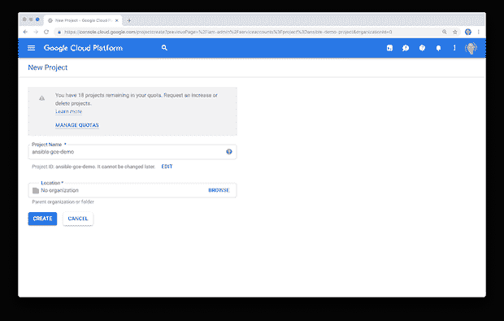

在 IAM & admin 服务帐户选项卡上向项目添加新的服务帐户。

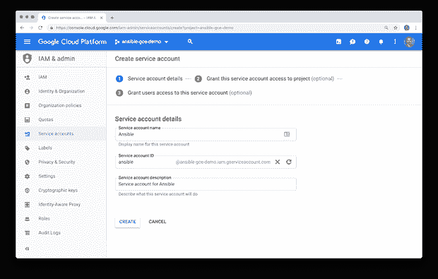

使用“角色”下拉菜单向项目中的“计算管理员”角色授予新服务帐户权限。[最小特权原则](https://en.wikipedia.org/wiki/Principle_of_least_privilege) (PoLP)建议我们应该将服务帐户的权限仅限于调配所需计算资源所必需的角色。

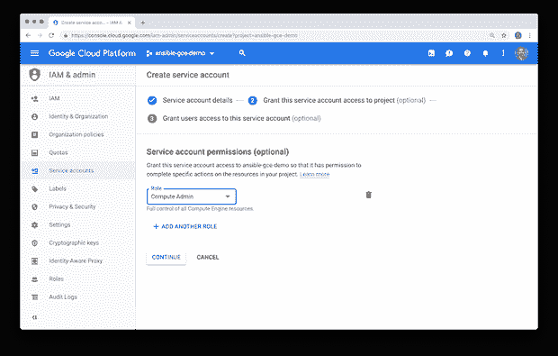

在 IAM & admin 服务帐户选项卡上，为服务帐户创建私钥。这个私有密钥不同于 SSH 密钥，SSH 密钥将添加到项目中。此私钥包含服务帐户的凭据。

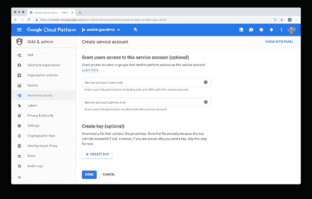

选择 JSON 密钥类型。

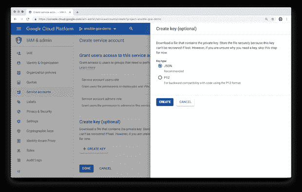

下载私钥 JSON 文件，并将其放在 Ansible 可以访问的安全位置。注意不要将该文件签入源代码管理。同样，该文件包含用于以编程方式访问 GCP 和管理计算资源的服务帐户凭据。

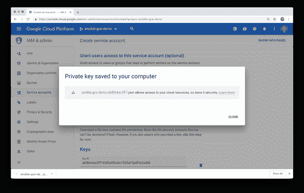

我们现在应该有一个服务帐户，与新的 GCP 项目相关联，具有“计算管理”角色的权限，以及一个已经下载并可供 Ansible 访问的私钥。注意服务帐户的电子邮件地址，在我的例子中是`ansible@ansible-gce-demo.iam.gserviceaccount.com`；您将需要在稍后的配置中引用它。

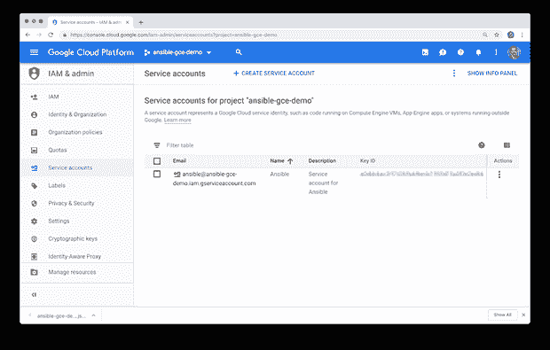

接下来，创建一个 SSH 公共/私有密钥对。SSH 密钥将用于以编程方式访问 GCE 虚拟机。创建一个单独的密钥对允许您将它的使用仅限于新的 GCP 项目。如果泄露，密钥对很容易在 GCP 项目和 Ansible 配置中被删除和替换。在 Mac 上，您可以使用以下命令创建新的密钥对，并将公钥复制到剪贴板。

```
ssh-keygen -t rsa -b 4096 -C "ansible"
cat ~/.ssh/ansible.pub | pbcopy
```

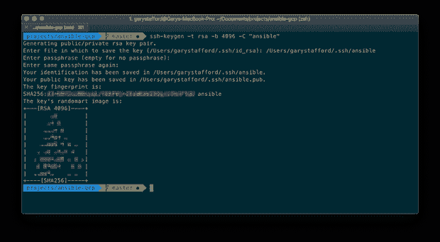

在计算引擎元数据 SSH Keys 选项卡上，将新的公钥剪贴板内容添加到项目中。在此处添加密钥意味着它可由项目中的任何虚拟机使用，除非您在调配新虚拟机并专门为该虚拟机配置密钥时显式阻止此选项。

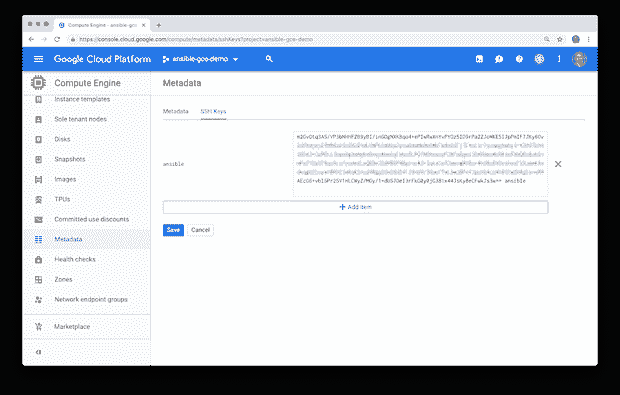

请注意与密钥相关联的名称`ansible`，您将需要在稍后的配置中引用它。

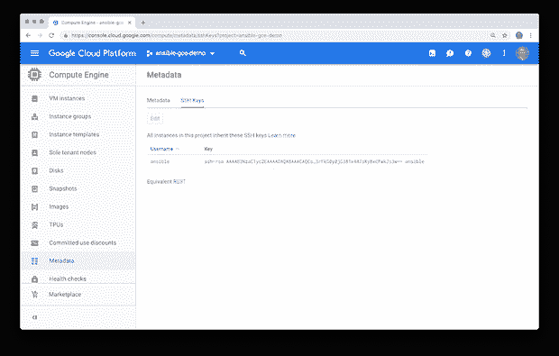

# 设置可行

虽然这篇文章不是 Ansible 的入门，但我将介绍一些我为准备这个演示而做的设置步骤。在我的 Mac 上，我运行的是 Python 3.7、pip 18.1 和 Ansible 2.7.6。安装了 Python 和 pip 之后，在 Mac 或 Linux 上[安装 Ansible](https://docs.ansible.com/ansible/latest/installation_guide/intro_installation.html) 最简单的方法就是使用 pip。

```
pip install ansible
```

您还需要安装两个额外的包，以便使用 [GCE 动态库存](https://docs.ansible.com/ansible/latest/scenario_guides/guide_gce.html#gce-dynamic-inventory)收集关于基于 GCP 的主机的信息，稍后会在帖子中解释。

```
pip install requests google-auth
```

## 可变配置

我为这个项目创建了一个简单的 Ansible `ansible.cfg`文件，位于`/ansible/inventories/`子目录中。Ansible 配置文件包含项目角色和清单的位置，这将在后面解释。该文件还包含两个与我们刚刚创建的 SSH 密钥对相关联的配置项。如果您的密钥命名不同或位于不同的位置，请更新文件( [*gist*](https://gist.github.com/garystafford/98a1f59efa208b324c0848980a81e283) )。

Ansible 在 [GitHub](https://github.com/ansible/ansible/blob/devel/examples/ansible.cfg) 上有一个配置文件参数的完整例子。

## 可变环境变量

为了将我们特定的 GCP 项目证书与 Ansible 行动手册和角色分离， [Ansible 建议](https://medium.com/@odedia/listen-to-yourself-design-pattern-for-event-driven-microservices-16f97e3ed066?source=userActivityShare-1c57fc47fc23-1527520403)将那些必需的模块参数设置为环境变量，而不是将它们包含在行动手册中。此外，我将 GCP 项目名称设置为一个环境变量，以便将它从剧本中分离出来。要设置这些环境变量，使用`source`命令( [*gist*](https://gist.github.com/garystafford/8ec01497c324aa7871241bb954cff3ca) )在项目的根目录中找到`part0_source_creds.sh`脚本。

```
source ./part0_source_creds.sh
```

# GCP CLI/Ansible 混合工作流

企业经常混合使用 DevOps 工具来调配、配置和部署计算资源。在第一个工作流中，我们将使用 Ansible 配置一个 web 服务器，并将其部署到一个现有的 GCE VM 上，这个 VM 是用`gcloud` CLI 工具预先创建的。

## 创建 GCP 资源

首先，使用`gcloud` CLI 工具创建一个 GCE VM 和相关资源，包括一个外部 IP 地址和端口 80 (HTTP)的防火墙规则。为简单起见，我们将使用现有的 GCP `default` [虚拟私有云](https://cloud.google.com/vpc/) (VPC)网络和`default` us-east1 子网。执行项目根目录下的`part1_create_vm.sh`脚本。网络应该已经在防火墙上打开了端口 22 (SSH)。请注意，脚本中的`SERVICE_ACCOUNT`变量是在 IAM & admin 服务帐户选项卡上找到的服务帐户电子邮件，如前一节所示( [*要点*](https://gist.github.com/garystafford/7bed6bc1a0d41fa31f02553f7faaad35) )。

脚本的输出应该如下所示。请注意与虚拟机相关联的外部 IP 地址，您将需要在稍后的帖子中引用该地址。

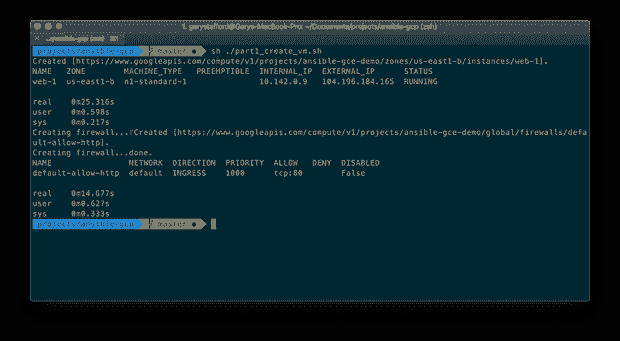

使用`gcloud` CLI 工具或谷歌云控制台，我们应该能够在 GCP 上查看我们新提供的资源。首先，我们的新 GCE 虚拟机，使用计算引擎虚拟机实例详细信息选项卡。


接下来，检查网络接口详细信息选项卡。在这里，我们可以看到运行虚拟机的网络和子网的详细信息。我们可以看到虚拟机的内部和外部 IP 地址。我们还看到了防火墙规则，包括我们的新规则，允许 TCP 在端口 80 上进入流量。

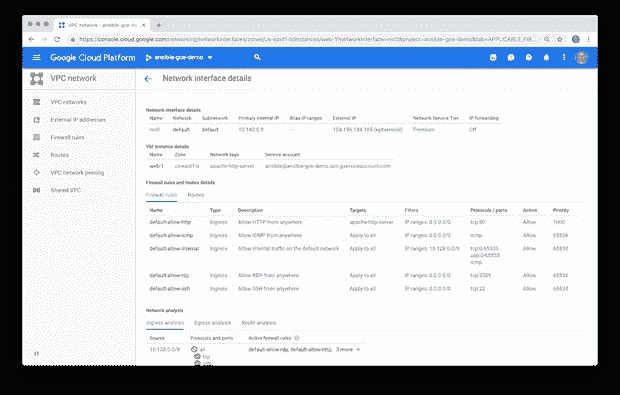

最后，检查新的防火墙规则，它将允许 TCP 流量在端口 80 上从任何 IP 地址到达我们位于`default`网络中的虚拟机。注意另一个预先存在的控制访问`default`网络的规则。

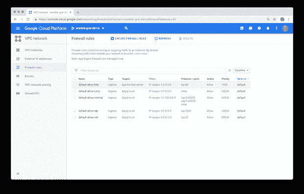

最终的 GCP 建筑看起来如下。


## GCE 动态库存

Ansible 中的两个核心概念是[主机和库存](https://docs.ansible.com/ansible/latest/user_guide/intro_inventory.html)。我们需要一份主机清单来运行我们的 Ansible 行动手册。如果我们有长期存在的主机，通常称为“pet”，它们有长期存在的静态 IP 地址或 DNS 条目，那么我们可以手动将主机添加到静态 hosts 文件中，类似于下面的示例。

```
[webservers]
34.73.171.5
34.73.170.97
34.73.172.153

[dbservers]
db1.example.com
db2.example.com
```

然而，考虑到云的短暂性，主机(通常被称为“牛”)、IP 地址甚至 DNS 条目通常都是短暂的，我们将使用动态清单的概念。

如果你记得我们`pip`在我们的 Ansible 设置中安装了两个包`requests`和`google-auth`，用于 [GCE 动态库存](https://docs.ansible.com/ansible/latest/scenario_guides/guide_gce.html#gce-dynamic-inventory)。根据 Ansible 的说法，与 GCE VM 主机交互的最佳方式是使用`gcp_compute`清单插件。该插件允许 Ansible 动态查询 GCE 中可以管理的节点。使用`gcp_compute`清单插件，我们还可以有选择地将找到的主机分类到[组](https://docs.ansible.com/ansible/latest/user_guide/intro_inventory.html#hosts-and-groups)中。然后，我们将在一组或多组主机上运行包含角色的行动手册。

要演示如何动态查找新的 GCE 主机，并将其添加到组中，请使用 [Ansible Inventory](https://docs.ansible.com/ansible/latest/cli/ansible-inventory.html) CLI 执行以下命令。

```
ansible-inventory --graph -i inventories/webservers_gcp.yml
```

该命令调用`webservers_gcp.yml`文件，该文件包含将 GCE 主机与`webservers`主机组相关联所需的逻辑。Ansible 目前关于这个主题的文档非常少。感谢 Matthieu Remy 的伟大帖子，[如何使用 Ansible GCP 计算库存插件](http://matthieure.me/2018/12/31/ansible_inventory_plugin.html)。在本演示中，我们仅在 us-east1-b 中寻找名称中包含“web-”的主机。( [*要诀*](https://gist.github.com/garystafford/1e6f12af18a5cd3180fe9c8da2cd6613) )。

该命令的输出应该如下所示。我们应该观察到我们的新虚拟机，正如其外部 IP 地址所示，被分配给了`webservers`组的一部分。我们将使用动态清单的功能将播放列表应用到`webservers`组中的所有主机。

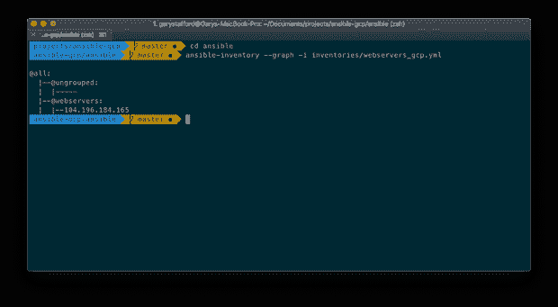

我们还可以通过修改 inventory 命令来查看有关主机的详细信息。

```
ansible-inventory --list -i inventories/webservers_gcp.yml --yaml
```

该命令的输出应该如下所示。这个特殊的例子是在一个早期的主机上运行的，使用了不同的外部 IP 地址。

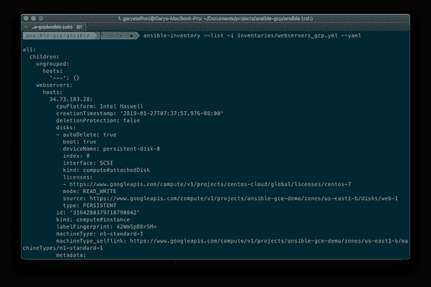

## Apache HTTP 服务器行动手册

为了在 GCP 上第一次体验 Ansible，我们将运行一个 [Ansible 剧本](https://docs.ansible.com/ansible/latest/user_guide/playbooks_intro.html)来在新的基于 CentOS 的虚拟机上安装和配置 Apache HTTP 服务器。根据 Ansible 的说法，总部位于 YAML 的剧本可以声明配置，它们还可以编排任何手动订购流程的步骤，即使不同的步骤必须以特定的顺序在不同的机器之间来回跳动。他们可以同步或异步启动任务。行动手册用于编排任务，而不是使用 Ansible 的临时任务执行模式。

剧本在本质上可以是“单一的”，包含所有必需的[变量](https://docs.ansible.com/ansible/latest/user_guide/playbooks_variables.html)、[任务](https://docs.ansible.com/ansible/latest/user_guide/playbooks_intro.html#tasks-list)和[处理程序](https://docs.ansible.com/ansible/latest/user_guide/playbooks_intro.html#handlers-running-operations-on-change)，以实现期望的结果。如果我们编写一个剧本来部署和配置我们的 Apache HTTP 服务器，它可能看起来像下面的`httpd_playbook.yml`，剧本( [*要点*](https://gist.github.com/garystafford/ebccb1250c9e22edfb30157a4180f47e) )。

我们可以用下面的命令运行这个剧本来部署 Apache HTTP 服务器，但是我们不会这样做。相反，接下来，我们将运行一个应用`httpd`角色的剧本。

```
ansible-playbook \
  -i inventories/webservers_gcp.yml \
  playbooks/httpd_playbook.yml
```

## 可变角色

根据 Ansible 的说法，角色是基于已知的文件结构自动加载某些变量 _ 文件、任务和处理程序的方式。按角色对内容进行分组还允许与其他用户轻松共享角色。角色的使用是首选的，因为它提供了一个很好的组织系统。

`httpd`角色在功能上与第一个工作流中使用的`httpd_playbook.yml`相同。然而，剧本的主要部分已经被分解成单独的资源文件，正如 Ansible 所描述的。这个结构是使用 Ansible Galaxy CLI 创建的。Ansible Galaxy 是 Ansible 分享 Ansible 内容的官方中心。

```
ansible-galaxy init httpd
```

这个`ansible-galaxy`命令创建了下面的结构。之后，我添加了文件和 Jinja2 模板。

```
.
├── README.md
├── defaults
│   └── main.yml
├── files
│   ├── info.php
│   └── server-status.conf
├── handlers
│   └── main.yml
├── meta
│   └── main.yml
├── tasks
│   └── main.yml
├── templates
│   └── index.html.j2
├── tests
│   ├── inventory
│   └── test.yml
└── vars
    └── main.yml
```

在`httpd`角色内:

*   变量存储在`defaults/main.yml`文件中；
*   任务存储在`tasks/main.yml`文件中；
*   句柄存储在`handlers/main.yml`文件中；
*   文件存储在`files/`子目录中；
*   Jinja2 模板存储在`templates/`子目录中；
*   测试存储在`tests/`子目录中；
*   其他子目录和文件包含有关角色的元数据；

为了应用`httpd`角色，我们将运行`20_webserver_config.yml`剧本。将下面这份剧本与之前那份完整的`httpd_playbook.yml`剧本进行比较。所有的逻辑现在已经被分解到`httpd`角色的独立支持文件中( [*要点*](https://gist.github.com/garystafford/a19d94416c94a0da9be084f9dc5c6187) )。

我们可以从使用 Ansible 的[检查模式](https://docs.ansible.com/ansible/latest/user_guide/playbooks_checkmode.html)(“预演”)运行我们的剧本开始。当`ansible-playbook`与`--check`一起运行时，Ansible 不会对远程系统进行任何实际的更改。根据 Ansible 的说法，检查模式只是一种模拟，如果您的步骤使用了依赖于先前命令结果的条件，它可能对您没什么用处。然而，它非常适合一次一个节点的基本配置管理用例。使用检查模式执行以下命令。

```
ansible-playbook \
  -i inventories/webservers_gcp.yml \
  playbooks/20_webserver_config.yml --check
```

该命令的输出应该如下所示。它表明，如果我们执行实际的命令，我们应该预期会发生七个变化。

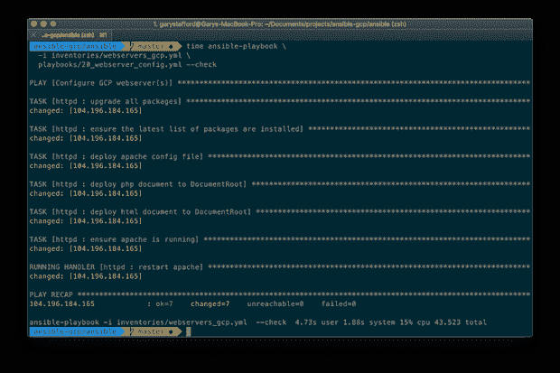

如果一切正常，那么不使用检查模式运行相同的命令。

```
ansible-playbook \
  -i inventories/webservers_gcp.yml \
  playbooks/20_webserver_config.yml
```

该命令的输出应该如下所示。请注意，更改的项目数(七个)与上面使用检查模式的结果相同。

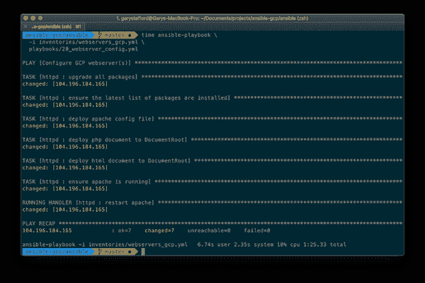

如果我们第二次使用 Check 模式执行命令，我们应该观察到零更改项。这意味着最后一个命令成功应用了所有更改，剧本中没有新的更改。

## 测试结果

我们可以使用许多方法和工具来测试 Apache HTTP 服务器和服务器工具的部署。首先，我们可以使用一个专门的`ansible` CLI 命令，通过调用`systemctl`来确认`httpd`进程正在 VM 上运行。`systemctl`应用程序用于检查和控制运行在基于 CentOS 的虚拟机上的`systemd`系统和服务管理器的状态。

```
ansible webservers \
  -i inventories/webservers_gcp.yml \
  -a "systemctl status httpd"
```

该命令的输出应该如下所示。我们看到了 Apache HTTP 服务器服务的详细信息。我们还看到它根据角色中的任务和处理程序的要求被停止和启动。

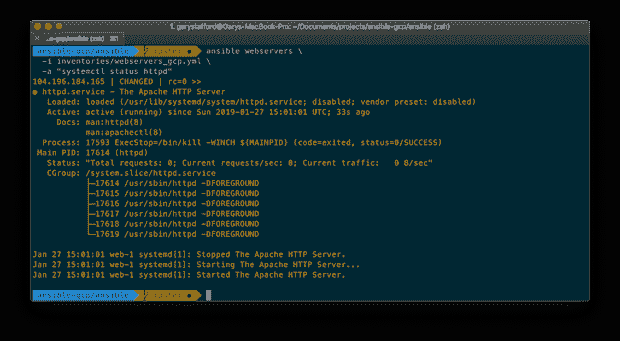

我们还可以检查我们作为剧本的一部分部署的主页和 PHP 信息文档是否在虚拟机上的正确位置。

```
ansible webservers \
  -i inventories/webservers_gcp.yml \
  -a "ls -al /var/www/html"
```

该命令的输出应该如下所示。我们看到我们部署的两个文档位于网站目录的根目录下。


接下来，通过将您的 web 浏览器指向我们之前创建的外部 IP 地址，并在端口 80 (HTTP)上与虚拟机关联，来查看我们网站的主页。我们应该观察剧本中的变量值，“你好，GCP 的 Ansible！”，被注入到 [Jinja2](http://jinja.pocoo.org/docs/2.10/) 模板文件`index.html.j2`，页面被正确部署到 VM。


如果您还记得`httpd`角色，我们的任务是部署服务器状态配置文件。这个配置文件公开了`/server-status`端点，如下所示。状态页面显示分配给虚拟机的内部和外部 IP 地址。它还显示了 Apache HTTP Server 和 PHP 的当前版本、服务器正常运行时间、流量、负载、CPU 使用率、请求数量、正在运行的进程数量等等。

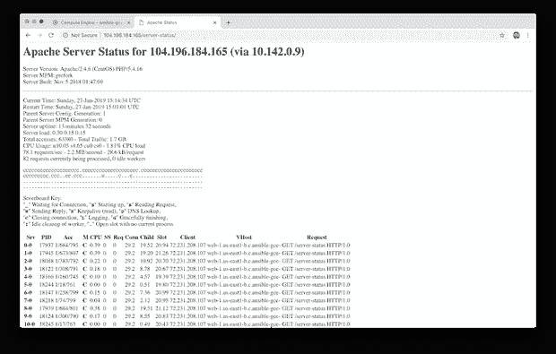

## 使用 Apache Bench 进行测试

[Apache Bench](https://httpd.apache.org/docs/2.4/programs/ab.html) ( `ab`)是 Apache HTTP server 基准测试工具。我们可以在本地使用 Apache Bench，在虚拟机上生成 CPU、内存、文件和网络 I/O 负载。例如，使用下面的命令，我们可以向服务器状态页面生成 100K 个请求，模拟 100 个并发用户。

```
ab -kc 100 -n 100000 http://your_vms_external_ip/server-status
```

该命令的输出应该如下所示。观察这个命令成功地在 web 服务器上产生了大约 17.5 分钟的持续负载。

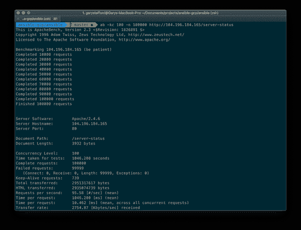

使用计算引擎虚拟机实例监控选项卡，我们看到虚拟机上相应的 Apache Bench CPU、内存、文件和网络负载，大约从上午 10:03 开始，在运行剧本安装 Apache HTTP Server 后不久。

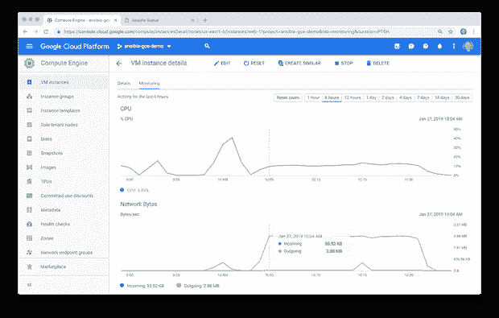

## 破坏 GCP 资源

在探索了我们工作流的结果之后，在我们继续下一个工作流之前，拆除现有的 GCE 资源。要删除资源，执行项目根目录下的`part2_clean_up.sh`脚本( [*gist*](https://gist.github.com/garystafford/23b81d5d9c8c945ea43b04ecaf7eb3e2) )。

脚本的输出应该如下所示。

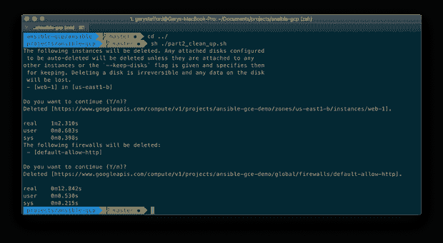

# 可行工作流

在第二个工作流中，我们将提供和配置 GCP 资源，并使用 Ansible 将 Apache HTTP Server 部署到新的 GCE VM。我们将使用与上一个示例相同的项目、区域和分区。然而，这一次，我们将创建一个新的全球 VPC 网络，而不是像以前一样使用`default`网络；创建一个新的子网，而不是像以前一样使用`default`子网；创建一个新的防火墙，并使用入口规则来打开端口 22 和 80。最后，将创建一个外部 IP 地址，并将其分配给虚拟机。

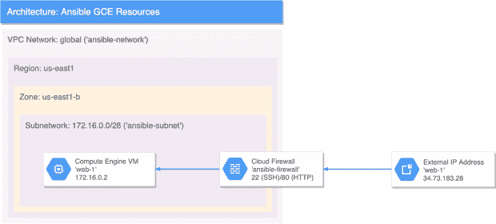

## 提供 GCP 资源

我们将使用 Ansible 来供应 GCP 资源，而不是使用`gcloud` CLI 工具。为此，我创建了一个剧本`10_webserver_infra.yml`，其中有一个角色`gcpweb`，但是有两组任务，一组创建 GCE 资源`create.yml`，另一组删除 GCP 资源`delete.yml`。这是一个典型的可行的剧本模式。角色的标准文件目录结构如下所示，类似于`httpd`角色。

```
.
├── README.md
├── defaults
│   └── main.yml
├── files
├── handlers
│   └── main.yml
├── meta
│   └── main.yml
├── tasks
│   ├── create.yml
│   ├── delete.yml
│   └── main.yml
├── templates
├── tests
│   ├── inventory
│   └── test.yml
└── vars
    └── main.yml
```

为了提供 GCE 资源，我们运行`10_webserver_infra.yml`行动手册( [*要点*](https://gist.github.com/garystafford/c7e7f6635ddcc616884c80fa805c1cae) )。

本行动手册运行`gcpweb`角色。角色的默认`main.yml`任务文件导入另外两组任务，一组用于创建，一组用于删除。每组任务都有一个相应的标签与之相关联([](https://gist.github.com/garystafford/98d146203029d6d6065fae71683362b4)*)。*

*通过调用剧本并传递“创建”标记，角色将运行并应用相关的创建任务集。标签是 Ansible 中一个强大的构造。执行下面的命令，传递`create`标签。*

```
*ansible-playbook -t create playbooks/10_webserver_infra.yml*
```

*在本行动手册中，前面使用的检查模式在这里会失败。如果您还记得的话，这个特性并不是为那些步骤使用依赖于先前命令结果的条件的行动手册而设计的，例如本行动手册。*

*`create.yml`文件包含六个任务，它们利用了 Ansible [GCP 模块](https://docs.ansible.com/ansible/latest/modules/list_of_cloud_modules.html#google)。这些任务创建全球 VPC 网络、美国东部地区的子网、防火墙和规则、外部 IP 地址、磁盘和虚拟机实例( [*要点*](https://gist.github.com/garystafford/53036067e92eba52273d8f004350dfca) )。*

*如果您对剧本执行过程中实际发生的事情感兴趣，可以在上面的命令中添加详细选项(`-v`或`-vv`)。这对学习 Ansible 很有帮助。*

*该命令的输出应该如下所示。请注意应用于 localhost 的更改。由于在提供资源之前，GCP 上不存在 GCE VM 主机，因此我们引用 localhost。整个过程不到两分钟就创建了一个全球 VPC 网络、子网、防火墙规则、虚拟机、连接的磁盘，并分配了一个公共 IP 地址。*

*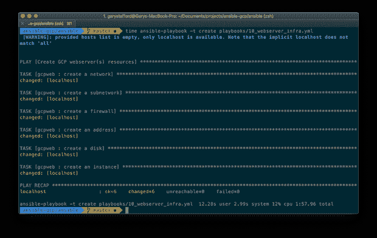*

*现在，所有 GCP 资源都已调配和配置完毕。下面，我们看到 Ansible 创建的新 GCE VM。*

*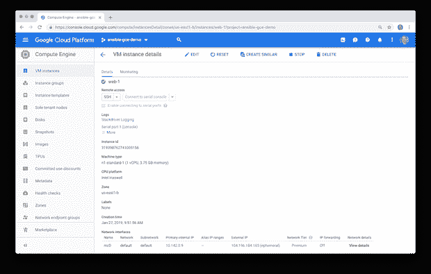*

*下面，我们看到了新 GCE 虚拟机的网络接口详细信息控制台页面，显示了有关虚拟机、NIC、内部和外部 IP 地址、网络、子网和入口防火墙规则的详细信息。*

*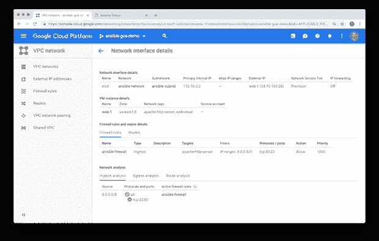*

*下面，我们看到了 VPC 的详细信息，显示了每个自动创建的区域子网，以及我们在 us-east1 区域的新“ansible-subnet”，跨越了 172.16.0.0/28 [CIDR](https://en.wikipedia.org/wiki/Classless_Inter-Domain_Routing) (无类域间路由)块中的 14 个 IP 地址。*

*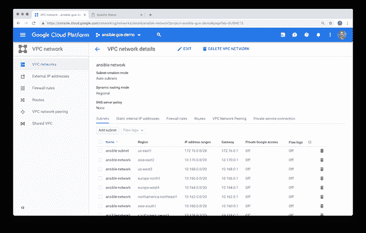*

*为了部署和配置 Apache HTTP Server，以与我们在第一个工作流中完全相同的方式运行`httpd`角色。*

```
*ansible-playbook \
  -i inventories/webservers_gcp.yml \
  playbooks/20_webserver_config.yml*
```

## *基于角色的测试*

*在第一个工作流中，我们使用一些特别的命令并通过在浏览器中查看网页来手动测试我们的结果。这些测试方法不适合 DevOps 自动化。更有效的策略是编写测试，这是角色的一部分，并且可能在每次应用角色时运行，作为 CI/CD 管道的一部分。这个项目中的每个角色都包含一些简单的测试来确认角色中任务的成功。首先，用下面的命令运行`gcpweb`角色的测试。*

```
*ansible-playbook \
  -i inventories/webservers_gcp.yml \
  roles/gcpweb/tests/test.yml*
```

*行动手册收集了主机组中 GCE 主机的信息，并针对这些主机运行了总共五个测试任务。这些任务使用收集的事实( [*要点*](https://gist.github.com/garystafford/75d79de362f523016885e6a10b7f9c06) )来确认主机的时区、vCPU 计数、操作系统类型、操作系统主要版本和主机名。*

*该命令的输出应该如下所示。观察到所有五个任务都成功运行。*

*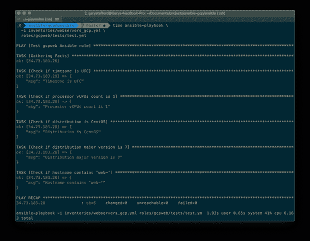*

*接下来，运行`httpd`角色的测试。*

```
*ansible-playbook \
  -i inventories/webservers_gcp.yml \
  roles/httpd/tests/test.yml*
```

*同样，该命令的输出应该类似于以下内容。剧本这次运行四个测试任务。这些任务确认两个文件都存在，主页可访问，并且服务器状态页面显示正确。下面，我们四个都跑成功了。*

*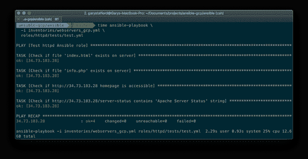*

## *改变剧本*

*为了观察如果我们对剧本进行更改会发生什么，让我们在`httpd`角色的`/roles/httpd/defaults/main.yml`文件中更改`greeting`变量值。回想一下，原来的主页是这样的。*

*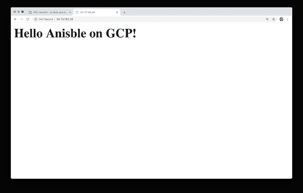*

*使用相同的命令，更改`greeting`变量值并重新运行剧本。*

```
*ansible-playbook \
  -i inventories/webservers_gcp.yml \
  playbooks/20_webserver_config.yml*
```

*该命令的输出应该如下所示。正如所料，我们应该观察到只有一个任务，即部署主页，发生了变化。*

*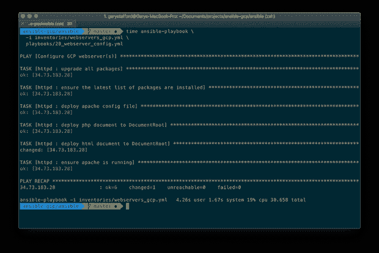*

*再次查看主页，或者通过修改相关的测试任务，我们应该观察到新的值被注入到 Jinja2 模板文件中，`index.html.j2`，并且新的页面被正确部署。*

*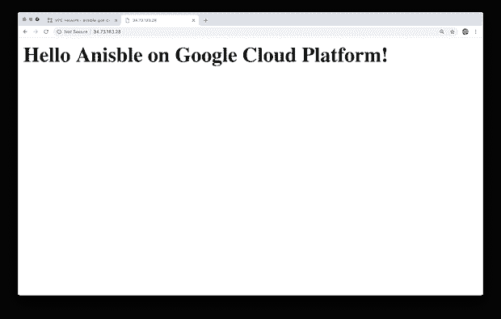*

## *用 Ansible 摧毁 GCP 资源*

*完成后，您可以通过调用`10_webserver_infra.yml`剧本并传递`delete`标签来销毁所有 GCP 资源，角色将运行并应用相关的删除任务集。*

```
*ansible-playbook -t delete playbooks/10_webserver_infra.yml*
```

*使用 Ansible，我们通过将`state`从`present`更改为`absent`来删除 GCP 资源。行动手册将以特定的顺序删除资源，以避免依赖性冲突，例如尝试在虚拟机之前删除网络。请注意，我们不必显式删除磁盘，因为，如果您还记得，我们用`disks.auto_delete=true`选项( [*要点*](https://gist.github.com/garystafford/bb000453def0b4b80d72394516e650d4) )调配了 VM 实例。*

*该命令的输出应该如下所示。我们看到虚拟机实例、连接的磁盘、防火墙、规则、外部 IP 地址、子网，最后是网络，它们都被删除了。*

*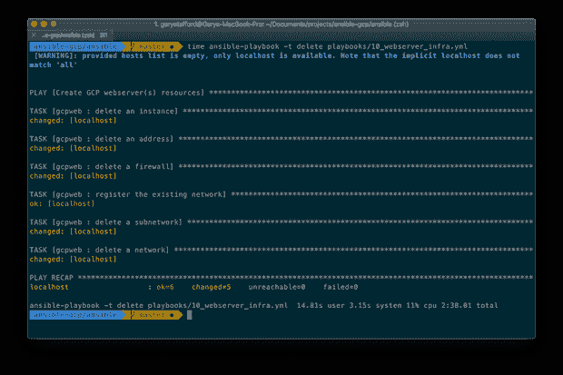*

# *结论*

*在这篇文章中，我们看到了在 Google 云平台上使用 Ansible 是多么容易。使用 Ansible 的 300+ [云模块](https://www.ansible.com/integrations/cloud)，供应、配置、部署和测试广泛的 GCP、Azure 和 AWS 资源是容易的、可重复的和完全自动化的。*

*本文表达的所有观点都是我个人的，不一定代表我现在或过去的雇主或他们的客户的观点。*

**原载于 2019 年 1 月 30 日*[*【programmaticponderings.com*](https://wp.me/p1RD28-6bj)*。**