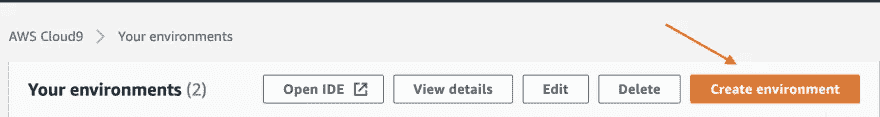
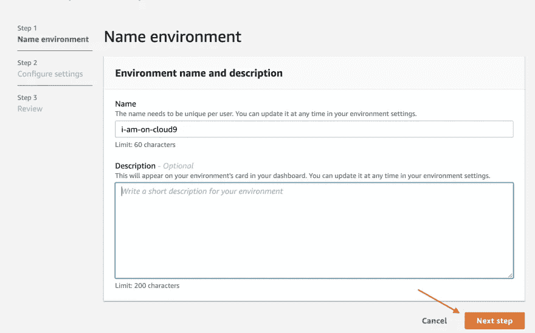
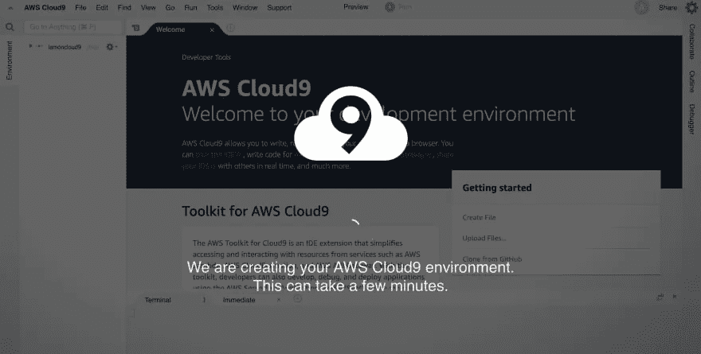
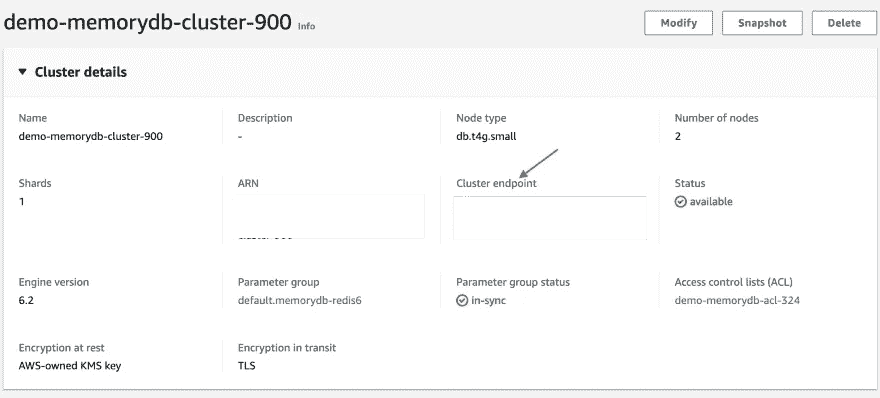
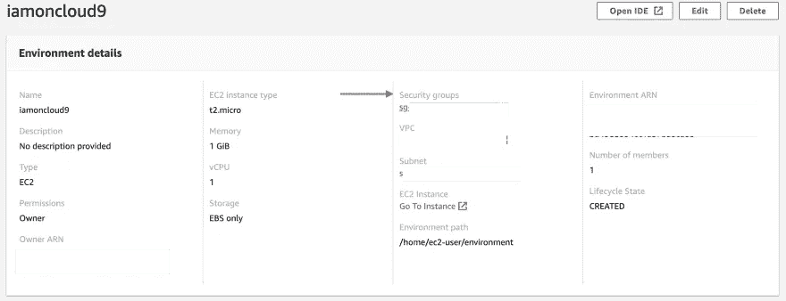
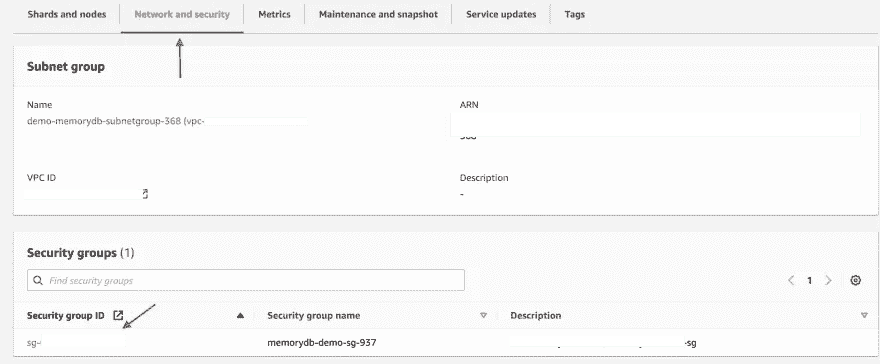
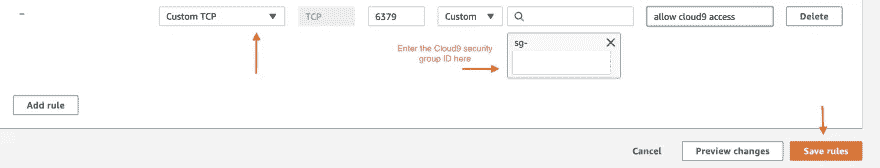
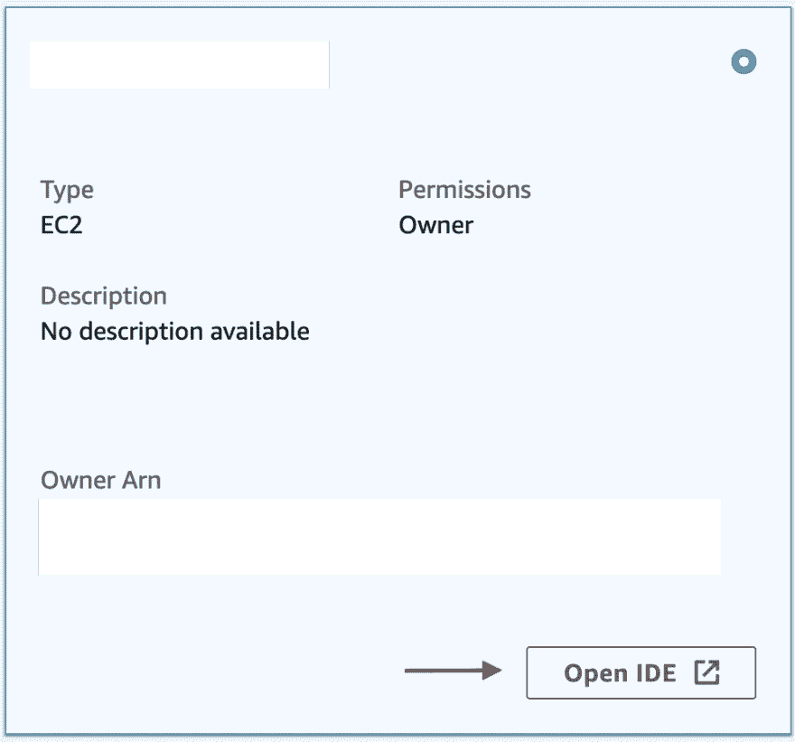
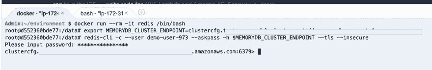
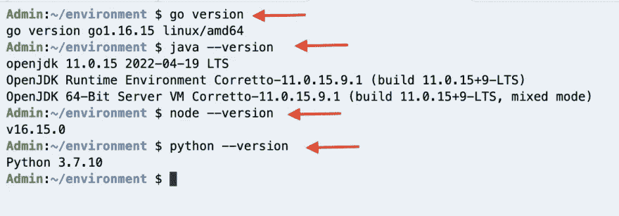

# AWS 上的 Redis 入门——最简单的方法！

> 原文：<https://itnext.io/getting-started-with-redis-on-aws-the-easy-way-11afe9717dc2?source=collection_archive---------0----------------------->

## *该快速入门使用 AWS Cloud9 IDE 帮助您快速启动和运行 Redis 的 MemoryDB】*

当我最初探索一些 AWS 服务(如 MemoryDB、MSK、Redis 的 Elasticache 等)时。)，我通常按照文档来设置 EC2，SSH 到实例中，安装/复制东西(语言、运行时、代码、客户机等)。)然后去尝试。大多数情况下，第一步是最难的，对于开发人员来说，尽可能减少摩擦以“开始工作”是很重要的。

当我寻找更简单/更快捷的方法时，我发现了 [AWS Cloud9](https://aws.amazon.com/cloud9/) ，结果证明它非常有用。它快速、可预测，并且有一堆有用的工具随时可用。在这篇博客中，我将提供一步一步的指导，告诉你如何使用`Cloud9`轻松快速地开始(并继续试验/构建/开发)Amazon MemoryDB for Redis。

> [*Amazon MemoryDB for Redis*](https://docs.aws.amazon.com/memorydb/latest/devguide/what-is-memorydb-for-redis.html)*是一个持久的内存数据库服务，它与 Redis 兼容，从而使您能够使用他们现在已经使用的灵活友好的 Redis 数据结构、API 和命令来构建应用程序。它与亚马逊 VPC 完全集成，集群始终在 VPC 启动。*

**你不需要在本地机器上安装任何东西来完成本教程。**

你唯一需要的就是一个 AWS 账户(当然！)—所以确保你有一个[(甚至免费层也可以)](https://aws.amazon.com/free/)

# 设置 Cloud9 和 MemoryDB

如果你是 AWS(或 memory db/任何其他服务)的新手，我建议你使用 AWS 控制台手动完成设置(而不是使用 [CloudFormation](https://docs.aws.amazon.com/AWSCloudFormation/latest/UserGuide/Welcome.html) 或其他工具)。这为您提供了可用选项的概述，并且在您尝试使用 AWS CLI、CDK、CloudFormation 等实现自动化时会有所帮助。

**Cloud9 环境**

这很简单——文档[像预期的那样工作。](https://docs.aws.amazon.com/cloud9/latest/user-guide/tutorial.html)

转到 AWS 控制台> Cloud9:



只需输入您的环境名称:



您可以在第二个屏幕上安全地选择默认值:

*   Amazon Linux 2 将有一个`t2.micro`节点类型(1 GiB RAM + 1 vCPU ),它将在 30 分钟后自动休眠(如果不使用)
*   该实例将被放置在[默认 VPC](https://docs.aws.amazon.com/vpc/latest/userguide/default-vpc.html) (任何 AZ 中的任何子网)中。—还将创建一个安全组

目前这已经足够好了。

在最后一页，检查您的设置，点击**创建环境**，您应该可以开始比赛了！



**Redis 的内存数据库**

同样，[文档](https://docs.aws.amazon.com/memorydb/latest/devguide/getting-started.createcluster.html)按预期工作。有几个配置旋钮，但我会建议你保持简单:

*   单节点集群—选择`db.t4g.small`节点类型(目前已经足够)
*   放置**默认 vpc** —您将在创建子网组(在 MemoryDB 中)时选择此选项(连同子网)
*   确保还设置了 ACL 和凭证(连接到 MemoryDB 的用户名和密码)

请耐心等待，群集应该在几分钟后准备好:)



**安全配置**

您需要添加配置，以允许从`Cloud9`实例访问您的 MemoryDB 集群。

首先，复制您的`Cloud9`实例的安全组 ID:



然后，打开 MemoryDB 集群的安全组:



添加一个*入站*安全规则:



> *规则说:允许与*源*安全组(本例中为* `*Cloud9*` *)关联的实例访问与*目标*安全组*关联的实例的 TCP 端口 `*6379*`

# *你都准备好了！*

*导航到您的 Cloud9 IDE:*

*转到 AWS 控制台>云 9:*

**

*您的`Cloud9` env 应该打开——您应该看到一个终端。*

# *连接到 MemoryDB —最简单的方法*

*最简单的方法是使用 [redis-cli](https://redis.io/docs/manual/cli/) 。您不需要单独安装它——让我们直接使用 Docker，因为它已经为我们预装了！*

*`redis-cli`在`redis`容器本身中是可用的，因此您可以从那里启动并使用它。从 [DockerHub](https://hub.docker.com/_/redis) - `docker pull redis`中提取 Redis Docker 图像*

```
*Admin:~/environment $ docker pull redisUsing default tag: latest
latest: Pulling from library/redis
214ca5fb9032: Pull complete 
9eeabf2ad250: Pull complete 
b8eb79a9f3c4: Pull complete 
0ba9bf1b547e: Pull complete 
2d2e2b28e876: Pull complete 
3e45fcdfb831: Pull complete 
Digest: sha256:180582894be9a7d5f1201877744b912945a8f9a793a65cd66dc1af5ec3fff0fc
Status: Downloaded newer image for redis:latest
docker.io/library/redis:latest*
```

*运行容器:*

```
*Admin:~/environment $ docker run --rm -it redis /bin/bash
root@429f8fabaf09:/data#*
```

> **现在你在一个终端(Cloud9 IDE)的一个终端内部(容器内)；)**

*复制 MemoryDB 集群的集群端点，并将其设置为环境变量*

**

> **确保从集群端点删除端口(* `*:6379*` *)，因为* `*redis-cli*` *会自动追加:**

```
*export MEMORYDB_CLUSTER_ENDPOINT=<memorydb cluster endpoint without the :6379 part)redis-cli -c --user <memorydb username> --askpass -h $MEMORYDB_CLUSTER_ENDPOINT --tls --insecure*
```

> *`*--askpass*` *会提示你输入密码——输入它。**

**

*Wohoo！现在，您从 Cloud9 实例中的 Docker 容器内部连接到了 MemoryDB 集群。*

*传统的`hello world`舞蹈时间到了！*

*在终端中:*

```
*SET hello world
SET foo bar*
```

> *你应该从 MemoryDB 得到一个 `*OK*` *响应**

*到目前为止一切顺利！您可以使用标准工具(`redis-cli`)来连接新创建的 MemoryDB 集群。这有利于健全性/连接性测试，但你也可以做一些“轻量级”开发，运行一些程序来执行 MemoryDB 上的操作——这是下一个逻辑步骤。*

*让我们开始吧。下面的例子展示了一个 Go 程序，但是你也可以使用你自己选择的语言。毕竟，大多数语言运行时(如 Java、Python、Node.js、Go 等。)来预装在 Cloud9 环境下！看看这个[https://docs . AWS . Amazon . com/cloud 9/latest/user-guide/language-support . html](https://docs.aws.amazon.com/cloud9/latest/user-guide/language-support.html)*

**

# *运行程序以连接 MemoryDB*

*代码在 GitHub 上，所以只需克隆它并更改到正确的文件夹:*

```
*git clone https://github.com/abhirockzz/memorydb-cloud9-quickstart
cd memorydb-cloud9-quickstart*
```

*设置环境变量并运行程序！*

```
*export MEMORYDB_CLUSTER_ENDPOINT=<memorydb cluster endpoint (with the port)>
export MEMORYDB_USERNAME=<memorydb username>
export MEMORYDB_PASSWORD=<memorydb password>go run main.go*
```

*下面是我运行它时的输出:*

```
*Admin:~/environment/memorydb-cloud9-quickstart (master) $ go run main.go go: downloading github.com/go-redis/redis/v8 v8.11.5
go: downloading github.com/gorilla/mux v1.8.0
go: downloading github.com/cespare/xxhash/v2 v2.1.2
go: downloading github.com/dgryski/go-rendezvous v0.0.0-20200823014737-9f7001d12a5f
2022/05/12 04:53:46 connecting to cluster ****************(redacted)
2022/05/12 04:53:46 successfully connected to cluster
2022/05/12 04:53:46 started HTTP server....*
```

*这将启动一个公开几个端点的 HTTP 服务器。让我们试用一下。*

> **在 Cloud9 中打开一个单独的终端，运行下面的命令**

*首先，看一下集群信息:*

```
*curl -i http://localhost:8080/HTTP/1.1 200 OK
Date: Thu, 12 May 2022 04:57:03 GMT
Content-Length: 354
Content-Type: text/plain; charset=utf-8[{"Start":0,"End":16383,"Nodes":[{"ID":"3a0ef99406d4165fab450fde6c0a4eac3ee8f215","Addr":"****************.amazonaws.com:6379"},{"ID":"2b5a4663a9183f7921517c6f14195e9d26a6ca79","Addr":"****************.amazonaws.com:6379"}]}]*
```

*我们得到了集群中碎片以及单个节点的信息。*

> **你的情况会有所不同**

*还记得我们之前用`redis-cli`执行过`SET hello world`吗？让我们来看看`GET`现在的价值:*

```
*# get the value for the key "hello"Admin:~/environment $ curl -i localhost:8080/hello
HTTP/1.1 200 OK
Date: Thu, 12 May 2022 04:54:45 GMT
Content-Length: 32
Content-Type: text/plain; charset=utf-8{"Key":"hello","Value":"world"}*
```

*对按键`foo`进行同样的操作:*

```
*Admin:~/environment $ curl -i localhost:8080/foo
HTTP/1.1 200 OK
Date: Thu, 12 May 2022 04:55:44 GMT
Content-Length: 28
Content-Type: text/plain; charset=utf-8{"Key":"foo","Value":"bar"}*
```

*像预期的那样工作——不存在的键怎么办？*

```
*Admin:~/environment $ curl -i localhost:8080/notthere
HTTP/1.1 404 Not Found
Date: Thu, 12 May 2022 04:56:23 GMT
Content-Length: 0*
```

*很公平。最后，您可以设置自己的键值:*

```
*Admin:~/environment $ curl -i -X POST -d 'redis' localhost:8080/awsome
HTTP/1.1 200 OK
Date: Thu, 12 May 2022 04:59:25 GMT
Content-Length: 0Admin:~/environment $ curl -i localhost:8080/awsome
HTTP/1.1 200 OK
Date: Thu, 12 May 2022 05:00:51 GMT
Content-Length: 33
Content-Type: text/plain; charset=utf-8{"Key":"awsome","Value":"redis"}*
```

*好了，一切正常！*

> **示例应用程序的* `*Dockerfile*` *也存在于 Github repo 中，以防您想要构建 docker 映像并运行它。**

# *打扫*

*完成后，不要忘记:*

*   *删除 MemoryDB 集群，并*
*   *云 9 环境*

*这个博客到此为止。我希望您能够跟上——设置一个 MemoryDB 集群和一个 Cloud9 环境(以及一个现成的 IDE 和终端！).在 docker 中使用`redis-cli`做了一些初始连接测试之后，您还运行了一个测试程序来做更多的实验。*

***这一切只需您的浏览器！***

*我希望这是有用的，你可以重复使用这种特殊的设置，要求和编程语言。编码快乐！*