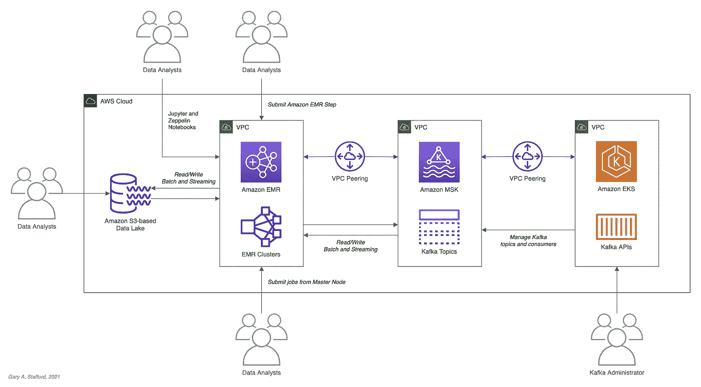
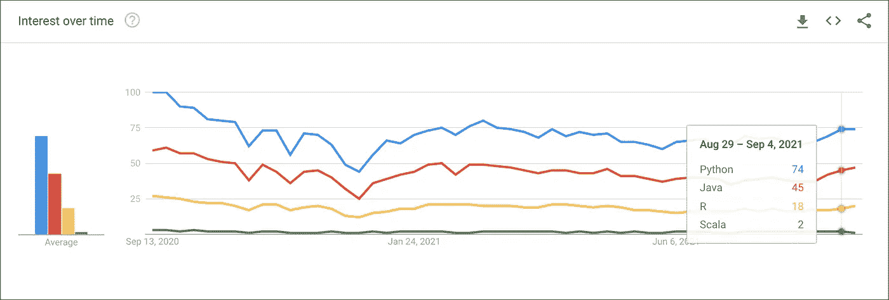
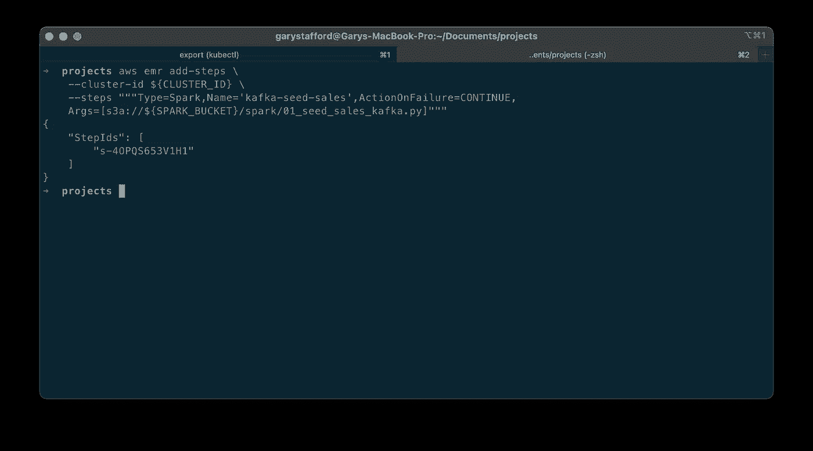
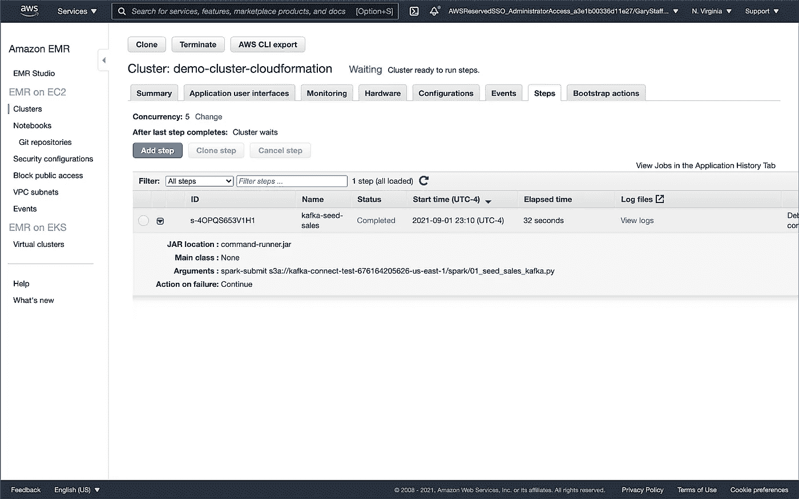
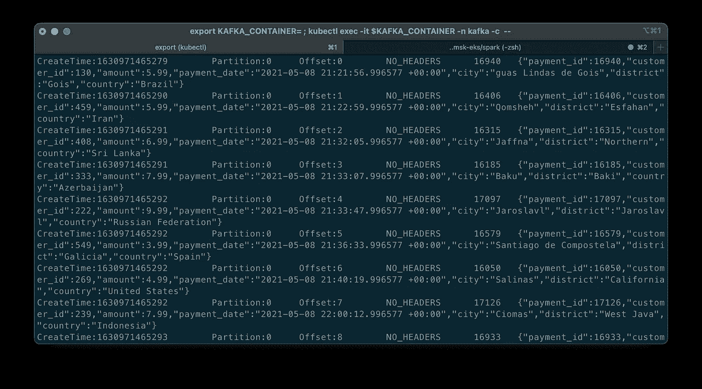
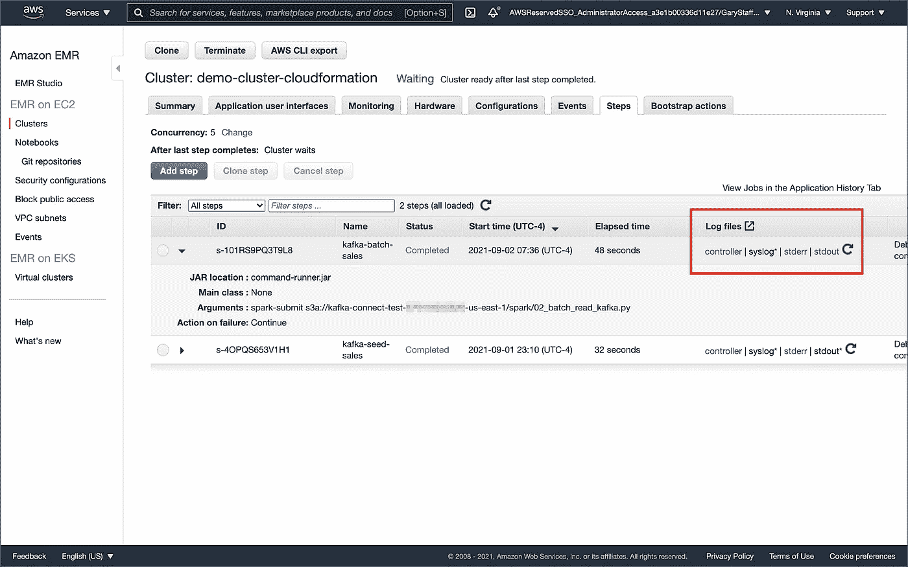
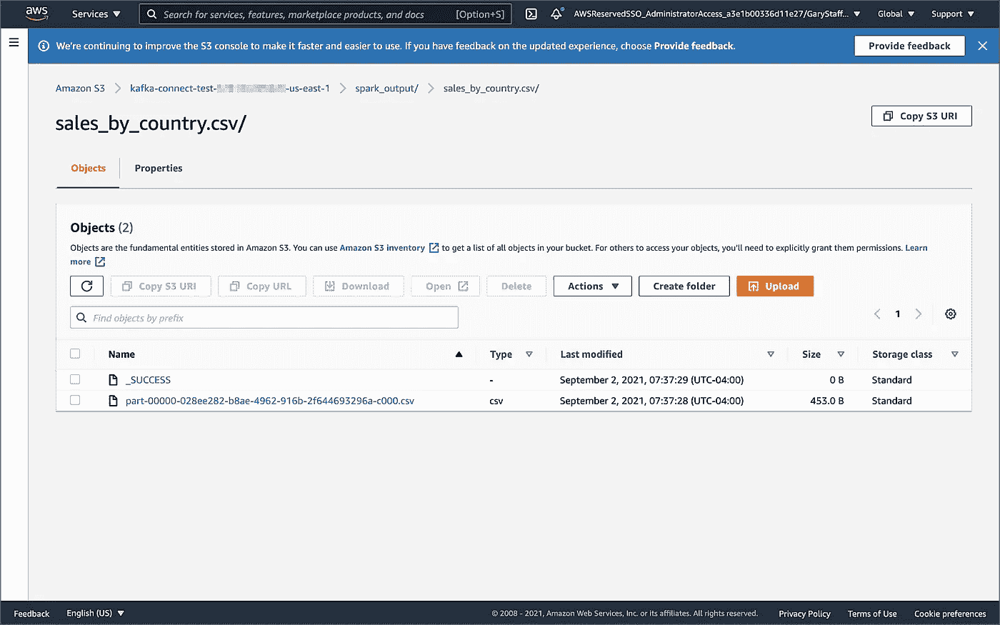
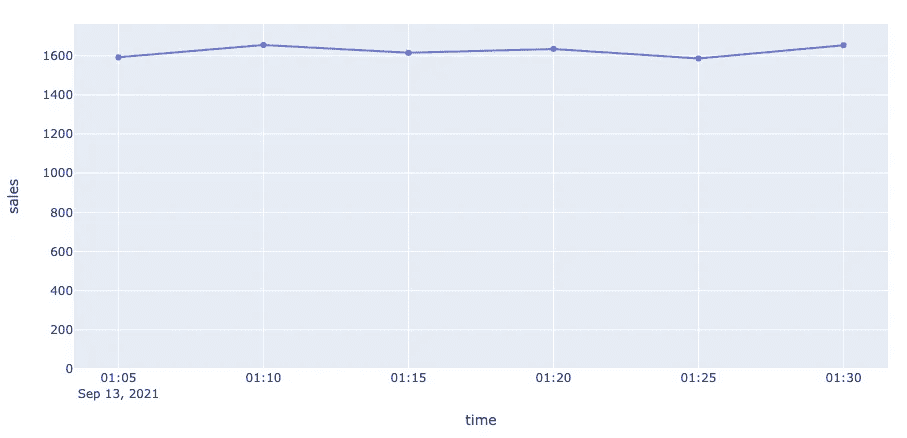
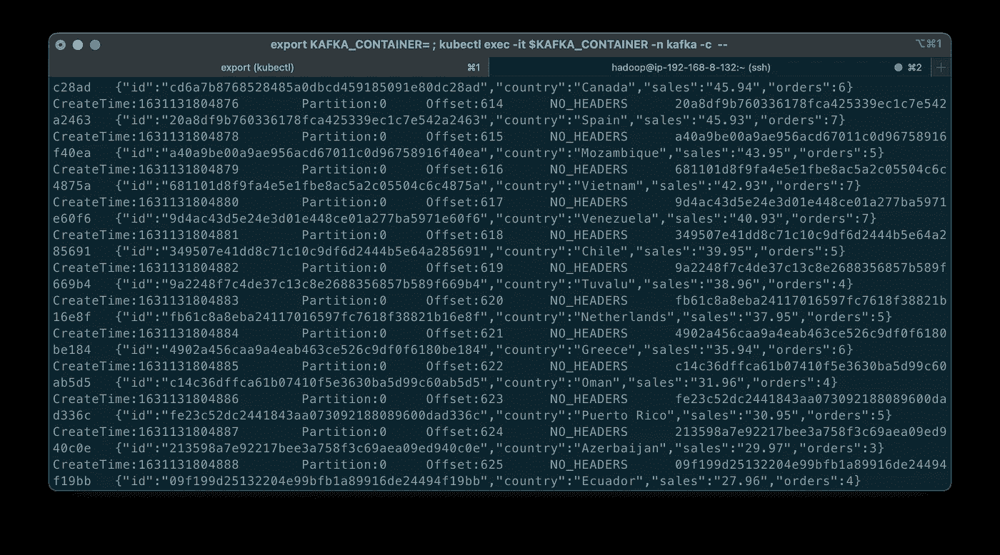

# 使用亚马逊 MSK 和亚马逊 EMR 在 AWS 上开始使用 Spark 结构化流和 Kafka

> 原文：<https://itnext.io/getting-started-with-spark-structured-streaming-and-kafka-on-aws-using-amazon-msk-and-amazon-emr-91b1f2ef0162?source=collection_archive---------0----------------------->

## 使用批处理查询和 Spark 结构化流，使用 Apache Kafka 探索 Apache Spark

结构化流是一个基于 Spark SQL 引擎的可扩展和容错的流处理引擎。使用结构化流，您可以像在静态数据上表达批处理计算一样表达您的流计算。在本帖中，我们将学习如何在 Apache Kafka 中使用 Apache Spark 和 Spark 结构化流。具体来说，我们将利用亚马逊 EMR(*fka Amazon Elastic MapReduce*)上的结构化流，以及针对 Apache Kafka(亚马逊 MSK)的亚马逊托管流。我们将使用批处理和流查询从 Kafka 消费和发布到 Kafka。对于这篇文章，Spark 作业将使用 PySpark 用 Python 编写。



本文演示的高级 AWS 架构

## 阿帕奇火花

根据[文档](https://spark.apache.org/docs/latest/index.html)，Apache Spark 是一个用于大规模数据处理的统一分析引擎。它提供了 Java、Scala、Python (PySpark)和 R 中的高级 API，以及一个支持通用执行图的优化引擎。此外，Spark 支持一组丰富的高级工具，包括用于 SQL 和结构化数据处理的 Spark SQL，用于机器学习的 MLlib，用于图形处理的 GraphX，以及用于增量计算和流处理的结构化流。


据[谷歌趋势](https://trends.google.com/trends/explore?geo=US&q=%2Fm%2F0ndhxqz,PySpark,%2Fm%2F0g55vt5,%2Fg%2F11bywl5x_j)称，Apache Spark 和 PySpark 对 Apache Hive，随着时间的推移，兴趣迅速增长

## 火花结构化流

根据[文档](https://spark.apache.org/docs/latest/structured-streaming-programming-guide.html)，Spark 结构化流是一个基于 Spark SQL 引擎的可扩展和容错的流处理引擎。您可以像表达静态数据上的批处理计算一样表达您的流计算。Spark SQL 引擎将不断递增地运行它，并随着流数据的不断到达更新最终结果。简而言之，结构化流提供了快速、可伸缩、容错、端到端、恰好一次的流处理，而无需用户对流进行推理。

## 亚马逊电子病历

根据[文档](https://aws.amazon.com/)，Amazon EMR(*fka Amazon Elastic MapReduce*是一个基于云的大数据平台，使用 [Apache Spark](https://aws.amazon.com/emr/features/spark/) 、 [Hadoop](https://hadoop.apache.org/) 、 [Hive](https://aws.amazon.com/emr/features/hive/) 、 [HBase](https://aws.amazon.com/emr/features/hbase/) 、 [Flink](https://aws.amazon.com/blogs/big-data/use-apache-flink-on-amazon-emr/) 、[胡迪](https://aws.amazon.com/emr/features/hudi/)、 [Presto](https://aws.amazon.com/emr/features/presto/) 等开源工具处理海量数据。Amazon EMR 是一项完全托管的 AWS 服务，通过自动执行配置容量和调整集群等耗时的任务，可以轻松设置、操作和扩展您的大数据环境。

自 2020 年 12 月以来，亚马逊 EMR 的一个部署选项，[EKS 的亚马逊 EMR](https://docs.aws.amazon.com/emr/latest/EMR-on-EKS-DevelopmentGuide/emr-eks.html)，允许你在[亚马逊弹性 Kubernetes 服务](https://aws.amazon.com/eks/)(亚马逊 EKS)上运行亚马逊 EMR。借助 EKS 部署选项，您可以专注于运行分析工作负载，而 Amazon EMR on EKS 为开源应用构建、配置和管理容器。

如果你不熟悉 Amazon EMR for Spark，特别是 PySpark，我推荐一个由两部分组成的早期系列文章，[在 Amazon EMR 上运行 PySpark 应用程序:在 Amazon Elastic MapReduce 上与 PySpark 交互的方法](https://medium.com/swlh/running-pyspark-applications-on-amazon-emr-e536b7a865ca)。

[](https://medium.com/swlh/running-pyspark-applications-on-amazon-emr-e536b7a865ca) [## 在 Amazon EMR 上运行 PySpark 应用程序

### Amazon Elastic MapReduce 上与 PySpark 交互的方法

medium.com](https://medium.com/swlh/running-pyspark-applications-on-amazon-emr-e536b7a865ca) 

## 阿帕奇卡夫卡

根据[文档](https://kafka.apache.org/)，Apache Kafka 是一个开源的分布式事件流平台，被数千家公司用于高性能数据管道、流分析、数据集成和关键任务应用。

## 亚马逊 MSK

Apache Kafka 集群在生产环境中的设置、扩展和管理极具挑战性。根据[文档](https://aws.amazon.com/msk/)的说法，亚马逊 MSK 是一个完全托管的 AWS 服务，让你可以轻松构建和运行使用 [Apache Kafka](https://aws.amazon.com/streaming-data/what-is-kafka/) 处理流媒体数据的应用程序。有了亚马逊 MSK，您可以使用原生 Apache Kafka APIs 来填充数据湖，将更改传入和传出数据库，并支持机器学习和分析应用程序。

# 先决条件

这篇文章将主要关注在 Amazon EMR 上配置和运行 Apache Spark 作业。为了跟进，您需要在 AWS 上部署和配置以下资源:

1.  亚马逊 S3 桶(保存星火资源和输出)；
2.  亚马逊 MSK 集群(使用 [IAM 访问控制](https://docs.aws.amazon.com/msk/latest/developerguide/iam-access-control.html#how-to-use-iam-access-control))；
3.  安装了 Kafka APIs 并且能够连接到亚马逊 MSK 的亚马逊 EKS 容器或 EC2 实例；
4.  亚马逊 EKS 集群或 EC2 和亚马逊 MSK 集群之间的连接；
5.  确保亚马逊 MSK 配置有`auto.create.topics.enable=true`；该设置默认为`false`；

如上面的架构图所示，演示在同一个 AWS 帐户和 AWS 区域`us-east-1`内使用了三个独立的 VPC，分别用于 Amazon EMR、Amazon MSK 和 Amazon EKS。使用 [VPC 对等](https://docs.aws.amazon.com/vpc/latest/peering/what-is-vpc-peering.html)连接三个 VPC。确保您在亚马逊 EMR、亚马逊 MSK 和亚马逊 EKS 安全组中公开了正确的入口端口和相应的 CIDR 范围。为了获得额外的安全性和成本节约，使用一个 [VPC 端点](https://docs.aws.amazon.com/vpc/latest/privatelink/vpc-endpoints-s3.html)用于亚马逊 EMR 和亚马逊 S3 之间的私人通信。

# 源代码

这篇文章和亚马逊 MSK 系列的前两篇文章的所有源代码，包括这里演示的 Python/PySpark 脚本，都是开源的，位于 [GitHub](https://github.com/garystafford/kafka-connect-msk-demo) 上。

[](https://github.com/garystafford/kafka-connect-msk-demo) [## GitHub-garystafter/Kafka-connect-MSK-demo:

### 对于这篇文章，在 AWS - GitHub 上使用变更数据捕获(CDC)、Apache Kafka 和 Kubernetes 来补充数据湖…

github.com](https://github.com/garystafford/kafka-connect-msk-demo) 

## PySpark 脚本

根据 Apache Spark [文档](http://spark.apache.org/docs/latest/api/python/)，PySpark 是 Python 中 Apache Spark 的一个接口。它允许您使用 Python API 编写 Spark 应用程序。PySpark 支持 Spark 的大部分功能，如 Spark SQL、DataFrame、Streaming、MLlib(机器学习)和 Spark Core。

这篇文章涵盖了九个 Python/PySpark 脚本:

1.  初始销售数据发布到卡夫卡
    T3 01 _ seed _ sales _ Kafka . py
2.  Kafka
    的批量查询 [02_batch_read_kafka.py](https://github.com/garystafford/kafka-connect-msk-demo/blob/main/pyspark/pyspark_scripts/02_batch_read_kafka.py)
3.  使用分组聚合对 Kafka 进行流式查询
    [03 _ streaming _ read _ Kafka _ console . py](https://github.com/garystafford/kafka-connect-msk-demo/blob/main/pyspark/pyspark_scripts/03_streaming_read_kafka_console.py)
4.  使用滑动事件时间窗口的流式查询
    [04 _ streaming _ read _ Kafka _ console _ window . py](https://github.com/garystafford/kafka-connect-msk-demo/blob/main/pyspark/pyspark_scripts/04_incremental_sales_kafka.py)
5.  增量销售数据发布到 Kafka
    [05 _ incremental _ sales _ Kafka . py](https://github.com/garystafford/kafka-connect-msk-demo/blob/main/pyspark/pyspark_scripts/05_streaming_read_kafka_console_window.py)
6.  使用分组聚合从/向 Kafka 进行流式查询
    [06 _ streaming _ read _ Kafka _ Kafka . py](https://github.com/garystafford/kafka-connect-msk-demo/blob/main/pyspark/pyspark_scripts/06_streaming_read_kafka_kafka.py)
7.  Kafka
    [中流式查询结果的批量查询 07_batch_read_kafka.py](https://github.com/garystafford/kafka-connect-msk-demo/blob/main/pyspark/pyspark_scripts/07_batch_read_kafka.py)
8.  使用静态连接和滑动窗口的流式查询
    [08 _ streaming _ read _ Kafka _ join _ window . py](https://github.com/garystafford/kafka-connect-msk-demo/blob/main/pyspark/pyspark_scripts/08_streaming_read_kafka_join_window.py)
9.  使用静态连接和分组聚合的流式查询
    [09 _ streaming _ read _ Kafka _ join . py](https://github.com/garystafford/kafka-connect-msk-demo/blob/main/pyspark/pyspark_scripts/09_streaming_read_kafka_join.py)

# 亚马逊 MSK 认证和授权

亚马逊 MSK 提供多种[认证和授权方法](https://docs.aws.amazon.com/msk/latest/developerguide/kafka_apis_iam.html)来与 Apache Kafka APIs 交互。在本文中，PySpark 脚本使用特定于 [IAM 访问控制](https://docs.aws.amazon.com/msk/latest/developerguide/iam-access-control.html#how-to-use-iam-access-control)的 Kafka 连接属性。您可以使用 IAM 对客户端进行身份验证，并允许或拒绝 Apache Kafka 操作。或者，您可以使用 TLS 或 SASL/SCRAM 来验证客户端，并使用 Apache Kafka ACLs 来允许或拒绝操作。在最近的一篇文章中，我演示了 SASL/SCRAM 和 Kafka ACLs 在亚马逊 MSK 上的使用:

[](/securely-decoupling-applications-on-amazon-eks-using-kafka-with-sasl-scram-48c340e1ffe9) [## 使用带有 SASL/SCRAM 的 Kafka 安全地解耦亚马逊 EKS 上的应用

### Gary Stafford 的“使用亚马逊 MSK 与 IRSA、SASL/SCRAM 和数据加密安全地分离亚马逊 EKS 上基于 Go 的微服务”

itnext.io](/securely-decoupling-applications-on-amazon-eks-using-kafka-with-sasl-scram-48c340e1ffe9) 

# 语言选择

根据最新的 Spark 3.1.2 [文档](https://spark.apache.org/docs/latest/index.html)，Spark 运行在 Java 8/11、Scala 2.12、Python 3.6+和 R 3.5+上。Spark 文档包含用所有四种语言编写的代码示例，并在 GitHub 上为 [Scala](https://github.com/apache/spark/tree/master/examples/src/main/scala/org/apache/spark/examples) 、 [Java](https://github.com/apache/spark/tree/master/examples/src/main/java/org/apache/spark/examples) 、 [Python](https://github.com/apache/spark/tree/master/examples/src/main/python) 和 [R](https://github.com/apache/spark/tree/master/examples/src/main/r) 提供示例代码。Spark 是用 Scala 写的。



根据谷歌趋势[和](https://trends.google.com/trends/explore?geo=US&q=%2Fm%2F05z1_,%2Fm%2F091hdj,%2Fm%2F07sbkfb,%2Fm%2F0212jm)，随着时间的推移，激发对语言的兴趣

关于为 Spark 选择最佳语言的帖子和行业观点不计其数。不偏袒任何一方，我选择了我最常用的数据分析语言，Python 使用 PySpark。与 Scala 相比，这两种语言展示了一些[显著差异](https://www.educba.com/python-vs-scala/):编译与解释、静态类型与动态类型、基于 JVM 与不基于 JVM、Scala 对并发和真正多线程的支持、Scala 10 倍的原始性能与 Python 的易用性、更大的社区和相对成熟度。

# 准备

## 亚马逊 S3

我们将从收集和复制必要的文件到你的亚马逊 S3 桶开始。bucket 将作为 Amazon EMR 引导脚本、Spark 所需的其他 JAR 文件、PySpark 脚本、CSV 格式数据文件以及 Spark 作业的最终输出的位置。

我们将要运行的 Spark 作业需要一小组额外的 JAR 文件。从 [Maven Central](https://mvnrepository.com/artifact/org.apache.spark) 和 GitHub 下载 jar，并将它们放在`[emr_jars](https://github.com/garystafford/kafka-connect-msk-demo/tree/main/pyspark/emr_jars)`项目目录中。这些 jar 将包括 [AWS MSK IAM Auth](https://github.com/aws/aws-msk-iam-auth) 、 [AWS SDK](https://aws.amazon.com/blogs/developer/java-sdk-bundle/) 、 [Kafka 客户端](https://mvnrepository.com/artifact/org.apache.kafka/kafka-clients)、[用于 Kafka 的 Spark SQL](https://mvnrepository.com/artifact/org.apache.spark/spark-sql-kafka-0-10)、 [Spark 流](https://mvnrepository.com/artifact/org.apache.spark/spark-streaming)以及其他依赖项。

```
cd ./pyspark/emr_jars/wget https://github.com/aws/aws-msk-iam-auth/releases/download/1.1.0/aws-msk-iam-auth-1.1.0-all.jarwget https://repo1.maven.org/maven2/software/amazon/awssdk/bundle/2.17.28/bundle-2.17.28.jarwget https://repo1.maven.org/maven2/org/apache/commons/commons-pool2/2.11.0/commons-pool2-2.11.0.jarwget https://repo1.maven.org/maven2/org/apache/kafka/kafka-clients/2.8.0/kafka-clients-2.8.0.jarwget https://repo1.maven.org/maven2/org/apache/spark/spark-sql-kafka-0-10_2.12/3.1.2/spark-sql-kafka-0-10_2.12-3.1.2.jarwget https://repo1.maven.org/maven2/org/apache/spark/spark-streaming_2.12/3.1.2/spark-streaming_2.12-3.1.2.jarwget https://repo1.maven.org/maven2/org/apache/spark/spark-tags_2.12/3.1.2/spark-tags_2.12-3.1.2.jarwget https://repo1.maven.org/maven2/org/apache/spark/spark-token-provider-kafka-0-10_2.12/3.1.2/spark-token-provider-kafka-0-10_2.12-3.1.2.jar
```

接下来，更新`SPARK_BUCKET`环境变量，然后使用 AWS `s3` API 将 JARs 和所有必要的项目文件从您的 GitHub 项目存储库副本上传到您的亚马逊 S3 bucket。

```
cd ./pyspark/**export SPARK_BUCKET="<your-bucket-111222333444-us-east-1>"** 
aws s3 cp emr_jars/ "s3://${SPARK_BUCKET}/jars/" --recursiveaws s3 cp pyspark_scripts/ "s3://${SPARK_BUCKET}/spark/" --recursiveaws s3 cp emr_bootstrap/ "s3://${SPARK_BUCKET}/spark/" --recursiveaws s3 cp data/ "s3://${SPARK_BUCKET}/spark/" --recursive
```

## 亚马逊电子病历

GitHub 项目资源库包括一个样本 AWS CloudFormation [模板](https://github.com/garystafford/kafka-connect-msk-demo/blob/main/pyspark/cloudformation/stack.yml)和一个相关联的 JSON 格式 CloudFormation [参数文件](https://github.com/garystafford/kafka-connect-msk-demo/blob/main/pyspark/cloudformation/dev.json)。模板`[stack.yml](https://github.com/garystafford/kafka-connect-msk-demo/blob/main/pyspark/cloudformation/stack.yml)`接受几个[参数](https://docs.aws.amazon.com/AWSCloudFormation/latest/UserGuide/parameters-section-structure.html)。为了与您的环境相匹配，您需要更新参数值，例如 SSK 密钥、子网和 S3 存储桶。该模板将构建一个最小规模的 Amazon EMR 集群，在现有的 VPC 中有一个主节点和两个核心节点。该模板可以很容易地修改，以满足您的要求和预算。

```
aws cloudformation deploy \
    --stack-name spark-kafka-demo-dev \
    --template-file ./cloudformation/stack.yml \
    --parameter-overrides file://cloudformation/dev.json \
    --capabilities CAPABILITY_NAMED_IAM
```

无论您是否决定使用 CloudFormation 模板，EMR 模板中的两个基本 Spark 配置项是要安装的应用程序列表和引导脚本部署。

下面，我们看到 EMR bootstrap shell 脚本 [bootstrap_actions.sh](https://github.com/garystafford/kafka-connect-msk-demo/blob/main/pyspark/emr_bootstrap/bootstrap_actions.sh) ，部署并在集群的节点上执行。

该脚本执行了几项任务，包括部署我们之前复制到亚马逊 S3 的额外 JAR 文件。


Amazon EMR 集群引导操作选项卡

## AWS 系统管理器参数存储

本演示中的 PySpark 脚本将从 AWS 系统管理器(AWS SSM)参数存储中获取两个参数。它们包括亚马逊 MSK bootstrap brokers 和包含 Spark 资产的亚马逊 S3 bucket。使用参数存储可以确保没有敏感的或特定于环境的配置被硬编码到 PySpark 脚本中。修改并执行`[ssm_params.sh](https://github.com/garystafford/kafka-connect-msk-demo/blob/main/pyspark/ssm_params.sh)`脚本来创建两个 AWS SSM 参数存储参数。

```
aws ssm put-parameter \
  --name /kafka_spark_demo/kafka_servers \
  --type String \
 **--value "<b-1.your-brokers.kafka.us-east-1.amazonaws.com:9098,b-2...>" \**  --description "Amazon MSK Kafka broker list" \
  --overwrite

aws ssm put-parameter \
  --name /kafka_spark_demo/kafka_demo_bucket \
  --type String \
 **--value "<your-bucket-111222333444-us-east-1>" \**  --description "Amazon S3 bucket" \
  --overwrite
```

# 亚马逊电子病历的 Spark 提交选项

Amazon EMR 提供了多个选项来运行 Spark 作业。PySpark 脚本的推荐方法是从 EMR 控制台或 AWS CLI 使用 [Amazon EMR 步骤](https://docs.aws.amazon.com/emr/latest/ManagementGuide/emr-work-with-steps.html)向安装在 EMR 集群上的 Spark 提交工作。在控制台和 CLI 中，您可以使用 Spark 应用程序步骤来实现这一点，该步骤代表您运行`spark-submit`脚本。通过 API，您可以使用一个步骤通过`command-runner.jar`调用`spark-submit`。或者，您可以 SSH 到 EMR 集群的主节点并运行`spark-submit`。我们将使用这两种技术来运行 PySpark 作业。

# 从 Spark 安全访问亚马逊 MSK

本文中演示的每个 PySpark 脚本都使用一个通用模式，通过 IAM 身份验证从 Amazon EMR 访问 Amazon MSK。无论是生成还是消费来自 Kafka 的消息，都使用相同的安全相关选项来配置 Spark ( *从第 10 行开始，在*下面)。每个选项背后的细节在 [Spark 结构化流+ Kafka 集成指南](https://spark.apache.org/docs/latest/structured-streaming-kafka-integration.html)的[安全性](https://spark.apache.org/docs/latest/structured-streaming-kafka-integration.html#security)部分和亚马逊 MSK IAM 访问控制文档的[配置 IAM 访问控制客户端](https://docs.aws.amazon.com/msk/latest/developerguide/iam-access-control.html)部分中有所概述。

用 IAM 阅读卡夫卡作品的 PySpark 配置

# 数据来源和分析目标

在这篇文章中，我们将继续使用 PostgreSQL 示例 [Pagila 数据库](https://www.postgresql.org/ftp/projects/pgFoundry/dbsamples/pagila/pagila/)中的数据。该数据库包含模拟电影租赁数据。数据集相当小，这使得它不太适合“大数据”用例，但也足够小，可以快速安装并最大限度地降低数据存储和分析查询成本。

post 中使用的电影租赁销售数据示例

根据[mastersindatascience.org](https://www.mastersindatascience.org/learning/what-is-data-analytics/)的说法，数据分析是“*…分析原始数据以发现趋势和回答问题的过程…* ”使用 Spark，我们可以批量或近实时地分析电影租赁销售数据，使用结构化流来回答不同的问题。例如，使用静态数据的批处理计算，我们可以回答这个问题，*与欧洲其他国家相比，法国目前的总销售额如何？*或者，*八月份印度的总销售额是多少？*使用流计算，我们可以回答这样的问题，*在当前四小时的营销推广期间，美国的销售量是多少？*或者，*随着奥运会在黄金时段播出，对北美的销售是否开始放缓？*

> 数据分析—分析原始数据以发现趋势和回答问题的过程。([mastersindatascience.org](https://www.mastersindatascience.org/learning/what-is-data-analytics/))

# 批量查询

在探索使用 Spark 结构化流进行流计算这一更高级的主题之前，让我们首先使用一个简单的批处理查询和批处理计算来消费来自 Kafka 主题的消息，执行一个基本的聚合，并将输出写入控制台和亚马逊 S3。

## PySpark 工作 1:初始销售数据

Kafka 支持[协议缓冲区](https://developers.google.com/protocol-buffers/)、 [JSON 模式](https://json-schema.org/)和 [Apache Avro](http://avro.apache.org/) 。然而，为了在第一篇文章中保持简单，我们将使用 JSON。我们将用第一批 250 条 JSON 格式的消息来播种一个新的 Kafka 主题。这第一批消息代表先前的在线电影租赁销售交易记录。我们将使用这些销售交易进行批处理和流式查询。

PySpark 脚本`01_seed_sales_kafka.py`和种子数据文件`[sales_seed.csv](https://github.com/garystafford/kafka-connect-msk-demo/blob/main/pyspark/data/sales_seed.csv)`都是由 Spark 从亚马逊 S3 读取的，运行在亚马逊 EMR 上。使用前面创建的参数从 AWS SSM 参数存储中提取亚马逊 S3 存储桶名称的位置和亚马逊 MSK 的经纪人列表值。存储销售数据的 Kafka 主题`pagila.sales.spark.streaming`，是脚本第一次运行时自动创建的。

更新两个环境变量，然后使用 AWS CLI 和`emr` API 提交您的第一个 Spark 作业作为 Amazon EMR 步骤:



成功地向 Amazon EMR 集群添加了一个步骤(Spark 作业)

从 Amazon EMR 控制台，我们应该观察到 Spark 作业已经在大约 30-90 秒内成功完成。



Amazon EMR 步骤(Spark 作业)成功完成

Kafka [消费者 API](https://kafka.apache.org/documentation/#consumerapi) 允许应用程序从 Kafka 集群中的主题读取数据流。使用 Kafka 消费者 API，从运行在 Amazon EKS 上的 Kubernetes 容器或 EC2 实例中，我们可以观察到新的 Kafka 主题已经成功创建，并且消息(*初始销售数据*)已经发布到新的 Kafka 主题。

```
export BBROKERS="b-1.your-cluster.kafka.us-east-1.amazonaws.com:9098,b-2.your-cluster.kafka.us-east-1.amazonaws.com:9098, ..."bin/kafka-console-consumer.sh \
  --topic pagila.sales.spark.streaming \
  --from-beginning \
  --property print.key=true \
  --property print.value=true \
  --property print.offset=true \
  --property print.partition=true \
  --property print.headers=true \
  --property print.timestamp=true \
  --bootstrap-server $BBROKERS \
  --consumer.config config/client-iam.properties
```



Kafka 主题中作为消息的初始销售数据

## PySpark Job 2:批量查询亚马逊 MSK 话题

PySpark 脚本`02_batch_read_kafka.py`对 Kafka 主题中最初的 250 条消息执行批量查询。运行时，PySpark 脚本解析 JSON 格式的消息，然后按国家汇总总销售额和订单数，最后按总销售额排序。

```
window = Window.partitionBy("country").orderBy("amount")
window_agg = Window.partitionBy("country").withColumn("row", F.row_number().over(window)) \
.withColumn("orders", F.count(F.col("amount")).over(window_agg)) \
.withColumn("sales", F.sum(F.col("amount")).over(window_agg)) \
.where(F.col("row") == 1).drop("row") \
```

结果以`stdout`的形式写入控制台，并以 CSV 格式写入亚马逊 S3。

同样，使用 AWS CLI 和`emr` API 将此作业作为 Amazon EMR 步骤提交:

要查看控制台输出，点击 Amazon EMR 控制台中的“查看日志”,然后点击`stdout`日志文件，如下所示。



来自成功的 Amazon EMR 步骤(Spark 作业)的日志

根据最初的 250 条销售记录，日志文件应该包含按国家排列的前 25 个总销售额和订单数。

```
+------------------+------+------+
|country           |sales |orders|
+------------------+------+------+
|India             |138.80|20    |
|China             |133.80|20    |
|Mexico            |106.86|14    |
|Japan             |100.86|14    |
|Brazil            |96.87 |13    |
|Russian Federation|94.87 |13    |
|United States     |92.86 |14    |
|Nigeria           |58.93 |7     |
|Philippines       |58.92 |8     |
|South Africa      |46.94 |6     |
|Argentina         |42.93 |7     |
|Germany           |39.96 |4     |
|Indonesia         |38.95 |5     |
|Italy             |35.95 |5     |
|Iran              |33.95 |5     |
|South Korea       |33.94 |6     |
|Poland            |30.97 |3     |
|Pakistan          |25.97 |3     |
|Taiwan            |25.96 |4     |
|Mozambique        |23.97 |3     |
|Ukraine           |23.96 |4     |
|Vietnam           |23.96 |4     |
|Venezuela         |22.97 |3     |
|France            |20.98 |2     |
|Peru              |19.98 |2     |
+------------------+------+------+
only showing top 25 rows
```

PySpark 脚本也以 CSV 格式将相同的结果写入亚马逊 S3。



由于 Spark 作业，CSV 文件被写入亚马逊 S3

对 69 个国家的总销售额和订单数进行计算、排序并合并到一个 CSV 文件中。

亚马逊 S3 CSV 文件中前 25 个国家的简略视图

# 流式查询

为了演示 Spark 结构化流的流查询，我们将使用两个 PySpark 脚本的组合。第一个脚本`03_streaming_read_kafka_console.py`将对 Kafka 主题中的消息执行流查询和计算，汇总总销售额和订单数。同时，第二个 PySpark 脚本`04_incremental_sales_kafka.py`将从位于亚马逊 S3 的 CSV 文件中读取额外的 Pagila 销售数据，并以每秒两条消息的速度向 Kafka 主题写入消息。第一个脚本`03_streaming_read_kafka_console.py`将以一分钟为增量的微批量将聚合流传输到控制台。Spark 结构化流查询使用[微批处理引擎](https://spark.apache.org/docs/latest/structured-streaming-programming-guide.html#overview)进行处理，该引擎将数据流作为一系列小型批处理作业进行处理。

请注意，第一个脚本执行分组聚合，而不是在[滑动事件时间窗口](https://spark.apache.org/docs/latest/structured-streaming-programming-guide.html#window-operations-on-event-time)上进行聚合。聚合结果表示在计算微批处理时，基于主题中当前所有消息的某个时间点的总销售额。

为了进行这一部分的演示，您可以在现有的 Amazon EMR 集群上作为并发步骤[运行两个 Spark 作业，或者创建与现有集群配置相同的第二个 EMR 集群，以运行第二个 PySpark 脚本`04_incremental_sales_kafka.py`。使用第二个集群，您可以使用没有核心节点的最小规模的单个主节点集群来节省成本。](https://docs.aws.amazon.com/emr/latest/ManagementGuide/emr-concurrent-steps.html)

## PySpark 作业 3:将查询流式传输到控制台

第一个 PySpark 脚本`03_streaming_read_kafka_console.py`，执行 Kafka 主题中消息的流查询。然后，该脚本根据总销售额和订单数、国家汇总数据，最后根据总销售额进行排序。

```
.groupBy("country") \
.agg(F.count("amount"), F.sum("amount")) \
.orderBy(F.col("sum(amount)").desc()) \
.select("country",
        (F.format_number(F.col("sum(amount)"), 2)).alias("sales"),
        (F.col("count(amount)")).alias("orders")) \
```

使用`processingTime`触发参数将结果传输到控制台。触发器定义了流式查询执行和发出新数据的频率。`processingTime`参数设置一个触发器，该触发器根据处理时间(例如“5 分钟”或“1 小时”)定期运行微批处理查询。为了便于演示，触发器当前被设置为一分钟的最小处理时间。

```
**.trigger(processingTime="1 minute") \** .outputMode("complete") \
.format("console") \
.option("numRows", 25) \
```

出于演示目的，我们将直接从 EMR 集群的主节点运行 Spark 作业。这种方法将允许我们在微批处理和相关日志事件输出到控制台时轻松查看它们。控制台通常用于测试目的。从集群的主节点提交 PySpark 脚本是提交 Amazon EMR 步骤的替代方法。作为`hadoop`用户，使用 SSH 连接到 Amazon EMR 集群的主节点:

```
export EMR_MASTER=<your-emr-master-dns.compute-1.amazonaws.com>
export EMR_KEY_PATH=path/to/key/<your-ssk-key.pem>ssh -i ${EMR_KEY_PATH} hadoop@${EMR_MASTER}
```

将 PySpark 脚本`03_streaming_read_kafka_console.py`提交给 Spark:

```
export SPARK_BUCKET="<your-bucket-111222333444-us-east-1>"spark-submit s3a://${SPARK_BUCKET}/spark/03_streaming_read_kafka_console.py
```

在运行第二个 PySpark 脚本`04_incremental_sales_kafka.py`之前，让第一个脚本运行足够长的时间，以获取 Kafka 主题中的现有销售数据。在大约两分钟内，您应该会看到第一个小批量的汇总销售结果，标记为“Batch: 0”输出到控制台。这个初始微批应该包含来自 Kafka 的现有 250 条消息的聚合结果。流式查询的第一个微批处理结果应该与之前的批处理查询结果相同。

```
-------------------------------------------
Batch: 0
-------------------------------------------
+------------------+------+------+
|country           |sales |orders|
+------------------+------+------+
|India             |138.80|20    |
|China             |133.80|20    |
|Mexico            |106.86|14    |
|Japan             |100.86|14    |
|Brazil            |96.87 |13    |
|Russian Federation|94.87 |13    |
|United States     |92.86 |14    |
|Nigeria           |58.93 |7     |
|Philippines       |58.92 |8     |
|South Africa      |46.94 |6     |
|Argentina         |42.93 |7     |
|Germany           |39.96 |4     |
|Indonesia         |38.95 |5     |
|Italy             |35.95 |5     |
|Iran              |33.95 |5     |
|South Korea       |33.94 |6     |
|Poland            |30.97 |3     |
|Pakistan          |25.97 |3     |
|Taiwan            |25.96 |4     |
|Mozambique        |23.97 |3     |
|Ukraine           |23.96 |4     |
|Vietnam           |23.96 |4     |
|Venezuela         |22.97 |3     |
|France            |20.98 |2     |
|Peru              |19.98 |2     |
+------------------+------+------+
only showing top 25 rows
```

在批处理输出的正下方，将有一个包含批处理信息的日志条目。在下面的日志条目片段中，注意 Spark 作业的 Kafka 消费者组的主题的开始和结束偏移量，从 0 ( *null* )到 250，表示初始销售数据。

## PySpark 工作 4:增量销售数据

如前所述，第二个 PySpark 脚本`04_incremental_sales_kafka.py`从位于亚马逊 S3`[sales_incremental_large.csv](https://github.com/garystafford/kafka-connect-msk-demo/blob/main/pyspark/data/sales_incremental_large.csv)`的第二个 CSV 文件中读取 1，800 条额外的销售记录。然后，脚本以每秒两条消息的速度向 Kafka 主题发布消息。同时，第一个 PySpark 作业仍在运行并执行流查询，它将使用新的 Kafka 消息，并在大约 15 分钟的时间内以一分钟为增量的小批量将汇总的总销售额和订单流传输到控制台。

将第二个 PySpark 脚本作为并发的 Amazon EMR 步骤提交给第一个 EMR 集群，或者作为一个步骤提交给第二个 Amazon EMR 集群。

该作业在 15 分钟内以每秒两条消息的速度向 Kafka 发送总共 1800 条消息。给定几分钟的启动和关闭时间，作业的总运行时间应该大约为 19 分钟。为什么跑这么久？我们希望确保作业的运行时间将跨越多个重叠的滑动事件时间窗口。

大约两分钟后，返回到在第一个集群的主节点上运行的第一个 Spark 作业`03_streaming_read_kafka_console.py`的终端输出。只要每分钟都有新消息被消耗，您应该会看到一个新的小批量的汇总销售结果流到控制台。下面我们看到一个批次 3 的例子，它反映了与之前显示的批次 0 相比的额外销售额。结果实时反映了当前各个国家的历史销售额，因为销售额是发布给 Kafka 的。

```
-------------------------------------------
Batch: 5
-------------------------------------------
+------------------+------+------+
|country           |sales |orders|
+------------------+------+------+
|China             |473.35|65    |
|India             |393.44|56    |
|Japan             |292.60|40    |
|Mexico            |262.64|36    |
|United States     |252.65|35    |
|Russian Federation|243.65|35    |
|Brazil            |220.69|31    |
|Philippines       |191.75|25    |
|Indonesia         |142.81|19    |
|South Africa      |110.85|15    |
|Nigeria           |108.86|14    |
|Argentina         |89.86 |14    |
|Germany           |85.89 |11    |
|Israel            |68.90 |10    |
|Ukraine           |65.92 |8     |
|Turkey            |58.91 |9     |
|Iran              |58.91 |9     |
|Saudi Arabia      |56.93 |7     |
|Poland            |50.94 |6     |
|Pakistan          |50.93 |7     |
|Italy             |48.93 |7     |
|French Polynesia  |47.94 |6     |
|Peru              |45.95 |5     |
|United Kingdom    |45.94 |6     |
|Colombia          |44.94 |6     |
+------------------+------+------+
only showing top 25 rows
```

如果我们快进到稍后的微批次，在第二个增量销售作业完成后的某个时间，我们应该看到按国家/地区排列的前 25 个总计 2，050 条消息的销售——250 条种子消息加上 1，800 条增量消息。

```
-------------------------------------------
Batch: 20
-------------------------------------------
+------------------+--------+------+
|country           |sales   |orders|
+------------------+--------+------+
|China             |1,379.05|195   |
|India             |1,338.10|190   |
|United States     |915.69  |131   |
|Mexico            |855.80  |120   |
|Japan             |831.88  |112   |
|Russian Federation|723.95  |105   |
|Brazil            |613.12  |88    |
|Philippines       |528.27  |73    |
|Indonesia         |381.46  |54    |
|Turkey            |350.52  |48    |
|Argentina         |298.57  |43    |
|Nigeria           |294.61  |39    |
|South Africa      |279.61  |39    |
|Taiwan            |221.67  |33    |
|Germany           |199.73  |27    |
|United Kingdom    |196.75  |25    |
|Poland            |182.77  |23    |
|Spain             |170.77  |23    |
|Ukraine           |160.79  |21    |
|Iran              |160.76  |24    |
|Italy             |156.79  |21    |
|Pakistan          |152.78  |22    |
|Saudi Arabia      |146.81  |19    |
|Venezuela         |145.79  |21    |
|Colombia          |144.78  |22    |
+------------------+--------+------+
only showing top 25 rows
```

将下面批次 20 与之前批次 0 的信息输出进行比较。注意题目上卡夫卡消费群的起始偏移量是 1986，结束偏移量是 2050。这是因为所有消息都已经从主题中被消费和聚合。如果在流式作业仍在运行的同时有额外的消息被流式传输到 Kafka，额外的微批处理将继续每一分钟被流式传输到控制台。

## PySpark 作业 5:滑动事件时间窗口上的聚合

在前面的示例中，我们实时分析了历史总销售额(例如，*定期显示法国与欧洲其他国家相比的当前历史总销售额)*。这种方法与在滑动事件时间窗口期间进行的销售相反(例如，*在当前的四小时营销促销期间，美国的总销售额是否比前一个促销期间更好)*。在许多情况下，特定时期或事件窗口的实时销售额可能是比总销售额更常跟踪的 KPI。

如果我们向 PySpark 脚本添加一个滑动事件时间窗口，我们可以很容易地实时观察滑动事件时间窗口期间的总销售额和订单数。

```
.withWatermark("timestamp", "10 minutes") \
.groupBy("country", 
         F.window("timestamp", "10 minutes", "5 minutes")) \
.agg(F.count("amount"), F.sum("amount")) \
.orderBy(F.col("window").desc(), 
         F.col("sum(amount)").desc()) \
```

窗口总计将不包括在流查询开始之前出现在 Kafka 主题中的销售(*消息*),也不包括在先前的滑动窗口中。构建正确的查询总是从清楚地理解您试图回答的问题开始。

下面，在脚本`05_streaming_read_kafka_console_window.py`的微批处理的简化控制台输出中，我们看到了三个 10 分钟滑动事件时间窗口的结果，其中有五分钟的重叠。销售和订单总计表示在该时间段内销售的数量，该微批次落在当前活动时间段(19:30 至 19:40 UTC)内。

使用滑动事件时间窗口绘制一段时间内的总销售额，我们将观察到结果并不反映运行总数。总销售额仅在滑动窗口内累计。



5 分钟滑动活动时间窗口内的累计销售额

将这些结果与前一个脚本的结果进行比较，前一个脚本的总销售额反映了一个运行总数。


销售总额(无滑动窗口)

## PySpark 作业 6:来自/去往亚马逊 MSK 的流查询

PySpark 脚本`06_streaming_read_kafka_kafka.py`执行与前面的脚本`03_streaming_read_kafka_console.py`相同的流查询和分组聚合。然而，该作业的结果将被写入亚马逊 MSK 上的一个新的 Kafka 主题，而不是输出到控制台。

```
**.format("kafka") \** .options(**options_write) \
.option("checkpointLocation", "/checkpoint/kafka/") \
```

重复前面脚本中使用的相同过程。重新运行种子数据脚本`01_seed_sales_kafka.py`，但是将输入主题更新为一个新名称，比如`pagila.sales.spark.streaming.in`。接下来，运行新的脚本，`06_streaming_read_kafka_kafka.py`。给脚本时间来启动和消耗来自卡夫卡的 250 个种子消息。然后，更新输入主题名称，并重新运行增量数据 PySpark 脚本`04_incremental_sales_kafka.py`，与同一集群上的新脚本并发运行，或者在第二个集群上运行。

运行时，脚本`06_streaming_read_kafka_kafka.py`将不断使用来自新`pagila.sales.spark.streaming.in`主题的消息，并将分组聚合结果发布到新主题`pagila.sales.spark.streaming.out`。

使用 Kafka 消费者 API 查看新消息，因为 Spark job 将它们近乎实时地发布到 Kafka。

```
export BBROKERS="b-1.your-cluster.kafka.us-east-1.amazonaws.com:9098,b-2.your-cluster.kafka.us-east-1.amazonaws.com:9098, ..."bin/kafka-console-consumer.sh \
 **--topic pagila.sales.spark.streaming.out \**  --from-beginning \
  --property print.key=true \
  --property print.value=true \
  --property print.offset=true \
  --property print.partition=true \
  --property print.headers=true \
  --property print.timestamp=true \
  --bootstrap-server $BBROKERS \
  --consumer.config config/client-iam.properties
```



通过流式 Spark 作业发布到 Kafka 的汇总销售结果(消息)

## PySpark 作业 7:批量查询来自 MSK 的流结果

运行时，前面的脚本每分钟都会向 Kafka 主题生成包含非窗口销售聚合的 Kafka 消息。使用下一个 PySpark 脚本`07_batch_read_kafka.py`，我们可以使用批处理查询来消费这些聚合消息，并在控制台上显示最近的销售总额。每个国家/地区最近的总销售额和订单数应该与前一个脚本的结果相同，代表所有 2，050 条 Kafka 消息的聚合— 250 条种子消息加上 1，800 条增量消息。

为了获得最新的国家总销售额，我们将使用输出主题中的所有消息，按国家对结果进行分组，从每个国家的销售列中找到最大值(`max`)，最后，以降序显示结果排序销售。

```
window = Window.partitionBy("country") \
    .orderBy(F.col("timestamp").desc()).withColumn("row", F.row_number().over(window)) \
.where(F.col("row") == 1).drop("row") \
.select("country", "sales", "orders") \
```

将前 25 个结果写入控制台，我们应该会看到与 PySpark 脚本的最后一个微批处理(第 20 批，如上所示)相同的结果。

```
+------------------+------+------+
|country           |sales |orders|
+------------------+------+------+
|India             |948.63|190   |
|China             |936.67|195   |
|United States     |915.69|131   |
|Mexico            |855.80|120   |
|Japan             |831.88|112   |
|Russian Federation|723.95|105   |
|Brazil            |613.12|88    |
|Philippines       |528.27|73    |
|Indonesia         |381.46|54    |
|Turkey            |350.52|48    |
|Argentina         |298.57|43    |
|Nigeria           |294.61|39    |
|South Africa      |279.61|39    |
|Taiwan            |221.67|33    |
|Germany           |199.73|27    |
|United Kingdom    |196.75|25    |
|Poland            |182.77|23    |
|Spain             |170.77|23    |
|Ukraine           |160.79|21    |
|Iran              |160.76|24    |
|Italy             |156.79|21    |
|Pakistan          |152.78|22    |
|Saudi Arabia      |146.81|19    |
|Venezuela         |145.79|21    |
|Colombia          |144.78|22    |
+------------------+------+------+
only showing top 25 rows
```

## PySpark 作业 8:带静态连接和滑动窗口的流式查询

PySpark 脚本`08_streaming_read_kafka_join_window.py`在滑动事件时间窗口上执行与前面的脚本`05_streaming_read_kafka_console_window.py`相同的流查询和计算。但是，该脚本不是按国家对销售额和订单进行合计，而是按销售区域对销售额和订单进行合计。销售区域由同一地理区域内的多个国家组成。PySpark 脚本从亚马逊 S3`sales_regions.csv`读取销售地区和国家的静态列表。

销售区域的简略列表

然后，脚本在流式查询的结果和静态区域列表之间执行一个[连接操作](https://spark.apache.org/docs/latest/structured-streaming-programming-guide.html#join-operations)，在`country`上连接。使用 join，Kafka 的流式销售数据被丰富为销售类别。任何国家没有指定销售区域的销售记录都被归类为“未指定”

```
.join(df_regions, on=["country"], how="leftOuter") \
.na.fill("Unassigned") \
```

然后按销售区域汇总销售额和订单，每分钟将前 25 名输出到控制台。

要运行该作业，请重复之前重命名主题(如`pagila.sales.spark.streaming.region)`)的过程，然后运行初始销售数据作业、该脚本，最后，与该脚本同时运行增量销售数据作业。下面，我们看到了稍后从 Spark 作业到控制台的微批处理输出。我们从三个不同的 10 分钟滑动事件时间窗口(有 5 分钟的重叠)中，按销售区域看到了三组销售结果。

## PySpark 脚本 9:分组聚合的静态连接

作为比较，我们可以从前面的流查询脚本`08_streaming_read_kafka_join_window.py`中排除滑动事件时间窗口操作，以获得按销售区域划分的当前、总的、有史以来的销售额。有关详细信息，请参见项目存储库中的脚本`[09_streaming_read_kafka_join.py](https://github.com/garystafford/kafka-connect-msk-demo/blob/main/pyspark/pyspark_scripts/09_streaming_read_kafka_join.py)`。

```
-------------------------------------------
Batch: 20
-------------------------------------------
+--------------+--------+------+
|sales_region  |sales   |orders|
+--------------+--------+------+
|Asia & Pacific|5,780.88|812   |
|Europe        |3,081.74|426   |
|Latin America |2,545.34|366   |
|Africa        |1,029.59|141   |
|North America |997.57  |143   |
|Middle east   |541.23  |77    |
|Unassigned    |352.47  |53    |
|Arab States   |244.68  |32    |
+--------------+--------+------+
```

# 结论

在这篇文章中，我们了解了如何在 Amazon EMR 上开始使用 Spark 结构化流。首先，我们探索了如何在 Amazon EMR 上使用 PySpark 以 Python 编写的作业作为步骤运行，并直接从 EMR 集群的主节点运行。接下来，我们发现了如何在亚马逊 MSK 上使用 Apache Kafka，使用批处理和流查询来生成和消费消息。最后，我们了解了滑动事件时间窗口上的聚合与分组聚合的比较，以及如何使用微批处理处理结构化流查询。

在后续的帖子中，我们将学习如何在 Amazon EMR 上使用 Apache Avro 和 Apicurio Registry 与 PySpark 来读取和写入 Apache Avro 格式的消息到 Amazon MSK。

这篇博客代表我自己的观点，而不是我的雇主亚马逊网络服务公司(AWS)的观点。所有产品名称、徽标和品牌都是其各自所有者的财产。