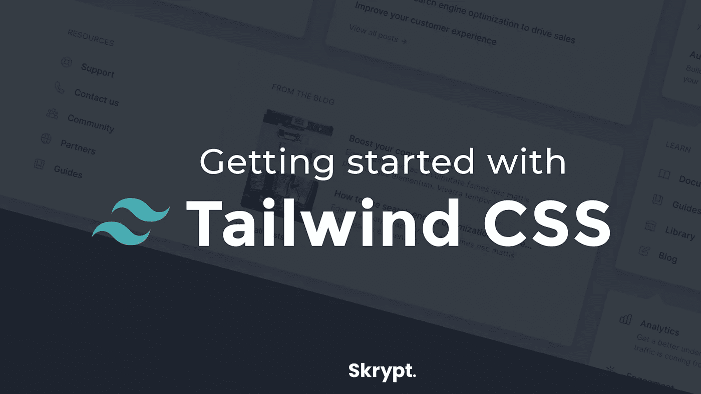

# 顺风 CSS 入门

> 原文：<https://itnext.io/getting-started-with-tailwind-css-ad75d9e5eac4?source=collection_archive---------4----------------------->

*几个月前我写了* [*这篇文章*](/why-i-stopped-using-bootstrap-and-switched-to-tailwind-instead-8269ebdde3a9) *关于顺风 CSS 以及为什么我更喜欢它而不是 Bootstrap。从那以后，我收到了很多关于它的问题，所以我想让我们就如何开始创建一个深入的指南。*



# 内容

1.  [什么是顺风](#792e)
2.  [如何安装顺风](#165f)
3.  [配置顺风](#4a14)
    a. [断点](#58d7)
    b. [颜色](#95a9)
    c. [间距](#bd64)
    d. [变体](#f70c)
4.  [改善你的顺风工作流程](#453e)
5.  [常见问题解答](#d8f7)


# 什么是顺风

> Tailwind CSS 是一个高度可定制的低级 CSS 框架，它为您提供了构建定制设计所需的所有构件，而没有您必须努力克服的任何恼人的固执己见的风格。

没错，上面的文字是直接从 Tailwind 的网站上抄来的，但它准确地描述了 Tailwind 是什么。与 Bootstrap 或布尔玛等框架不同，Tailwind 没有任何预定义的风格或布局。但是，使用预样式的框架不是更容易上手吗？嗯，从某种意义上来说，的确如此，而且有了最新的 Bootstrap 版本(举例来说)，定制这些开箱即用的样式也变得容易多了。然而，有了顺风，你可以完全控制一切。Tailwind 的每一项功能都是可定制的。当你刚开始做一名 web 开发人员时，这可能会让你感到有些不知所措。但是，当你开始越来越熟悉网页设计并需要控制每一个样式属性时，你现在不再需要重写任何预先编写的类。例如，当你需要更新一个单一的颜色时，你唯一需要做的就是对你的顺风配置文件做一个小小的改变。在所有的资产都被建立之后，颜色将在你的整个项目中被改变。不再需要搜索所有的 CSS 文件来替换这种颜色。

[](https://tailwindcss.com/) [## tailwind CSS——一个实用的 CSS 框架，用于快速构建定制设计

### 它们带有各种预先设计的组件，如按钮、卡片和警报，可以帮助您快速移动…

tailwindcss.com](https://tailwindcss.com/) 

# 如何安装顺风

在 Tailwind 的网站上，你可以找到一个非常扩展且易于遵循的[分步指南](https://tailwindcss.com/docs/installation)，关于如何结合几个构建工具安装 Tailwind。我可以将所有步骤复制/粘贴到这里，但是我建议您自己阅读文档，因为具体的步骤取决于您的项目所使用的其他框架和工具。【https://tailwindcss.com/docs/installation】T5


在安装过程中的某一点上，您必须生成顺风配置文件。然而，如果你还不太熟悉这个文件的无限可能性，我建议你运行`npx tailwindcss init --full`。使用`--full`标志，Tailwind 将向您的配置文件添加一大堆预定义的规则。乍一看，这似乎让人不知所措，但是相信我，当你刚刚开始时，使用这套默认规则会使事情变得容易得多。

[](https://skr.pt/cloudways-tailwind)

正在寻找托管您的顺风应用程序的方法吗？查看 Cloudways，终极管理云托管平台！


# 配置顺风

配置系统大概是我最喜欢顺风的地方。您也可以自己在主 CSS 文件中定义样式变量，Tailwind 会自动为您完成这项工作。Tailwind 框架是以这样一种方式创建的，通过在配置文件中做一个小的改变，或者通过安装一个(第三方)插件，每一件小事都可以被改变。在这一节，我将简要回顾一下，在我看来，配置系统最常用的特性。在每个特性的下面，我会留下一个到原始 Tailwind 文档的链接，这些文档通常会提供更详细的信息。

## 断点

就像其他 CSS 框架一样，Tailwind 提供了在不同屏幕尺寸上改变网站风格的可能性。当您使用默认的顺风配置文件时，将有 4 个默认断点:

```
screens: {
  sm: '640px',
  md: '768px',
  lg: '1024px',
  xl: '1280px'
}
```

例如，如果您想添加第五个断点，只需向 screens 对象添加一个新属性，它就可以立即在整个项目中使用。或者你甚至可以随意更改默认断点名称(例如`phone`、`tablet`、`laptop`、&、`desktop` )
与 Bootstrap 相反，你可以为你在配置文件中定义的每个样式属性使用这些断点。无论你想改变颜色还是边距，Tailwind 都可以通过简单地将特定的断点作为前缀添加到任何类中来实现。例如，让我们考虑我们想要在较小的设备上使用不同的背景颜色，那么我们只需添加以下两个类:`bg-color-red-500` & `md:bg-color-white`。注意我是如何在原来的`bg-color-white`类前面添加`md:`的。同样，这适用于几乎所有的顺风发电类。

[](https://tailwindcss.com/docs/breakpoints) [## 断点—顺风 CSS

### 您可以在 tailwind.config.js 文件的 theme.screens 部分定义项目的断点。钥匙是你的…

tailwindcss.com](https://tailwindcss.com/docs/breakpoints) 

## 颜色；色彩；色调

开箱即用的配置带有一些预定义的颜色，当然，您可以修改甚至删除这些颜色。默认情况下，这些颜色有 9 种不同的色调，从 100 到 900，500 是原始颜色。例如，要使用红色作为背景色，只需将`bg-red-500`类添加到 HTML 元素中。这也适用于文本颜色(`text-red-500`)和边框颜色(`border-red-500`)。没有任何不同色调的颜色，如黑色和白色，可以像`text-white`和`border-black`一样使用，而要使用不同色调的颜色，您必须将`500`替换为您想要使用的任何色调。

要向项目中添加自定义颜色，只需向配置文件中的 colors 对象添加一个新的嵌套对象。这个 [*顺风颜色阴影*](https://javisperez.github.io/tailwindcolorshades/#/) 工具可以帮助你轻松生成你的颜色的不同阴影，所以你可以把它们添加到你的主题中。结合不同的变体，我们将进一步讨论，这些色调可以很容易地创建一个专业外观的用户界面，没有太多的麻烦。

[](https://tailwindcss.com/docs/customizing-colors) [## 自定义颜色—顺风 CSS

### tailwind.config.js 文件的 theme.colors 部分允许您覆盖 tailwind 的默认调色板。//…

tailwindcss.com](https://tailwindcss.com/docs/customizing-colors) 

## 间隔

空白和间距在现代 UI/UX 设计中非常重要。为了保持网站的清晰和易用，你需要增加元素之间的间距，或者让元素变大(或变小)，这样用户就可以很容易地区分不同之处。默认情况下，顺风会将以下预定义的间距比例添加到主题中:

```
spacing: {
  px: '1px',
  '0': '0',
  '1': '0.25rem',
  '2': '0.5rem',
  '3': '0.75rem',
  '4': '1rem',
  '5': '1.25rem',
  '6': '1.5rem',
  '8': '2rem',
  '10': '2.5rem',
  '12': '3rem',
  '16': '4rem',
  '20': '5rem',
  '24': '6rem',
  '32': '8rem',
  '40': '10rem',
  '48': '12rem',
  '56': '14rem',
  '64': '16rem'
},
```

此间距比例可用于填充和边距类，也可用于(最大- &最小-)宽度、(最大- &最小-)高度等。唯一不能用这个比例调整大小的是字体大小，因为这个属性有自己的比例。例如，要使用上边距的比例，您可以将`mt-8`类添加到所需的元素中。如前所述，你也可以用它来填充(T1)或最小高度(T2)。

[](https://tailwindcss.com/docs/customizing-spacing) [## 自定义间距—顺风 CSS

### 您的 tailwind.config.js 文件的 theme.spacing 部分允许您覆盖 tailwind 的默认间距/大小…

tailwindcss.com](https://tailwindcss.com/docs/customizing-spacing) 

## 变体

这可能是我最喜欢的顺风特性之一:变体。这个特性为您提供了改变样式的可能性，例如，当用户悬停或聚焦在一个元素上时。开箱即用支持 12 种不同的变体:

*   `'responsive'`
*   `'group-hover'`
*   `'focus-within'`
*   `'first'`
*   `'last'`
*   `'odd'`
*   `'even'`
*   `'hover'`
*   `'focus'`
*   `'active'`
*   `'visited'`
*   `'disabled'`

然而，默认情况下不会生成所有这些变量，因为这会大大增加 CSS 文件的大小。默认情况下，大多数类会有不同的响应变体，少数会有 hover 或 focus 伪类变体。如果您想使用任何其他变量，您必须将所需的变量添加到可以在 Tailwind 配置文件中找到的 variants 对象的嵌套数组中。

例如，假设我们想要将每个奇数表格行的高度加倍。在您的`tailwind.config.js`文件中，您会发现下面一行:`height: [‘responsive’],`。如你所见，我们只有高度等级的响应变体。为了达到我们的目标，我们将`'odd'`添加到数组中。资产构建完成后，我们可以使用`odd:height-24`类，赋予每个奇数`tr`一个`6rem`的高度(如我们的`spacing`对象中所定义的)。

[](https://tailwindcss.com/docs/configuring-variants) [## 配置变体—顺风 CSS

### 在 tailwind.config.js 文件的 variants 部分，您可以控制应该拥有哪些核心实用程序插件…

tailwindcss.com](https://tailwindcss.com/docs/configuring-variants) 

# 改进您的顺风工作流程

当你使用 Tailwind 的时候，你可能会发现自己在一遍又一遍地添加相同的类，比如按钮。幸运的是，您可以使用自定义的`@apply`指令将一组 Tailwind 类捆绑成一个单独的类。看看这个例子:

```
.table-cell {
  @apply border;
  @apply px-4;
  @apply py-2;
}
```

或者用一种更简短的方式:

```
.table-cell {
  @apply border px-4 py-2;
}
```

当您现在将`table-cell`类添加到您的任何元素中时，这些元素都将具有`border`、`px-4`和`py-2`类的属性。当然，在这种情况下，只有 3 个不同的类，但是想象一下你需要为一个按钮样式添加 20 多个类。

但是有一点要注意，你不能在你的主类中直接使用变体。要为你的类创建一个变体，你必须手动创建一个伪类，并在其中添加不同的样式。例如，当您想要创建一个悬停伪类时，您必须这样做:

```
.table-cell {
  @apply bg-gray-100 border px-4 py-2;
}.table-cell {
  @apply bg-gray-300;
}
```

[](https://skr.pt/cloudways-tailwind)

[正在寻找托管您的顺风应用的方法吗？查看 Cloudways，终极管理云托管平台！](https://skr.pt/cloudways-tailwind)