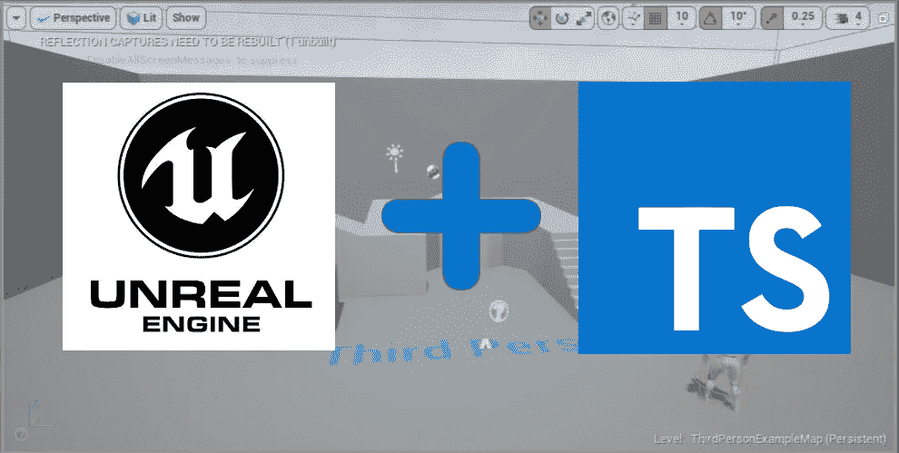
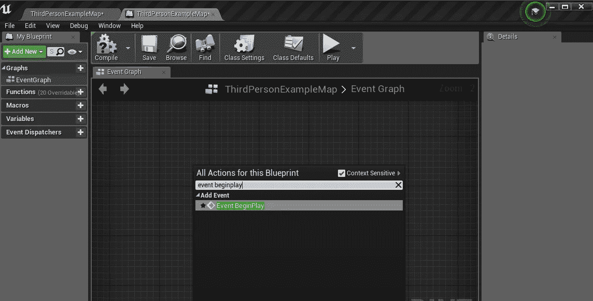
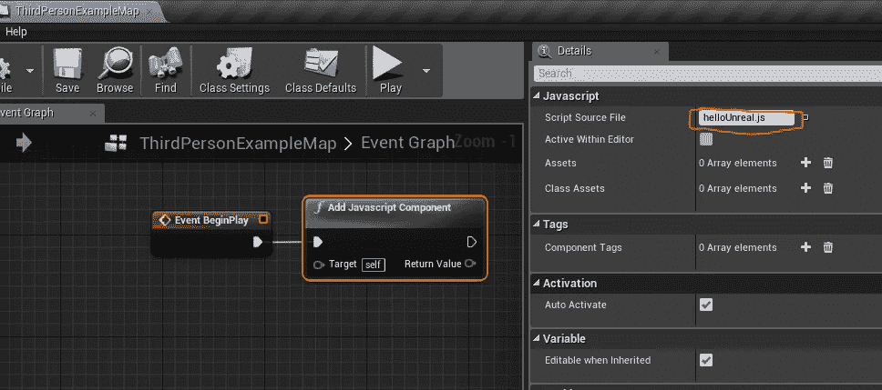
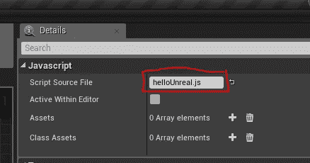
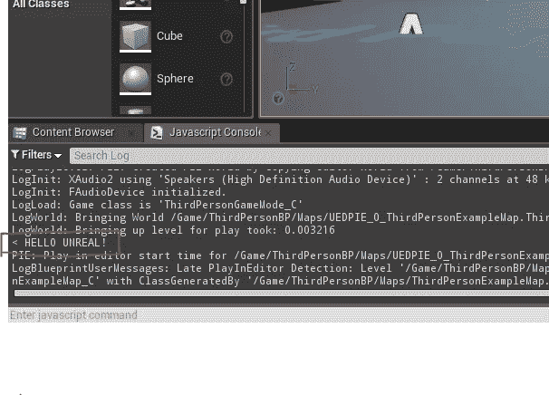
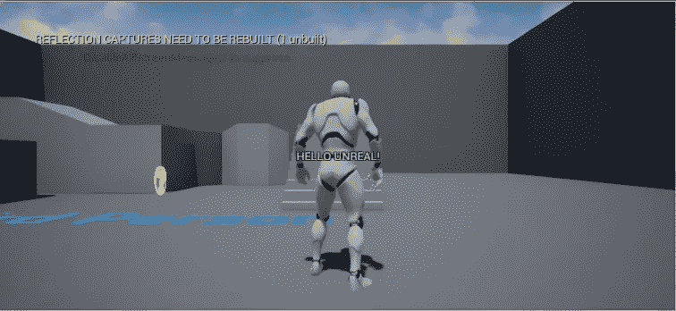

# 虚幻引擎中的 TypeScript 入门

> 原文：<https://itnext.io/getting-started-with-typescript-in-unreal-engine-f1a70adb624?source=collection_archive---------3----------------------->



你可能听说过像《堡垒之夜》和《未知玩家的战场》这样的游戏。这两款游戏都是在虚幻引擎 4 中构建的。虚幻引擎一直是 AAA 游戏开发商和独立工作室的最爱。自从 Epic Games 在 2015 年发布免费使用的引擎以来，许多热切的开发者和爱好者已经尝试在强大的 3D 引擎中创建游戏。大多数爱好者和小团队选择引擎内置的蓝图编辑器，而不是 C++中的脚本。虽然 Unreal 的 blueprint editor 使用起来非常简单，但对于一些开发人员来说，在 GUI 界面中连接许多节点似乎很麻烦。幸运的是，JavaScript 社区总能找到将他们最喜欢的语言与任何东西配对的方法，因此给我们带来了[虚幻。JS](https://github.com/ncsoft/Unreal.js) 。Unreal.js 是 Unreal Engine 的 V8 运行时，它可以替代现有的 C++和 Blueprint 脚本，或者与现有的 c++和 blue print 脚本一起运行。唯一能让用 JS 开发大型 3D 游戏变得更容易的是无限可伸缩的 TypeScript。在这里，我将向您展示如何开始使用 Unreal.js 和 TypeScript。

首先，如果你还没有，通过 Epic Games Launcher 安装虚幻引擎。接下来，在启动器中进入市场，找到 Unreal.js，然后运行“安装到引擎”。


打开虚幻引擎，创建一个新项目。在这个例子中，我创建了一个第三人称蓝图项目。

打开编辑器后，进入“编辑>插件”并确保“虚幻 JS”已启用。如果没有，启用它，您将看到一个提示，要求重新启动编辑器。

现在，在项目的内容文件夹中，您应该会看到一个名为“脚本”的文件夹。如果没有安装 typescript，可以通过运行

```
npm install -g typescript
```

接下来，打开您的终端，导航到脚本文件夹并运行

```
tsc --init
```

这会生成一个 tsconfig.json 文件。打开文件，根据您的喜好更改设置。在底部，我们将从 Unreal.js 中排除“aliases.js”文件。

```
tsconfig.json
...
...// "emitDecoratorMetadata": true,         /* Enables experimental          support for emitting type metadata for decorators. */}, "exclude": [ "aliases.js" ]}
```

现在，在您喜欢的编辑器中打开 Scripts 文件夹，创建一个名为“helloUnreal.ts”的文件。

现在，让我们只添加一个控制台消息。在文件中添加

```
console.log(’HELLO UNREAL!’)
```

现在，在我们的终端中，让我们运行 TypeScript 编译器。

```
tsc helloUnreal.ts
```

这应该会创建一个“helloUnreal.js”文件。

打开虚幻编辑器，在第三个人示例地图中，转到“蓝图”并打开事件图。在事件图中，我们将添加一个在游戏开始时触发的事件，名为“EventBeginPlay”。添加事件的最简单方法是右键单击蓝图并搜索它。



接下来，我们将找到使用相同方法添加 JavaScript 组件的函数，并通过单击和拖动将两个节点连接在一起。选择 JavaScript 组件，然后在编辑器右侧的“Details”选项卡上，将我们的“helloUnreal.js”文件添加到“脚本源文件”输入框中。



现在，确保点击“编译”和“保存”，这应该是它。现在我们可以打开 JavaScript 控制台并测试我们的代码。转到“窗口>开发工具> Javascript 控制台”并打开控制台。

现在点击“播放”按钮，运行游戏。在控制台中，您应该会看到“HELLO UNREAL！”我们之前添加的消息。



# 使用 TypeScript 创建 HUD 信息

好了，现在让我们试着用 Unreal.js 对我们的游戏做点什么。首先，为了启动一个实时重载开发环境，让我们创建一个名为“bootstrap.ts”的引导文件，它将遵循 [Unreal.js 示例](https://github.com/ncsoft/Unreal.js/blob/master/Examples/Content/Scripts/bootstrap.js)。

```
/// <reference path="typings/ue.d.ts">/>export default function (filename:string) { Context.RunFile('aliases.js') Context.RunFile('polyfill/unrealengine.js') Context.RunFile('polyfill/timers.js') require('devrequire')(filename)}
```

现在让我们运行 TypeScript 来观察我们用

```
tsc -w
```

让我们打印我们的“你好不真实！”通过创建一个演员向 HUD 发送消息。以 [helloCanvas 为例](https://github.com/ncsoft/Unreal.js/blob/master/Examples/Content/Scripts/helloCanvas.js)。打开 helloUnreal.ts 并添加以下代码:

```
/// <reference path="typings/ue.d.ts">/>// find a local player controllerfunction GetPC() {// out-ref function returns an object which contains out-ref params and return param.// eg) bool USomeClass::Func(int a, int* b, int* c); -> {$:{bool}, b:{int}, c:{int}}return PlayerController.C(GWorld.GetAllActorsOfClass(PlayerController).OutActors[0])}function main(){ class MyHUD extends HUD { ctor() { }// override ReceiveDrawHUD ReceiveDrawHUD() { var text:string = 'HELLO UNREAL!'; this.Canvas.DrawText( GEngine.SmallFont, text, {X:this.Canvas.SizeX/2,Y:this.Canvas.SizeY/2}, {R:1,G:1,B:1,A:1}, 0, {R:0,G:0,B:0,A:1}, {X:1,Y:1}, true,true,true, {R:0,G:0,B:0,A:1} ) }}// register new HUD classlet MyHUD_C = require('uclass')()(global,MyHUD);// and instantiate it GetPC().ClientSetHUD(MyHUD_C)// no mess to clean return function () { }}import bootstrap from "./bootstrap"// bootstrap to initiate live-reloading dev env.try { module.exports = () => { let cleanup:Function|null = null// wait for map to be loaded.process.nextTick(() => cleanup = main());// live-reloadable function should return its cleanup function return () => (<Function>cleanup)() }}catch (e) { bootstrap('helloUnreal')}
```

现在，当我们在游戏中点击“Play”时，应该会看到“HELLO UNREAL！”屏幕中央的消息。



注意，这个例子包含了一个没有使用的清理函数。如果你在你的剧本中创造演员，这个功能是非常重要的，但是你可以在这里看到一个基本的例子[。](https://github.com/ncsoft/Unreal.js/blob/master/Examples/Content/Scripts/helloWorld.js)

现在我们用[虚幻有了一个虚幻引擎项目。可以使用 TypeScript 编写脚本的 JS](https://github.com/ncsoft/Unreal.js) 。编码快乐！

***注意*** *:编写类型文件是为了在 JavaScript 的 VSCode 中提供自动完成功能，可能需要一些配置来删除最新版本的 TypeScript 中的所有警告。库检查也可能触发* [*GitHub 用户 concestar row*](https://github.com/ncsoft/Unreal.js/issues/164#issuecomment-289242192)*指出的错误，应该在 tsconfig.json 文件中忽略。*

*虚幻。JS 是开源的，更新类型对于任何对使用 TypeScript 感兴趣的人来说都是一个巨大的贡献。*