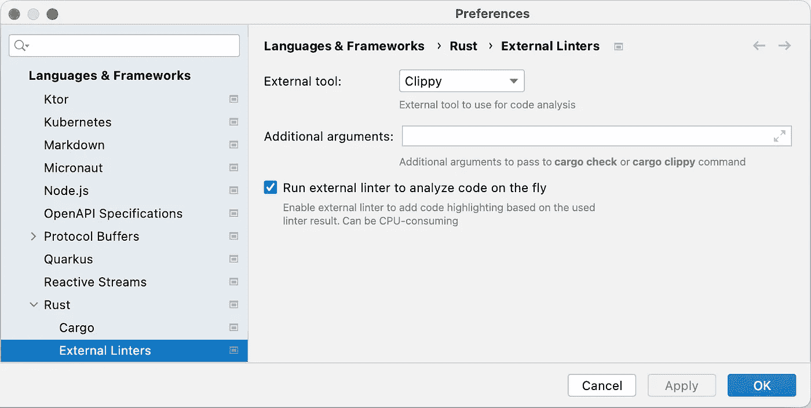

# 铁锈色镀金玫瑰形

> 原文：<https://itnext.io/gilded-rose-kata-in-rust-e00f51f1e8d8?source=collection_archive---------6----------------------->


镀金的玫瑰形是一个重构练习。GitHub 上的[提供了完整的描述。我很晚才知道这个形，也就是在 2016 年的雪营会议上。](https://github.com/NotMyself/GildedRose)[约翰·马丁森](https://twitter.com/johan_alps)和[雷米·桑拉维尔](https://twitter.com/sanlaville)基于《镀金的玫瑰》做了一次现场代码重构。

如今，我认为形更加广泛。它在很多语言中都有[版本](https://github.com/emilybache/GildedRose-Refactoring-Kata)，甚至包括一些不被认为是主流的语言*，例如*，XSLT 或者 ABAP。在这篇文章中，我想用 Rust 来做。我的想法是少关注一般的重构原则，多关注 Rust 细节。

*   [我的第一杯铁锈](https://blog.frankel.ch/start-rust/1/)
*   [我的第二杯铁锈](https://blog.frankel.ch/start-rust/2/)
*   [生锈练习—第一部分](https://blog.frankel.ch/start-rust/3/)
*   [生锈练习—第二部分](https://blog.frankel.ch/start-rust/4/)
*   [前端生锈](https://blog.frankel.ch/start-rust/5/)
*   [库伯内特公司的铁锈控制器](https://blog.frankel.ch/start-rust/6/)
*   [Rust 和 JVM](https://blog.frankel.ch/start-rust/7/)
*   [diceroller，一个样本生锈项目](https://blog.frankel.ch/start-rust/8/)
*   [铁锈的矢量](https://blog.frankel.ch/start-rust/9/)

# 实施测试

我们需要通过实现测试来开始 kata，以确保重构不会破坏现有的逻辑。

没什么好说的，但还是:

*   Infinitest: IntelliJ IDEA 为 JVM 语言提供了 Infinitest 插件。您可以将其配置为在每次代码更改时运行您的测试。一旦你的重构破坏了测试，横幅就会从绿色变成红色。我没有找到任何类似 Rust 的插件。
*   测试位置:在 Java 中，Maven 已经普及了配置方法的约定，`src/main/java`用于应用程序代码，`src/test/java`用于测试。通常，测试结构遵循主结构。我们可以在同一个文件中编写测试，但是在 Rust 的一个专用模块中。

```
// Main code

#[cfg(test)]                                                    // 1
mod tests {                                                     // 2

    use super::{GildedRose, Item};                              // 3

    #[test]
    pub fn regular_item_sell_in_and_quality_decrease() {}       // 4

    #[test]
    pub fn regular_item_quality_stop_decreasing_at_0() {}       // 4

    // Other tests
}
```

1.  作为常规应用程序启动时被忽略
2.  专用模块
3.  因为`tests`是一个专用模块，我们需要从父模块导入`struct`
4.  测试功能

# Clippy 是你的朋友！

> *收集 lints 来捕捉常见错误并改进您的 Rust 代码。*
> 
> 这个板条箱里有 500 多根棉绒！
> 
> *棉绒分为多个类别，每个类别都有一个默认的棉绒级别。你可以选择多少 Clippy 应该骚扰帮助你，通过改变类别的棉绒水平。*
> 
> *—*[*GitHub*](https://github.com/rust-lang/rust-clippy)

在命令行上，`cargo`原生集成了 Clippy。您可以通过在项目文件夹中运行以下命令来使用它:

```
cargo clippy
```

您可以在 IntelliJ 中显示 Clippy 的警告。转到首选项>语言和框架> Rust >外部 Linters。然后，您可以选择工具*，例如*、Clippy，以及是否在后台运行它。



IntelliJ 警告你，它可能是 CPU 繁重。

Clippy 强调了以下陈述:

```
item.quality = item.quality + 1;
item.quality = item.quality - 1;
```

和 Java 一样，IntelliJ IDEA 非常适合重构。你可以使用`Alt+Enter`组合键，IDE 会处理这些琐碎的工作。新代码是:

```
item.quality += 1;
item.quality -= 1;
```

# 关于实现的函数

在 Java 中，很大一部分重构致力于改进面向对象方法。虽然 Rust 不是 OO，但它提供了功能。函数可以是顶级的:

```
fn increase_quality() {}
```

功能也可以是`impl`的一部分:

```
struct Item {
    pub quality: i32,
}impl Item {
    fn increase_quality() {}   // 1
}Item::increase_quality();      // 2
```

1.  定义函数
2.  打电话吧

在`impl`中定义的函数可以访问它的`struct`:它的第一个参数必须是`self`或者它的一个替代- `mut self`和`&mut self`:

```
struct Item {
    pub quality: i32,
}impl Item {
    fn increase_quality(&mut self) {    // 1
        self.quality += 1;              // 2
    }
}let item = Item { quality: 32 };
item.increase_quality();                // 3
```

1.  第一个参数是对`Item`的可变引用
2.  更新`quality`属性
3.  调用`item`变量上的函数

# 字符串匹配

原始代码库使用大量条件表达式进行字符串比较:

```
if self.name == "Aged Brie" { /* A */}
else if self.name == "Backstage passes to a TAFKAL80ETC concert" { /* B */ }
else if self.name == "Sulfuras, Hand of Ragnaros" { /* C */ }
else { /* D */ }
```

我们可以利用`match`关键字。然而，锈分为`String`型和`&str`型。为此，我们必须将前者转化为后者:

```
match self.name.as_str() {                                      // 1
    "Aged Brie"                                 => { /* A */ }
    "Backstage passes to a TAFKAL80ETC concert" => { /* B */ }
    "Sulfuras, Hand of Ragnaros"                => { /* C */ }
    _                                           => { /* D */ }
}
```

1.  将`String`转换为`&str` -需要编译

# 空火柴

“拉格纳罗斯之手”产品的质量始终如一。因此，它的相关逻辑是空的。语法是`()`定义空语句。

```
match self.name.as_str() {
    "Aged Brie"                                 => { /* A */ }
    "Backstage passes to a TAFKAL80ETC concert" => { /* B */ }
    "Sulfuras, Hand of Ragnaros"                => (),         // 1
    _                                           => { /* D */ }
}
```

1.  什么也不做

# 列举

项目类型由其名称引用。重构后的代码公开了以下生命周期阶段:销售前、销售中和销售后。代码在销售前和销售后阶段使用相同的字符串。显而易见，使用枚举只写一次字符串。

```
enum ItemType {                                        // 1
    AgedBrie,
    HandOfRagnaros,
    BackstagePass,
    Regular
}impl Item {
  fn get_type(&self) -> ItemType {                     // 2
    match self.name.as_str() {                         // 3
      "Aged Brie"                             => ItemType::AgedBrie,
      "Sulfuras, Hand of Ragnaros"      => ItemType::HandOfRagnaros,
      "Backstage passes to a TAFKAL80ETC concert" => ItemType::BackstagePass,
      _                                        => ItemType::Regular
    }
  }
}
```

1.  枚举所有可能的项类型
2.  函数将项类型从其名称中去掉
3.  字符串匹配只发生在这里。错别字的可能性在单个位置。

此时，我们可以在 match 子句中使用枚举。它要求`enum`实现`PartialEq`。对于枚举，我们可以使用宏。

```
#[derive(PartialEq)]
enum ItemType {
    // same as above
}fn pre_sell_in(&mut self) {
    match self.get_type() {
        ItemType::AgedBrie       => { /* A */ }
        ItemType::BackstagePass  => { /* B */ }
        ItemType::HandOfRagnaros => (),
        ItemType::Regular        => { /* D */ }
    }
}// Same for post_sell_in
```

# 惯用铁锈:`From`和`Into`

由于其强大的类型系统，从一种类型转换到另一种类型在 Rust 中非常常见。出于这个原因，Rust 在其标准库中提供了两个特征:`From`和`Into`。


> *用于在消耗输入值的同时进行值到值的转换。是* `*Into*` *的倒数。*
> 
> *比起* `*Into*` *，人们应该总是更喜欢实现* `*From*` *，因为实现* `*From*` *自动为人们提供了* `*Into*` *的实现，这得益于标准库中的一揽子实现。*
> 
> *—* [*特质 std::convert::From*](https://doc.rust-lang.org/std/convert/trait.From.html)

在上一节中，我们使用一个定制的`get_type()`函数将一个`String`转换为一个`ItemType`。为了编写更地道的 Rust，我们将用一个`From`实现替换这个函数:

```
impl From<&str> for ItemType {
    fn from(slice: &str) -> Self {
        match slice {
            "Aged Brie"                       => ItemType::AgedBrie,
            "Sulfuras, Hand of Ragnaros"=> ItemType::HandOfRagnaros,
            "Backstage passes to a TAFKAL80ETC concert" => ItemType::BackstagePass,
            _                                  => ItemType::Regular
        }
    }
}
```

我们现在可以使用它:

```
fn pre_sell_in(&mut self) {
    match ItemType::from(self.name.as_str())  {       // 1
        ItemType::AgedBrie       => { /* A */ }
        ItemType::BackstagePass  => { /* B */ }
        ItemType::HandOfRagnaros => (),
        ItemType::Regular        => { /* D */ }
    }
}
```

1.  使用惯用的`From`特征

因为实现`From`提供了对称的`Into`，我们可以相应地更新代码:

```
fn pre_sell_in(&mut self) {
    match self.name.as_str().into()  {                // 1
        ItemType::AgedBrie       => { /* A */ }
        ItemType::BackstagePass  => { /* B */ }
        ItemType::HandOfRagnaros => (),
        ItemType::Regular        => { /* D */ }
    }
}
```

1.  将`From`替换为`into()`

# 结论

不管是哪种语言，重构代码都是一个很好的学习练习。在这篇文章中，我展示了几个使用更地道 Rust 的技巧。在我学习这门语言的过程中，请随时提供额外的技巧来进一步改进代码。

这篇文章的完整源代码可以在 GitHub 上找到[。](https://github.com/ajavageek/gilded-rose-rust)

*原载于* [*一个 Java 极客*](https://blog.frankel.ch/start-rust/10/)*2021 年 2 月 6 日*