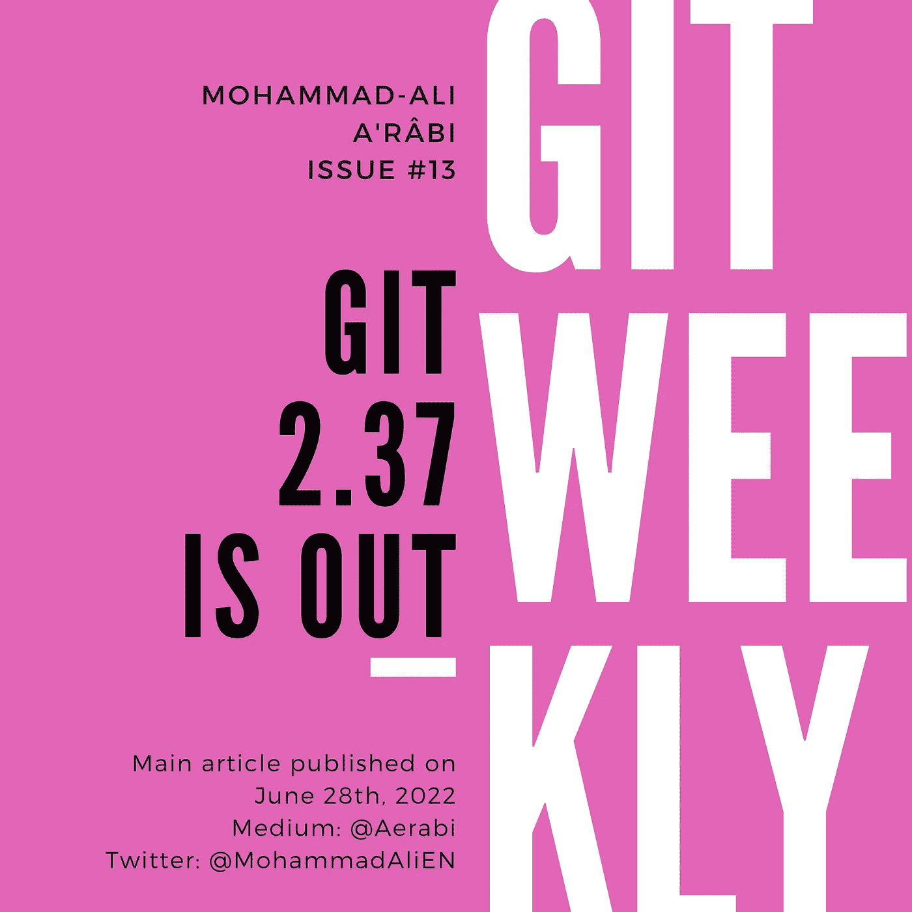

# Git 2.37 出来了

> 原文：<https://itnext.io/git-2-37-is-out-31945b4862aa?source=collection_archive---------1----------------------->

## 变化的亮点

git 的最新版本 2.37 于昨天发布，增加了超过 75 个新特性和修复。在这篇文章中，我们将安装它，并看看一些有趣的功能。



# 如何安装

最新版本的 git 在一段时间后才在包注册中心可用。例如`apt`在我的 Ubuntu 20.04 上安装 git 2.25，在我的 Ubuntu 22.04 上安装 git 2.34.1。要立即安装最新版本，可以从源文件手动构建 git。

> 建议等待软件包注册中心发布最新版本。手工构建需要专业知识。

要手动构建 git，首先在您的机器上克隆 repo:

```
git clone https://github.com/git/git.git
```

转到克隆存储库的目录:

```
cd git
```

现在做如下操作:

```
make
make install
```

这将在您的主目录中安装 git。要改为全局安装:

```
make prefix=/usr all doc info
```

# 有什么新鲜事？

有许多技术上的改变使得 git 运行更加流畅，性能也得到增强。界面也有变化。

## 新版本和帮助命令

要查看 git 的版本，必须使用以下命令:

```
git --version
```

在 2.37 版中，为其创建了以下别名:

```
git -v
```

现在`-h`可以到达的`--help`也是如此。

[ [来源](https://lore.kernel.org/git/xmqqy1xinf00.fsf@gitster.g/T/#u) ]

## 交互式舞台已重写

*主文:* [*Git 部分暂存*](/git-partial-staging-17714642cb1e)

git 中有一个交互式暂存选项，允许进行部分暂存(例如，暂存文件中的一些更改，而不暂存同一文件中的其他更改)。交互式暂存可通过以下方式访问:

```
git add -i
```

整个互动舞台都是用 c 重写的。

[ [来源](https://lore.kernel.org/git/xmqqy1xinf00.fsf@gitster.g/T/#u)

## 用于 Windows 和 macOS 的文件系统监视器

Git 被设计成在 Linux 上很快。有时，它会降低在其他操作系统上的性能。文件系统监视器使得像`git status`这样的命令在非 Linux 操作系统上运行得更快。要启用它:

```
git config core.fsmonitor true
```

[ [来源](https://github.blog/2022-06-27-highlights-from-git-2-37/)

## 因为作为 Git 日志的过滤器

命令`git log`有一个`--since`选项，用于列出特定时间后创建的所有提交:

```
git log --since=<date>
```

`--since`选项列出提交，直到遇到比给定日期更早的提交，不会显示任何比该日期更早的提交。但是提交可能不是按日期排序的，因为:

*   创建提交的机器上的日期是错误的，
*   提交被手动重新排序，等等。

因此，添加了一个新选项，显示不早于某个日期的所有提交:

```
git log --since-as-filter=<date>
```

[ [来源](https://lore.kernel.org/git/xmqqy1xinf00.fsf@gitster.g/T/#u)，[来源](https://git-scm.com/docs/git-log)

# 最后的话

要了解最新版本的其他变化，请看看[的变更日志](https://lore.kernel.org/git/xmqqy1xinf00.fsf@gitster.g/T/#u)。

我每周在 git、GitHub 和 GitLab 上写文章。

*   订阅 my Medium publishes，以便在新的 Git 周刊发布时获得通知。
*   在 Twitter 上关注我，获取 git 上的每周文章和每日推文。