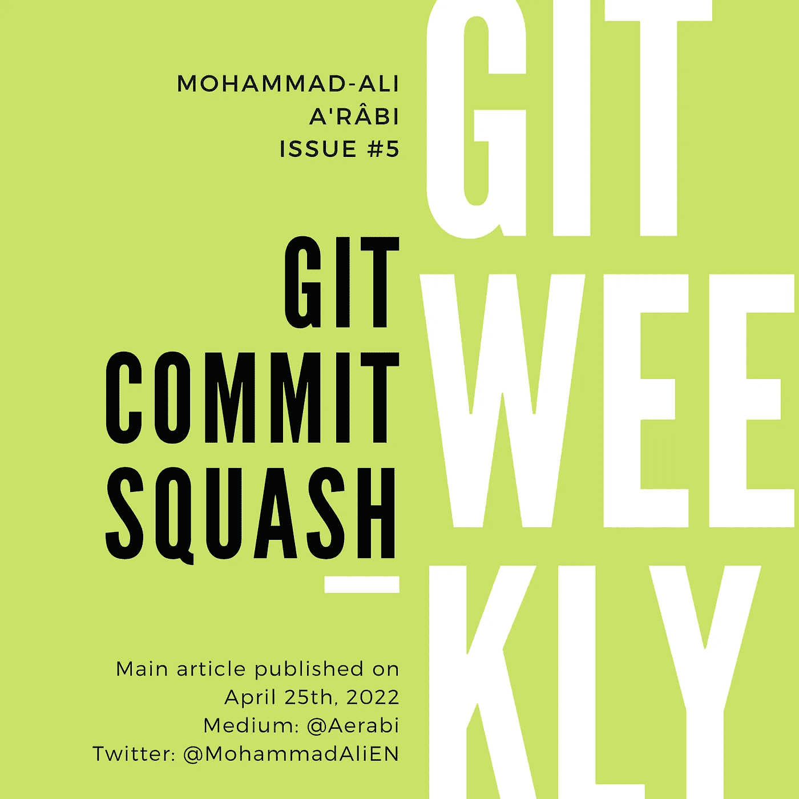

# Git 提交挤压

> 原文：<https://itnext.io/git-commit-squash-64c5b23b188a?source=collection_archive---------3----------------------->

挤压提交是将几个提交合并成一个的行为。在 git 的上下文中，术语“挤压”出现在两个地方:

*   [挤压合并](/git-merge-vs-rebase-938950fb218)
*   手动挤压

挤压合并是一种特殊类型的合并，它自动获取一个分支中的所有提交，将它们挤压在一起，并将结果提交添加到目标分支(通常是主分支)。

挤压合并在下一期 Git Weekly 中得到了部分解决:

*   [Git 合并与 Rebase:三种类型的合并](/git-merge-vs-rebase-938950fb218)

在这一期中，我们将讨论如何手动压缩几个提交。



# 手动挤压

可以通过“交互式重置基础”进行手动挤压。让我们假设我们想要一起挤压 5 个最后的提交。然后，我们将对最后 5 次提交进行交互式重新排序:

```
git rebase -i HEAD~5
```

该命令将启动交互式重置基础。将启动一个编辑器(如`nano`)，其内容如下:

```
pick f72e7cb Feat: Resurrect flatMap
pick 1a18b1c Feat: Add list transformations
pick 3420af4 3.0.0
pick f55a9ee Docs: Add marble diagrams to README
pick 0433f9d Update README.md
```

保持第一行不变，用`s`(用于挤压)替换后面各行中的每个`pick`:

```
pick f72e7cb Feat: Resurrect flatMap
**s** 1a18b1c Feat: Add list transformations
**s** 3420af4 3.0.0
**s** f55a9ee Docs: Add marble diagrams to README
**s** 0433f9d Update README.md
```

保存并退出。然后，编辑器再次启动，显示所有 5 次提交的提交消息。随意删除全部，重写整个消息。保存并退出。这就结束了互动 rebase。

要验证挤压是否完成，请执行 git 日志:

```
git log
```

压缩完成后，如果您想要推送至远程分支，并且已经推送了 5 次提交中的任何一次，您必须强制执行:

```
git push [--force-with-lease](/git-force-vs-force-with-lease-9d0e753e8c41)
```

# 笔记

*   在交互式 rebase commit picker 中，你可以写`squash`而不是`s`。但是我想简单的`s`会更容易写下来。
*   要了解更多关于自动挤压的知识，请参考我的“ [16 Git 提示和技巧](/16-git-tips-and-tricks-bf08d0602d3b)”。我会写得更详细。
*   [订阅](https://medium.com/subscribe/@aerabi)my Medium publishes，以便在新的 Git 周刊发布时获得通知。
*   关注 Twitter 上的[我](https://twitter.com/MohammadAliEN)获取 git 上的每周文章和每日推文。