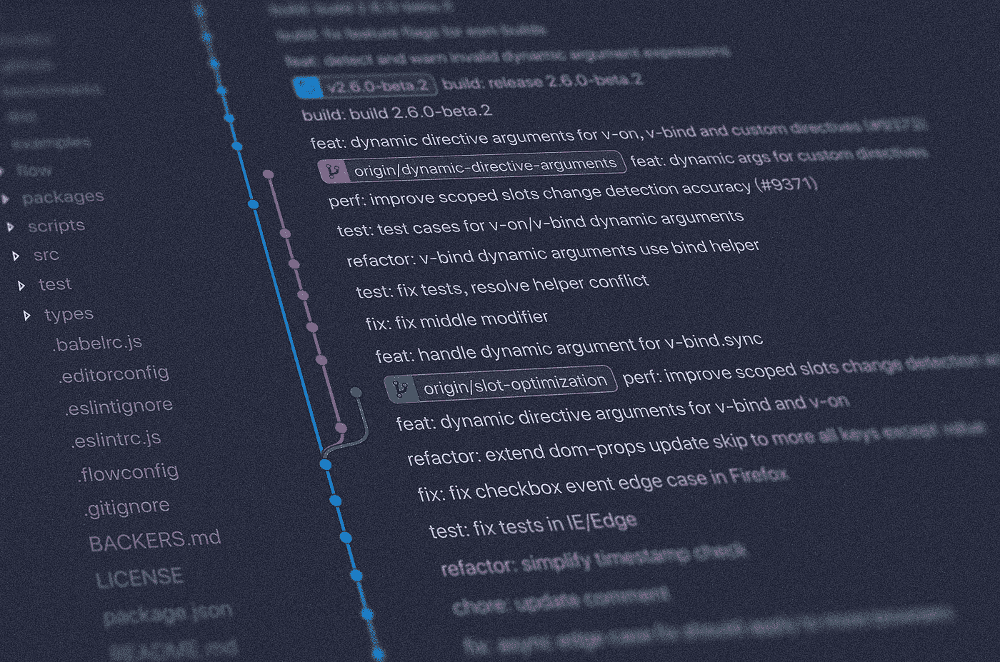

# 新手的 Git 概念——第 1 部分:什么是 DVCS？

> 原文：<https://itnext.io/git-concepts-for-newcomers-part-1-what-is-a-dvcs-bc873076c424?source=collection_archive---------5----------------------->

我正在开始一个关于 [Git](https://git-scm.com/) 的系列。本系列的目标是温和地介绍 [Git 版本控制系统](https://git-scm.com/) (VCS)的最重要的概念。

这是该系列的第一篇文章:

*   第一部分——什么是 DVCS:[https://it next . io/git-concepts-for-new York-part-1-What-is-a-dvcs-BC 873076 c 424](/git-concepts-for-newcomers-part-1-what-is-a-dvcs-bc873076c424)
*   第 2 部分—工作树和暂存区:[https://it next . io/git-concepts-for-new York-part-2-git-repository-Working-tree-and-staging-area-a2e 720 BF 3528](/git-concepts-for-newcomers-part-2-git-repository-working-tree-and-staging-area-a2e720bf3528)
*   第三部分—提交、记录和修改:[https://medium . com/@ dSebastien/git-concepts-for-new York-part-3-Commits-log-and-amend-6 dcbb 05370 c](https://medium.com/@dSebastien/git-concepts-for-newcomers-part-3-commits-log-and-amend-6dcbb05370c)
*   part # 4-Branches:[https://medium . com/@ dSebastien/git-concepts-for-新人-part-4-Branches-52 aee 1 da 4385](https://medium.com/@dSebastien/git-concepts-for-newcomers-part-4-branches-52aee1da4385)



图片由 [Yancy Min](https://unsplash.com/@yancymin) 提供

本系列将对初级用户、来自另一个版本控制系统的开发人员甚至对所有概念都不太熟悉的 git 用户有用。

这些文章就不深入了，那真的不是重点。我的目标只是简单地提供*简短的*和*易于理解的*关于最重要的概念/命令/想法的解释。

最后，我想以一个对分布式团队来说真正有效和强大的 git 工作流的解释来结束。

但在此之前，让我们先从基础开始。在第一篇文章中，我将解释为什么 Git 的分布式方面如此棒，以及它与 Subversion 等集中式系统有何不同。

如果你从未听说过 git，那么请在继续之前先看一下维基百科的页面。

如果您还没有安装 git，您也可以在您的机器上安装 git

[](https://git-scm.com/downloads) [## 下载

### Git 带有内置的 GUI 工具(git-gui，gitk ),但是有几个第三方工具供用户寻找一个…

git-scm.com](https://git-scm.com/downloads) 

# 分布式版本控制系统

Git 是一个*分布式*版本控制系统(DVCS)，或点对点版本控制系统，与像 [Subversion](https://subversion.apache.org/) 这样的集中式系统相反。

Git 没有“主”或“中央”存储库的概念。起初这可能被认为是一个“缺陷”，但是一旦你意识到它真正的含义，你会发现它实际上是 Git 最大的优点。

当您的机器上有 git 存储库时，它是自包含的。它自己就能很好地工作。使用 git 不需要在某个地方运行服务器。

对于像 Subversion 这样的旧版本控制系统(VCS ),必须有一个中央存储库来与版本控制系统进行交互。没有它，就无法检查日志，无法创建新的提交，无法切换到另一个分支，等等。

不仅如此，由于一切都必须通过中央存储库，一切都慢了很多。

有了机器上的 git 存储库，您就拥有了所需的一切。知识库包含整个历史；所有的分支，所有的提交，所有的标签，*所有的东西*。得益于此，为 Git 存储库创建备份变得异常简单:只需制作一份副本，就大功告成了。

创建 git 存储库非常简单，只需使用:

```
git init
```

使用机器上的 git 存储库，您可以创建新的提交、重新排序/重新安排/修改/删除现有的提交、创建标签等。仅此一点就让 git 超级好用。注意，您可以添加一个`--bare`标志，但我不会在这里解释。如果你想了解这方面的更多信息，请查看这篇文章。

此外，由于一切都发生在本地机器上，不需要与远程服务器交互，一切都非常快。

但这只是冰山一角。您可以从其他 git 存储库中推/拉内容/变更。您推送/提取的存储库可以在任何地方:在您的文件系统上，在同事的机器上，在远程服务器上。一点也不重要。

这是 Git 真正闪光的地方。您可以在您的存储库中进行更改，然后获取(获取)其他人所做的更改，并将它们集成(合并)到您的存储库中，或者将您自己的更改推送到其他存储库中。您可以对任意数量的远程存储库进行这样的操作，次数不限。git 的这种分布式特性非常强大，因为它允许您独立工作，而且可以轻松地将您的工作与其他人同步。

还记得像 Subversion 这样的系统的集中方法吗？如果你愿意，你可以用 git 做同样的事情(人们经常这么做)。你可以在像 [Github](https://github.com/) 、 [Gitlab](https://about.gitlab.com/) 、 [Bitbucket](https://bitbucket.org/) 、你的 NAS 或者其他什么平台上创建一个集中的 git 存储库，然后将你的本地存储库与那个同步。

没有拓扑约束；您可以按照自己的意愿组织代码，并根据自己的意愿拉/推代码。这是真正的解放和授权。

当然，已经有几个久经沙场的 *git* *工作流*。我将在这个系列的最后探索我最喜欢的。

# 结论

在本文中，我解释了像 git 这样的版本控制系统的分布式意义。那就是*自由*。自由实施不同的工作流程，随心所欲地进行协作。

在本系列的下一篇文章中，我们将探索 git 的不同“领域”。读完之后，你会清楚地看到你的 g it 库、工作目录和暂存区之间的区别。

今天到此为止！

# 喜欢这篇文章吗？点击下面“喜欢”按钮查看更多内容，并确保其他人也能看到！

PS:如果你想了解关于软件/Web 开发、TypeScript、Angular、React、Vue、Kotlin、Java、Docker/Kubernetes 和其他很酷的主题的大量其他很酷的东西，那么不要犹豫[去拿一本我的书](https://www.amazon.com/Learn-TypeScript-Building-Applications-understanding-ebook/dp/B081FB89BL)并订阅[我的时事通讯](https://mailchi.mp/fb661753d54a/developassion-newsletter)！