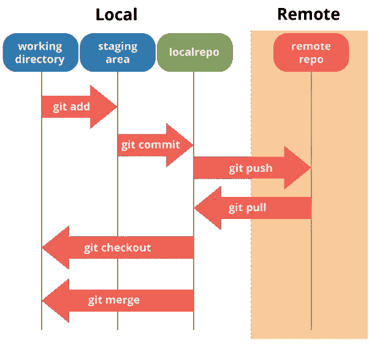
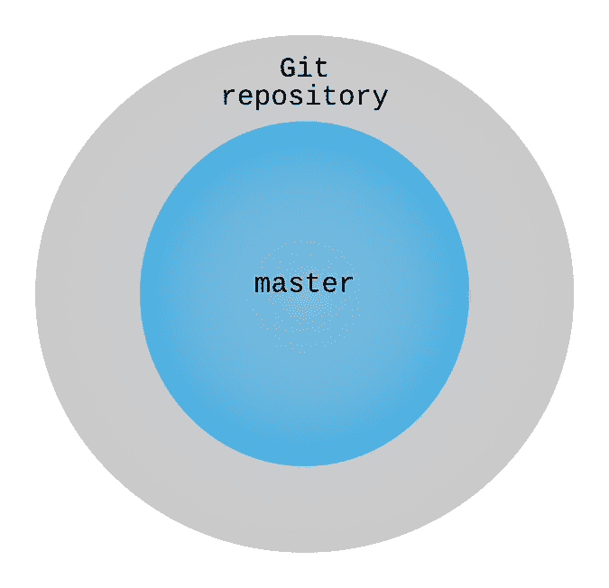
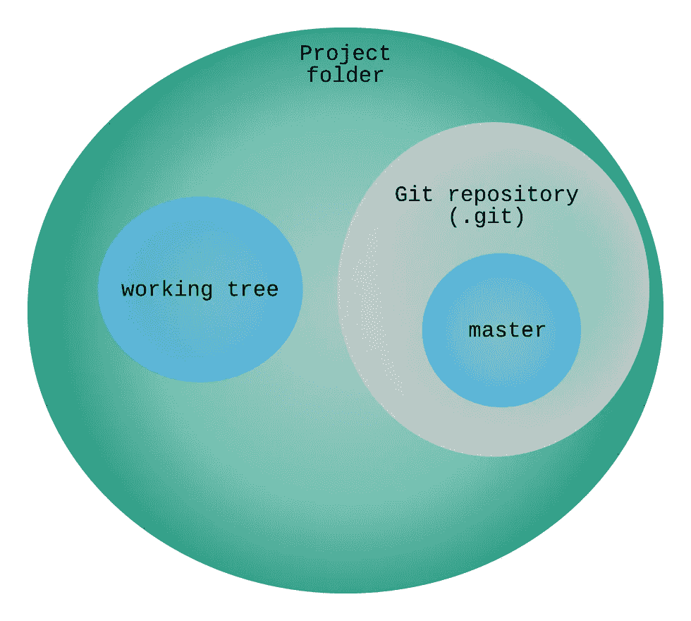

# 新来者的 Git 概念—第 2 部分:Git 存储库、工作树和暂存区

> 原文：<https://itnext.io/git-concepts-for-newcomers-part-2-git-repository-working-tree-and-staging-area-a2e720bf3528?source=collection_archive---------2----------------------->

让我们继续我们的 Git 宇宙之旅。这是该系列的第二篇文章。如果你错过了关于什么是 DVCS 的第一篇文章，你可以在这里查看。

**零件:**

*   第一部分—什么是 DVCS:[https://it next . io/git-concepts-for-new York-part-1-What-is-a-dvcs-BC 873076 c 424](/git-concepts-for-newcomers-part-1-what-is-a-dvcs-bc873076c424)
*   第 2 部分—工作树和暂存区:[https://it next . io/git-concepts-for-new York-part-2-git-repository-Working-tree-and-staging-area-a2e 720 BF 3528](/git-concepts-for-newcomers-part-2-git-repository-working-tree-and-staging-area-a2e720bf3528)
*   第三部分—提交、记录和修改:[https://medium . com/@ dSebastien/git-concepts-for-new yorks-part-3-Commits-log-and-amend-6 dcbb 05370 c](https://medium.com/@dSebastien/git-concepts-for-newcomers-part-3-commits-log-and-amend-6dcbb05370c)
*   part # 4-Branches:[https://medium . com/@ dSebastien/git-concepts-for-新人-part-4-Branches-52 aee 1 da 4385](https://medium.com/@dSebastien/git-concepts-for-newcomers-part-4-branches-52aee1da4385)


图片由 [Maksym Kaharlytskyi](https://unsplash.com/@qwitka) 提供

在这篇文章中，我将解释使用 Git 时需要注意的主要领域。它们是:存储库本身、工作树和索引，也称为暂存区。

我们开始吧！

# 创建 Git 存储库

如果您已经阅读了上一篇文章，那么您可能已经创建了一个存储库。如果没有，现在就使用 [git init 命令](https://git-scm.com/docs/git-init)创建一个:

```
git init
```

您可以在任何地方这样做，但是为了简单起见，请在一个空文件夹中这样做。

现在完成了，如果您列出文件，您应该注意到一个`.git`目录的存在。这是 Git 存储所有存储库数据/元数据的地方。我们将在以后的文章中探索该文件夹的内容(有很多很酷的东西要学！).现在，只需注意它的存在，并记住它是存储库:

```
$ ls
total 20K
drwxr-xr-x 1 dsebastien 197121 0 May 17 19:04 .
drwxr-xr-x 1 dsebastien 197121 0 Apr 26 18:45 ..
**drwxr-xr-x 1 dsebastien 197121 0 May 17 19:04 .git**
```

此时，如果您执行`git status`命令，您应该会看到以下内容:

```
$ git status
On branch masterNo commits yetnothing to commit
```

关于这一点有几点要说:

*   首先，我们在上默认****分支*** 。我们稍后将探索分支；暂时忘掉那些吧*
*   其次，Git 告诉我们到目前为止还没有任何提交，这是有意义的，因为这是一个全新的存储库
*   最后，Git 对 ***提交*** 看不到任何东西。这也是正常的，因为到目前为止我们还没有做任何事情

[git status](https://git-scm.com/docs/git-status) 命令允许我们[检查我们的存储库](https://www.atlassian.com/git/tutorials/inspecting-a-repository)。它显示了 ***工作树*** 的状态，以及 ***索引*** 的状态(也称为 ***暂存区*** )。这些术语很重要；我将在接下来的部分中解释每一个。

# 区域概述

像往常一样，一张图胜过千言万语:



[来源](https://greenido.files.wordpress.com/2013/07/git-local-remote.png)

目前，忽略上图中的箭头。相反，请关注列/通道。

Git 区分了三个不同的领域/概念:

*   ***存储库*** 本身，它存储在`.git`目录下的*中，如前一节所述*
*   ***工作树*** ，对应于文件系统中文件的当前状态
*   ***暂存区*** (也称为 ***索引*** )，这是您可以用来*准备*提交/临时保存您的工作的区域

在上面的模式中，还提到了一个远程存储库，但是我们将在以后保留它；-)

让我们一次发现一个领域。

# Git 存储库和主分支

正如我以前说过的，我不会涉及“的细节。git”文件夹的内容。尽管如此，重要的是要理解我们之前创建的 Git 存储库实际上是存储在 that 中的*。git”文件夹。在它外面的是所谓的工作树。我将在下一节阐明这一点。*

如果您想在这一点上可视化 Git 存储库的状态，那么可以把它想象成。git”文件夹:



(我真的不擅长想象:p)

这是一种过度简化，但创建 Git 如何组织其内容的第一个心理模型仍然是有用的。

此时，正如`git status`命令所指出的，我们的存储库在“主”分支上(即默认分支)。稍后我将向您展示，git 存储库确实可以包含许多分支，以及许多其他很酷的东西；-)

我们提交(即保存/持久化)到存储库中的所有内容都将存储在。git 文件夹，并将被“添加”到“主”分支，直到我们决定切换到(即签出)一个不同的分支。

现在不去探究什么是分支，它们是如何被创建的，等等，让我们尝试一个类比:想象一个分支就像一本书。您可以向其中添加页面(通过提交)，如果愿意，您可以重写页面(使用 amend)，重新组织页面(使用 rebase)，甚至将该故事与其他故事混合(使用 merge，rebase)。当然，这本书的页面是有编号的，并按照特定的顺序排列。后面我会教你那些操作。

# 工作树

对于 git，[工作树](https://git-scm.com/docs/git-worktree)(或工作目录)是文件系统上的一个目录树，它与 git 存储库相关联。这听起来可能不太清楚；让我解释一下。

当您查看包含 git 库的文件夹时，工作树是您看到的第一个树。工作树位于您的文件系统中。它可能包含与存储库中的分支完全相同的内容，但也可能完全不同，这取决于您对它所做的更改。

让我们尝试另一种可视化方式:



在上一节中，我们看到了这个逻辑图的一部分；即。git 文件夹。正如我们看到的，这个”。git”文件夹是整个存储库，其中包含了所有的内容:分支、标签、提交等(其中大部分内容我们还没有发现)。在这里，我们看到的是一个更高的层次:项目文件夹或“工作区”的内容，无论你喜欢叫它什么。

一旦你在一个文件夹中创建了一个 git 库或者*克隆了*一个现有的库，那么这个文件夹就变成了一个*工作树*。除了顶层之外，工作树由属于该文件夹及其子文件夹的所有内容组成。git”文件夹。实际上，有可能有[多个工作树](https://git-scm.com/docs/git-worktree)，但是这超出了本系列的范围。

在我们的示例存储库中，工作文件夹此时仍然是空的。我们来补充一下。继续创建一个包含一些文本的文件:

现在，再次执行 git status 命令:

如您所见，Git 已经注意到了我们的新文件。但在这一点上，它并不太关心它。它只是告诉我们“好的，我已经注意到工作树中存在一个文件，但是没有人告诉我要跟踪它”。

如果你现在删除“hello.txt”文件，那么 Git 不会介意。此外，除非您暂存并提交更改，否则这些更改不会被添加到 Git 存储库中，这意味着它们可能会丢失。

如上所示，虽然我们创建了一个文件，但是还没有提交任何东西。原因很简单，文件还是 ***未跟踪***。

为了理解这意味着什么，我需要告诉你 Git 索引。

如果你想更进一步，你可以查看这些链接:

*   [https://medium . com/@ Lucas Maurer/git-gud-the-working-tree-staging-area-and-local-repo-a1f0f 4822018](https://medium.com/@lucasmaurer/git-gud-the-working-tree-staging-area-and-local-repo-a1f0f4822018)
*   [https://medium . com/status code/saving-time-with-multiple-working-trees-in-git-CBA 4 BF 5419d 3](https://medium.com/statuscode/saving-time-with-multiple-working-trees-in-git-cba4bf5419d3)

# 索引(又名暂存区)

关于 git，需要理解的一个关键概念是它的索引，也称为暂存区。

正如我们在上一节中看到的，Git 知道工作树内部发生的一切，但是它只跟踪它被告知要跟踪的文件。

Git 索引是工作树和 Git 存储库之间的一个*暂存区*。它允许您精确地控制 Git 应该跟踪什么，当您决定创建一个提交时应该包括什么，等等。

使用 Git，提交(即“保存点”)是基于添加到索引中的内容创建的。此时，您可能想知道如何在索引中添加/删除内容。让我们看看它是如何工作的！

当向/从索引中添加/删除内容时，我们经常会谈到 ***暂存/取消暂存更改*** 。

要暂存文件，您可以使用`git add`命令。继续使用它来添加“hello.txt”文件:

```
$ git add hello.txt
```

完成后，如果您再次运行 git status，您应该会看到以下内容:

现在 Git 不仅能看到“hello.txt”文件，还能跟踪它。 [git add 命令](https://git-scm.com/docs/git-add)告诉 git 将文件及其内容添加到索引中。

完成后，我们的“hello.txt”文件现在是临时区域的一部分。这是一种“保存点”；它还不是 Git 存储库的一部分，但是 Git 已经保存了内容的快照。

向索引中添加文件有两个目的:

*   为添加的文件创建快照(即某种保存点)
*   标记创建提交时要考虑的更改

如上面的代码清单所示，Git 告诉我们现在可以提交变更了。Git 认为暂存区的任何部分都是应该提交的内容。我将在本系列的下一篇文章中解释提交。现在，让我们把注意力放在指数上。

如我所说,“hello.txt”文件现在已经“保存”到临时区域。这意味着，从现在开始，我们可以恢复该文件的版本。

让我们尝试一些东西。继续并:

*   删除“hello.txt”文件(哎呀)
*   执行以下命令从索引中恢复文件:`git checkout -- hello.txt`

正如你所看到的，我们可以很容易地恢复被删除的“hello.txt”文件，并将其恢复到与暂存版本相同的状态，这要感谢 [git checkout 命令](https://git-scm.com/docs/git-checkout)。这不是很好吗？

此外，现在 Git 跟踪我们的文件，它也跟踪我们对它所做的更改。让我们看看这意味着什么。

继续修改“hello.txt”文件的内容:

现在事情越来越有意思了！Git 已经注意到我们已经对文件进行了修改。它*知道*我们在索引中“保存”的版本和我们工作树中文件的当前版本之间存在差异。此时，工作树和索引之间的区别应该是清楚的。

在索引中，我们使用`git add`命令保存了只包含“Hello world”的文件的第一个版本。现在，我们工作树中的文件包含“我是 Git 新人”，但是这个版本的文件只存在于工作树中。新内容尚未暂存(即添加到索引中)。

使用 [git diff](https://git-scm.com/docs/git-diff) 命令，我们可以让 git 告诉我们它所看到的存储库状态(目前基本上仍为空)、索引和工作树之间的差异:

Git 确切地知道索引中的文件(i/hello.txt)和工作树(w/hello.txt)之间的区别。

**提示#1** :您还可以通过在命令末尾添加路径/名称来查看特定文件的**差异**。

Git 索引真正酷的地方在于，您可以使用它来集合变更集，这些变更集实际上只包含您在某个时间点真正想要提交的内容，即使您的工作树中当前有更多的变更。这是我一直在做的事情。

`git add`命令其实更强大。如果您用`--patch or -p`标志执行它，您可以决定[只将文件的特定部分添加到索引](https://stackoverflow.com/questions/4309156/commit-specific-lines-of-a-file-to-git)。因此，您可以有选择性地只存放特定的块甚至特定的行。同样，这是 Git 的一个超级酷的特性，我每天都依赖它。有无数次，当我在做某件事的时候，我决定修正一个小问题，但是那些修改和我目前正在做的事情没有任何关系。由于这种对添加所谓的“块”和行的粒度支持，我可以创建只包含相关更改的提交；不多不少。整洁！

**提示#2** : git add 有一个很酷的[交互模式](https://git-scm.com/book/en/v2/Git-Tools-Interactive-Staging)

**提示#3** :你可以使用`git add -A`一次将所有东西添加到暂存区。不过要小心。有时，您可能会将您不期望/不想要的东西添加到准备区域，并最终添加到您的提交中。我将在以后的文章中解释如何忽略文件。

当然，你也可以从索引中删除一些东西；否则会有点问题:p。

为了从暂存区中删除变更，您可以使用`git rm` [命令](https://git-scm.com/docs/git-rm)。注意`git rm`可以从索引或者从索引和工作树中删除东西，这取决于选项。如果你只想从工作树中删除一些东西，那么你可以使用标准的操作系统命令。

最后，`git mv` [命令](https://git-scm.com/docs/git-mv)可用于移动/重命名文件。

您可以在这里了解更多关于 Git 索引的信息:

*   [http://shafiul.github.io/gitbook/7_the_git_index.html](http://shafiul.github.io/gitbook/7_the_git_index.html)
*   [https://medium . com/hacker noon/understanding-git-index-4821 a 0765 cf](https://medium.com/hackernoon/understanding-git-index-4821a0765cf)

# 结论

在第二篇文章中，我已经向您介绍了使用 Git 需要注意的最重要的方面:工作树、索引(或暂存区)和存储库本身。

在下一篇文章中，我们将基于这些知识，发现如何使用提交来保存我们的工作。敬请期待！

今天到此为止！

# 喜欢这篇文章吗？点击下面“喜欢”按钮查看更多内容，并确保其他人也能看到！

PS:如果你想学习大量关于软件/Web 开发、TypeScript、Angular、React、Vue、Kotlin、Java、Docker/Kubernetes 和其他很酷的主题的其他很酷的东西，那么不要犹豫[去拿一本我的书](https://www.amazon.com/Learn-TypeScript-Building-Applications-understanding-ebook/dp/B081FB89BL)并订阅[我的简讯](https://mailchi.mp/fb661753d54a/developassion-newsletter)！