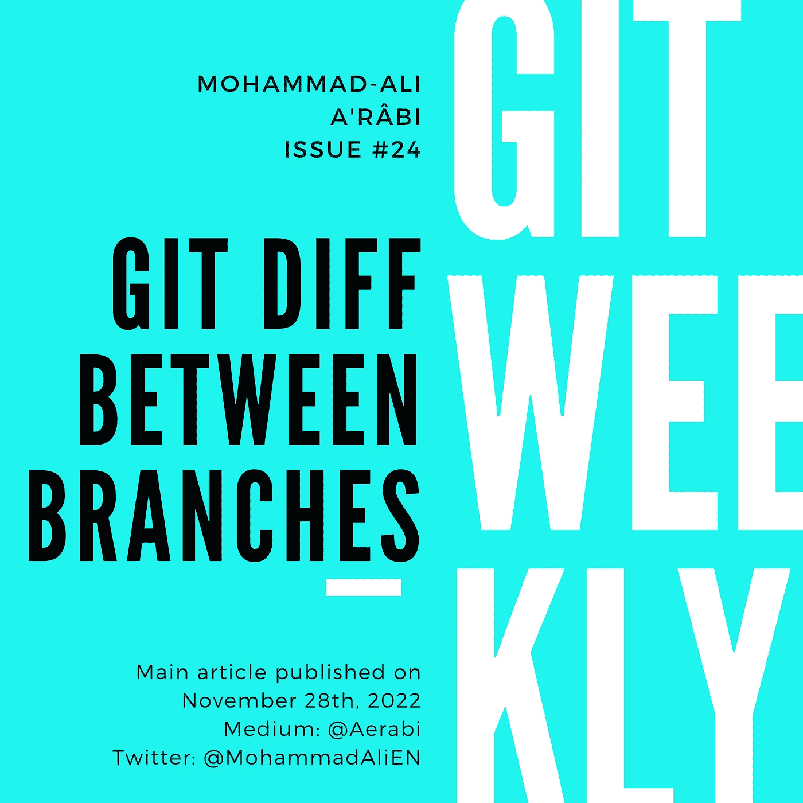

# 分支之间的 Git 差异

> 原文：<https://itnext.io/git-diff-between-branches-ddc59ae7f566?source=collection_archive---------1----------------------->

## 向艾伦·图灵致敬

[Git 周刊](https://medium.com/@aerabi/list/git-weekly-9fe103e35b4b) #24
等级:初学者🥉

Git 是一个免费的开源分布式版本控制系统，旨在快速高效地处理从小到大的各种项目。

当您的 Git 存储库中有多个分支时，您可能想知道它们之间的区别。git diff 命令可以显示两个分支之间的区别。

## 目录

1.  Git Diff 简介
2.  什么是分支？
3.  如何在分支之间使用 Git Diff
4.  分支之间的 Git 差异示例
5.  关于 Git Diff 的进一步阅读



# 1.Git Diff 简介

Git Diff 是文件或提交的两个版本之间的差异。它是一个强大的工具，可以用来查找、合并和检查代码的变更。Git Diff 可用于比较两个分支、标记、提交或文件。它可以用来查找两次提交之间发生了什么变化，或者查看两个文件之间的差异。Git Diff 是一个非常通用的工具，可以以多种方式使用。在这一节中，我们将介绍 Git Diff 的一些使用方法。

当您第一次学习版本控制时，您学习了跟踪变更的三种主要方法:提交、合并和重定基础。然而，还有另一种跟踪变化的方法非常有用:git diff。

Git Diff 是文件或提交的两个版本之间的差异。它是一个强大的工具，可以用来查找、合并和检查代码的变更。Git Diff 可用于比较两个分支、标记、提交或文件。它可以用来查找两次提交之间发生了什么变化，或者查看两个文件之间的差异。Git Diff 是一个非常通用的工具，可以以多种方式使用。

使用 Git Diff 的一种方法是找出两次提交之间的差异。这可以通过使用 git diff 命令后跟提交标识符来完成。例如，如果您想要找出最近两次提交之间的差异，您可以使用以下命令:

```
git diff HEAD HEAD~1
```

这个命令将比较最近的提交(HEAD)和之前的提交(HEAD~1)。该命令的输出将向您展示两次提交之间的差异。

使用 Git Diff 的另一种方法是比较两个分支。这可以通过使用 git diff 命令后跟分支名称来实现。例如，如果您想找出主分支和开发分支之间的差异，您可以使用以下命令:

```
git diff master develop 
```

这个命令将比较这两个分支，并向您展示它们之间的差异。

如果您想要查看两个文件之间的差异，您可以使用 git diff 命令后跟文件名。例如，如果您想要查看文件 1 和文件 2 之间的差异，您可以使用以下命令:

```
git diff file1 file2
```

这个命令将向您展示这两个文件之间的差异。

Git Diff 是一个功能强大的工具，可以以多种方式使用。在本节中，我们介绍了 Git Diff 的一些使用方法。我们鼓励您尝试使用 Git Diff，并找到用它来帮助您工作的方法。

# 2.什么是分支？

分支是 git 存储库中一条独立的开发线。当第一次创建存储库时，它有一个名为“主”的分支。主分支被认为是规范分支，所有其他分支都是从它创建的。

当对 git 存储库中的文件进行更改时，该更改会对当前分支进行。如果当前分支是主分支，则将更改为主分支。如果当前分支是不同的分支，则对该分支进行更改。

对分支所做的更改不会影响主分支或任何其他分支。这允许开发人员在不影响主要代码库的情况下试验新的变化。

一旦对分支进行了更改，就可以将其合并到主分支中。这将把分支中的更改应用到主分支。

合并分支是 git 中的一种常见做法，用于将来自多个分支的变更合并到一个分支中。

# 3.如何在分支之间使用 Git Diff

假设您的项目有两个分支，一个主分支和一个开发分支，您可以使用下面的命令来查看它们之间的区别:

```
git diff master..development
```

这将向您显示在主分支之外的开发分支中所做的所有变更的列表。您也可以使用`--stat`选项来查看更改摘要:

```
git diff master..development --stat
```

如果您想查看特定文件中的更改，您可以使用—

# 4.分支之间的 Git 差异示例

当您对特定分支上的代码库进行了更改，并且想要查看该分支和另一个分支之间的差异时，您可以使用`git diff`命令。这将向您显示所有已更改文件的列表，以及已经添加、删除或修改的特定行。

例如，假设你有一个`master`分行和一个`development`分行。你已经在`development`分支上开发了一些新特性，并且想看看这两个分支之间有什么不同。为此，您可以运行以下命令:

```
git diff master..development
```

这将向您显示所有已更改文件的列表，以及已经添加、删除或修改的特定行。

在某些情况下，您可能只想查看特定文件的差异。为此，您可以提供文件的路径作为`git diff`命令的参数。例如，如果您只想查看`main.c`文件的差异，您可以运行以下命令:

```
git diff master..development main.c
```

您还可以使用`git diff`命令来查看两个特定提交 id 之间的差异。如果您想要查看代码的两个特定版本之间发生了什么变化，这可能会很有用。为此，您可以运行以下命令:

```
git diff 0da94be..59ff30c
```

# 5.关于 Git Diff 的进一步阅读

Git 有很多文档，有很多方法可以了解更多关于 git diff 的内容。git 文档是一个很好的起点，网上还有许多其他资源。

这里有一些资源可以帮助您了解更多关于 git diff 的信息:

*   Git 书籍:这本书是由 Git 的创建者写的，它涵盖了从 Git 基础到更高级主题的所有内容。
*   自底向上的 Git:这是理解 Git 内部的一个很好的资源。它涵盖了从 Git 如何工作的基础知识到更高级的主题。
*   Git Magic:这是另一本关于 Git 的好书，它涵盖了广泛的主题。
*   Git 百科全书:这是 Git 所有内容的综合参考。
*   堆栈溢出:这是一个询问关于 Git 问题的好地方，并且有大量的信息可用。

在 Git 中比较分支时，请记住只能进行同类比较。换句话说，您只能比较两个远程分支或两个本地分支，而不能比较远程分支和本地分支。git diff 命令可以比较两个本地或远程分支，但不能比较两者的混合。

# 最后的话

我每周都会在 git 上写一篇博文。

*   [订阅](https://medium.com/subscribe/@aerabi)my Medium publishes，以便在新一期 Git 周刊出版时获得通知。
*   在 Twitter 上关注[我，了解更多其他平台上发布的更新和文章。](https://twitter.com/MohammadAliEN)