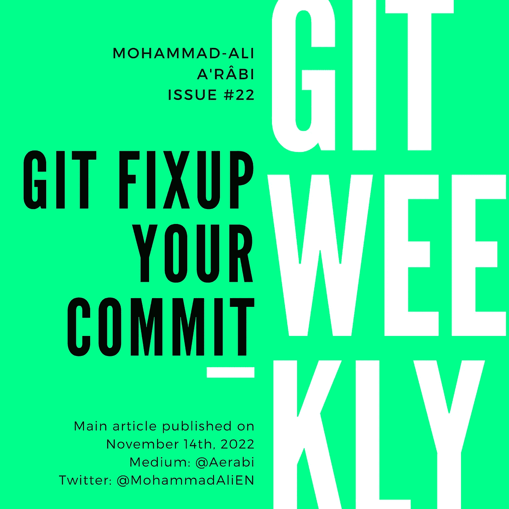

# Git:修复您的提交

> 原文：<https://itnext.io/git-fixup-your-commit-e1047f2fb966?source=collection_archive---------2----------------------->

Git 周刊 #22
级别:中级🥈

很多时候，我做了几次提交请求，然后有人留下了这样的评论:“在你的第一次提交中有一个打字错误”。我可以创建另一个提交来修复打字错误，但最好是在提交本身中修复打字错误。



# 修正提交

让我们假设在我的分支`aerabi/test`中有两个提交。让我们通过 git 日志来看看它们:

```
git log --oneline
```

输出如下所示:

```
3963089 (HEAD -> aerabi/test) Add Test2.md
56b4c6d Add Test.md
```

然后我想修复文件`Test.md`中的一个错别字。其工作方式如下。我在文件`Test.md`中做了更改，然后将它登台:

```
git add Test.md
```

然后我做一个“修正”提交，用散列值`56b4c6d`修正第一个提交:

```
git commit --fixup 56b4c6d
```

创建一个新的提交。但是因为我们没有指定提交消息，所以让我们做另一个日志来查看它:

```
5607ce2 (HEAD -> aerabi/test) fixup! Add Test.md
3963089 Add Test2.md
56b4c6d Add Test.md
```

消息是`fixup! Add Test.md`。因此，与我们试图修复的提交消息相同，只是前缀是`fixup!`。

现在，我们不希望这个提交像这样搁置，所以我们做了一个 rebase:

```
git rebase -i --autosquash HEAD~3
```

将打开一个编辑器，显示以下内容:

```
pick 56b4c6d Add Test.md
fixup 5607ce2 fixup! Add Test.md
pick 3963089 Add Test2.md
```

注意，最后一次提交被移动，并被放置在它正在修复的提交之后。并且 todo 动词已经被设置为`fixup`。保存文件并关闭它，不要修改它。最后的结果是这样的:

```
b8158e4 (HEAD -> aerabi/test) Add Test2.md
487cddb Add Test.md
```

最后一次提交被合并到第一次提交中，并且它的散列也因此而改变。现在我们把它推进一步审查:

```
git push --force-with-lease
```

# 笔记

在 rebasing 上下文中，修正类似于挤压，只是它的提交消息被丢弃了。在 squash 的情况下，git 会要求您合并提交消息。

注意，我们已经将标志`--autosquash`传递给了 rebase 命令。我们可以通过设置 git 配置使其默认:

```
git config rebase.autosquash true
```

此命令以及有关挤压的更多内容在以下内容中进行了讨论:

*   [16 个 Git 技巧和窍门](/16-git-tips-and-tricks-bf08d0602d3b)

此外，我们不得不推进`--force-with-lease`，因为我们通过重定基数改变了历史。更多关于武力与武力租赁的区别:

*   [Git Force vs Force with Lease](/git-force-vs-force-with-lease-9d0e753e8c41)

# 遗言

我每周都会在 git 上写一篇博文。

*   [订阅](https://medium.com/subscribe/@aerabi)my Medium publishes，以便在新的 Git 周刊发布时获得通知。
*   在 Twitter 上关注[我](https://twitter.com/MohammadAliEN)以获取更多其他平台上发布的更新和文章。