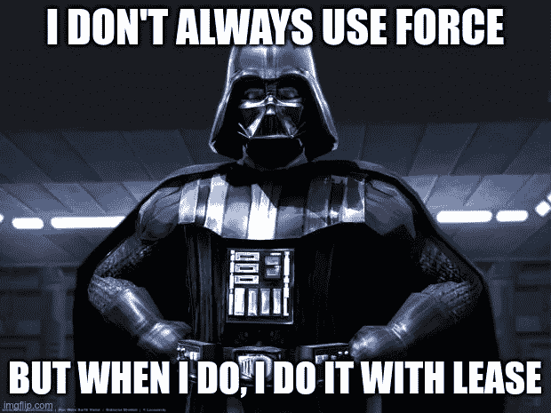

# Git Force 与 Force with Lease

> 原文：<https://itnext.io/git-force-vs-force-with-lease-9d0e753e8c41?source=collection_archive---------0----------------------->

## 以及何时使用它们

*更新于 2022 年 4 月 6 日*

当有一个`git push`你想执行，而远程回购拒绝了它，有一个危险的方法让它工作:

```
git push --**force**
```

这种危险的方法非常流行，大多数 ide 都有一个特殊的复选框。但是`force`有一个兄弟姐妹没有得到足够的关注:

```
git push --**force-with-lease**
```

ide 通常没有`force-with-lease`的复选框，它通常不会在文档中提到，它也没有自己的科幻电影。



*更新:在 IntelliJ IDE(2021.3 版以后)上做强制推送的时候，* [*实际上做了一个带租约的强制*](https://www.jetbrains.com/help/idea/commit-and-push-changes.html#use-git-staging-area-to-commit-changes) *。*

# 快进规则

当推送到远程存储库时，如果远程存储库不是本地存储库的祖先，git 将拒绝推送。这就是所谓的“快进规则”。Git 这样做是因为它怀疑有人将一些新的提交推送到您试图推入的远程分支。但事实并非总是如此。以下所有情况都违反了快进规则，因此会被普通推送拒绝:

*   你把你的树枝换成了主人的，
*   你重新排序了提交，
*   您更改了提交消息，
*   你把所有的承诺都压缩成了一个。

我们通常可以将所有这些情况称为“rebase”，因为所有这些都是通过普通的或交互式的 rebase 实现的。

当在 rebase 之后推动时，可以通过`--force`标志来绕过限制。通过这样做，git 将完全忽略远程历史，并用分支的本地版本覆盖它。在这种情况下，很可能有人真的把什么东西推到了你的树枝上，而你只是把它扔掉了。

# 以租赁方式引入强制力

为了避免这种情况，人们可以转而传递`--force-with-lease`旗。使用这个标志，git 检查分支的远程版本是否与您重定基础的版本相同，也就是说，当我们重定基础时，是否有人提交了新的提交。如果远程分支被更改，推送将被拒绝。

这就像是租用了您开始更改的分支版本。然后在推送时，它会检查您启动时的版本，只有当它记忆的版本与遥控器上当前的版本匹配时，才会应用更改。因此，您不会意外地覆盖您没有意识到的提交。

# 何时对租赁使用武力

建议始终使用`--force-with-lease`而非`--force`。

# 何时使用武力

可以使用`--force`忽略远程分支上新添加的提交，并用本地提交覆盖它们。

> 不要强行推动，除非你想打破什么东西。

一个例子是，有人不小心推到你的分行，或者你想扔掉你同事的零钱，用你的来代替。如果是这种情况，我仍然会获取错误的更改，恢复它们，并在最后(当合并到 master 时)将所有的提交挤压在一起，有效地删除错误的提交，但也避免了意外丢失某些内容的风险。

# 笔记

*   打破快进规则的任何改变都可以实现，不需要改变基础。
*   人们可以打破项目的历史，破坏人们的工作，但仍然可以用`--force-with-lease`来推动。

# 最后的话

在我使用 git 的 6 年中，我只使用过一次`--force`:我从回购的整个历史中删除了一个完整的目录(使它成为自己的回购，并作为子模块导入)。然后我知道我也可以用`--force-with-lease`做那个。

要想找到做`force-with-lease`和其他 git 技巧的捷径，请看看我的另一篇文章“ [16 个 Git 技巧和窍门](https://medium.com/@aerabi/16-git-tips-and-tricks-bf08d0602d3b?source=friends_link&sk=2c9f7092004461adf64bd448a8183dff)”。