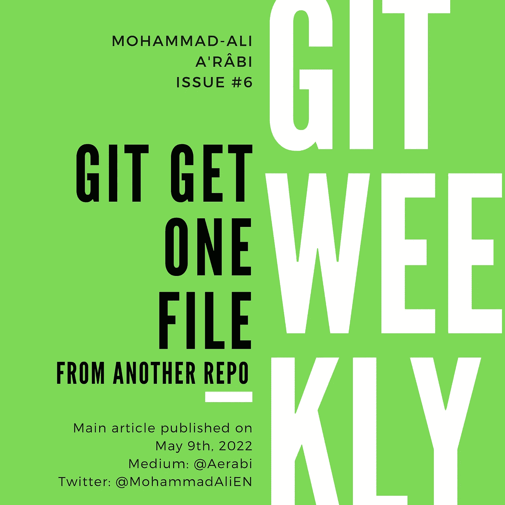
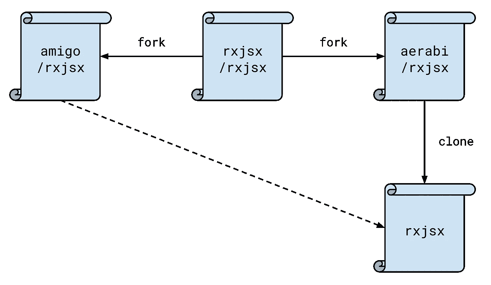

# Git 从另一个 Repo 中获取一个文件

> 原文：<https://itnext.io/git-get-one-file-from-another-repo-34471067af51?source=collection_archive---------1----------------------->

假设您在一个分支中有一个文件，您想将它带到另一个分支。这已经够棘手的了。更棘手的是:你和你的朋友分支了同一个回购协议，并对每个回购协议进行了不同的修改。现在你想让你的朋友在你的餐叉上对他们的餐叉进行更改。

在本文中，我们将回答这两个问题:

*   从同一个回购协议的另一个分支获取文件
*   从另一个仓库获取文件



# 从另一个分支获取一个文件

假设您想将一个文件从分支`feature-source`带入分支`feature-dest`。这个文件叫做`package.json`。

首先，你需要到分行结账`feature-dest`:

```
git checkout feature-dest
```

然后从另一个分支带来文件:

```
git checkout feature-source -- package.json
```

# 从另一个存储库中获取一个文件

现在假设我已经把回购`rxjsx/rxjsx`分成了`aerabi/rxjsx`。然后，我克隆了我的 fork，在本地对它进行处理。我的朋友也将原始回购分支到`amigo/rxjsx`中，做了一些修改，并将其推送到他的主分支。



现在我想从他的总分行得到一个文件到我的本地回购。事情是这样的:

首先复制您想要从中获取文件的远程 repo 的 URL，在本例中是`amigo/rxjsx`。

那就去拿吧:

```
git fetch git@github.com:amigo/rxjsx.git
```

Git 将显示如下消息:

```
From github.com:amigo/rxjsx 
 * branch            HEAD       -> FETCH_HEAD
```

这意味着远程回购被获取，其`HEAD`现在被命名为`FETCH_HEAD`。接下来，从`FETCH_HEAD`中获取您想要的文件(或目录):

```
git checkout FETCH_HEAD -- package.json
```

这与前一种情况类似，唯一的区别是您要从中检查的 git 标签。

# 最后的话

*   因为`checkout`既用于切换分支，也用于在分支之间移动文件，git 引入了一个新命令`switch`。我会在接下来的几周写一篇完整的文章。
*   [订阅](https://medium.com/subscribe/@aerabi)my Medium publishes，以便在新的 Git 周刊发布时获得通知。
*   在 Twitter 上关注[我，获取 git 上的每周文章和每日推文。](https://twitter.com/MohammadAliEN)