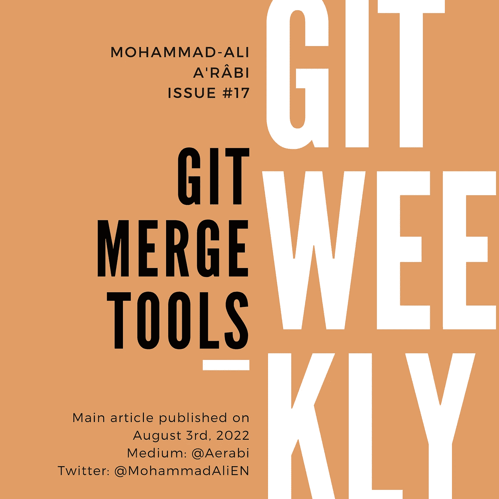

# Git 合并工具

> 原文：<https://itnext.io/git-merge-tools-be2efd7ec9db?source=collection_archive---------1----------------------->

## 如何使用 Git 解决冲突？

很多时候，一行被两方不同地更改，其中一个版本被合并。另一方应该获得更改并解决冲突。你通常如何解决冲突？



# 冲突

那么，冲突是什么样的呢？让我们来看一个例子:

```
<<<<<<< HEAD
name: 'auto-assign'
on:
  pull_request:
    types: [opened, ready_for_review]

jobs:
  assign-author:
    runs-on: ubuntu-latest
    steps:
      - uses: kentaro-m/auto-assign-action@v1.2.1
        with:
          configuration-path: '.github/auto-assign.yml'
=======
*# Nothing is here yet* >>>>>>> Conflicting commit
```

所以，这是一个双方编辑过的文件。其中一个创建了一些配置并将它们合并到主分支中。对方只是添加了一行注释“这里还没有任何东西”，并提交了它，将“冲突提交”设置为提交消息。然后她把树枝重新放在师父身上，于是就发生了冲突。

简而言之，这部分代码显示了文件的两个版本。那么，现在，如何解决呢？

# 编辑文本

人们可以简单地使用任何文本编辑器来删除以下三行:

```
<<<<<<< HEAD
=======>>>>>>> Conflicting commit
```

以及两个版本之间的折衷。然后保存文件并使用 git 暂存它:

```
git add auto-assign.yml
```

使用这种方法，可能会弄乱文件，留下前面提到的一些行。此外，有太多冲突的文件通常是不可读的，也很难处理。

# 使用 Git Mergetool

继续在命令行中输入以下命令:

```
git mergetool
```

如果是第一次，git 可能会显示如下消息:

```
This message is displayed because 'merge.tool' is not configured. 
See 'git mergetool --tool-help' or 'git help config' for more details. 
'git mergetool' will now attempt to use one of the following tools: 
meld opendiff kdiff3 tkdiff xxdiff tortoisemerge gvimdiff diffuse diffmerge ecmerge p4merge araxis bc codecompare smerge emerge vimdiff 
Merging: 
.github/workflows/auto-assign.yml 

Normal merge conflict for '.github/workflows/auto-assign.yml': 
  {local}: created file 
  {remote}: created file 
Hit return to start merge resolution tool (bc):
```

它显示了一些可用的合并工具:

*   合并
*   opendiff
*   kdiff3
*   tkdiff
*   xxdiff
*   浮现
*   等等。

以及冲突:本地和远程版本都创建了相同的文件`auto-assign.yml`。它还要求您选择一种解决工具。您可以进入其中一个工具，或者退出(例如在 Linux 上使用 Ctrl+C ),并从头开始传递该工具:

```
git mergetool --tool=vimdiff3
```

要查看计算机上可用的合并工具，请运行以下命令:

```
git mergetool --tool-help
```

我的机器显示以下工具:

```
'git mergetool --tool=<tool>' may be set to one of the following: 
                araxis 
                emerge 
                vimdiff 
                vimdiff2 
                vimdiff3 

The following tools are valid, but not currently available: 
                bc 
                bc3 
                codecompare 
                deltawalker 
                diffmerge 
                diffuse 
                ecmerge 
                examdiff 
                guiffy 
                gvimdiff 
                gvimdiff2 
                gvimdiff3 
                kdiff3 
                meld 
                opendiff 
                p4merge 
                smerge 
                tkdiff 
                tortoisemerge 
                winmerge 
                xxdiff 

Some of the tools listed above only work in a windowed 
environment. If run in a terminal-only session, they will fail.
```

一些工具打开图形工具，例如`emerge`打开 Emacs 编辑器。有些工具是终端专用的，例如`vimdiff`，它会在你的终端上打开一个 Vim 编辑器。

我们将对 git 的 CLI 可用的不同合并工具做一个全面的介绍。

# 使用 IDE 或编辑器

一些图形编辑器和大多数 ide 都带有 git 合并工具。例如:

*   JetBrains IDEs，例如 IntelliJ、WebStorm、PyCharm 等。
*   黯然失色
*   虚拟代码

# 遗言

你通常如何解决合并冲突？你通常使用哪些合并工具？

我每周在 git、GitHub 和 GitLab 上写文章。

*   [订阅](https://medium.com/subscribe/@aerabi)my Medium publishes，以便在新一期 Git 周刊出版时获得通知。
*   在 Twitter 上关注[我](https://twitter.com/MohammadAliEN)获取 git 上的每周文章和每日推文。