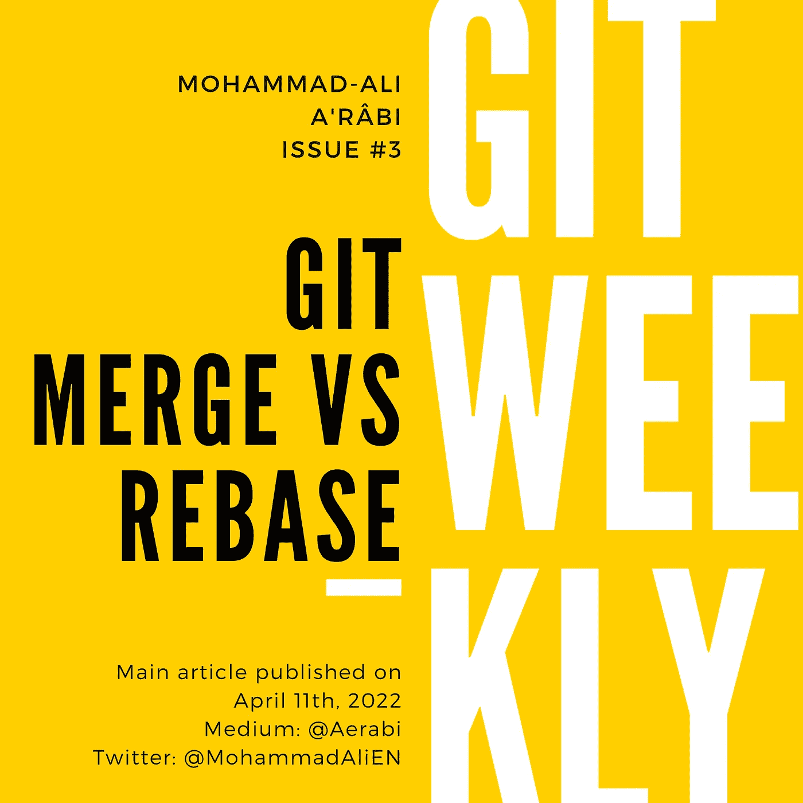
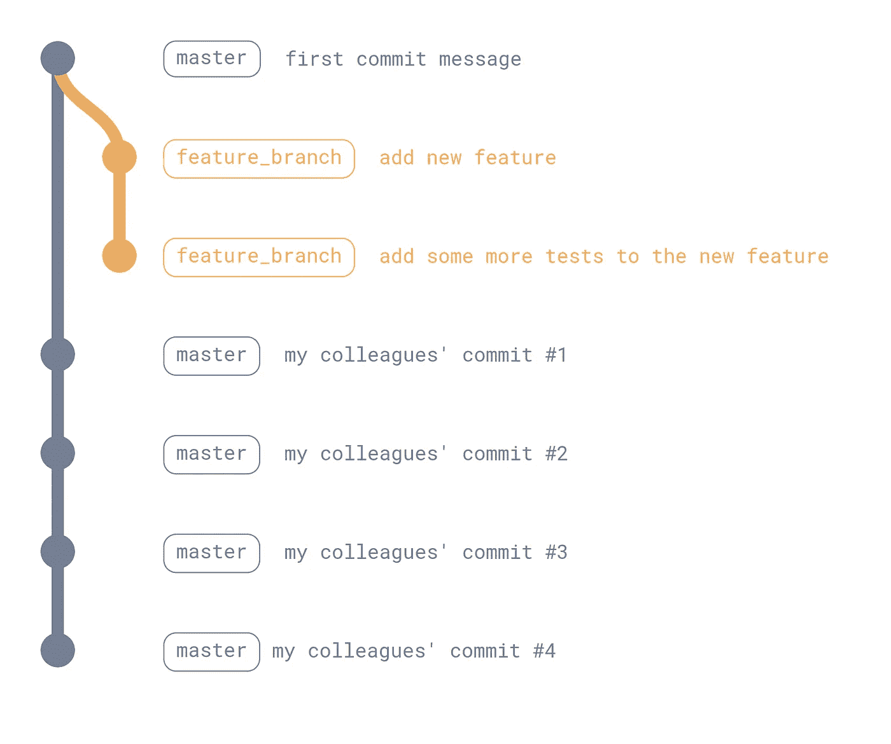
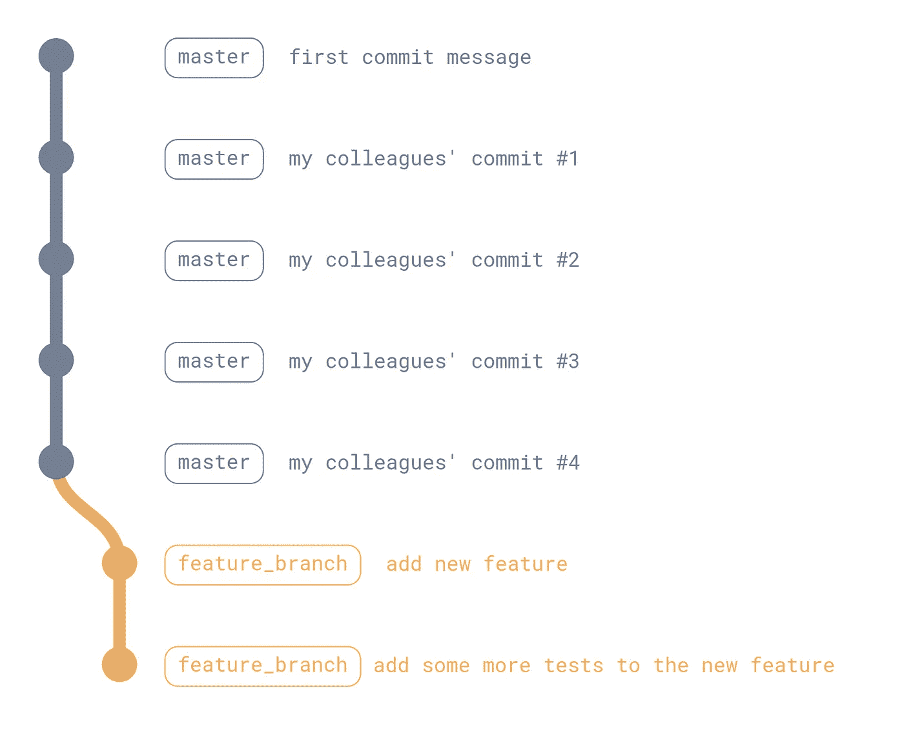
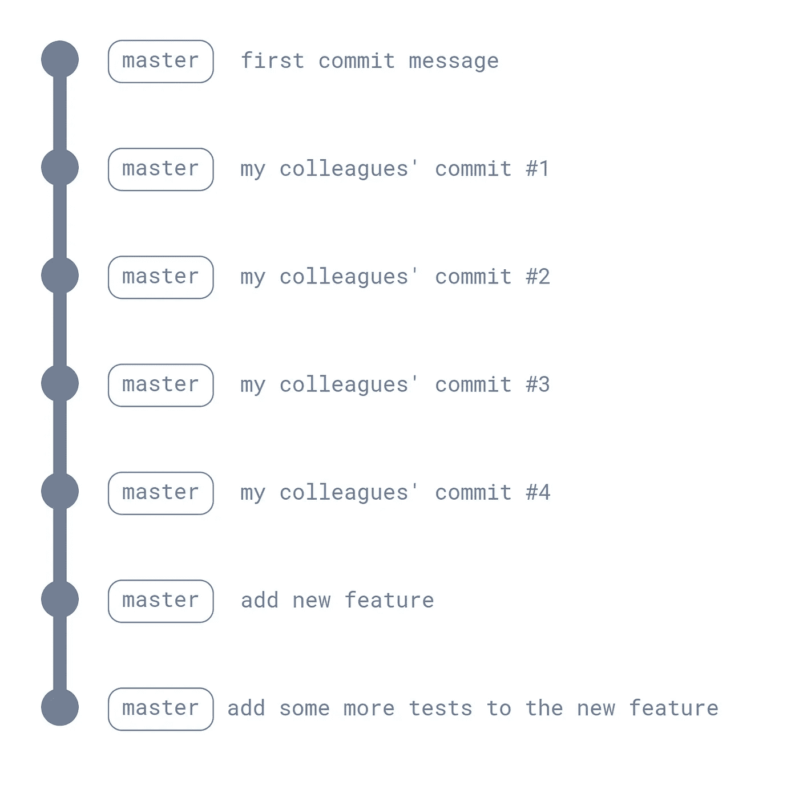

# Git 合并 vs Rebase

> 原文：<https://itnext.io/git-merge-vs-rebase-938950fb218?source=collection_archive---------0----------------------->

## 三种类型的合并

合并是将一个分支中完成的工作添加到另一个分支中。有三种方法可以将一个分支合并到另一个分支:

*   快进合并，
*   挤压合并，
*   和通过创建合并提交进行合并。

我将第三个选项称为“真正的合并”，以在必要时强调它。

# TL；速度三角形定位法(dead reckoning)

这篇副标题为“三种合并”的文章主要集中在为是否使用重定基或合并的讨论奠定基础。一篇名为“Git Merge vs Rebase 以及在哪里使用它们”的后续文章将涵盖每个工作流的优缺点。



# 快进合并

当源分支中只有新的提交时，快进合并只是将这些提交添加到目标分支中。轻松点。

# 重置基础和快进合并

只有当目标分支是源分支的祖先时，快速前进合并才是可能的，但通常不是这样。您已经向您的特性分支添加了 2 个提交，当您想要将它合并回主特性时，您的同事已经向它添加了 4 个提交。在这种情况下，我们说特征分支比主分支超前 2 次提交，滞后 4 次提交。



如果特征分支落后，则不能执行快速前进合并。为了解决这个问题，我们做了一件叫做“重定基础”的事情。通过将特征分支重新基于主服务器，我们移除新添加的分支提交，用主服务器的当前状态更新分支，然后在主服务器的顶端添加移除提交。

```
git checkout feature_branch
git rebase master
```



在执行 rebase 之后，特征分支变成提前 2 次提交，在主分支之后 0 次提交，因此我们可以执行快进合并。

```
git checkout master
git merge --ff-only feature_branch
```



# 真正的合并

让我们回到具有特征分支 2 提前提交和 4 滞后于主提交的情况。当执行真正的合并时，新的提交被添加到主分支，该主分支包含来自特征分支的所有新的改变。

```
git checkout master
git merge feature_branch
```


新添加的提交称为“合并提交”。它具有对特征分支的头的引用，以及对其在主分支中的先前提交的引用；这就是为什么我们说合并提交有两个“双亲”。

# 合并与重设基础

当我们谈论“合并与重定基础”时，我们是在比较以下两个合并两个分支的工作流:

*   重定基数和快进，
*   或者执行真正的合并。

这两种工作流程之间存在一些差异:

*   rebase 工作流使 git 图保持线性，而 merge 工作流跟踪分支提交。
*   如果存在冲突，在前一个工作流中，需要在重新定基阶段解决它们，而在后一个工作流中，需要在合并阶段解决它们(因此，需要将主文件合并到特征分支中，然后将特征分支合并到主文件中)。

# 挤压合并

第三种类型的合并并没有得到太多的关注。挤压合并基本上挤压特征分支上的所有提交(即，将它们打包成一个提交)，并将该提交添加到目标分支。

主要区别在于，新创建的提交没有对创建它的分支的引用。所以，这种合并方式和另外两种有相似之处。

# 未来的工作

在将于 4 月 18 日出版的下一部作品中，将对这两个工作流程进行全面比较。[订阅](https://medium.com/subscribe/@aerabi),以便在文章发布时获得通知，以及随后的其他每周 git 内容。