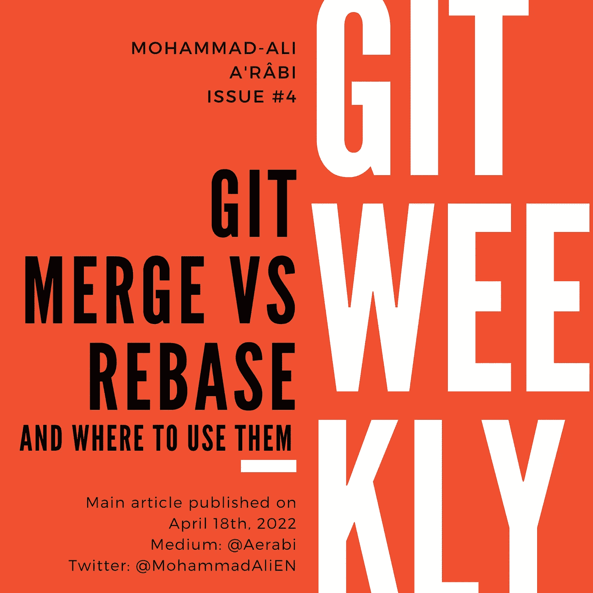
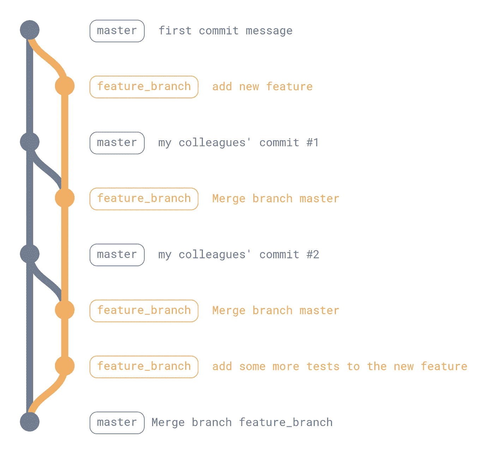

# Git Merge vs Rebase 以及在哪里使用它们

> 原文：<https://itnext.io/git-merge-vs-rebase-and-where-to-use-them-2a0a6e88769d?source=collection_archive---------4----------------------->

将特征分支合并到主分支有两种工作流程，即“重设基础和快进”和“(适当)合并”。在前一篇文章中，我们已经讨论了这些工作流的含义。现在，是时候讨论何时使用它们了。

# TL；速度三角形定位法(dead reckoning)

建议在跳进讨论之前先看一下[前传](/git-merge-vs-rebase-938950fb218)。

# 合并或改变基础

看情况。我会提到一些利弊，并会说什么是我个人做的方式。

## Git 图

real merge 的第一个特性是它创建的非线性的、有时是混乱的 git 历史图。使用合并工作流，您的历史也将被总是相同的合并提交所填充:这个分支被合并到另一个分支中。它并没有告诉你太多，只是给你指出了一些方向。

让我们假设您希望在开发时让您的分支与 master 保持同步。图表会变得很恐怖。

这与重定基础不同，因为它只是将您的分支提交放在主提交之上。

## 提交消息

我们提到过合并提交很烦人。但是让我们假设您有一个包含 79 个提交的分支，每个提交都有一条类似于“大修复”或“更新 README”的消息。通过改变基础和快进，你给你的主人增加了很多垃圾。真正的合并在这里也不是一个好的选择:合并提交指向一堆垃圾。也许一个南瓜合并在这里最有意义。

但是如果你有一两个精心制作的提交，带有有意义的消息，那么直接把它们添加到主分支比添加另一个“合并分支 feature_branch”更有意义。

## 更新特征分支

让我们假设您想要从主分支获取更新，并将它们发送到您的特性分支。如果您有 79 个提交，并且有一个冲突，在 rebase 的情况下，您可能被迫解决 79 次冲突(因为提交被一个接一个地添加到主的提示)。当您创建合并提交时，情况并非如此。

# 我个人推荐

“用哪个”的最终答案是“看情况”。它们都不是灵丹妙药，如果没有正确使用 git，您可能会把两者都搞得一团糟。

我使用的工作流程是基于重置基础和快进，但它也非常类似于挤压合并:

1.  为微小的变化创建特征分支
2.  添加一些提交
3.  创建拉取/合并请求
4.  在审查和接受拉/合并请求之后，将特性分支上的提交压缩成一个(手动，不合并)，并为其编写一个有意义的提交消息，链接原始问题 ID
5.  对主服务器执行快进合并

我喜欢保持主分支的整洁和线性，并且每个提交消息都有意义。当有人想获得更多关于代码库中某些变化的上下文时，这很有帮助(通过 git 责备)。

我遵循此工作流程的其他原因:

*   我做一些小的提交，使评审过程对评审者来说更容易
*   审查完成后，我将它们压缩在一起，这样只有一个提交在主分支上结束
*   我手动挤压，因为这样就可以在最终合并之前检查提交消息(或者甚至由 CI 自动检查)
*   此外，通过手动挤压，我可以自己编写提交消息——通过挤压合并，单击合并按钮的人可以编写提交消息，这不是我们想要的
*   我对每个拉/合并请求都做一件事，所以对它做一次提交是有意义的
*   我将最初的问题号/ID 链接回提交消息，这既是为了自动关闭问题(GitHub 和 GitLab 都有这方面的机制),也是为了让未来的读者有机会了解该问题的讨论和需求

# 最后的话

由于这篇文章对于一篇“中等”大小的文章来说已经太长了，我将在以后的文章中更深入地研究细节，尤其是以下内容:

*   如何手动挤压提交
*   如何链接 GitHub 和 GitLab 上的问题
*   拉/合并请求工作流最佳实践
*   如何在您的配置项上设置提交 lint

下一篇文章部分介绍了最后一个问题:

*   [Git 提交消息的十诫](/ten-commandments-of-git-commit-messages-94bd6dcf6e0e)

要获得未来文章的通知，您可以:

*   [订阅](https://medium.com/subscribe/@aerabi)我的媒体发布
*   在 Twitter 上关注[我](https://twitter.com/MohammadAliEN)，获取 git 上的每周文章和推文