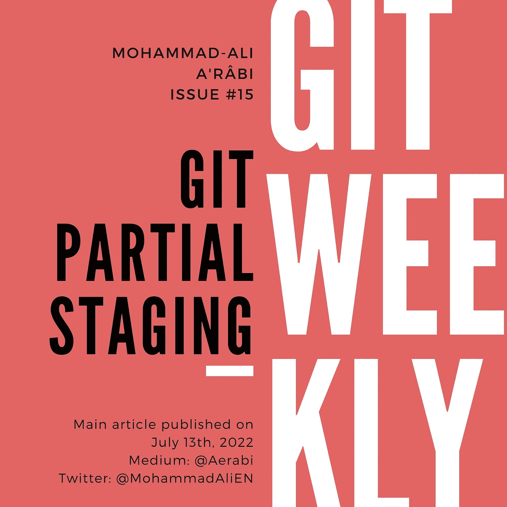

# Git 部分登台

> 原文：<https://itnext.io/git-partial-staging-17714642cb1e?source=collection_archive---------3----------------------->

## 如何部分暂存文件

我经常遇到这样的情况，我改变了一个文件中的多个位置，但只想提交其中的一个。一个例子是 Node.js 项目中的`package.json`文件，它包含不同的部分:项目信息和版本、预定义的命令、依赖项，甚至是 linter 规则。人们可能希望提交依赖关系中的更改，而不是预定义命令中的更改。



# 引入互动舞台

让我们假设在`package.json`文件中有两组变更。让我们来看看它们:

```
git diff package.json
```

输出如下所示:

```
**diff --git a/package.json b/package.json** 
**index 465ef44..ee478bb 100644** 
**--- a/package.json** 
**+++ b/package.json** 
@@ -1,6 +1,6 @@ 
 { 
   "name": "@rxjsx/rxjsx", 
-  "version": "1.0.0", 
+  "version": "1.0.1", 
   "description": "RxJS Extensions", 
   "main": "lib/index.js", 
   "types": "lib/index.d.ts", 
@@ -38,7 +38,7 @@ 
     "jest": "^26.6.3", 
     "jest-junit": "^13.0.0", 
     "prettier": "^2.2.1", 
-    "rxjs": "^7.5.5", 
+    "rxjs": "^7.5.6", 
     "ts-jest": "^26.5.6", 
     "typescript": "^4.2.4" 
   }
```

因此，我们在文件开头的版本中进行了更改，在中间的依赖项中也进行了更改。我们希望进行依赖关系的变更，但还不是版本变更。为此，我们使用交互式添加:

```
git add -i
```

终端中会打印出以下文本:

```
**staged     unstaged path** 
  1:    unchanged        +9/-9 package-lock.json 
  2:    unchanged        +2/-2 package.json 

***** Commands ***** 
  1: **s**tatus       2: **u**pdate       3: **r**evert       4: **a**dd untracked 
  5: **p**atch        6: **d**iff         7: **q**uit         8: **h**elp 
**What now**>
```

显示`package-lock.json`和`package.json`有变化。下面列出了可用的命令。让我们键入`p`作为补丁并按回车键:

```
**What now**> p 
 **staged     unstaged path** 
  1:    unchanged        +9/-9 package-lock.json 
  2:    unchanged        +2/-2 package.json
**Patch update**>>
```

键入 2，表示我们希望在`package.json`进行部分分段:

```
**Patch update**>> 2  
 **staged     unstaged path** 
  1:    unchanged        +9/-9 package-lock.json 
* 2:    unchanged        +2/-2 package.json 
**Patch update**>>
```

按回车键，表示这就是全部，我们到此结束:

```
**Patch update**>>  
**diff --git a/package.json b/package.json** 
**index 465ef44..ee478bb 100644** 
**--- a/package.json** 
**+++ b/package.json** 
@@ -1,6 +1,6 @@ 
 { 
   "name": "@rxjsx/rxjsx", 
-  "version": "1.0.0", 
+  "version": "1.0.1", 
   "description": "RxJS Extensions", 
   "main": "lib/index.js", 
   "types": "lib/index.d.ts", 
**(1/2) Stage this hunk [y,n,q,a,d,j,J,g,/,e,?]?** n
```

现在它显示了第一个“大块”变更，并询问如何处理它。我们不想上演它，所以我们进入`n`:

```
@@ -38,7 +38,7 @@ 
     "jest": "^26.6.3", 
     "jest-junit": "^13.0.0", 
     "prettier": "^2.2.1", 
-    "rxjs": "^7.5.5", 
+    "rxjs": "^7.5.6", 
     "ts-jest": "^26.5.6", 
     "typescript": "^4.2.4" 
   } 
**(2/2) Stage this hunk [y,n,q,a,d,K,g,/,e,?]?** y
```

现在它显示了第二块，我们可以在这里输入`y`。这样，部分转移将结束，交互式转移将返回到命令:

```
***** Commands ***** 
  1: **s**tatus       2: **u**pdate       3: **r**evert       4: **a**dd untracked 
  5: **p**atch        6: **d**iff         7: **q**uit         8: **h**elp 
**What now**> q
```

让我们通过输入`q`并按回车键来退出。然后做一个 git 状态:

```
git status
```

输出如下所示:

```
On branch master 
Your branch is up to date with 'origin/master'. 

Changes to be committed: 
  (use "git restore --staged <file>..." to unstage) 
        modified:   package.json 

Changes not staged for commit: 
  (use "git add <file>..." to update what will be committed) 
  (use "git restore <file>..." to discard changes in working directory) 
        modified:   package-lock.json 
        modified:   package.json
```

文件`package.json`显示为已暂存和未暂存。这是因为它是部分暂存的，而有些部分不是为提交而暂存的。您可以继续并提交更改。

# 最后的话

我每周在 git、GitHub 和 GitLab 上写文章。

*   [订阅](https://medium.com/subscribe/@aerabi)my Medium publishes，以便在新的 Git 周刊发布时获得通知。
*   关注 Twitter 上的[我](https://twitter.com/MohammadAliEN)获取 git 上的每周文章和每日推文。