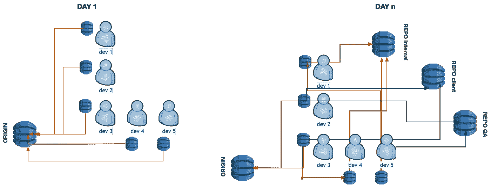

# Git 存储库转移保留所有历史记录

> 原文：<https://itnext.io/git-repository-transfer-keeping-all-history-670fe04cd5e4?source=collection_archive---------0----------------------->


照片由 [Giammarco Boscaro](https://unsplash.com/@giamboscaro?utm_source=medium&utm_medium=referral) 在 [Unsplash](https://unsplash.com?utm_source=medium&utm_medium=referral) 拍摄

## 如何复制您的 Git repo 并保留所有以前的提交、分支和标记

Git 现在是版本控制的事实标准，无论是否是分布式的。它有大量强大的功能，其中一些功能被大多数普通用户忽略了。其中一个特性是 Git 能够将您的本地存储库与多个远程存储库连接起来，并且可以根据您的需要删除和添加远程位置。

在这篇文章中，我们将使用添加和删除远程存储库的特性来有效地将一个存储库转移到另一个存储库，同时保持所有提交历史、分支和标签不变。

# Git 遥控器

与旧版本控制工具(如 CVS 和 SVN)相比，所有代码都集中在一个存储库中，Git 允许代码在无限数量的远程存储库中共存。

事实上，Git 中原始的、中心的或“起源”存储库的概念只是一个约定。当大多数用户开始同步第一个`git clone`时，它恰好*是他们开始同步的存储库。*

随着项目的进展，存储库的位置和偏好可能会发生变化，所以在开始时曾经的*原点*可能会开始变得不相关:



Git 中可以随意引入遥控器(图片由作者提供)

# 转移方法

到目前为止，我们已经确定，您可以拥有任意多的遥控器，它们的名称在 Git 的生态系统中没有任何重要作用。那么，我们如何利用 Git 的这个特性将文件从一个远程设备传输到另一个远程设备呢？

## 丢失所有历史(开发者-上帝模式)

快速而肮脏的方法是克隆新的、空的存储库，从源存储库中复制/粘贴文件，然后提交/推送。尽管这种方法可能会节省您几分钟的时间，并且除了您已经知道的标准 Git 命令之外，不需要任何其他命令，但是它有一个严重的缺点。

因为您是将所有文件提交到新存储库的人，所以您现在成为源存储库的每个文件的唯一作者。保存在源存储库中的任何以前的提交历史现在都将永远丢失，整个项目看起来就像是由一个人(您)创建的。

开发商-上帝综合症得到满足；原作者气死了。

## 保存历史

将资源从一个存储库复制到另一个存储库，同时保持提交历史完整无损，这不仅承认了其他人的原始工作，还可能带来有用的好处。例如，您可以搜索以前的提交消息，找到对您正在研究的问题的解释；如果你意识到一个特定的开发人员容易犯相同类型的错误，你可以很容易地过滤掉他/她的提交来重新检查它们，等等。

# 传输命令

如果你搜索如何转移一个 Git 库，你会得到几种不同的建议，从简单的 Git 命令序列到纯粹的 Git 魔术。

接下来建议的方法可能不一定是“最好的”，但是，它已经在具有数千个提交的存储库上进行了测试，并且遵循两个基本原则:1/保持完整的提交历史，包括所有分支和标签，以及 2/不干扰原始存储库。

所以，让我们从命令开始。

**①从创建旧存储库的镜像克隆开始**

```
git clone --mirror old-repo-url new-repo
```

用旧 repo 的 Git URL 替换`old-repo-url`,并给将要克隆它的文件夹`new-repo`起一个合适的名字。

**②删除对原始/旧存储库的远程引用**

```
cd new-repo
git remote remove origin
```

如果您的原始存储库包含分支，您可能会得到一个警告，但是您可以忽略它。从技术上讲，这一步是不必要的，因为如上所述，你可以有多个遥控器，但是，它使未来的命令更容易键入，并完全脱离原来的存储库。

**③添加新存储库的远程引用**

```
git remote add origin new-repo-url
```

用新存储库的 Git URL 替换`new-repo-url`。不言而喻，您应该在您最喜欢的 Git 管理系统中预先创建新的回购协议。

**④将所有内容推送到新的存储库**

```
git push --all
git push --tags
```

**⑤克隆新的存储库**

```
cd ..
rm -rf new-repo
git clone new-repo-url new-repo
```

用您的新存储库替换`new-repo-url`和`new-repo`。

这最后一步是必要的，因为步骤(1)中执行的克隆是镜像克隆，不能用于进一步的提交。如果你知道如何转换它，有效地绕过这个重新克隆的步骤，请在评论中告诉我。

# 结论

尽管 Git 的分支和标记允许您有效地将一个存储库用于多种不同的目的，但有时您只想从一个新的存储库开始。在这篇文章中，我们看到了如何将一个 Git 存储库的内容转移到另一个新的存储库，同时也移动原始存储库的所有提交历史、分支和标记。