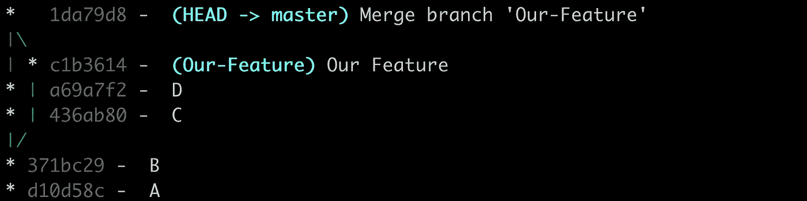
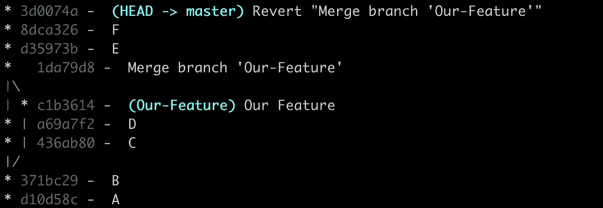
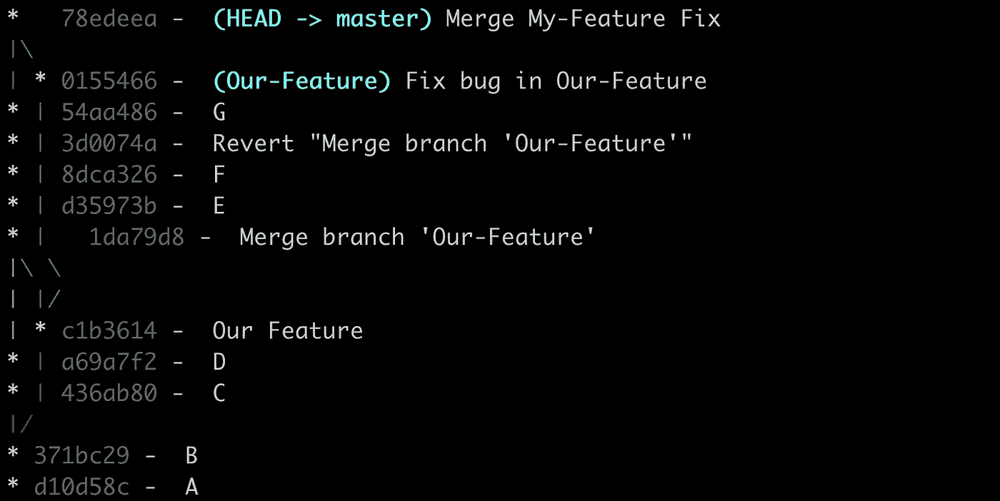
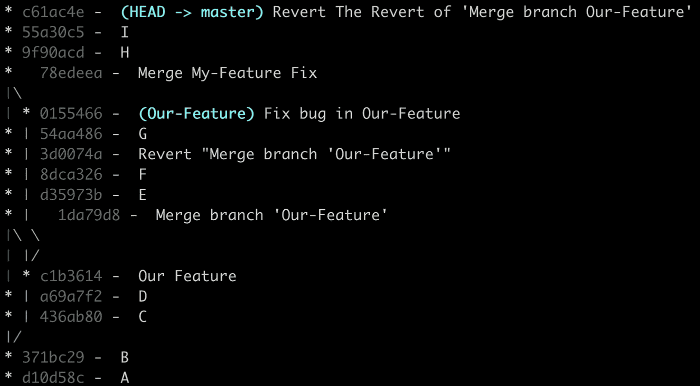
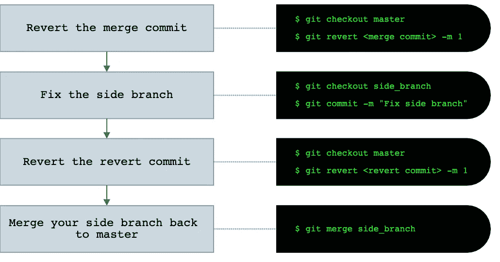

# Git - Revert 恢复

> 原文：<https://itnext.io/git-revert-the-revert-88b1e66d71d4?source=collection_archive---------0----------------------->

> *TL；DR——如果你认为“恢复”就是“撤销”,那么你将永远错过恢复的这一部分。是的，它撤销数据，但不，它不撤销历史。*本文基于 Linus Torvalds&Junio C Hamano[文章](https://opensource.apple.com/source/Git/Git-26/src/git-htmldocs/howto/revert-a-faulty-merge.txt)。

# 场景

你正和你的团队成员在一个`master`分支上工作。
你的任务是开发一个新功能，所以你创建了一个名为“ **Our-Feature** ”的全新分支。🤓
花了你一段时间，最后你把它合并到主:

然后……**瞧！**
**等等**，你只是注意到我们的功能中有一个影响整个 app 的 bug！
你的团队成员被卡住了，错误代码已经被推送，他们无法继续工作，**你会怎么做**？

要摆脱这个麻烦，你需要做 2 个步骤。**撤销**——将`master`分支变回原来的状态，或者换句话说，**撤销** `Our-Feature`合并到`master`。
2。**固定**——固定`Our-Feature`分支，合并回`master`。

# 1.取消

***注意:*** *这一步开始很重要。有时候会出现 bug，并不意味着一定要影响整个团队运作。*

在谷歌上快速搜索了一下[如何在 git](https://www.atlassian.com/git/tutorials/undoing-changes) 中撤销事情之后，你决定使用`git revert`命令。

与`git reset`不同的是，`git revert`不会从项目历史中删除提交，而是**反转**由所选提交引入的更改，并且**会向**追加一个新的提交，其中包含最终的反转内容。在与其他人协作时，`git revert`比`git reset`更安全，因为它**不会改变存储库历史。**您的团队成员将能够使用“撤销”不需要的提交的回复提交来拉动分支。

## 我们来还原一下！

你输入`$ git revert 1da79d8 -m 1`，结果是:

看起来不错！
从`master`移除`Our-Feature`分支的所有变更。

# 2.固定

你回到`Our-Feature`分支，修复那个烦人的 bug。您检查了一千次，以确保我们没有引起更多的麻烦，提交更改，并将其合并到`master`。

# 有些东西工作不正常😩

你检查了一下`master`，注意到`Our-Feature` 分支**的一些文件和变更少了**，检查回`Our-Feature`，看到所有变更都在。
git 怎么了？！为什么有些变更合并了，有些没有？
你再次尝试将`Our-Feature`分支合并到`master`，看看遗漏的变更现在会不会出现，但是 git 告诉你:
`Already up to date.`

# 发生了什么事？！

所以，你需要做三个步骤来摆脱这个麻烦。把你生活中的所有麻烦都归咎于 git，用这样的句子:*“bug 不是我的——git 有一个疯狂的 bug，它决定忽略文件。”
2。冷静下来，明白你戏剧性的行为对你没有帮助。你可能用错了 git。
3。了解哪里出了问题并解决它。👌*

# 那么…哪里出了问题？

您试图找到导致这种行为的线索，并注意到丢失的更改是在合并恢复之前**发生的。然而，我们看到的所有变化都起源于**合并恢复(提交`3d0074a`)之后的**。**

让我们记住，`git revert` *反转由选择提交*引入的变更，在我们的例子中，反转由合并引入的所有变更，以及其中的所有变更。这意味着只要合并的恢复在 git 存储库中，来自该合并的数据将被反转。

主节点实际上是`Already up to date`并且`Our-Feature`分支完全合并到主节点，问题是我们为撤销 git 合并所做的恢复仍然在我们的 git 存储库中，并且仍然反转在合并之前源于**的变更。我们可以在`Our-Feature`中看到变化，因为这个分支中的数据不包含 revert commit。**

> 因此“恢复”撤销了数据更改，但它很大程度上是**而不是**一个
> 的“撤销”，因为它没有撤销提交对
> 存储库历史的影响。( [参考](https://opensource.apple.com/source/Git/Git-26/src/git-htmldocs/howto/revert-a-faulty-merge.txt))

在历史上的某个时刻，由于一个错误，恢复是必要的。但是现在我们不希望这些改变被逆转，所以……
我们如何**撤销这种逆转**？

# 回复回复

当恢复时，不像`git reset`命令，我们不改变 git 历史，而是在我们的 git 存储库时间线上创建一个新的提交。这个提交现在是我们的存储库历史的一部分，因此，我们反转的更改将保持不变，直到我们**撤销**Revet 提交，或者换句话说，**恢复 Revet** 。虽然听起来很奇怪，但这是解决我们问题的简单方法。
**反转**将**反转**并将**撤销**反转。

结帐至主并输入:
`$ git revert 3d0074a -m 1`

然后……**瞧！所有丢失的文件和更改都回来了！**

# 结论

有时在开发过程中，一个有问题的分支会合并到主分支。
要撤消合并，请执行以下步骤:

