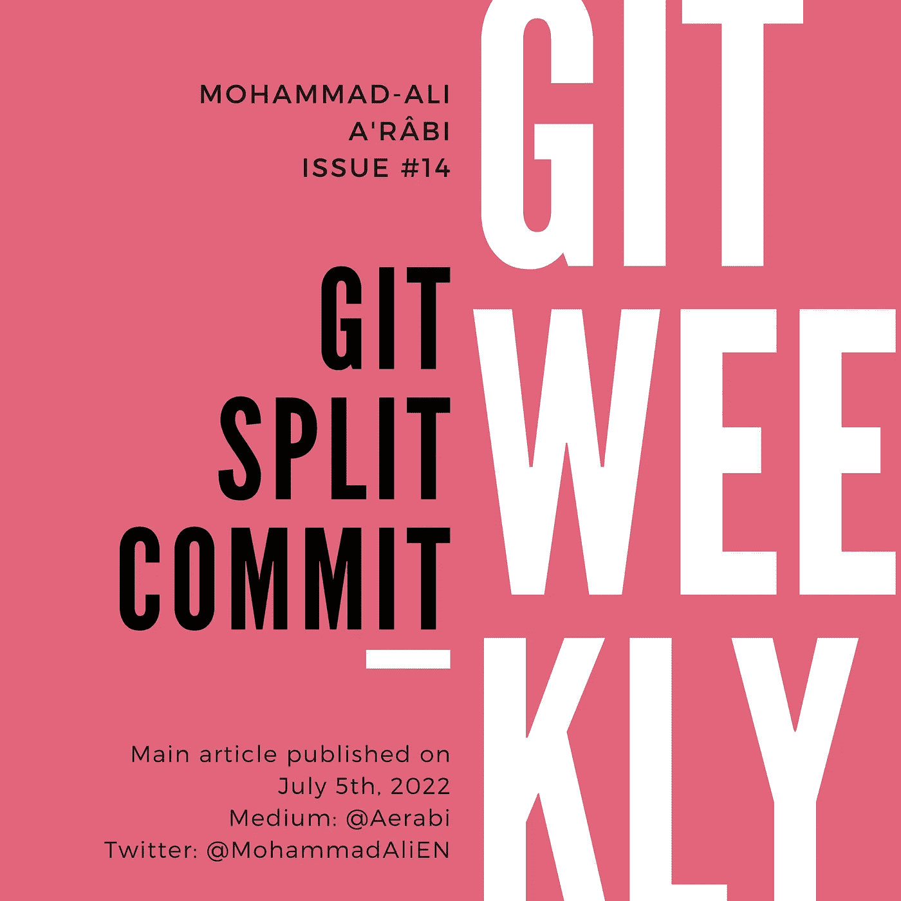

# Git 拆分提交

> 原文：<https://itnext.io/git-split-commit-b42a609a6bf3?source=collection_archive---------4----------------------->

## 如何在 Git 中拆分提交

有时我会想“这个承诺太大了，我需要把它分解成更小的”。可能的情况是，我在一次提交中做了两件事，我希望每件事都有一次提交。在这些时候，我想知道是否有可能做到这一点。你越早想做，就越容易。



# 拆分最后一次提交

与往常一样，更改最后一次提交更容易。要拆分最后一次提交，需要“撤销”提交，部分准备更改，并创建多个提交。

首先撤销提交:

```
git reset HEAD^
```

该命令撤消最后一次提交，并保持更改不变。然后，您可以部分暂存更改并提交它们，例如:

```
git add README.md
git commit -m "Add install section to README"
git add requirements.txt
git commit -m "Update the PIP requirements"
```

人们可以使用交互式 staging 部分地存放文件，但是我们稍后会完整地存放它，特别是因为在新版本的 git 中已经重写了[。](/git-2-37-is-out-31945b4862aa)

注意，你现在不得不用租赁来推动[力量，因为你在历史上已经做了一些家务:](https://medium.com/itnext/git-force-vs-force-with-lease-9d0e753e8c41)

```
git push --force-with-lease
```

# 拆分旧的提交

现在，让我们假设我们想要分割两次提交之后的提交(因此，第三次提交，从最后一次开始计数)。为了找到我们想要编辑的提交，让我们做一个 oneliner git 日志:

```
git log --oneline
```

输出如下所示:

```
dd16fac (**HEAD -> master**) Add GitHub page 
b8473cf Update README
deba6a0 Add README and requirements.txt
```

这里，`Add GitHub page`是最后一次提交，我们要编辑`Add README and requirements.txt`。为此，我们使用交互式重新设定基准:

```
git rebase -i HEAD~3
```

`HEAD~3`表明我们想回顾过去改变历史到什么程度。在本例中，是 3 次提交。通过运行此命令，将打开一个编辑器，其中包含以下内容:

```
pick deba6a0 Add README and requirements.txt
pick b8473cf Update README
pick dd16fac Add GitHub page
```

请注意，该顺序与 git 日志中的顺序不同。您想要更改的提交现在显示在第一行。要改变 split up，你要改变它前面的动词，从`pick`变成`edit`。

```
**edit** deba6a0 Add README 
pick b8473cf Update README
pick dd16fac Add GitHub page
```

然后保存文件并退出。您将返回到命令行，并有机会在该特定历史点进行更多更改:

```
git reset HEAD^
git add README.md
git commit -m "Add README"
git add requirements.txt
git commit -m "Add the PIP requirements"
```

这与我们在上一节中所做的相同。现在让交互式 rebaser 知道您已经完成了这里的工作，并希望继续:

```
git rebase --continue
```

将不会有冲突，你的 rebase 将成功完成。再做一次 git 日志，现在提交应该是两次提交:

```
git log -4
```

输出如下所示:

```
dd16fac (**HEAD -> master**) Add GitHub page 
b8473cf Update README
e870c58 Add README
f853559 Add the PIP requirements
```

# 最后的话

我每周在 git、GitHub 和 GitLab 上写文章。

*   订阅 my Medium publishes，以便在新的 Git 周刊发布时获得通知。
*   关注 Twitter 上的[我](https://twitter.com/MohammadAliEN)获取 git 上的每周文章和每日推文。