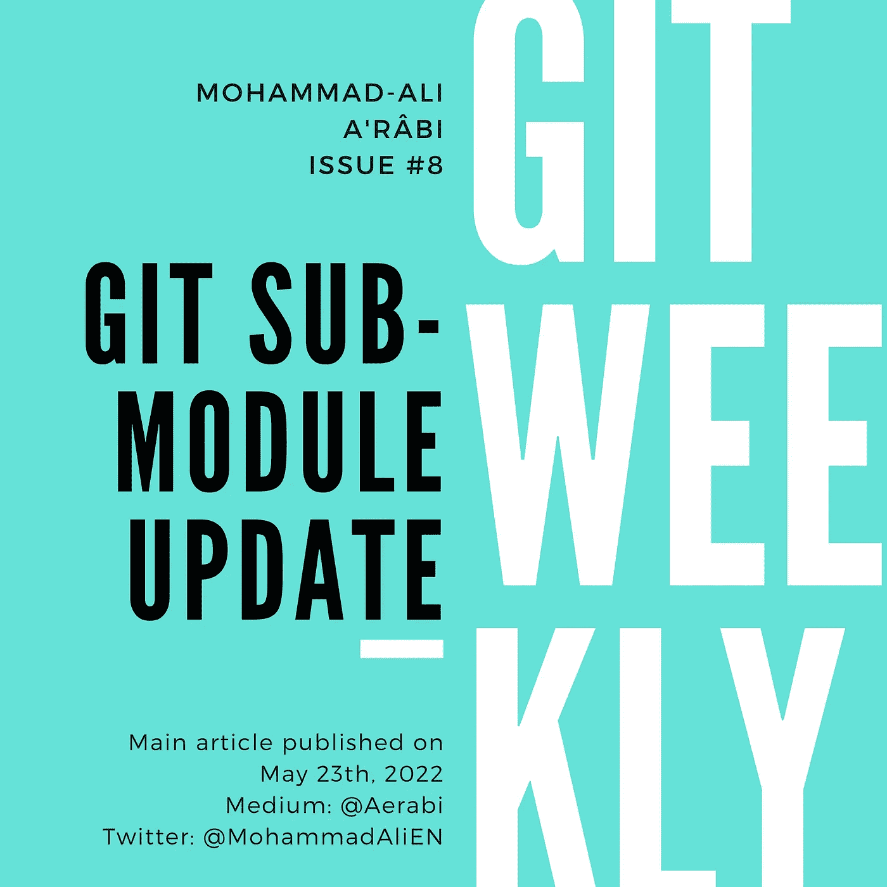

# Git 子模块更新

> 原文：<https://itnext.io/git-submodule-update-30ef27ea1f79?source=collection_archive---------0----------------------->

子模块是 git 将一个存储库嵌入另一个存储库的解决方案。子模块的一些最常见的用例如下:

*   将共享模块嵌入到多个其他存储库中，
*   嵌入第三方库，
*   分离责任和关注点，例如，将同一项目的不同 reposss 嵌入到主 repo 中，然后由主 repo 负责它们的集成。

这篇文章是我之前写的介绍文章的后续文章，假设你熟悉子模块的概念。如果你不熟悉子模块，请先看看前传。



# 将子模块更新至最新版本

> 子模块就像版本化的第三方库。由于升级到依赖项的最新版本可能会破坏您的代码，所以升级到子模块的最新版本也是如此。

要将子模块更新到最新版本，请执行以下操作:

```
git submodule update
```

要查看添加到子模块的提交，请执行以下操作:

```
git diff --submodule
```

在根据新的子模块版本测试代码之后，通过暂存子模块的路径来提交子模块:

```
git add <the-submodule-path>
git commit -m "Update submodule to version XXX"
```

有一个有意义的提交消息也很重要。如果子模块没有单独的版本，试着说明子模块更新的原因。例如

```
git commit -m "Update submodule to use Python 3.9"
```

# 将子模块更新到特定版本

现在让我们假设您想要将您的子模块状态升级(或降级)到一个特定的版本，例如另一个 repo 或特定分支上的特定标记，或者甚至是特定的提交。

让我们假设您的子模块在路径`shared`下。将您的目录更改到此分支:

```
cd shared
```

如果你有一个显示分支的终端，它很可能会显示一个散列而不是一个名字:

```
~/the-repo/shared [(569d7ce...)]$
```

您也可以运行:

```
git branch
```

输出会是这样的:

```
* (HEAD detached at 569d7ce)
  master
```

“HEAD detached”状态基本上意味着子模块的当前状态“没有名称”，即没有分支或标签指向该特定提交。如果没有，也不错。

现在，我们要做的就是改变子模块 repo 的状态。

## 1.更新到特定的分支或标签

要将子模块更新到特定的分支或标记，只需切换到该分支或标记:

```
git switch specific-branch 
```

其中`specific-branch`是您想要将子模块更新到的分支的名称。该命令与以下命令相同:

```
git checkout specific-branch
```

我们将在以后的文章中讨论签出和切换。

## 2.降级一次提交

要回到过去，你可以检查`HEAD~1`:

```
git checkout HEAD~1
```

## 3.转到特定提交

现在让我们假设您想要将状态更改为特定的提交。首先，找出散列并对其进行校验:

```
git checkout bfa784412503902f1d07edacb2e0e0954e2e221f
```

## 回来提交

既然您对子模块状态/版本感到满意，那么您可以返回到最初的 repo:

```
cd ..
```

要查看对子模块所做的更改，请执行以下操作:

```
git diff --submodule
```

它将列出添加或删除的提交，例如:

```
Submodule shared 43222e8..569d7ce (rewind): 
  < Add venv and pyc files to .gitignore 
  < Fix urllib3 version
```

这意味着上面提到的两个提交从子模块(rewind)中删除了。

现在，添加子模块并提交它:

```
git add shared
git commit -m "Rewind the commits"
```

# 最后的话

*   [订阅](https://medium.com/subscribe/@aerabi)my Medium publishes，以便在新的 Git 周刊发布时获得通知。
*   关注 Twitter 上的[我，获取 git 上的每周文章和每日推文。](https://twitter.com/MohammadAliEN)