# Git 专业人员工作流程

> 原文：<https://itnext.io/git-workflow-for-professionals-7495c3474ebd?source=collection_archive---------2----------------------->

分支、合并冲突、拉请求等等

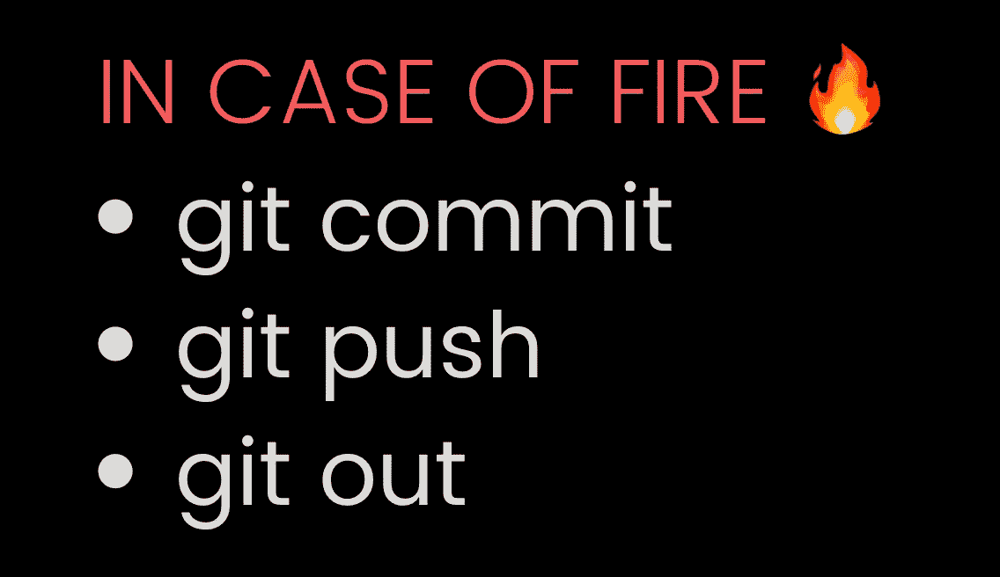

没那么简单！

创建 Linux 内核的人 Linus Torvalds 也负责创建 Git。自 2005 年推出以来，Git 已经成为最流行的 SCM(源代码控制管理)工具。它拥有超过 80%的配置管理工具市场份额。

# Git 是什么？

Git 是一个源代码控制管理工具，它可以帮助团队成员同时处理相同的源代码，并且冲突最小。即使你是一个人的团队，有备份也是好的。有时，您可能希望回滚到以前的代码。Git 有助于所有这些。

但是，您应该知道 git 的基本命令，如添加、提交、拉、推等。这篇文章不是关于那个的。我们将使用 GitHub 和 GitHub IDE 来管理我们的库。GitHub Desktop 是一个使用 Git 的 GUI。

**在进一步移动之前，确保你的机器上已经安装了** [**Git**](https://git-scm.com/book/en/v2/Getting-Started-Installing-Git) **和** [**GitHub 桌面**](https://desktop.github.com/) **。**在本文中，使用了 Mac，但不同操作系统的工作流程和工具保持不变。

# 用例

假设我们是两个人的团队，要做一个网站。该网站有两页*关于*和*联系人。*本文将详细说明团队如何一起处理源代码，并在合并过程中解决冲突。

以下是这篇文章的摘要:

*   [创建一个项目](#b656)
*   [克隆一个项目](#3765)
*   [使用分支](#7fd1)
*   [拉取请求](#87d1)
*   [解决合并冲突](#7e9f)
*   [CI/CD](#59c6)

# 创建项目

GitHub 提供了一个非常好的平台来托管我们的 Git 项目。在 GitHub 上创建一个帐户，并创建一个新的存储库。确保您选择了 README 文件的复选框[。gitignore](https://git-scm.com/docs/gitignore) ，并许可。在下面。gitignore 下拉列表，选择项目的模板。这不会跟踪与构建、日志、用户或任何其他不必要的文件相关的文件。查看下面的截图。

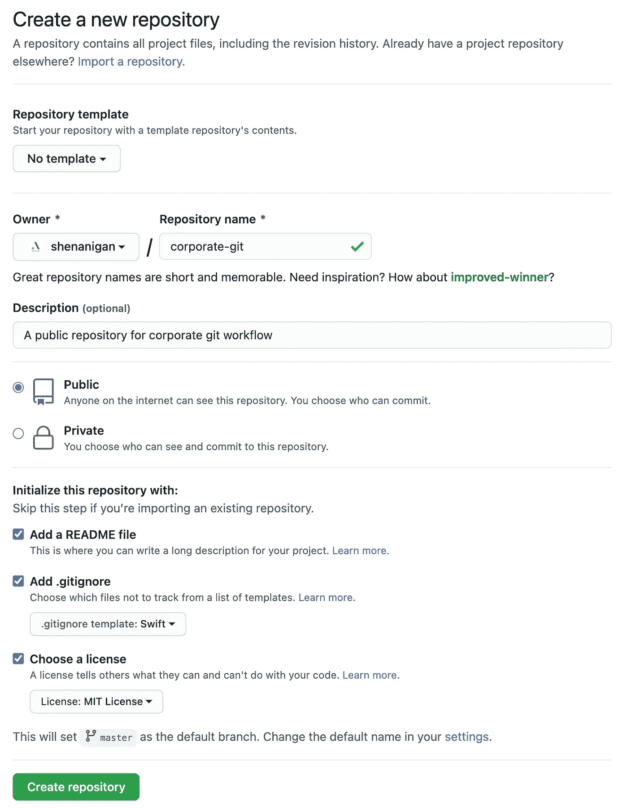

创建新的存储库

创建后，您将看到 3 个文件

*   README.md:您可以在其中添加项目的详细信息
*   。gitignore:存储库中不跟踪的文件
*   许可证:所选许可证的详细信息。

# 克隆项目

接下来，我们将把项目克隆到我们的本地机器上。我们需要首先用我们的 GitHub 帐户登录 GitHub 桌面。

打开 GitHub 桌面，从主菜单中选择**首选项**。

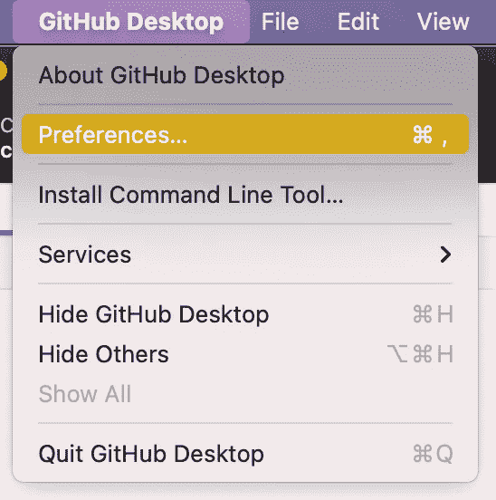

选择登录首选项

点击**登录**按钮，登录您的 GitHub 账户。

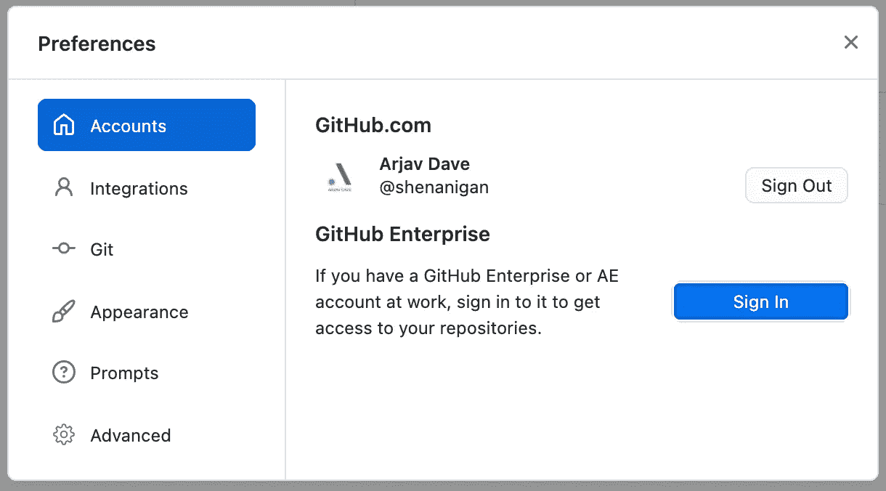

登录 GitHub 帐户

要克隆存储库，打开文件菜单并选择**克隆存储库**。

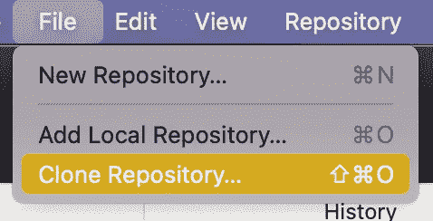

文件菜单

在打开的窗口中，搜索您的项目。在*本地路径*中，输入您机器上想要克隆存储库的目的地。最后，点击*克隆*按钮。您将看到在您的目标路径上创建了一个包含 3 个文件的文件夹。

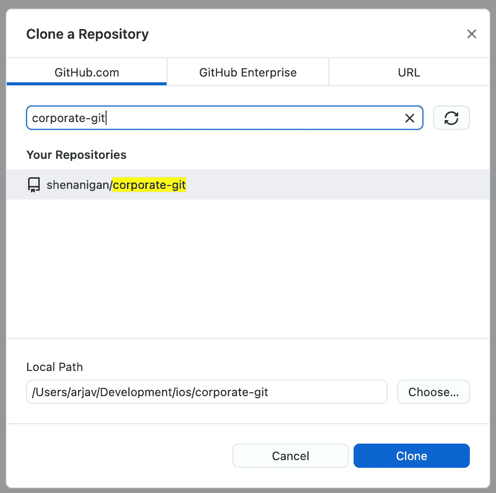

克隆到本地机器

# 使用分支

在企业世界中，每个项目通常有 3 个环境。

*   开发:开发人员可以工作的地方。
*   QA 或 UAT:测试人员可以执行各种测试。这在理想情况下几乎与生产环境相似。
*   生产:最终用户将从那里访问您的产品。

我们将使用分支在我们的源代码库中复制这个结构。

**但是，什么是 git 分支呢？**

[一个分支](https://www.atlassian.com/git/tutorials/using-branches)是一个单独的开发线。它代表了一个你可以在不影响他人工作的情况下工作的领域。当处理一个新的特性或者一个 bug 时，你通常会创建一个新的分支。这些被称为特性或 bug 分支。一旦一个特性或 bug 完成，它的分支就会被合并到主代码中，然后被删除。

检查下面的截图如何实现这一点。

首先，从主分支创建一个分支，即 qa。你可以通过 GitHub 桌面应用程序轻松实现这一点。选择**新分支**

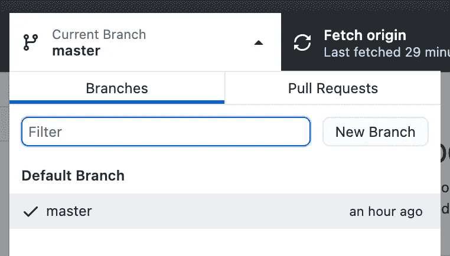

分支机构列表

基于 master 创建 qa 分支。

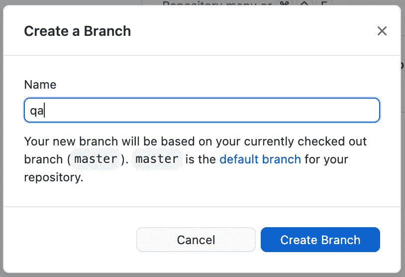

基于主文件创建 qa 分支

最后，点击 Publish branch 将更改推送到您的 GitHub 帐户。

向 GitHub 发布开发和质量保证

> 对 **开发** *分公司重复同样的操作。*

现在，当你在浏览器中刷新 GitHub 库时，你会看到 dev、qa 和 master 分支，如图所示。

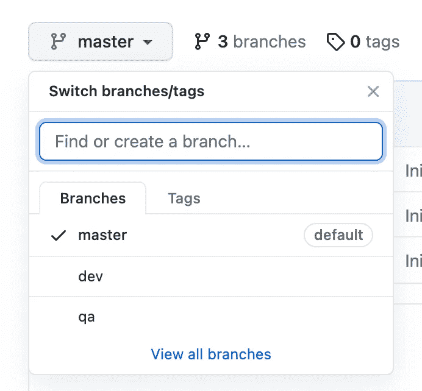

GitHub 分支

设置好我们的项目后，让我们开始使用*关于*和*联系*页面。假设我们将处理*关于*页面，而另一名团队成员将处理*联系*页面。

由于这是一个新特性，我们将研究一个名为 feature/about 的分支。

继续并基于 **dev** 创建一个新的特性分支。另外，将分支发布到 GitHub。

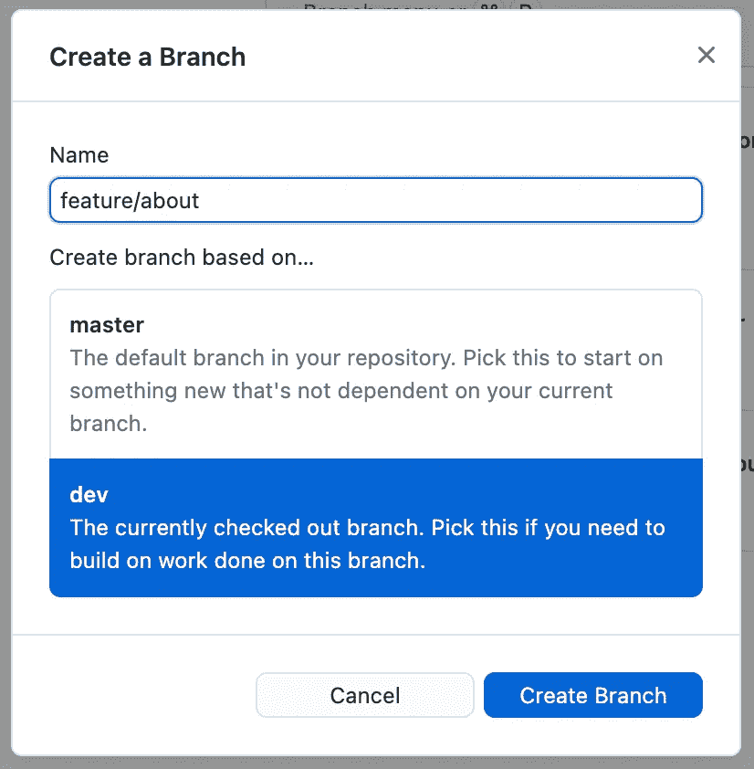

特征/关于分支

为了保持实现简单，我们将创建一个名为*about.html*的文件，并将其内容设置为 ***< h1 >关于我们< /h1 >*** 。

文件创建完成后，返回 GitHub 桌面并提交文件。最后，通过点击**发布更改**将您的更改发布到 GitHub。

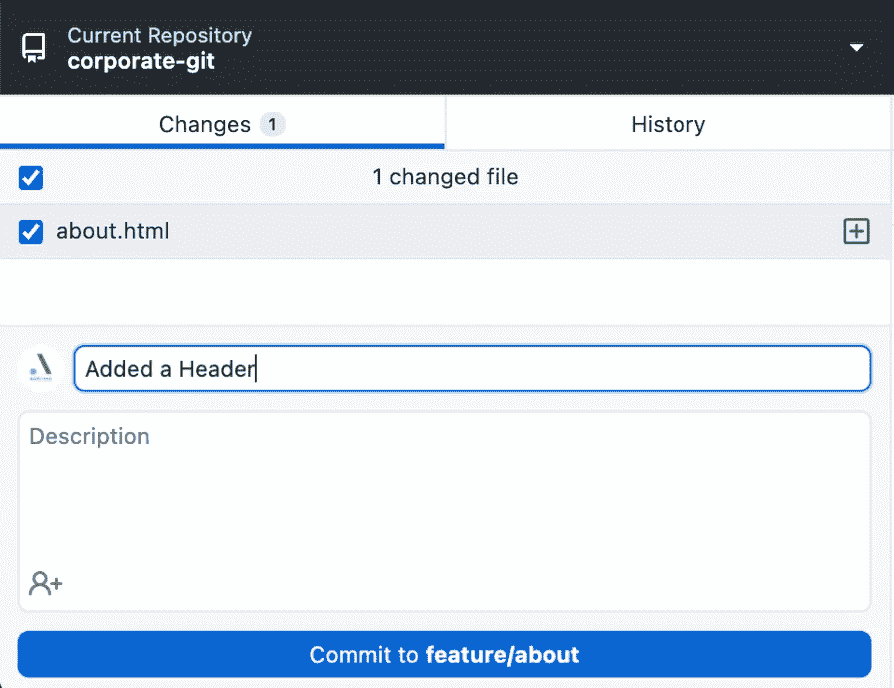

另一名团队成员将为*联系人*页面做同样的事情。将使用*contact.html*文件创建一个新的分支*特征/联系人*，并发布到存储库。

一旦实现完成，就是拉请求和代码审查的时候了。

# 拉取请求

拉请求(PR)是团队成员在代码被合并并提交给 *dev、qa 或 master* 分支之前审查代码的一种方式。假设一个开发人员正在开发一个特性。当特征完成时，将从特征分支到*开发*分支创建一个 PR。

重要的是，任何东西都不应该直接提交给*开发、qa 或主*分支*。应该总是使用 PR 将代码从一个分支转移到另一个分支。这不仅有助于代码的维护，还能改善 CI/CD 过程，我们将在下面看到。*

要创建 PR，请在浏览器中访问您的存储库。选择**拉动请求**选项卡。

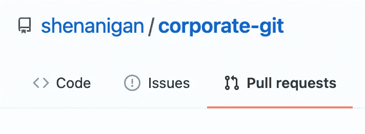

拉式请求标签

接下来，点击**新拉动请求**按钮开始 PR 过程。

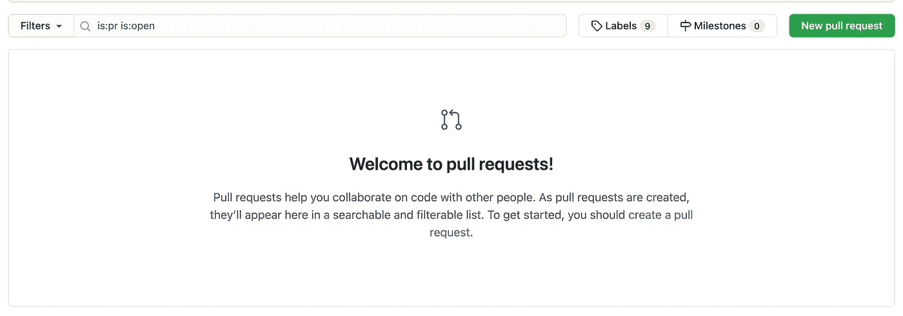

如下图所示，将比较分支更改为*特征/关于*，将基础分支更改为*开发*分支。点击*创建拉动请求*按钮预览请购单，以进行任何最终更改。

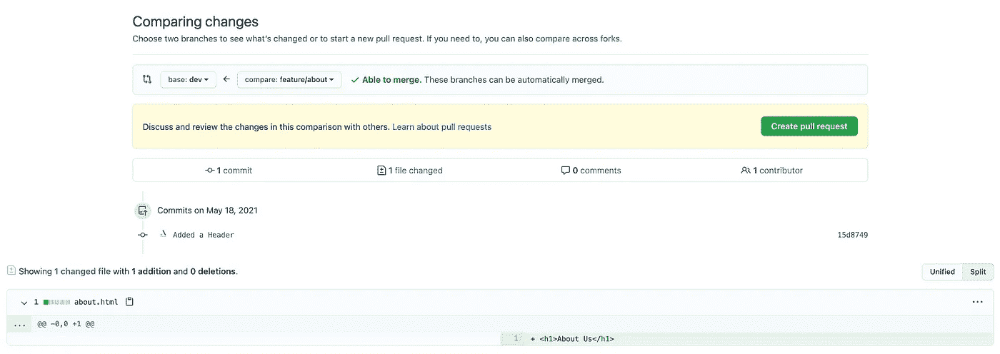

创建新的拉式请求

PR 尚未创建。当您点击上面的*创建拉动请求*按钮时，它会导航到 PR 的设置/预览页面，如下所示。在这里，您可以为 PR 添加标题、添加注释、审阅者、受托人、标签、问题等。最后，再次点击*创建拉动式请求*按钮来创建请购单。

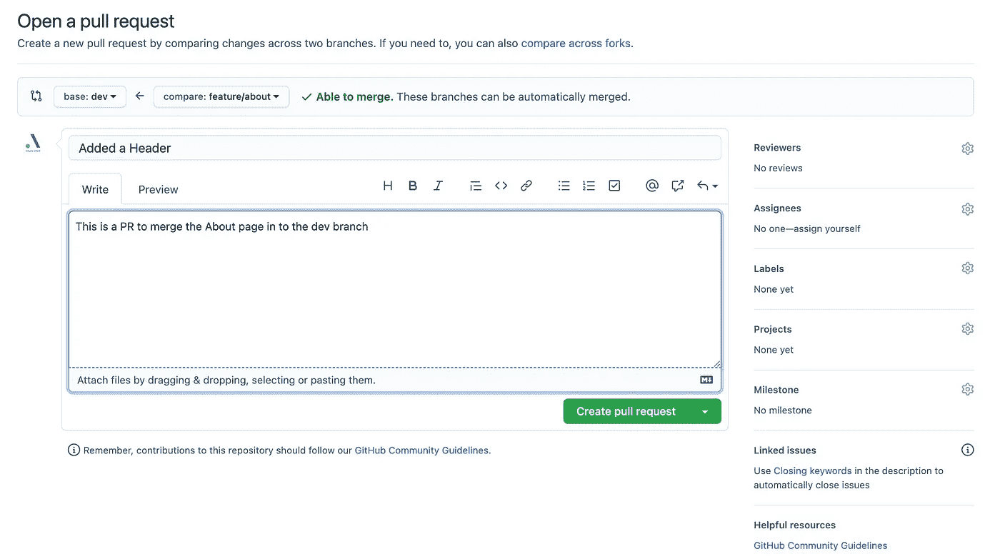

配置拉取请求

现在，到了代码审查部分。审查者(可以是你或其他人)将审查代码。如果一切正常，点击**合并拉取请求**按钮。

如果需要更改，则添加注释，以便进行相关的更改，然后完成合并请求。

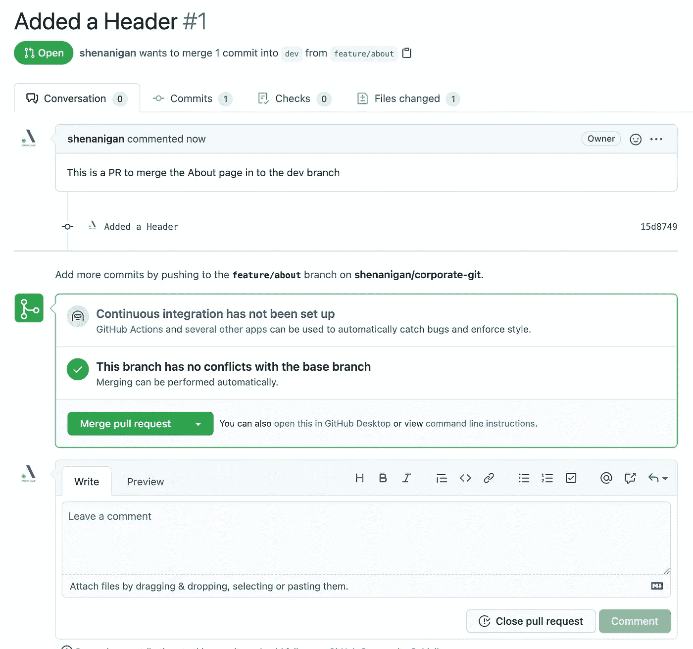

继续点击*合并拉取请求按钮*，然后*确认拉取请求。*PR 完成后，如果特征完成，特征分支被删除。

所以，现在如果你想开始一个新特性的工作，你必须切换到本地机器上的 *dev* 分支，获取最新的代码并创建一个新的特性分支。

类似地，您可以创建一个 PR 并将代码从 *dev* 合并到 *qa* 和 *qa* 到 *master* 分支。

# 解决合并冲突

当两个人在他们的本地机器上修改了同一行代码，并将其推送到存储库时，会发生什么呢？将会发生冲突，这通常被称为*合并冲突*。

假设你和你的团队成员被指派开发一个*作品集*页面。你们两个都在同一个部门工作*功能/组合*。

您的团队成员**创建了一个名为*portfolio.html*的文件，其内容为 ***< h1 >文件夹< /h1 >*** 。您还在本地机器上创建了一个名为*portfolio.html*的文件，内容为 ***< h1 >我的作品集< /h1 >。*** 现在，当你在 GitHub 桌面提交并拉取代码时，你会得到如下所示的冲突。**

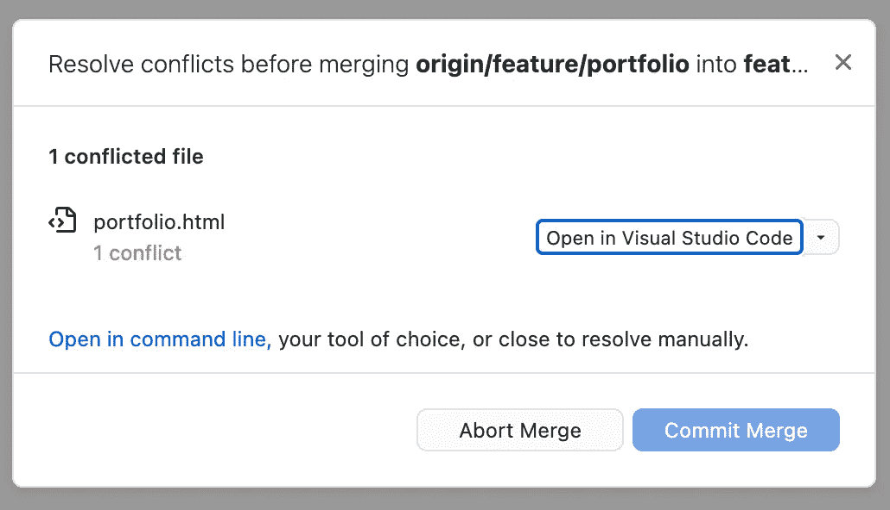

GitHub 中的冲突

打开*portfolio.html*文件，你可以看到你的代码和其他团队成员的代码。这些冲突用它们的提交 id 包装。

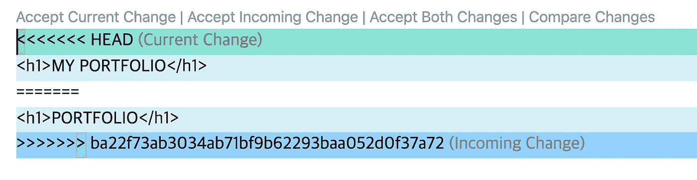

代码冲突

这是因为你们都在同一文件和同一行上工作。为了解决这个问题，你必须决定哪个版本应该保留在存储库中。

现在让我们假设你决定保持你的版本被推送。于是你将内容设置为 ***< h1 >我的作品集< /h1 >*** 并保存文件。当你回到 GitHub 桌面时，你会看到冲突已经解决。您现在可以点击*提交合并*来完成合并并发布您的更改。

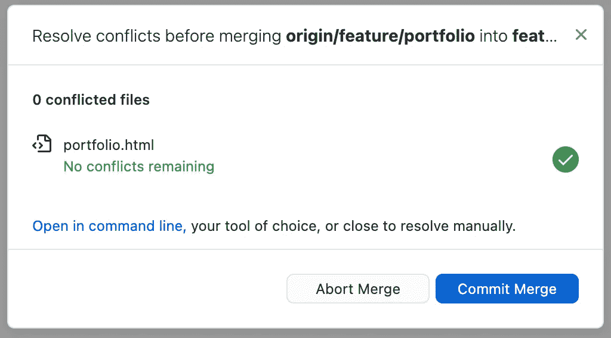

合并冲突已解决

这是如何解决合并冲突的一个非常简单的例子。

# 持续集成/持续部署

CI/CD 是一个不断构建、测试和部署新代码的过程。因此，每当您将代码推送到一个分支时，就会启动一个构建。然后测试脚本将运行，如果一切正常，它将被部署。

做 CI/CD 有很多方法。像 [Jenkins](https://www.jenkins.io/) 这样的开源软件可以用来在你自己的服务器上设置 CI/CD。很多云提供商，如 GitHub、 [Azure DevOps、](https://dev.azure.com) [CircleCI](https://circleci.com/) 等。也是可用的。我个人更喜欢 Azure DevOps，因为它提供了一个最好的免费计划和一个非常简单的配置 CI/CD 管道的方法。

理想情况下，CI 应该在代码被推送到特性或 bug 分支时运行。但是，根据服务提供商提供的计划，出于预算原因，这实际上可能不可行。在这种情况下，只有当代码被合并到 *dev、qa 和 master* 分支时，才运行 CI/CD。

我们不会讨论如何配置 CI/CD，但是如果您感兴趣，您可以访问这些针对[iOS](https://arjavdave.com/2021/03/11/continuous-integration-for-ios-on-azure-devops-part-1/)&[Android](https://arjavdave.com/2021/03/16/how-to-setup-ci-cd-pipelines-for-android-with-azure-devops/)的文章。

# 结论

Git 应该是开始编程时首先要学习的东西之一。如果你今天没有学会，那就昨天学吧。它提供了一种很好的与其他人合作的方式。其次，它保留了代码的版本，以便在需要时可以回滚。

> 基本上，Git 是所有开发人员的主要工具。

如果你有问题、疑问或评论，请在下面的文章中告诉我。