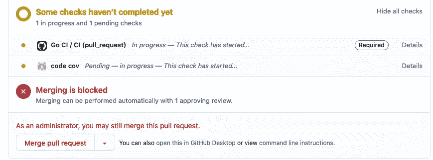
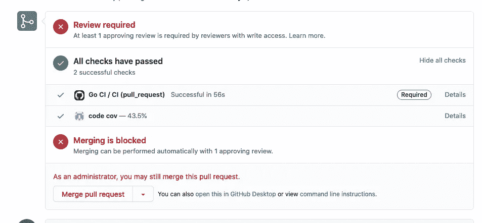

# GitHub actions 代码覆盖——没有第三方

> 原文：<https://itnext.io/github-actions-code-coverage-without-third-parties-f1299747064d?source=collection_archive---------0----------------------->

格伦·卡丽在 [Unsplash](https://unsplash.com?utm_source=medium&utm_medium=referral) 拍摄的照片

事实证明。使用 GitHub actions 将代码覆盖集成到构建管道中的方法是使用第三方解决方案，如 [codcov.io](https://codecov.io/) 等。这些解决方案非常棒，但是每个用户每月的成本高达 20 美元。而且它们有许多并非每个人都需要的高级功能。对于拉请求的基本代码覆盖率检查和 README.md 中的代码覆盖率徽章，我不想按月付费。

在网上搜寻免费解决方案后，我没有找到任何有用的东西。决定黑掉我的路。

在这篇文章中，我将展示如何使用 GitHub actions 和一些云存储(如 s3)来为您的存储库创建一个代码覆盖率标记，以及一个 GitHub status，它可以用来保护主分支，因此如果一个 pull 请求丢弃了代码覆盖率，它将被阻止合并。

GitHub 徽章只是嵌入在 repo README.md 中的一个小 SVG。创建它最简单的方法是使用 [shields.io](http://shields.io/) API。

***卷曲 https://img.shields.io/badge/coavrege-$total%-$COLOR>badge . SVG***

其中$COLOR 是一个 bash 变量，包含 CSS 颜色，如红色、绿色、橙色。$total 是另一个 bash 变量，百分位在 0 到 100 之间。 [shields.io](http://shields.io/) 提供这个免费的实用程序太棒了。

这个简单的一行程序可以创建一个徽章，剩下的就是将它上传到一个禁用缓存的公共存储中，并将其嵌入到一个 [README.md](http://README.md)

# 徽章生成

GCP 云存储示例

GitHub actions 工作流可以在主分支的推送/合并上运行上述内容，并上传徽章，请注意**“Cache-Control”**标头，这很重要，因为至少在 GCP 是如此，但在 AWS 上也可能如此，如果您将对象上传到公共存储，默认情况下会缓存该对象，然后项目的 README.md 将始终包含过期版本。

## README.md

将此链接放入您的自述文件中，它将指向最新的代码覆盖率徽章。

## GitHub 操作工作流文件

GitHub 工作流的一个例子，运行 golang 测试，并生成代码覆盖率徽章。

# GitHub 状态

这是这篇文章最令人讨厌的部分。如果代码覆盖率下降，CI 失败是很常见的，使用 GitHub 动作实现这一点的方法是使用 [GitHub 状态](https://docs.github.com/en/rest/reference/repos#statuses)

GitHub [状态](https://docs.github.com/en/rest/reference/repos#statuses)是一个连接到提交的实体，任何提交都可以有许多与之相关的状态。状态可以有一个状态(错误、失败、挂起或成功)。最常见的状态示例是您的项目测试套件，当测试正在运行时，状态为挂起，如果失败，则状态为失败，如果通过，则状态为成功。这对于拉请求来说很方便，因为可以“[保护分支](https://docs.github.com/en/github/administering-a-repository/about-protected-branches)”，只有当所有状态都通过时才允许合并拉请求。

当您运行 GitHub 工作流时，该工作流中的任何作业都将创建一个状态(以及一个工卡)，但是状态的名称是静态的(作业的名称，就像上面示例中的`CodeCov`—第 9 行)。如果您希望您的状态包含动态信息，比如代码覆盖率的百分比，您将不得不更加努力地工作，所以让我们深入研究代码，稍后再解释它。

## 代码覆盖率状态 GitHub 工作流

一个戈兰的例子

这一部分稍微长一点，它为当前的提交创建一个挂起状态，运行测试，下载主分支的代码覆盖率(当发布徽章时，我们在前面的工作流中上传了它)，并与当前运行的代码覆盖率进行比较。如果代码覆盖率下降，则它处于失败状态，否则它会将其标记为成功。

注意调用**api.github.com**的两个 curl 命令。他们创建并更新代码覆盖率状态。

# 这是它看起来的样子

待定支票

通过检查(注意代码覆盖率的百分比)

就是这样:)

关心你的代码。测试它，不要忽略代码覆盖率。这不是最好的质量度量(90%的覆盖率并不能说明你的测试质量)，但总比什么都没有好。干杯。