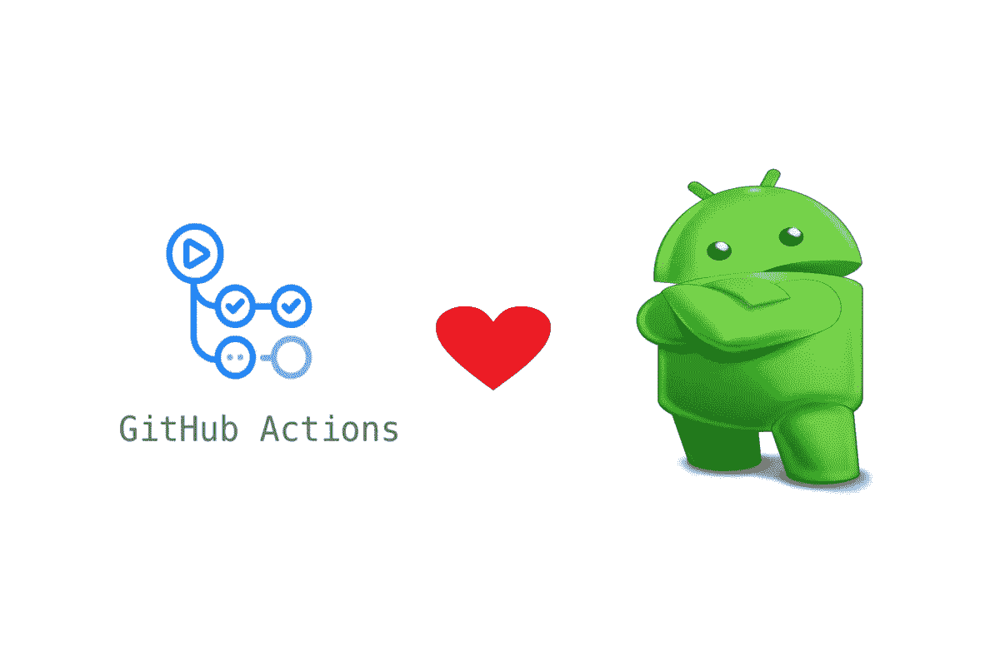
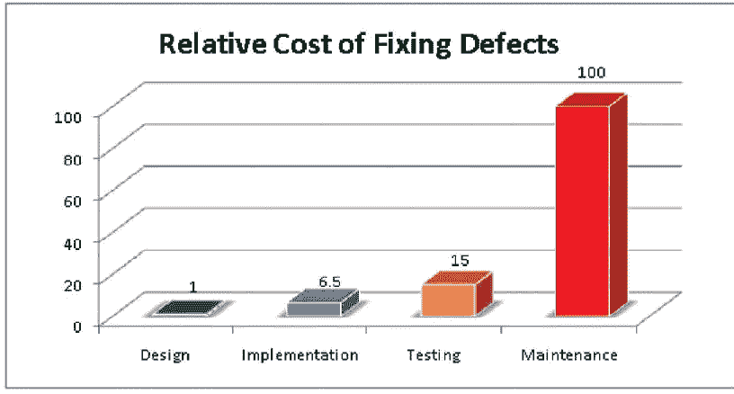
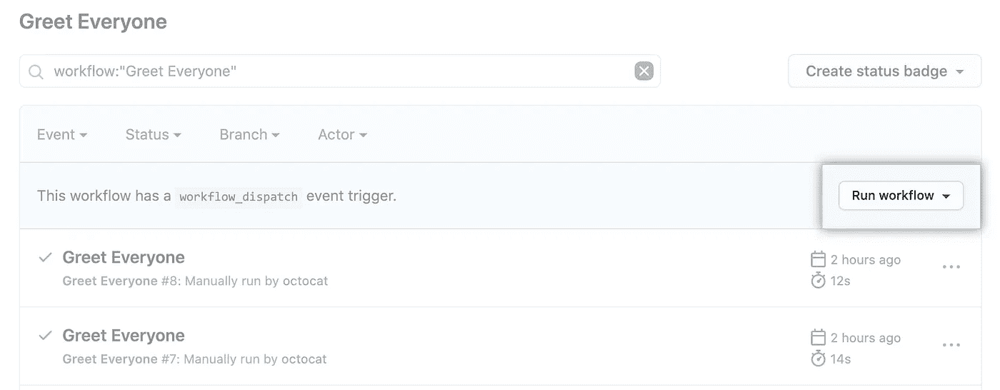
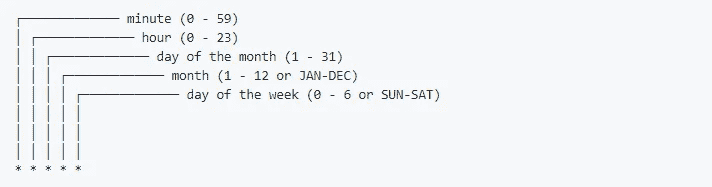
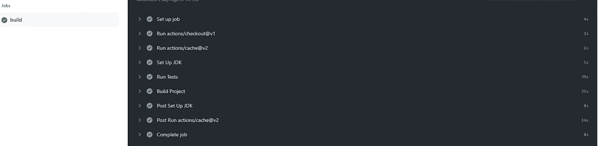
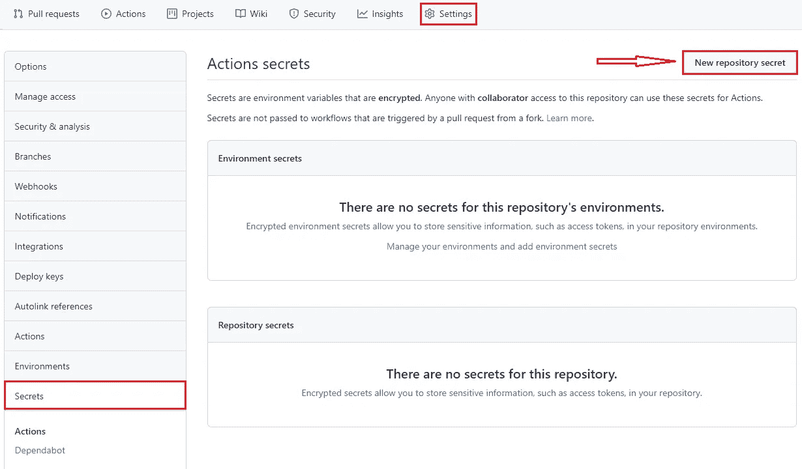
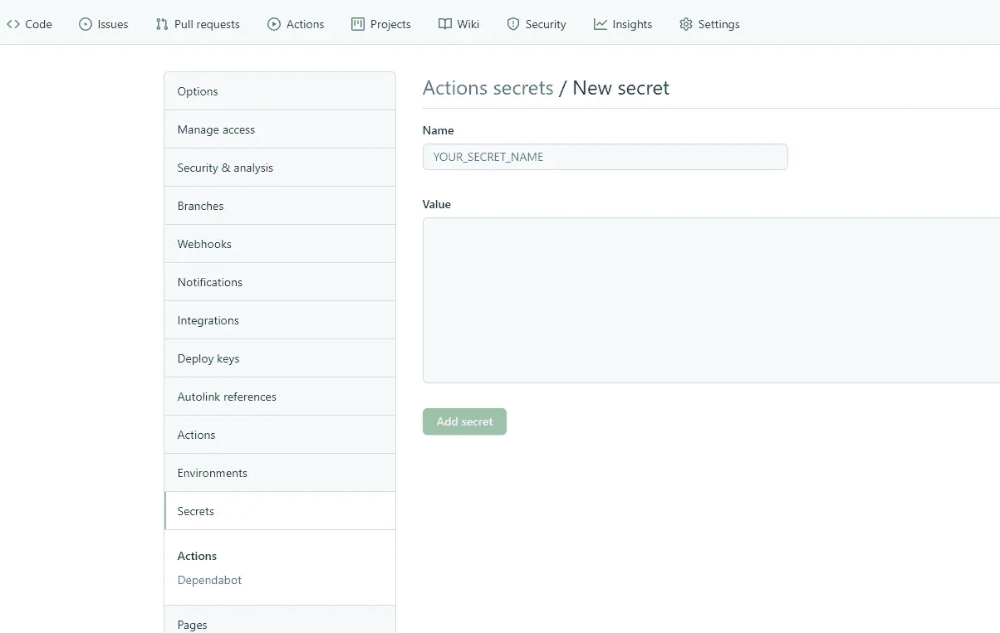

# 面向 Android 开发者的 GitHub 行动

> 原文：<https://itnext.io/github-actions-for-android-developers-9ae606df2bfa?source=collection_archive---------0----------------------->



面向 Android 开发者的 GitHub 行动

大家好，我是 Amr Hesham，一名软件工程师，我对 Android 开发和编译器设计感兴趣，在这篇文章中，我将谈论 GitHub Actions，以及作为一名 Android 开发人员，如何使用它为您的项目构建持续集成管道(CI ),但首先什么是持续集成？

持续集成
将来自多个参与者的代码变更自动集成到一个软件项目中的实践，可以在构建管道中验证代码的质量。从长远来看，使用左移方法及早检测安全漏洞和代码质量问题可以降低成本，因为在生产过程中检测到的漏洞修复起来成本很高。

**bug 成本** 跳过测试可能会导致 bug 潜入产品，这会花费更多的钱或者引起客户不满，导致法律诉讼或者损害你的商业声誉。同样，手动测试会花费金钱并延迟交付。迫切需要测试自动化来避免额外的成本和软件交付问题。



数据来自 IBM 系统科学研究所修复缺陷研究门户的相对成本

**GitHub 操作** GitHub 操作是 GitHub 存储库工作流中的一组操作，允许您定制和执行软件开发工作流，您可以创建操作或利用现有操作，并创建和定制工作流来执行任何工作或自动化软件开发生命周期(SDLC ),包括 CI/CD。

**工作流**
在 GitHub 仓库中，流程设置在一个定义构建、测试、打包或部署作业的 YAML 文件中，称为工作流，它存储在 GitHub/workflow 文件夹中，一个工作流可能包含一个或多个作业，并根据触发器/事件进行调度运行。

**作业** 作业是在运行程序的单个新实例上运行的一组步骤，可以顺序运行，也可以并行运行，这取决于需求。默认情况下，如果您的工作流包含多个作业，它将并行运行。您还可以创建一个依赖作业，如果依赖项失败，它将不会运行。对于每个作业，您应该指定运行程序操作系统和版本。

**GitHub 托管运行程序** 托管运行程序是机器，它们预装了常用软件，包含操作系统 Linux、macOS 或 Windows 和硬件配置，您不能自定义托管运行程序的硬件配置，但是如果您的应用程序有特定需求，您可以将您的机器或虚拟机设置为 GitHub 操作的运行程序，例如，要在 ubuntu 上运行，您可以编写:

```
run-on:ubuntu-latest
```

你可以在[](https://github.com/actions/virtual-environments/tree/main/images)****的虚拟环境中找到 GitHub runners 安装的软件和操作系统信息。****

****Action** Action 是工作流的最小构建块，它可以被标识为一个单独的任务，这些步骤可以组合起来创建一个可以在工作流中执行的作业，您可以使用 GitHub[**market place**](https://github.com/marketplace?type=actions)**中的现有操作或者创建您的操作，每个操作都有一个名称和版本，例如:****

```
**-uses: actions/checkout@v1**
```

****操作名称为“结帐”,提供者(用户或组织)为“操作”,版本为 1，因此，如果您要查找操作 URL 以查找有关如何设置它的文档，它将是 github.com/{provider}/{name}，例如 github.com/actions/checkout.****

******步骤
步骤**一个任务即一个动作或命令被标识为一个步骤，一个作业中的所有步骤运行在同一个运行器中，共享文件系统信息，命令可以是这样的。****

```
**- name: Say Hello
  run: echo 'Hello, World!'**
```

******事件****** 

****对于手动事件示例，您可以使用 workflow_dispatch 使您能够使用按钮来触发它****

```
**on: [workflow_dispatch]**
```

********

****来自 Github.com 的手动工作流触发器图像****

****对于 webhooks 事件，您可以让您的工作流在所有分支或特定分支中的代码更改被推或拉请求时运行****

****对于所有分支机构。****

```
**on: [push, pull_request]**
```

****仅适用于主支行。****

```
**push:
 branches: [ master ]
pull_request:
 branches: [ master ]**
```

****或者，您可以使用 cron: syntax 将预定事件作为触发器****

```
**on:
 schedule:
 - cron: ’30 * * * *’**
```

****Cron 语法有五个由空格分隔的字段，每个字段代表一个时间单位。****

********

****Github.com 的 Cron 语法****

****你可以从这里找到 GitHub Doc 中所有事件以及如何配置的列表: [**事件**](https://docs.github.com/en/actions/reference/events-that-trigger-workflows) 。****

****现在，在你知道什么是 GitHub 动作之后，让我们知道如何为 Android 项目构建我们的工作流来构建和测试它，为此我们有两个选项，第一个是从头开始一步一步地创建我们的工作流文件，另一个选项是使用市场中现有的动作。****

****在我们开始编写我们的第一个工作流之前，我们需要确保我们的 gradlew 文件是可执行的，这样工作流就可以使用它，要做到这一点，请在您的 android 项目中打开终端并编写****

```
**git update-index --chmod=+x gradlew**
```

****现在，让我们从第一个选项开始，即从头开始创建工作流，因为这将有助于我们理解文件的结构，并在将来轻松创建我们的操作。****

****第一步是在中创建工作流文件。扩展名为 yml 或 yaml 的 github/workflows 文件夹，例如 build.yml。****

```
**name: Buildon:
  push:
    branches: [ master ]
  pull_request:
    branches: [ master ]**
```

****我们的工作流名称是 build，它将在主分支上进行代码推送或拉取请求时运行，然后让我们定义 id 为 Build 的作业，并在 ubuntu-latest 上运行。****

```
**jobs:
  build:
    runs-on: ubuntu-latest**
```

****现在让我们定义我们的工作步骤，我们的第一步是在$GITHUB_WORKSPACE 下签出我们的存储库，以便工作流可以访问它。****

```
**- uses: actions/checkout@v1**
```

****然后我们需要将 java 版本定义为 1.8。****

```
**- name: Set up JDK 1.8
  uses: actions/setup-java@v1
    with:
      java-version: 1.8**
```

****现在我们的环境已经准备好了，我们将开始编写命令步骤来使用 Gradle，运行所有你能做的单元测试。****

```
**- name: Run Tests
  run: ./gradlew test**
```

****为了构建这个项目你可以写。****

```
**- name: Build Project
  run: ./gradlew assemble**
```

****现在，我们的工作流将正确工作，它验证您的项目正在成功构建，并且所有测试都已通过，但请记住，您的时间和资源有限，如果我们每次下载一些依赖项，我们都会浪费它们，请记住，在您的本地计算机上下载一次，每次运行作业时，作业都会在新的实例上运行，因此要解决这个问题，我们需要缓存它们，这很容易，因为有了缓存操作，所以在您使用签出操作后，您可以像这样运行我们的缓存操作。****

```
**- uses: actions/cache@v2
  with:
    path: |
      ~/.gradle/caches
      ~/.gradle/wrapper
    key: ${{ runner.os }}-gradle-${{ hashFiles('**/*.gradle*', '**/gradle-wrapper.properties') }}
    restore-keys: |
      ${{ runner.os }}-gradle-**
```

****完整的工作流程将是这样的。****

```
**name: Buildon:
  push:
    branches: [ master ]
  pull_request:
    branches: [ master ]jobs:
  build:
    runs-on: ubuntu-latest steps:
      - uses: actions/checkout@v1 - uses: actions/cache@v2
          with:
            path: |
              ~/.gradle/caches
              ~/.gradle/wrapper
            key: ${{ runner.os }}-gradle-${{ hashFiles('**/*.gradle*', '**/gradle-wrapper.properties') }}
            restore-keys: |
            ${{ runner.os }}-gradle- - name: Set Up JDK
        uses: actions/setup-java@v1
        with:
          java-version: 1.8 - name: Run Tests
        run: ./gradlew test - name: Build Project
        run: ./gradlew assemble**
```

****如果一切正常，您将在 action 选项卡中看到这一点。****

********

****GitHub 操作成功****

****您可能面临的一个额外问题是，您的 local.properties 文件中有变量，而该文件被忽略，因此构建工作流会因为这些变量而失败，所以我们需要在构建之前添加它。****

****首先，我们需要将其定义为一个秘密值，您有两种类型的秘密，存储库级别将仅在当前存储库中使用，组织级别将用于该组织中的所有存储库。****

****机密名称区分大小写，不能以数字开头，只能用下划线分隔，也不能使用 GITHUB_，并且在存储库和组织级别必须是唯一的。****

****让我们定义我们的回购级别机密，您可以从存储库中的设置选项卡定义机密，然后单击创建新的存储库机密。****

********

****创建新的存储库密码****

****然后写秘密名和值。****

********

****创建带有名称和值的秘密****

****在我们创建了我们的秘密之后，我们应该把它添加到 local.properties 文件中，但是首先让我们使用命令步骤创建一个。****

```
**- name: Create Local Properties File
  run: touch local.properties**
```

****然后我们需要用一个变量名把我们的秘密值加进去。****

```
**- name: Add secret API Key
  run: echo "apiKey=\""${{ secrets.secret_name }}"\"" >> local.properties**
```

****例如，如果我们的密钥是 10，变量名是 apiKey，文件中的最终结果将是。****

```
**apkKey="10"**
```

****现在我们已经将它们添加到了属性文件中，但是请记住，这应该是在构建或测试命令之前。****

****GitHub Actions 上有许多功能，你可以用它做许多事情，我推荐你阅读《GitHub Actions 实践》一书，这样你就可以知道如何创建一个好的 CI/CD 管道，以及如何创建你的自定义操作和 Runner。****

****你可以在:[**GitHub**](https://github.com/amrdeveloper)[**LinkedIn**](https://www.linkedin.com/in/amrdeveloper/)[**Twitter**](https://twitter.com/amrdeveloper)上找到我。****

****享受编程😋。****