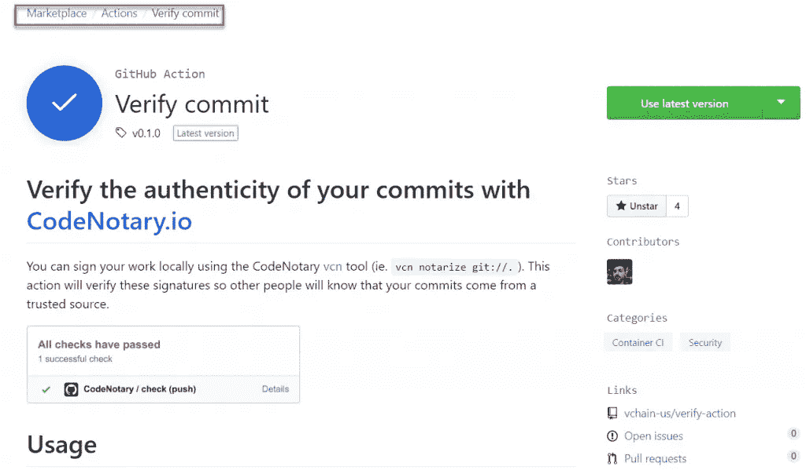
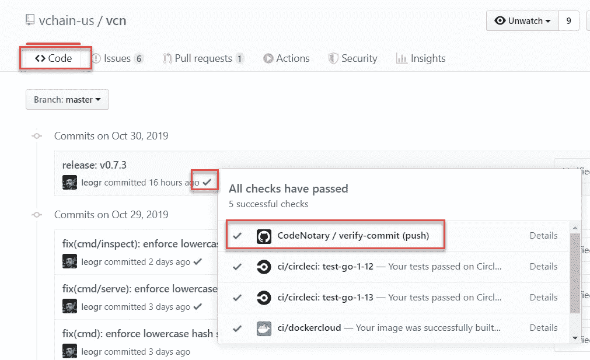
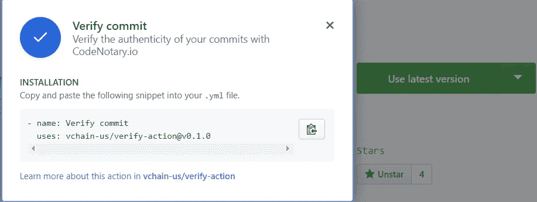

# GitHub 动作和验证动作即将发布

> 原文：<https://itnext.io/github-actions-go-live-nov-13th-and-so-do-our-verify-actions-536e86d28bb2?source=collection_archive---------7----------------------->

GitHub Actions 将于 11 月 13 日上线，我们现在处于测试的最后两周。

作为 GitHub Actions beta 计划的一部分，我们可以为 GitHub Actions marketplace 创建 code 公证人提交认证。现在它已经准备好并经过测试，每个人都可以免费使用:[https://github.com/marketplace/actions/verify-commit](https://github.com/marketplace/actions/verify-commit)

# GitHub 行动 GA 自由数量

我们收到了下面的电子邮件，告知我们免费数量以及在哪里可以找到价格，如果你超出了这些限制。

> *我们想让您知道，这些服务对于开源软件仍然是免费的，并且包括免费的数量，超出部分将在 11 月 13 日成为付费服务。您可以继续使用这些服务，无需更改现有工作流程。如果您想要使用超出所包含限制的操作和软件包注册，您将需要启用超额，因为我们不会在未经您同意的情况下向您收费，即使您在 beta 计划期间使用了类似级别的服务数量。*
> 
> *GitHub*

定价页面可以在这里找到:[https://github.com/features/actions](https://github.com/features/actions)

# GitHub 操作市场

你可以在市场中找到 GitHub 动作:[code 公证人验证提交](https://github.com/marketplace/actions/verify-commit)



# 使用 code 公证人验证您提交的真实性。io

使用 Verify commit 动作，您可以使用[code 公证人 vcn](https://github.com/vchain-us/vcn) 命令行(即 *vcn 公证 git://* 。).此操作将验证这些签名，以便其他人知道您的提交来自受信任的来源。

每当你发布一个新的提交，验证检查就会被触发，每个人都可以确信它是被维护者信任的。您只需单击提交的每个复选标记即可查看详细信息。



# 使用



在您的存储库`.github/workflows`目录中创建一个工作流`.yml`文件(例如`.github/workflows/verify.yml`)。在您的工作流程中，您首先需要签出存储库，然后使用以下操作:

```
name: CodeNotary on: [push] jobs: check: runs-on: ubuntu-latest steps: - name: Checkout uses: actions/checkout@master - name: Verify uses: vchain-us/verify-action@master
```

有关更多详细信息，请参见[GitHub 动作的上下文和表达式语法](https://help.github.com/en/articles/contexts-and-expression-syntax-for-github-actions)

# 输入

参见 [action.yml](https://github.com/vchain-us/verify-action/blob/master/action.yml) 。

可用输入

*   `signerID` -要验证的签名 ID 列表(用空格分隔)。SignerID 是签名者的公共地址(表示为一个 40 个十六进制字符长的字符串，前缀为`0x`)。
*   `org` -要验证的组织 ID。注意`org`优先于`signerID`
*   `path`-git 工作目录路径。默认为当前目录。

示例:

```
- name: Verify uses: vchain-us/verify-action@master with: signerID: <a trusted signer ID> org: <a trusted organization> path: <path to your repository, if not the current directory>
```

# 签署/公证您的 Git 承诺

请检查 vcn 存储库，了解如何公证您的提交，以便通过检查。

[https://github.com/vchain-us/vcn#usage](https://github.com/vchain-us/vcn#usage)

# 来源

你可以在我们的 GitHub 资源库中找到 GitHub 动作的源代码:[https://github.com/vchain-us/verify-action](https://github.com/vchain-us/verify-action)

*原载于 2019 年 10 月 31 日*[*https://www . code 公证人. io*](https://www.codenotary.io/github-actions-are-live/) *。*