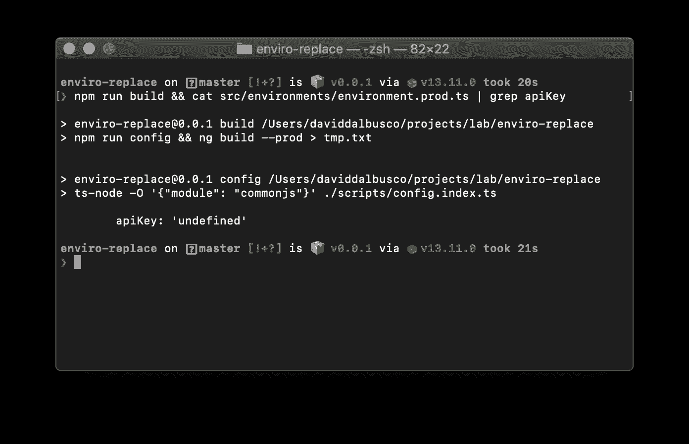
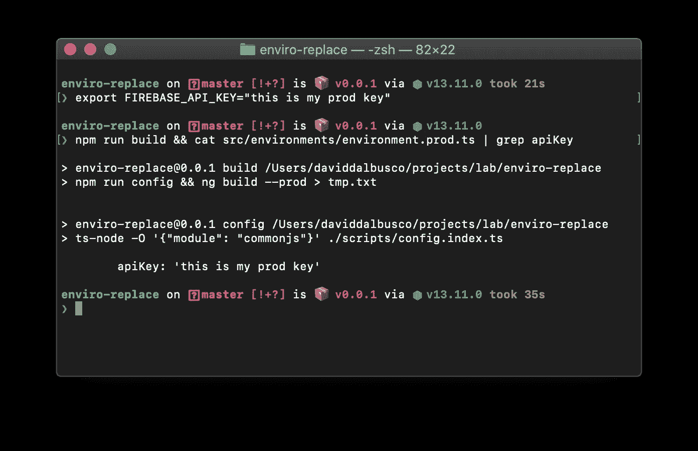

# GitHub 动作:隐藏和设置角度环境变量

> 原文：<https://itnext.io/github-actions-hide-and-set-angular-environment-variables-e753d06d16a8?source=collection_archive---------1----------------------->

## 如何在你的 repo 中隐藏 Angular environments 变量，并在构建时使用 GitHub 动作设置这些变量


照片由 [jae bano](https://unsplash.com/@jae462?utm_source=unsplash&utm_medium=referral&utm_content=creditCopyText) 在 [Unsplash](https://unsplash.com/s/photos/free?utm_source=unsplash&utm_medium=referral&utm_content=creditCopyText) 上拍摄

我每天分享[一招](https://medium.com/@david.dalbusco/one-trick-a-day-d-34-469a0336a07e)直到原定的 2020 年 4 月 19 日瑞士新冠肺炎隔离期结束。离第一个里程碑还有八天。希望更好的日子就在前面。

昨天我突然想起我还必须创建一个 [GitHub Actions](https://github.com/features/actions) 来构建和部署我们项目的编辑器 [DeckDeckGo](https://deckdeckgo.com) 。

即使大部分集成已经自动化，这个特性仍然在我的待办事项列表中，因为在能够正确完成这个任务之前，我必须混淆一些生产令牌。

当我思考这个问题时，我问自己，最近我是否真的已经在另一个项目中解决了这个特性？你猜怎么着，我确实有😉，而是装在一个[有棱角的](https://angular.io)原型里。几周前，为了帮我在苏黎世找到一套公寓，我为自己开发了一个小项目。

这就是为什么我今天与你分享这个新的技巧。

# 概念

Angular，开箱即用，由于我们的`angular.json`的属性`fileReplacements`，让我们处理环境变量。默认情况下，您的项目很可能包含两个文件，一个是`environment.ts`，另一个是用于您的生产构建的`environment.prod.ts`。

想法如下:在`environment.prod.ts`我们将定义不带任何值的键，允许我们在我们的公共 [GitHub](https://github.com) repo 中安全地推送这些键。然后，在系统变量的帮助下，在 GitHub 操作中构建之前设置这些变量。

# 安装环境. ts

首先，让我们先设置我们的`environment.ts`文件。我们的目标是混淆一个令牌，比如说我们想要隐藏我们的 [Firebase](https://firebase.google.com) Api 密钥。

与解决方案并不相关，但是我们也在您的配置中注入了应用程序的`version`和`name`。注意，这需要激活`tsconfig.json.`中的编译器选项`resolveJsonModule`到`true`

我们的`environment.ts`:

```
import {name, version} from '../../package.json';

export const environment= {
  production: false,
  firebase: {
    apiKey: 'the-key-you-can-expose',
  },
  name,
  version
};
```

而我们的`environment.prod.ts`包含了`'undefined'`为隐藏值。这是一个字符串背后的原因是，如果在构建时没有定义键，我们即将到来的解析器将注入这样的值。

```
export const environment= {
   production: true,
   firebase: {
        apiKey: 'undefined'
    },
    name: 'enviro-replace',
    version: '0.0.1'
};
```

## 隐藏发展变量

在前面的设置中，我修改了我们同意在开发配置中公开密钥的事实，但是您可能也想隐藏它。在这种情况下，我建议将这些值提取到一个单独的本地文件中，您在`.gitignore`中明确忽略了这个文件。

例如，假设我们创建了一个新文件`firebase.environment.ts`，在其中我们移动了配置，并添加到 Git 忽略的文件列表中。

```
export const firebase= {
    firebase: {
        apiKey: 'the-key-you-can-expose',
    }
};
```

然后我们可以更新我们的`environment.ts`如下:

```
import {firebase} from './firebase.environment';

import {name, version} from '../../package.json';

export const environment = {
  production: false,
  ...firebase,
  name,
  version
};
```

# 构建前更新变量

我们的生产环境在这一点上包含了一个隐藏的值`'undefined'`，我们必须在构建我们的应用程序之前替换它。

为此，我们可以使用 Riccardo Andreatta 的[文章](https://medium.com/@ferie/how-to-pass-environment-variables-at-building-time-in-an-angular-application-using-env-files-4ae1a80383c)中描述的“魔法文件”👍。

我们创建一个新的脚本`./config.index.ts`。基本上，它会用新值覆盖我们的`environment.prod.ts`文件，特别是我们将在您的环境或 GiHub Actions secret store 中定义的值。

在这个解析器中，我们注意到两件有趣的事情:

1.  它也包含环境变量。这意味着，如果您要向配置中添加一个新的密钥，您也必须更新脚本。
2.  我们使用环境进程`process.env.FIREBASE_API_KEY`来注入一个值，我们将从我们的环境或者从 GitHub 动作中获取这个值，用我们想要隐藏的有效键来覆盖环境。

```
import {writeFile} from 'fs';

import {name, version} from '../package.json';

const targetPath = './src/environments/environment.prod.ts';

const envConfigFile = `export const environment = {
   production: true,
   firebase: {
        apiKey: '${process.env.FIREBASE_API_KEY}'
    },
    name: '${name}',
    version: '${version}'
};
`;

writeFile(targetPath, envConfigFile, 'utf8', (err) => {
  if (err) {
    return console.log(err);
  }
});
```

最后，我们可以将脚本的执行添加到我们的`package.json`:

```
"scripts": {
  "config": 
     "ts-node -O '{\"module\": \"commonjs\"}' ./config.index.ts",
  "build": "npm run config && ng build --prod",
}
```

# 测试

我们都准备好了，现在可以试一试。让我们先运行一个构建，什么都不做。



正如你所注意到的，我们的`apiKey`剩余等于`'undefined'`，因此对我们的构建无效。

现在让我们尝试定义一个环境变量(`export FIREBASE_API_KEY="this is my prod key"`)并再次运行我们的构建。



Tada，我们环境变量已经被设置并用于我们的构建🎉。

此时，您可能会问自己“是的，但是 David，如果我们这样做，那么每次我们运行构建时，我们的`environment.prod.ts`文件都将被修改”。对此我会回答“是的，你是对的…但是我们的目标是用 GitHub 动作来自动构建，以便不再在本地运行高效的构建，因此修改对我们的日常工作流来说不是问题😇".

# GitHub 操作

最后一点，GitHub 动作的自动化。

我不打算讨论如何创建这样的脚本， [Julien Renaux](https://twitter.com/julienrenaux) 在他的[博客文章](https://julienrenaux.fr/2019/11/25/building-deploying-stenciljs-apps-firebase-hosting-github-actions/)中很好地讨论了这个主题，或者你可以查看我的 Angular 相关的 [app.yml](https://github.com/peterpeterparker/watamato/blob/master/.github/workflows/app.yml) GitHub actions。

我假设你的脚本已经准备好了，并且你已经在你的 repos' secrets 中定义了一个`FIREBASE_API_KEY`。

应用程序的相关构建序列可能如下所示:

```
jobs:
  build:
    name: Build
    runs-on: ubuntu-latest
    steps:
      - name: Checkout Repo
        uses: actions/checkout@master
      - name: Install Dependencies
        run: npm ci
      - name: Build
        run: npm run build
```

我们现在“只”需要添加以下内容:

```
jobs:
  build:
    name: Build
    runs-on: ubuntu-latest
    steps:
      - name: Checkout Repo
        uses: actions/checkout@master
      - name: Install Dependencies
        run: npm ci
      - name: Build
        run: npm run build
        env:
          FIREBASE_API_KEY: ${{ secrets.FIREBASE_API_KEY }}
```

已经这样了。这样做，GitHub Actions 将为我们的构建设置相关的环境变量，我们上面的脚本和配置将处理剩下的事情。

# 摘要

GitHub 操作非常方便，过去和现在都是我持续集成工作流程的重要资产。

呆在家里，注意安全！

大卫