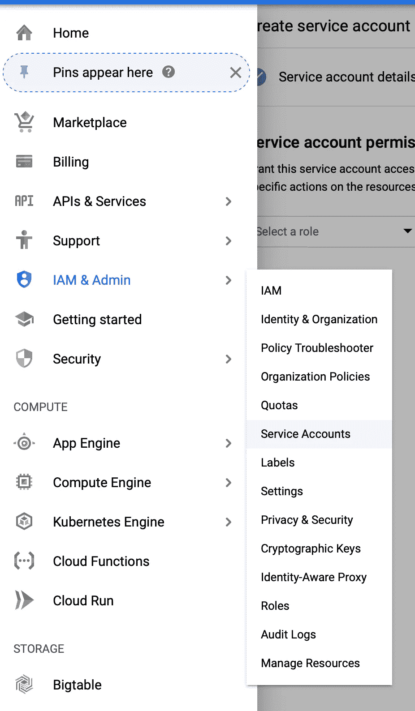
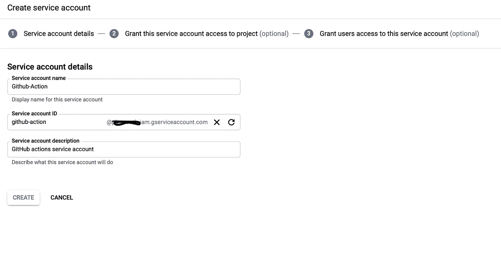
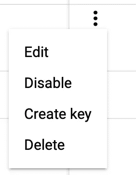
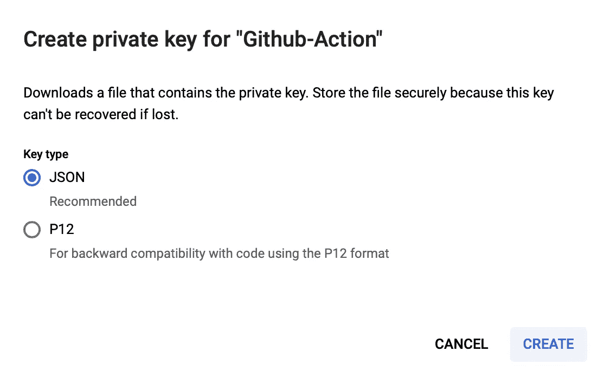
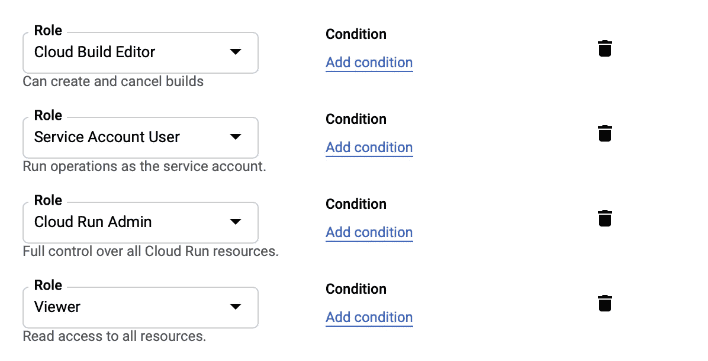
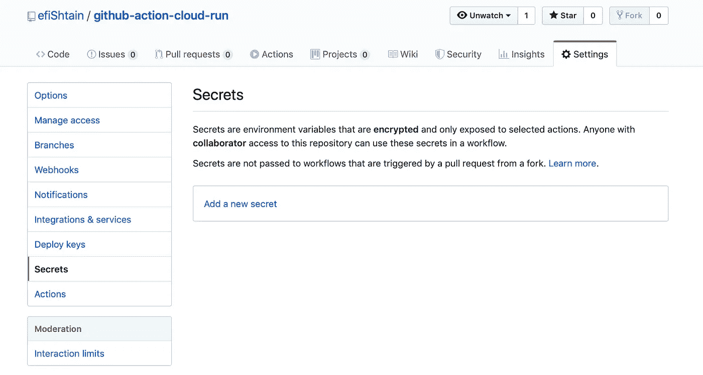
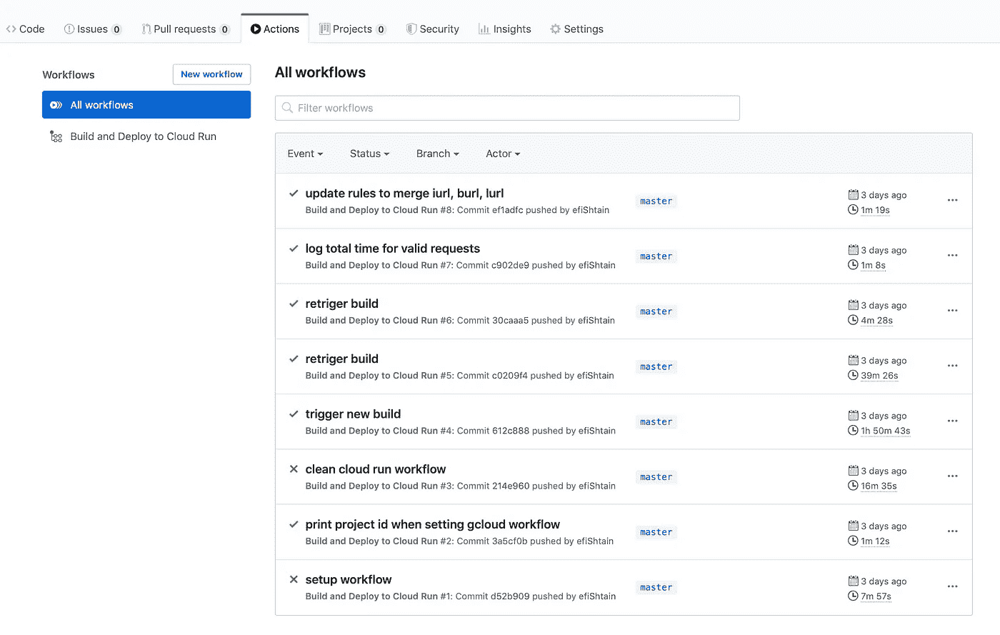

# github Actions——如何将代码交付给 GCP 云运行

> 原文：<https://itnext.io/github-actions-ship-code-to-gcp-cloud-run-8d607f34e1cd?source=collection_archive---------1----------------------->


[金赛](https://unsplash.com/@finalhugh?utm_source=medium&utm_medium=referral)在 [Unsplash](https://unsplash.com?utm_source=medium&utm_medium=referral) 上的照片

将代码部署到产品中既耗时又棘手。出错可能会让你的服务瘫痪，最终可能会伤害你的用户，让你损失金钱。

解决方案当然是尽可能自动化。

【参考消息:这篇博客文章假设在 node.js/docker,有一个 GCP 帐户的基本知识，有权限部署代码和创建服务帐户和 github 帐户。

# 什么是 GCP 云运行？

本着托管服务的精神，Google Cloud 为我们提供了一项名为 Cloud Run 的服务。

> Cloud Run 是一个完全托管的计算平台，可以自动扩展您的无状态容器

从那句话中我们能理解什么？

1.  云运行是一项托管服务
2.  云运行用于运行**容器**
3.  它可以自动扩展
4.  它是为无状态服务设计的

所以基本上，任何需要运行容器的人都可以从使用云运行中受益。

**我们想要运行容器！**

我们可以将我们的代码包装在一个容器中，例如 docker，将它推送到 gcp 的容器注册表(如果我们愿意，也可以是另一个注册表)，并使用 gcloud cli 工具将其部署到云上运行，或者从 GCP 控制台网站进行一些更新。

但是，这是一个重复的过程，容易出现人为错误，而且耗费时间。自动化的绝佳机会。

市场上有很多 CI/CD 工具，在这篇文章中，我们将重点关注 Github 的新动作

# 什么是 Github 动作？

> GitHub Actions 现在拥有世界一流的 CI/CD，可以轻松实现所有软件工作流程的自动化。直接从 GitHub 构建、测试和部署您的代码

Github 动作给了我们自动化过程的能力，所以我们可以编程我们想做的事情，并且知道当我们需要它时它会完全一样地重复自己。

动作基本上是描述一系列指令(称为步骤)的 yaml 文件。每一步都可以是另一个动作。我就不深究了，文档可以在这里找到[https://help . github . com/en/actions/getting-started-with-github-actions/core-concepts-for-github-actions](https://help.github.com/en/actions/getting-started-with-github-actions/core-concepts-for-github-actions)

一个关键点是:Github 提供了一个行动的市场，这意味着我们可能不需要发明轮子，除非我们在做真正前沿的东西。市场可以在这里找到:[https://github.com/marketplace?type=actions](https://github.com/marketplace?type=actions)

# 好吧，有什么计划？

我们将遵循以下步骤:

1.  创建新的 Github repo
2.  创建一个超级简单的 node.js 服务器
3.  创建匹配的 docker 文件，以便我们可以将服务器打包
4.  创建 Github action yaml 来实际构建容器并将其部署到 cloud run
5.  创建服务帐户
6.  授予服务帐户操作权限
7.  更新 Github 机密
8.  提交代码并观察奇迹的发生

完整的代码可以在这里找到:[https://github.com/efiShtain/github-action-cloud-run](https://github.com/efiShtain/github-action-cloud-run)

## 创建新的 Github repo

如果你已经有一个正在进行的回购，跳过这一步。否则，去 Github.com，登录你的帐户，创建一个新的回购协议，命名为任何你喜欢的名字，并克隆到你的驱动器

## 创建一个超级简单的 node.js 服务器

在 repo 目录中运行以下命令:

```
// Initialize an npm package
npm init -y// create source file directory
mkdir src// create the application server entry point file
touch src/index.js// vi to src/index.js or edit it how over you like and add the following code to itconst http = require('http');function requestHandler(req, res) {
    res.write('ok');
    res.end();
}const server = http.createServer(requestHandler);
const port = process.env.PORT || 8888;
server.listen(port, () => console.log(`listening on port ${port}`));
```

## 创建匹配的 Dockerfile 文件

```
// create the docker file
touch Dockerfile// Add the follwing lines to Dockerfile
FROM node:alpine
WORKDIR /usr/app/src
COPY package*.json ./RUN npm install --productionCOPY src .CMD ["node", "index.js"]
```

## 创建 Github action yaml 来实际构建容器并将其部署到 cloud run

转到:

 [## 主页面上的 setup-g cloud/cloud-run . yml Google-github-actions/setup-g cloud

### 此文件包含双向 Unicode 文本，其解释或编译可能与下面显示的不同…

github.com](https://github.com/google-github-actions/setup-gcloud/blob/main/example-workflows/cloud-run/cloud-run.yml) 

这是 github actions 的 Google 云平台官方云运行实例。在本地 repo 中创建完全相同的文件。github/workflows/cloud-run.yml

我们不会深入研究文件结构，让我们只关注几点:

```
PROJECT_ID: ${{ secrets.RUN_PROJECT }}
```

这是我们将在 gcp 中使用的项目 id。要查找您的项目 id，请前往 https://console.cloud.google.com/的。如果需要，请登录，并从左上角的菜单中打开项目列表。在模态窗口中，你会看到你的项目列表，它们的名字和 id。

```
RUN_REGION: us-central1  
SERVICE_NAME: helloworld-nodejs
```

您可以控制服务名称以及它将在哪个区域运行。

```
service_account_email: ${{ secrets.SA_EMAIL }}          service_account_key: ${{ secrets.GOOGLE_APPLICATION_CREDENTIALS}}
```

我们需要提供一个服务帐户和凭证，这样 github 可以控制我们的 GCP 项目。

*这是非常危险和重要的！！！尽可能限制任何服务帐户的访问*

如果你想看到其他正在进行的事情，就仔细阅读这个文件，但是它是相当基础的，并且确实做了我们在手册部分描述的事情。

## 创建服务帐户并更新 github 机密

转到您的 GCP 项目控制台-> IAM & Admin->服务帐户([https://console.cloud.google.com/iam-admin/serviceaccounts](https://console.cloud.google.com/iam-admin/serviceaccounts))



点击创建服务帐户


填写服务帐户名称，即 github-action，以及描述



单击 Create，并在下面两个屏幕中继续和完成。现在，您应该看到您的服务帐户已成功创建。


如果您还记得，我们在 cloud-run.yml 文件中有三个秘密:

```
secrets.RUN_PROJECET
secrets.GOOGLE_APPLICATION_CREDENTIALS
secrets.SA_EMAIL
```

SA_EMAIL 是:github-action@…iam.gserviceaccount.com

要获得 GOOGLE_APPLICATION_CREDENTIALS，单击右边的菜单并选择 create key



以下窗口将显示:



确保选择 JSON，然后单击 create。一个 JSON 文件将被下载到您的计算机上。任何拥有该文件的人都拥有服务帐户权限，可以做任何他想做的事情。保持它的安全，当然不是作为你的仓库的一部分。

最后一步，它将 JSON 文件的内容转换为 base64。在 mac 上，您可以在“终端”中使用以下功能:

```
cat {PATH_TO_DOWNLOADED_JSON_FILE} | base64
```

保存结果，我们很快就会用到它。

## 确保服务帐户可以做它需要做的事情

我们的服务帐户现在毫无价值，它没有角色，也不能做任何事情。让我们给它一些力量。

转到 IAM 页面，单击 Add 并在“new member”字段中填写我们刚刚创建的服务帐户名称—它应该会自动完成。向服务帐户添加以下角色:



1.  云构建器—允许服务帐户构建和提交映像
2.  服务帐户用户—允许服务帐户充当服务
3.  云运行管理—允许服务部署和启动容器
4.  项目上的查看器**——允许服务帐户列出存储对象并使用它们(这是我们的容器数据存储的地方)**

## 更新 Github 机密

好了，我们完成了 GCP，在 Github 的网站上打开你的回购。转到“设置”并选择“密码”选项卡



在回购协议中加入 3 个秘密:

```
RUN_PROJECT - project id
GOOGLE_APPLICATION_CREDENTIALS - service account credentials, in base64 format
SA_EMAIL - the service account email
```

## 提交代码并观察奇迹的发生

就是这样！我们都准备好了！您可以提交您的代码，让 github 来完成这项工作。转到行动页面，在那里你会看到正在发生什么。这里有一个我在操场上使用 github 动作的例子。



# 结论

这是一个漫长的过程，但你只需要做一次，我试着详细描述困难的部分。

您现在有了一个全功能的 Github 操作，它部署了一个云运行容器，隐藏了所有微妙的重复任务，因此您可以专注于编码。

也就是说，这只是触及了冰山一角。这个解决方案还没有完全投入生产，因为还有更多的事情需要考虑，比如处理故障、回滚、金丝雀测试、单元测试等等。

如果我犯了什么错误，或者你能想到更好/更简单的方法，请告诉我