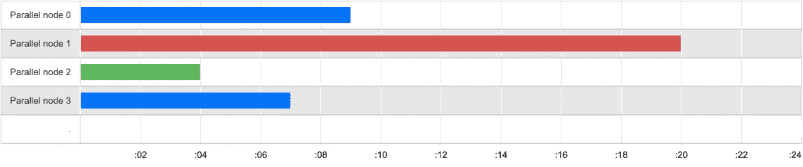
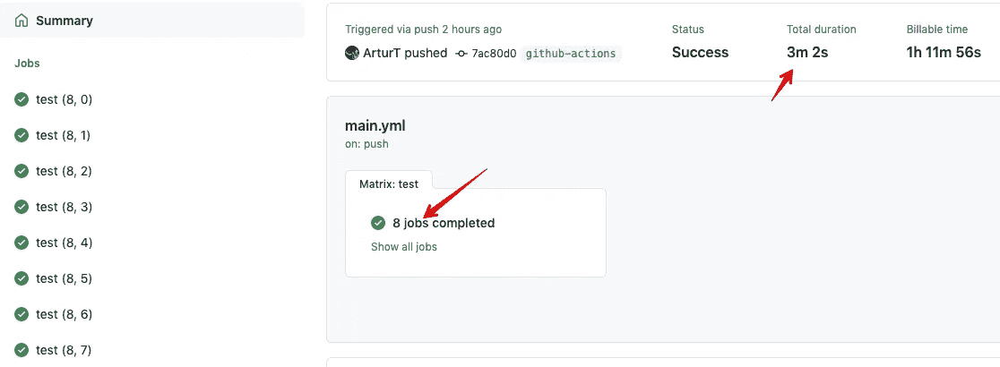

# Github Actions 与 Cucumber BDD 浏览器并行测试

> 原文：<https://itnext.io/github-actions-with-cucumber-bdd-browser-parallel-testing-1be62dda8fc4?source=collection_archive---------4----------------------->

Cucumber 采用行为驱动开发(BDD)来测试您的应用程序。在浏览器中运行时，这种类型的测试通常很耗时。您将学习如何使用并行作业在 Github Actions 上运行 Cucumber 测试，从而更快地执行测试套件。


# Github 行动矩阵战略

您可以使用 [Github 动作矩阵策略](https://docs.github.com/en/actions/reference/workflow-syntax-for-github-actions#jobsjob_idstrategymatrix)来运行并行作业。您将需要在并行作业之间划分您的 Cucumber 测试文件，以便在作业之间平衡工作。

这并不是那么简单，因为黄瓜测试通常需要不同的时间。一个测试文件可以有很多测试用例，另一个可以只有很少但非常复杂的测试用例，等等。

CI 管道中通常有更多的步骤，如安装依赖项、从缓存中加载数据，甚至在 Cucumber 测试开始之前，每个并行作业的每个步骤都可能花费不同的时间。这些步骤会影响整体 CI 构建速度。



您想要实现的是以这样一种方式运行并行作业，它们总是在相似的时间完成 Cucumber 测试的执行。由于这一点，您将避免可能成为 CI 构建瓶颈的滞后工作。


# 使用队列模式动态拆分黄瓜测试

为了获得最佳的 CI 构建执行时间，您需要确保并行作业之间的工作以这样的方式分割，以避免瓶颈缓慢的作业。为了实现这一点，您可以使用[backpack Pro](https://knapsackpro.com/?utm_source=medium&utm_medium=blog_post&utm_campaign=cucumber-bdd-testing-using-github-actions-parallel-jobs-to-run-tests-quicker)队列模式和`knapsack_pro` ruby gem 在并行作业之间动态分割 Cucumber 测试文件。

backpack Pro API 将负责协调如何在并行任务之间划分测试。在 API 端，有一个包含测试文件列表的队列，Github Actions 上的每个并行作业都通过`knapsack_pro` Ruby gem 运行 Cucumber 测试。`knapsack_pro` gem 要求队列 API 运行一组测试文件，在它被执行后，gem 要求另一组测试文件，直到队列被消耗。这确保了所有并行作业在非常相似的时间完成运行测试，以便您可以避免瓶颈作业。


您可以了解更多关于队列模式中的[动态测试套件分割的信息](https://docs.knapsackpro.com/2020/how-to-speed-up-ruby-and-javascript-tests-with-ci-parallelisation)或者查看下面的视频。

# Cucumber 的 Github 操作并行作业配置

这里是一个 Ruby on Rails 项目中 Cucumber 测试套件的完整 Github Actions YAML 配置示例，使用`knapsack_pro` gem 在并行作业之间运行 Cucumber 测试。

```
*# .github/workflows/main.yml*
name: Main

on: [push]

jobs:
  test:
    runs-on: ubuntu-latest

    *# If you need DB like PostgreSQL, Redis then define service below.*
    *#* [*https://github.com/actions/example-services/tree/master/.github/workflows*](https://github.com/actions/example-services/tree/master/.github/workflows)
    services:
      postgres:
        image: postgres:10.8
        env:
          POSTGRES_USER: postgres
          POSTGRES_PASSWORD: ""
          POSTGRES_DB: postgres
        ports:
          - 5432:5432
        *# needed because the postgres container does not provide a healthcheck*
        *# tmpfs makes DB faster by using RAM*
        options: >-
          --mount type=tmpfs,destination=/var/lib/postgresql/data
          --health-cmd pg_isready
          --health-interval 10s
          --health-timeout 5s
          --health-retries 5

      redis:
        image: redis
        ports:
          - 6379:6379
        options: --entrypoint redis-server

    *#* [*https://help.github.com/en/articles/workflow-syntax-for-github-actions#jobsjob_idstrategymatrix*](https://help.github.com/en/articles/workflow-syntax-for-github-actions#jobsjob_idstrategymatrix)
    strategy:
      fail-fast: false
      matrix:
        *# Set N number of parallel jobs you want to run tests on.*
        *# Use higher number if you have slow tests to split them on more parallel jobs.*
        *# Remember to update ci_node_index below to 0..N-1*
        ci_node_total: [8]
        *# set N-1 indexes for parallel jobs*
        *# When you run 2 parallel jobs then first job will have index 0, the second job will have index 1 etc*
        ci_node_index: [0, 1, 2, 3, 4, 5, 6, 7]

    steps:
      - uses: actions/checkout@v2

      - name: Set up Ruby
        uses: actions/setup-ruby@v1
        with:
          ruby-version: 2.7

      - uses: actions/cache@v2
        with:
          path: vendor/bundle
          key: ${{ runner.os }}-gems-${{ hashFiles('**/Gemfile.lock') }}
          restore-keys: |
            ${{ runner.os }}-gems-

      - name: Bundle install
        env:
          RAILS_ENV: test
        run: |
          bundle config path vendor/bundle
          bundle install --jobs 4 --retry 3

      - name: Create DB
        env:
          *# use localhost for the host here because we have specified a container for the job.*
          *# If we were running the job on the VM this would be postgres*
          PGHOST: localhost
          PGUSER: postgres
          RAILS_ENV: test
        run: |
          bin/rails db:prepare

      - name: Run tests
        env:
          PGHOST: localhost
          PGUSER: postgres
          RAILS_ENV: test
          KNAPSACK_PRO_TEST_SUITE_TOKEN_CUCUMBER: ${{ secrets.KNAPSACK_PRO_TEST_SUITE_TOKEN_CUCUMBER }}
          KNAPSACK_PRO_CI_NODE_TOTAL: ${{ matrix.ci_node_total }}
          KNAPSACK_PRO_CI_NODE_INDEX: ${{ matrix.ci_node_index }}
          KNAPSACK_PRO_FIXED_QUEUE_SPLIT: true
          KNAPSACK_PRO_LOG_LEVEL: info
        run: |
          bundle exec rake knapsack_pro:queue:cucumber
```

这里是来自 Github Actions 的视图，显示我们为 CI 构建运行 8 个并行作业。



# 摘要

我希望这个例子对你有用。如果你想了解更多关于[backpack Pro 的信息，请查看我们的主页](https://knapsackpro.com/?utm_source=medium&utm_medium=blog_post&utm_campaign=cucumber-bdd-testing-using-github-actions-parallel-jobs-to-run-tests-quicker)并查看一个列表，上面有[支持的 Ruby、JavaScript 等并行测试的测试运行程序](https://docs.knapsackpro.com/integration/)。


*原载于 2021 年 3 月 3 日*[*https://docs.knapsackpro.com*](https://docs.knapsackpro.com/2021/cucumber-bdd-testing-using-github-actions-parallel-jobs-to-run-tests-quicker)*。*