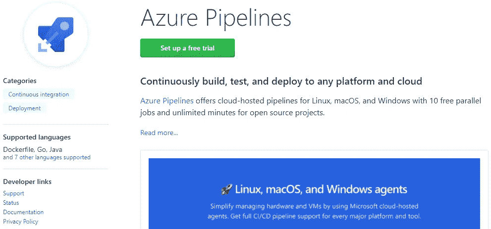
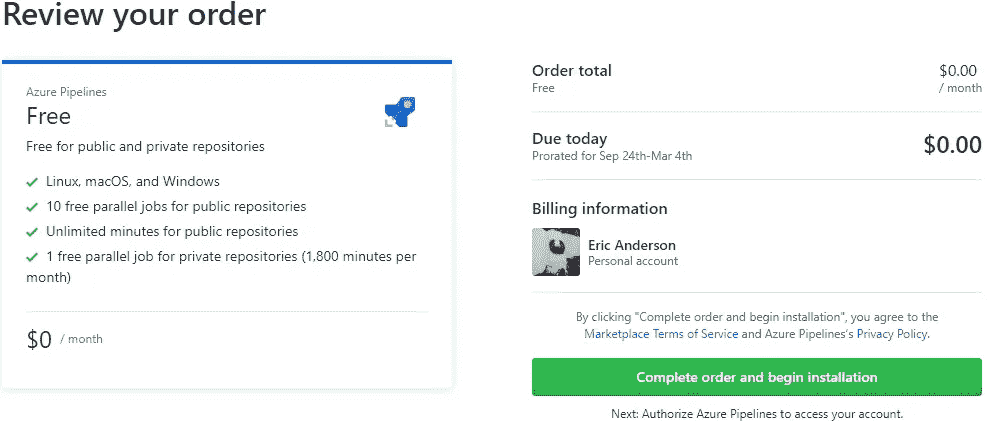
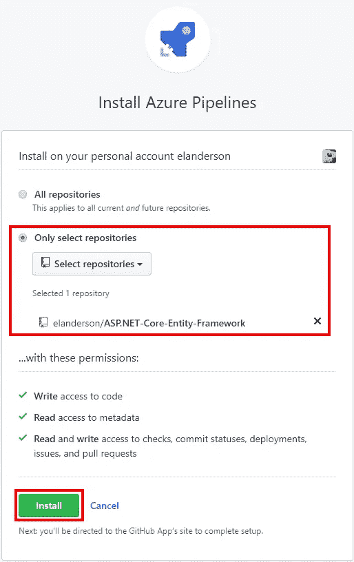
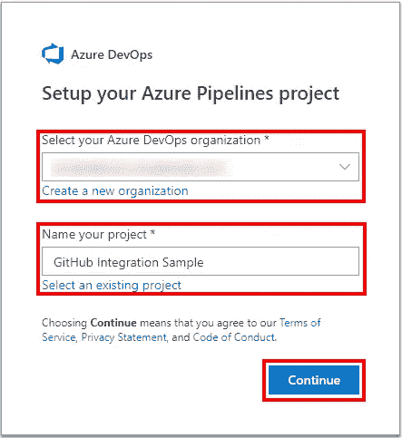
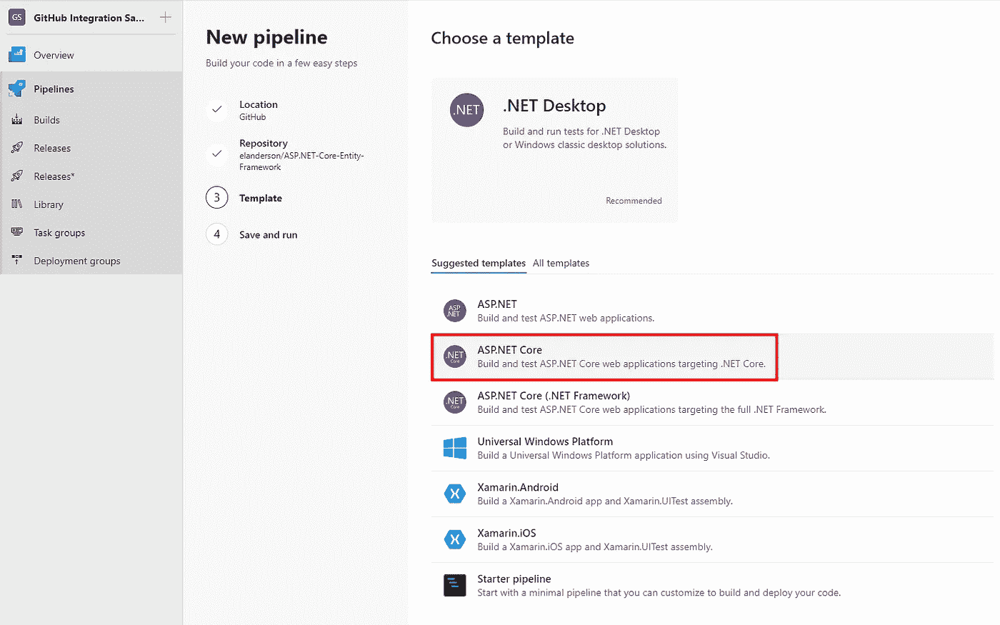
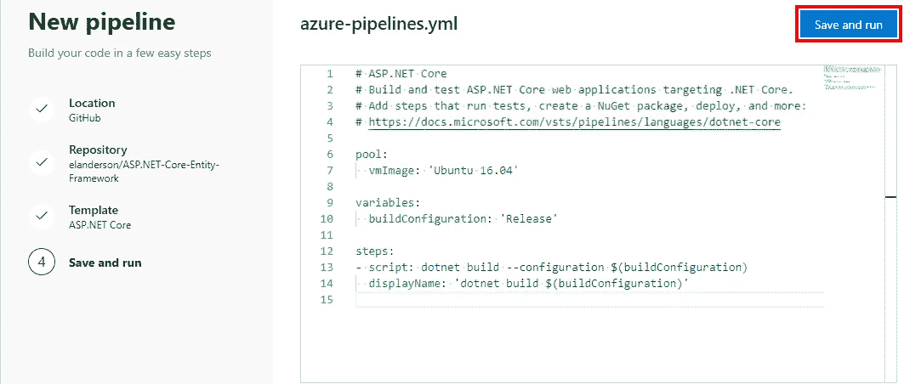
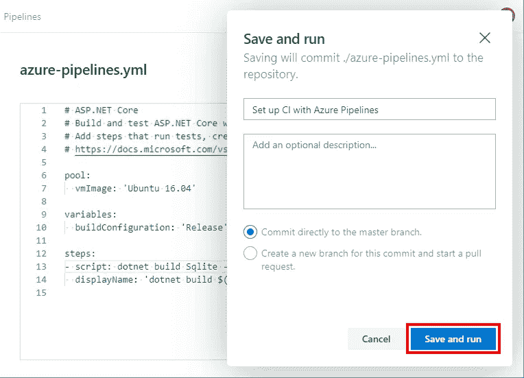
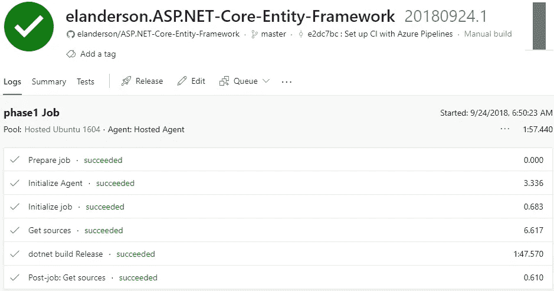

# GitHub 和 Azure 管道

> 原文：<https://itnext.io/github-and-azure-pipelines-25698e1c178b?source=collection_archive---------4----------------------->

几周前，微软宣布 Visual Studio Team Services 将被一系列品牌为 [Azure DevOps](https://azure.microsoft.com/en-us/blog/introducing-azure-devops/) 的服务所取代/更名。构成 Azure DevOps 的服务之一是 [Azure Pipelines](https://azure.microsoft.com/en-us/services/devops/pipelines/) ，它为 Windows、Linux 和 Mac 上的大量语言提供了持续集成和持续交付的平台。

作为这一变化的一部分，Azure Pipelines 现在可以在 GitHub 市场上使用。在这篇文章中，我将选择一个我现有的回购，看看我是否可以使用 Azure 管道从 GitHub 构建它。我确信微软或 GitHub 有文档，但我是在没有外部资源的情况下尝试的。

## GitHub 市场

确保您有一个 GitHub 帐户，其中包含您想要构建的回购。在这篇文章中，我将使用我的[ASP.NET 核心实体框架](https://github.com/elanderson/ASP.NET-Core-Entity-Framework)回购。现在你已经有了基本的准备，前往 [GitHub 市场](https://github.com/marketplace)搜索 Azure Pipelines 或者点击[这里](https://github.com/marketplace/azure-pipelines)。

滚动到页面底部的[定价和设置](https://github.com/marketplace/azure-pipelines/plan/MDIyOk1hcmtldHBsYWNlTGlzdGluZ1BsYW4xMTk0#pricing-and-setup)部分。有一个付费选项是默认选项。单击免费选项，然后单击免费安装。

在下一页，您将看到订单摘要。单击完成订购并开始安装按钮。

在下一页，您可以选择将安装应用到哪个仓库。对于这篇文章，我将选择一个单一的回购。在 repos 上做出选择后，单击安装按钮。

## Azure DevOps

单击“安装”后，您将进入 Microsoft 的帐户授权/创建过程。获得授权后，你将进入 Azure 设置过程的第一步。您需要选择一个组织和一个项目才能继续。如果您还没有这些设置，可以选择创建它们。

流程完成后，您将进入新管道创建流程，在此您需要选择要使用的回购。点击您想要使用的回购协议将进入下一步。

下一步是模板选择。我的示例是一个 ASP.NET 核心应用程序，所以我选择了 ASP.NET 核心模板。选择模板将使您进入下一步。

下一页将向您展示一个基于您选择的模板的 yaml 文件。对您的项目进行任何需要的更改(我的 repo 有两个项目，所以我必须更改构建以指向我想要构建的项目)。

接下来，会提示您将 yaml 文件提交到源代码控制。选择您的选项，然后单击保存并运行。

保存配置后，一个构建将被排队。如果一切顺利，你会看到你的应用程序正在建立。如果一切正常，您将会看到类似这样的构建结果页面。

## 包扎

GitHub 和微软在这种整合上做得非常好。我对设置的流畅程度感到惊讶。看到我在 Windows 上创建的项目在 Linux 上构建也很棒。

如果你在 GitHub 上有一个公共回购，并且需要一种方法来构建，那么试试 Azure Pipelines 吧。

*原载于***。**