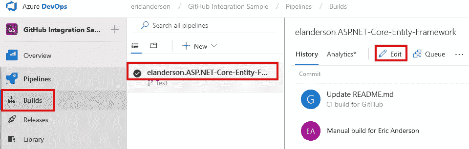
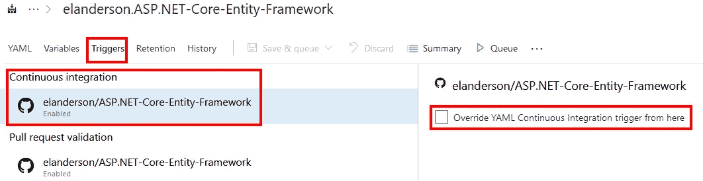
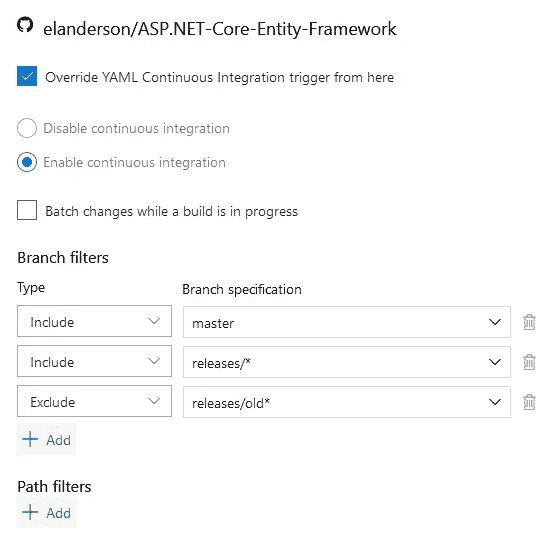

# GitHub 和 Azure 管道:构建触发器

> 原文：<https://itnext.io/github-and-azure-pipelines-build-triggers-d7f36dcf73c4?source=collection_archive---------3----------------------->

作为对我在 [GitHub 和 Azure Pipelines](https://elanderson.net/2018/10/github-and-azure-pipelines/) 上的帖子的回应，我在 Reddit 上收到了以下[问题](https://www.reddit.com/r/github/comments/9sbdmm/github_and_azure_pipelines/)。

> 这是自动检测分支吗？从你的截图来看，你是建筑大师。如果复制到特征 A，是否会自动创建和构建新管线？

当我最初回答这个问题时，我回答得不够深入。对于新管道是否会自动创建和构建，我的回答是否定的，但我认为这个问题的意图是，我是否必须在每次创建新分支时都设置一个新管道，答案也是否定的。默认情况下，当任何分支上签入任何更改时，都会触发现有管道。请注意，只有当变更被检入时，才创建分支，这不会被触发。

## 限制构建

有几种方法可以控制什么分支触发持续集成构建。第一种是通过在 repo 中编辑 **azure-pipeline.yml** 文件，第二种是通过 Azure Pipeline 中的覆盖。

YAML

官方的[构建管道触发器](https://docs.microsoft.com/en-us/azure/devops/pipelines/build/triggers?view=vsts&tabs=yaml)文档确实很好，但是我将在这里涵盖包括分支和排除分支的基本内容。有关路径包含/排除以及如何控制 PR 验证的信息，请查看文档。这里的一个例子是 yaml 文件，用于定义这个 repo 中的一个构建。

```
pool:
  vmImage: 'Ubuntu 16.04'

variables:
  buildConfiguration: 'Release'

steps:
- script: dotnet build Sqlite --configuration $(buildConfiguration)
  displayName: 'dotnet build $(buildConfiguration)'
```

为了控制构建什么分支，我们需要添加一个**触发器**部分。最有趣的例子是列出您想要构建的分支。允许使用结束通配符。参见下面的例子(摘自官方文件的触发部分)。

```
pool:
  vmImage: 'Ubuntu 16.04'

variables:
  buildConfiguration: 'Release'

steps:
- script: dotnet build Sqlite --configuration $(buildConfiguration)
  displayName: 'dotnet build $(buildConfiguration)'

trigger:
- master
- releases/*
```

这将在 releases 下构建 master 和所有分支，但不会构建其他的。下面显示了如何一起使用 includes 和 excludes。再次，触发器部分取自官方文件。

```
pool:
  vmImage: 'Ubuntu 16.04'

variables:
  buildConfiguration: 'Release'

steps:
- script: dotnet build Sqlite --configuration $(buildConfiguration)
  displayName: 'dotnet build $(buildConfiguration)'

trigger:
  branches:
    include:
    - master
    - releases/*
    exclude:
    - releases/old*
```

这将建立主版本和所有不从旧版本开始的版本。真的去读一下关于这个的官方文件，看看所有的细节。

天蓝色管道

要从 Azure DevOp 覆盖 CI 构建，请转到有问题的构建，然后单击**编辑**。



接下来，选择**触发器**和**持续积分**，勾选**超控 YAML** 。



检查覆盖后，你会看到更多的选项亮起。正如您在下面的屏幕截图中看到的，相同的包含和排除选项可用于相同的通配符选项。



## 包扎

如你所见，Azure Pipelines 在如何触发构建方面提供了很多灵活的能力。除了我在这里介绍的以外，还有一些选项可以设置预定的构建，以及在一个构建完成时触发另一个构建。如果你遇到了无法涵盖的情况，我很乐意在评论中听到。

*原载于* [*埃里克·安德森*](https://elanderson.net/2018/12/github-and-azure-pipelines-build-triggers/) *。*