# Github: Github 操作概述和 ArgoCD 部署示例

> 原文：<https://itnext.io/github-github-actions-overview-and-argocd-deployment-example-b6cf0cf6f832?source=collection_archive---------5----------------------->


[Github Actions](https://github.com/features/actions) 实际上与 [TravisCI](https://rtfm.co.ua/category/ci-cd-ru/travis-ru/) 非常相似，但与 Github 的集成更加紧密，甚至其接口也包含在 Github WebUI 中:

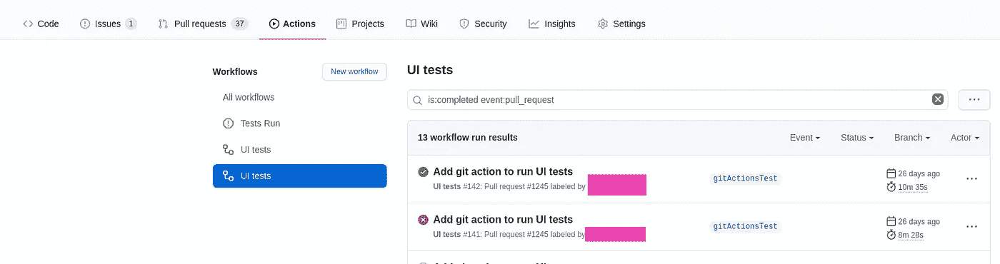

因此，让我们仔细看看它的能力，如何使用它，在下面的帖子中，我们将把它的自托管运行器部署到一个 Kubernetes 集群，并将使用 Github Actions 和 [ArgoCD](https://rtfm.co.ua/tag/argocd/) 构建一个 CI/CD 管道来部署应用程序。

*   [Github 动作定价](https://rtfm.co.ua/en/github-github-actions-overview-and-argocd-deployment-example/#Github_Actions_pricing)
*   [Github 操作:概述](https://rtfm.co.ua/en/github-github-actions-overview-and-argocd-deployment-example/#Github_Actions_an_overview)
*   [工作流文件结构](https://rtfm.co.ua/en/github-github-actions-overview-and-argocd-deployment-example/#A_workflow_file_structure)
*   [入门:创建工作流文件](https://rtfm.co.ua/en/github-github-actions-overview-and-argocd-deployment-example/#Getting_started_Creating_workflow_file)
*   [事件](https://rtfm.co.ua/en/github-github-actions-overview-and-argocd-deployment-example/#Events)
*   [手动触发—工作流 _ 调度](https://rtfm.co.ua/en/github-github-actions-overview-and-argocd-deployment-example/#Manual_trigger_-_workflow_dispatch)
*   [工作流程输入](https://rtfm.co.ua/en/github-github-actions-overview-and-argocd-deployment-example/#Workflow_inputs)
*   Webhooks:创建
*   [环境变量](https://rtfm.co.ua/en/github-github-actions-overview-and-argocd-deployment-example/#Environment_variables)
*   [秘密](https://rtfm.co.ua/en/github-github-actions-overview-and-argocd-deployment-example/#Secrets)
*   [条件和如果](https://rtfm.co.ua/en/github-github-actions-overview-and-argocd-deployment-example/#Conditions_and_if)
*   [需求—工作依赖](https://rtfm.co.ua/en/github-github-actions-overview-and-argocd-deployment-example/#needs_-_jobs_dependency)
*   [行动](https://rtfm.co.ua/en/github-github-actions-overview-and-argocd-deployment-example/#Actions)
*   [一个 ArgoCD 应用](https://rtfm.co.ua/en/github-github-actions-overview-and-argocd-deployment-example/#An_ArgoCD_application)
*   [ArgoCD 的 Github 动作工作流程](https://rtfm.co.ua/en/github-github-actions-overview-and-argocd-deployment-example/#Github_Actions_workflow_for_ArgoCD)

# Github 操作定价

这里的文档是[>>>](https://docs.github.com/en/github/setting-up-and-managing-billing-and-payments-on-github/about-billing-for-github-actions)。

GitHub Actions 对所有帐户类型都是免费的，但有一些限制:

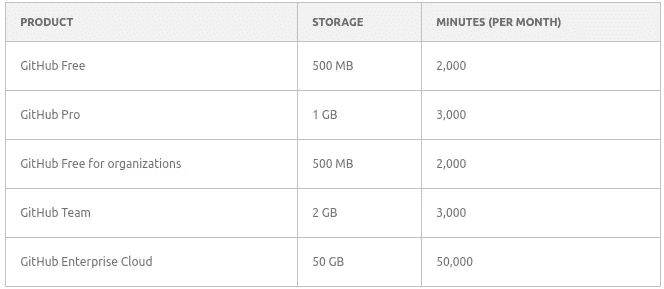

例如，我们的项目使用 GitHub 团队，因此我们每月可以有 2gb 和 3000 分钟。

因此，Linux、macOS 和 Windows 的分钟数不同:

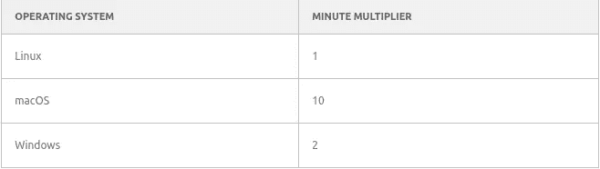

也就是说，在我们总共 3000 分钟的时间里，如果我们使用 macOS 代理，我们只能使用 300 分钟，每多花一分钟就要额外付费:


此外，Github 操作可以在 Github Cloud 中工作，并作为[自托管运行器](https://docs.github.com/en/actions/hosting-your-own-runners/about-self-hosted-runners)，这可以解决访问您的安全资源的问题，因为 Github 没有静态 IP 范围，所以您无法配置您的安全组/防火墙。

[Github 建议](https://docs.github.com/en/actions/using-github-hosted-runners/about-github-hosted-runners#ip-addresses)定期下载带有更新网络的 json 文件(顺便说一句，Github Actions 正在开发 [Microsoft Azure](https://rtfm.co.ua/azure-pochemu-nikogda/) )，但是我懒得创建一些额外的自动化来更新安全配置。

# Github 操作:概述

在动作中，构建流程如下(参见[GitHub 动作简介](https://docs.github.com/en/actions/learn-github-actions/introduction-to-github-actions)):

1.  一个*事件*(例如，一个拉取请求或者提交到一个存储库，参见这里的完整列表[>>>](https://docs.github.com/en/actions/reference/events-that-trigger-workflows))触发一个*工作流*，它包含*作业*
2.  一个*作业*包含一系列*步骤*，每个步骤由一个或多个*动作*组成
3.  *动作*在*转轮*上运行，一个工作流的多个动作可以同时运行

主要组件包括:

*   *runner* :运行在 Github Cloud 上或者自托管的服务器，它将执行一个作业
*   工作流:YAML 描述的一个过程，包括一个或多个任务，由一个事件触发
*   *作业*:在同一个转轮上运行的一组步骤。如果一个工作流有多个作业，默认情况下，它们将并行启动，但也可以配置为相互依赖
*   *步骤*:з执行普通命令的任务或*动作*。由于同一个作业的步骤在同一个运行器上运行，它们可以相互共享数据。
*   *动作*:主“执行块”——可以是一组已经准备好的任务，或者运行简单的命令

## 工作流文件结构

简而言之，让我们看看工作流文件是如何构建的:

*   `name`:工作流程名称
*   `on`:将触发此工作流的事件
*   `jobs`:该工作流的任务列表
*   `<JOB_NAME>`
*   `runs-on`:执行作业的运行程序
*   `steps`:该工作中需要用`uses`或`run`执行的任务
*   `uses`:一个*动作*执行
*   `run`:要执行的命令

## 入门:创建工作流文件

让我们从一个简单的文件开始，看看它是如何工作的。

在您存储库根目录下创建一个名为`.github/workflows/`的目录——在这里我们将存储所有的工作流，这些工作流可以被不同的事件触发:

```
$ mkdir -p .github/workflows
```

在这个目录中，为您的流创建一个文件，例如，命名为`.github/workflows/actions-test.yaml`:

```
name: actions-test
on: [push]
jobs:
  print-hello:
    runs-on: ubuntu-latest
    steps:
      - run: echo "Hello, world"
```

保存并推送到 Github:

```
$ git add .github/workflows/actions-test.yaml && git commit -m “Test flow” && git push
```

转到 Github WebUI，切换到 Actions 选项卡，您会看到这个工作流的执行:

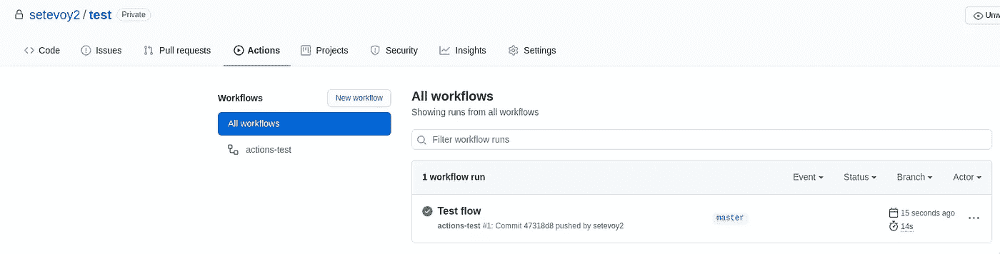

## 事件

在事件中，您可以描述运行该流的条件。

这样的条件可以是对存储库的 pull 请求或提交、时间表，或者 Github 之外的一些事件，这些事件将运行一个指向存储库的 webhook。

此外，您可以为存储库的不同分支配置这些条件:

```
name: actions-test
on: 
  push:
    branches:
      - master
  pull_request:
    branches:
      - test-branch
...
```

或者使用 cronjob，参见[预定事件](https://docs.github.com/en/actions/reference/events-that-trigger-workflows#scheduled-events):

```
name: actions-test
on: 
  schedule:
    - cron: '* * * *'
```

## 手动触发— `workflow_dispatch`

此外，您可以通过使用`on`中的`[workflow_dispatch](https://docs.github.com/en/developers/webhooks-and-events/webhook-events-and-payloads#workflow_dispatch)`来配置手动执行工作流的能力:

```
name: actions-test
on: 
   workflow_dispatch
jobs:
  print-hello:
    runs-on: ubuntu-latest
    steps:
      - run: echo "Hello, world"
```

之后，在操作中，您将获得一个按钮来运行该流程:

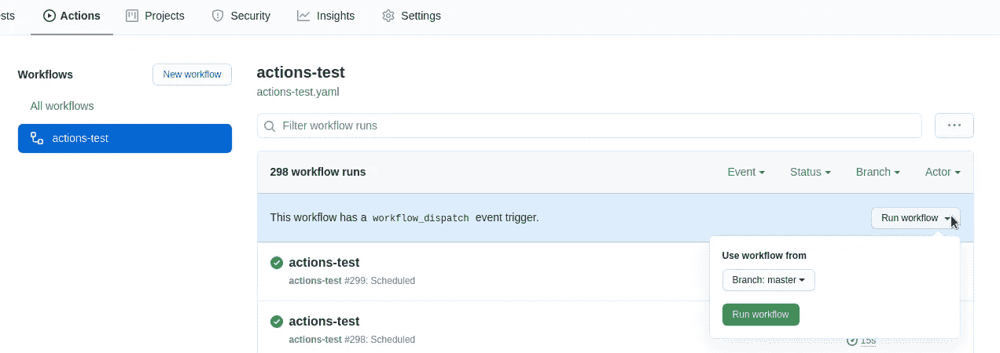

## 工作流程`inputs`

在您的工作流程中，您还可以添加一些`[inputs](https://docs.github.com/en/actions/learn-github-actions/finding-and-customizing-actions#using-inputs-and-outputs-with-an-action)`，它们将通过`[github.event](https://help.github.com/en/actions/reference/context-and-expression-syntax-for-github-actions#github-context)`上下文作为变量出现在步骤中:

```
name: actions-test
on: 
   workflow_dispatch:
     inputs:
       userName:
         description: "Username"
         required: true
         default: "Diablo"
jobs:
  print-hello:
    runs-on: ubuntu-latest
    steps:
      - run: echo "Username: ${{ github.event.inputs.username }}"
      - run: echo "Actor's username: ${{ github.actor }}"
```

这里，在`${{ github.event.inputs.username }}`中，我们获得了`workflow_dispatch.inputs.userName`的值，在`[github.actor](https://docs.github.com/en/actions/reference/context-and-expression-syntax-for-github-actions#github-context)`中，我们接收了 Github 操作元数据:

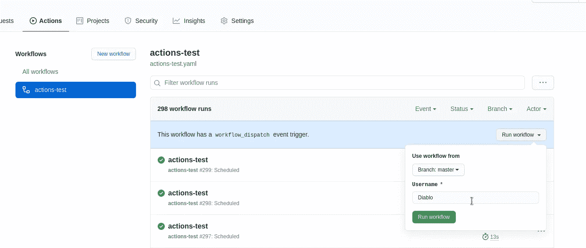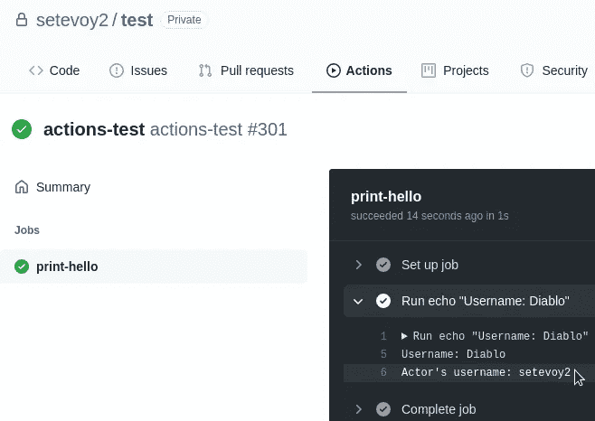

一个用例可以是，例如，传递 Docker 图像标签以与 ArgoCD 一起部署。

## Webhooks: `create`

除了我们在上面使用的`push`之外，我们可以在存储库中的任何其他事件上配置我们的工作流。

参见 [Webhook 事件](https://docs.github.com/en/actions/reference/events-that-trigger-workflows#webhook-events)中的完整列表。

作为另一个例子，让我们使用`[create](https://docs.github.com/en/actions/reference/events-that-trigger-workflows#create)`将我们的流配置为在创建新的分支或标签时运行:

```
name: actions-test
on: 
  create
jobs:
  print-hello:
    runs-on: ubuntu-latest
    steps:
      - run: |
          echo "Event name: ${{ github.event_name }}"
          echo "Actor's username: ${{ github.actor }}"
```

这里的`${{ github.event_name }}`用于显示触发器名称。

创建一个新分支并推动它:

```
$ git checkout -b a-new-branch
Switched to a new branch ‘a-new-branch’
$ git push -u origin a-new-branch
```

检查:

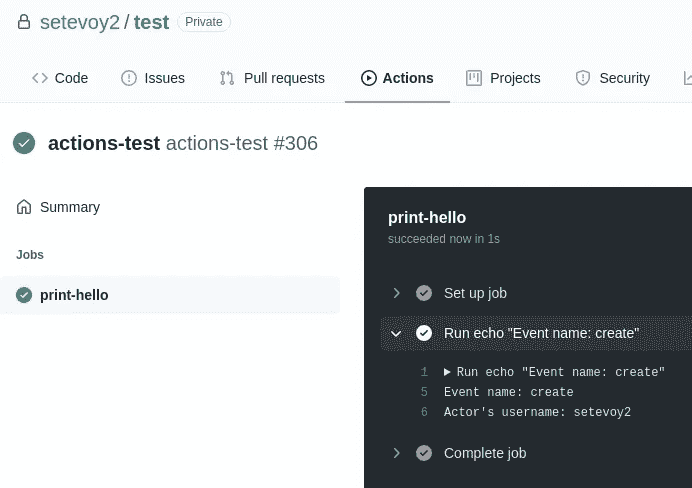

## 环境变量

此外，Github Actions 支持工作流中的环境变量。

有一个默认变量的列表，参见[默认环境变量](https://docs.github.com/en/actions/reference/environment-variables#default-environment-variables)，您可以在工作流级别、作业级别、每个作业或每个步骤创建自己的变量。

在此期间，注意你以不同的方式访问变量，参见[关于环境变量](https://docs.github.com/en/actions/reference/environment-variables#about-environment-variables):

*   *上下文变量* — `${{ env.VARNAME }}`:在将工作流文件发送给运行器之前，将在工作流文件预处理期间设置一个值，在除了`run`之外的任何地方使用它，例如在`if`条件中(将在下面讨论)
*   *环境变量* — `$VARNAME`:运行程序上的`run`在任务执行过程中会设置一个值
*   要在作业执行期间创建自己的变量，请使用默认`$GITHUB_ENV`变量中设置的特定文件

变量示例:

```
name: vars-test

on:
  push

env:
  VAR_NAME: "Global value"

jobs:
  print-vars:
    runs-on: ubuntu-latest
    steps:

      # using own varibales
      - name: "Test global var as $VAR_NAME"
        run: echo "Test value $VAR_NAME"

      - name: "Test global var as ${{ env.VAR_NAME }}"
        run: echo "Test value ${{ env.VAR_NAME }}"

      # using default variables
      - name: "Test job var as $GITHUB_REPOSITORY"
        run: echo "Test value $GITHUB_REPOSITORY"

      # this will be empty, as default variables are not in the context
      - name: "Test job var as ${{ env.GITHUB_REPOSITORY }}"
        run: echo "Test value ${{ env.GITHUB_REPOSITORY }}"

      # using 'dynamic' variables
      - name: "Set local var"
        run: echo "local_var=local value" >> $GITHUB_ENV

      - name: "Print local var as $local_var"
        run: echo "$local_var"

      - name: "Print local var as ${{ env.local_var }}"
        run: echo "${{ env.local_var }}"
```

和结果:

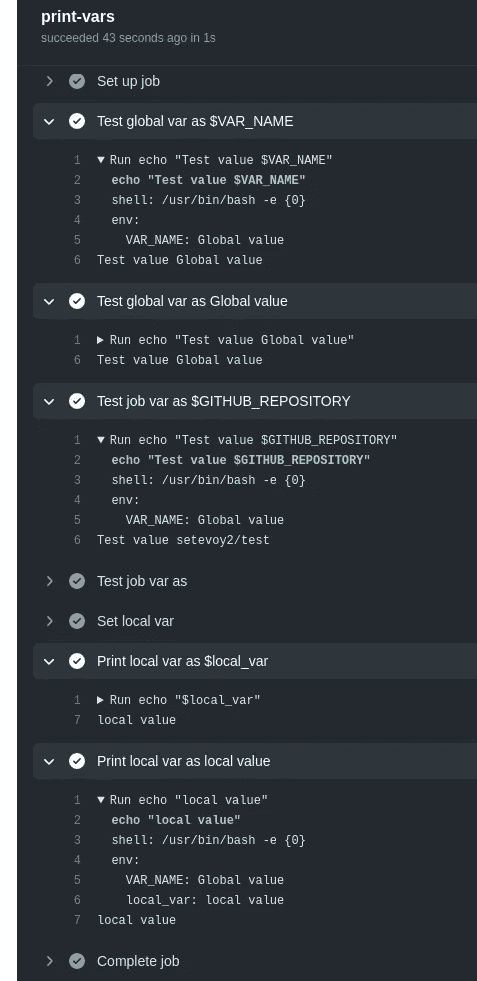

## 秘密

这里的文献资料是[>>>](https://docs.github.com/en/actions/reference/encrypted-secrets)。

可以在存储库中添加秘密*设置>秘密*:

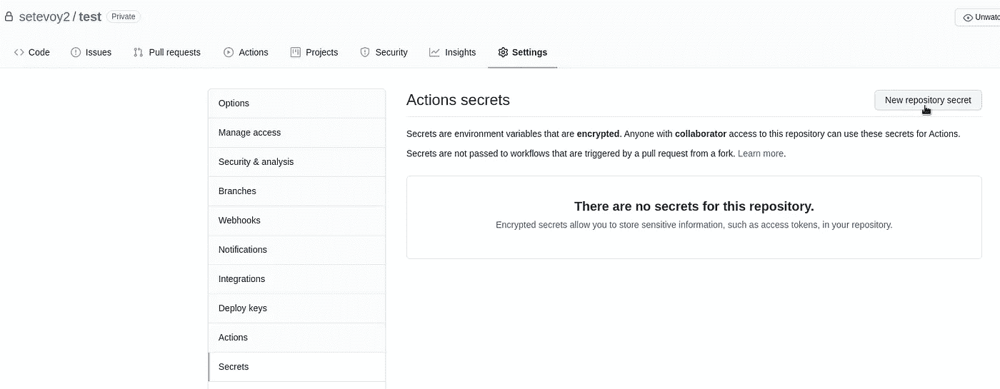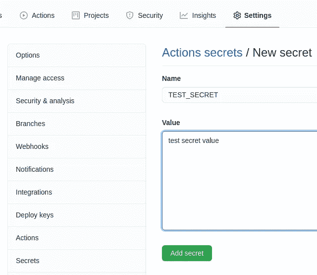

现在，在工作流中添加它的使用。一个秘密可以通过`${{ secret.SECRETNAME }}`直接被例化或者可以被设置为一个变量:

```
name: actions-test

on: 
  push

env:
  TEST_ENV: ${{ secrets.TEST_SECRET }}

jobs:
  print-hello:
    runs-on: ubuntu-latest
    steps:
      - run: |
          echo "Test secret: ${{ secrets.TEST_SECRET }}"
          echo "Test secret: ${{ env.TEST_ENV }}"
```

运行流程:

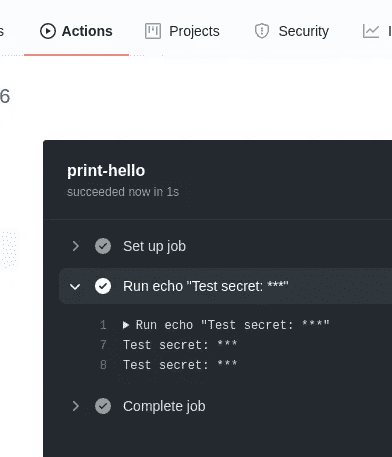

## 条件和`if`

Github Actions 通过使用`if`运算符后跟一个表达式来支持作业的条件检查，参见[关于上下文和表达式](https://docs.github.com/en/actions/reference/context-and-expression-syntax-for-github-actions#about-contexts-and-expressions)。

一个例子:

```
name: actions-test

on:
  push

jobs:
  print-hello:
    runs-on: ubuntu-latest
    steps:

      - id: 'zero'
        run: echo "${{ github.actor }}"

      - id: 'one'
        run: echo "Running because of 'github.actor' contains a 'setevoy' string"
        if: "contains(github.actor, 'setevoy')"

      # this will not run
      - id: 'two'
        run: echo "Skipping because of 'github.actor' contains a 'setevoy' string"
        if: "!contains(github.actor, 'setevoy')"

      - id: 'three'
        run: echo "Running because of Step Two was skipped"
        if: steps.two.conclusion == 'skipped'

      - id: 'four'
        run: echo "Running because of commit message was '${{ github.event.commits[0].message }}'"
        if: contains(github.event.commits[0].message, 'if set')

      - id: 'five'
        run: echo "Running because of previous Step was successful and the trigger event was 'push'"
        if: success() && github.event_name == 'push'
```

这里，我们使用`[github](https://docs.github.com/en/actions/reference/context-and-expression-syntax-for-github-actions#github-context)` [上下文](https://docs.github.com/en/actions/reference/context-and-expression-syntax-for-github-actions#github-context)、`[contains()](https://docs.github.com/en/actions/reference/context-and-expression-syntax-for-github-actions#contains)`函数、`!=`、`&&`、[运算符](https://docs.github.com/en/actions/reference/context-and-expression-syntax-for-github-actions#operators)和`[steps](https://docs.github.com/en/actions/reference/context-and-expression-syntax-for-github-actions#steps-context)`、[上下文](https://docs.github.com/en/actions/reference/context-and-expression-syntax-for-github-actions#steps-context)来检查条件。

结果将是:

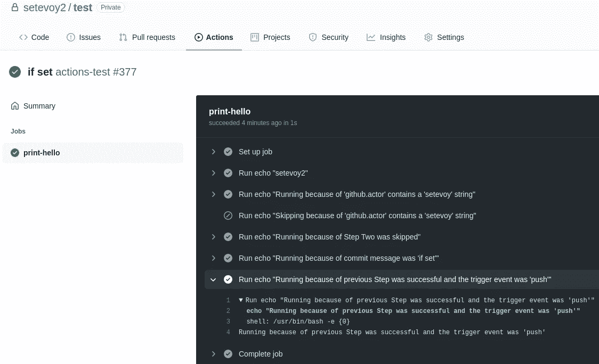

## `needs` -工作依赖

除了步骤中的`if: success()`之外，您还可以通过使用`[needs](https://docs.github.com/en/actions/reference/workflow-syntax-for-github-actions#jobsjob_idneeds)`来添加相互依赖的作业:

```
name: actions-test

on: 
  push

jobs:

  init:
    runs-on: ubuntu-latest
    steps:
      - run: echo "An init job"

  build:
    runs-on: ubuntu-latest
    steps:
      - run: echo "A build job" && exit 1
    needs: 'init'

  deploy:
    runs-on: ubuntu-latest
    steps:
      - run: echo "A deploy job"
    if: always()
    needs: ['init', 'build']
```

这里，在*构建*作业中，我们等待*初始化*作业完成，在*部署*作业中，我们等待*初始化*和*构建*，通过使用`if: always()`，我们已经设置运行*部署*作业，而不管依赖作业的执行结果如何:

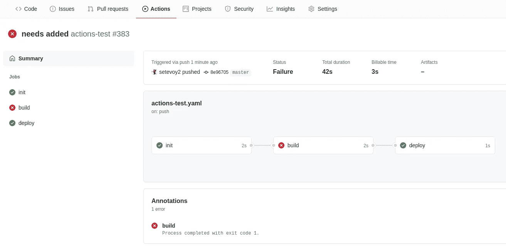

# 行动

最后要看的是 Github 动作的主要组成部分——动作。

Actions 允许我们使用已经存在的来自 Github Actions Marketplace 的脚本和工具，或者来自 Docker Hub 的 Docker 图片。

参见[查找和定制动作](https://docs.github.com/en/actions/learn-github-actions/finding-and-customizing-actions)。

在下面的例子中，我们将使用 [actions/checkout@v2](https://github.com/actions/checkout) 来克隆一个存储库 roo a runner-agent，并使用[ome gion/argocd-app-actions](https://github.com/marketplace/actions/argocd-application-sync-action)来同步 ArgoCD 应用程序(详见 [ArgoCD:概述、SSL 配置和应用程序部署](https://rtfm.co.ua/en/argocd-an-overview-ssl-configuration-and-an-application-deploy/)帖子)。

## ArgoCD 应用程序

让我们创建一个测试应用程序:

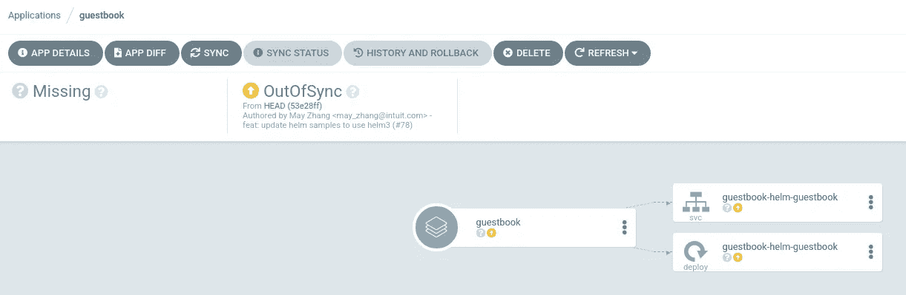

更新`argocd-cm`配置图，因为默认情况下*管理员*用户无权使用 ArgoCD 令牌(不要在生产环境中执行此操作！：

```
...
data:
  accounts.admin: apiKey,login
...
```

登录:

```
$ argocd login dev-1–18.argocd.example.com
Username: admin
Password:
‘admin’ logged in successfully
Context ‘dev-1–18.argocd.example.com’ updated
```

创建令牌:

```
$ argocd account generate-token
eyJ***3Pc
```

## ArgoCD 的 Github 操作工作流

使用此令牌添加密码:

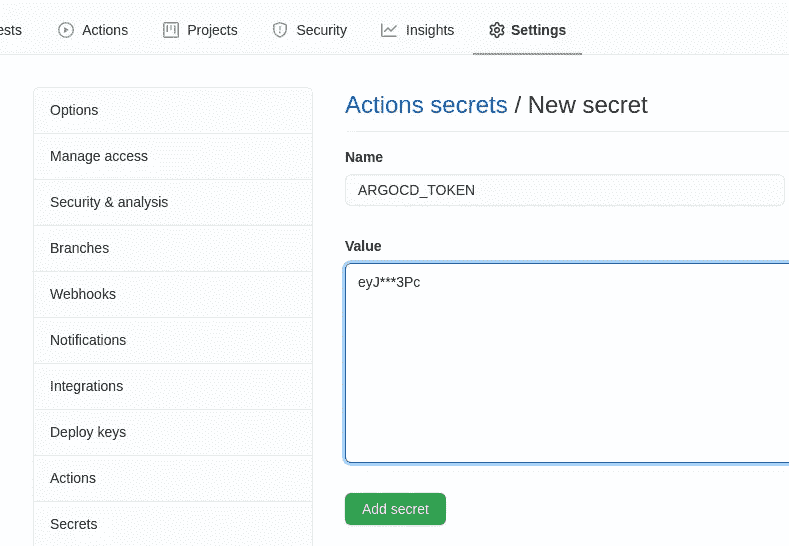

创建新的工作流程:

```
name: "ArgoCD sync"
on: "push"
jobs:
  build:
    runs-on: ubuntu-latest
    steps:

      - name: "Clone reposiory"
        uses: actions/checkout@v2
        with:
          repository: "argoproj/argocd-example-apps.git"
          ref: "master"

      - name: "Sync ArgoCD Application"
        uses: omegion/argocd-app-actions@master
        with:
          address: "dev-1-18.argocd.example.com"
          token: ${{ secrets.ARGOCD_TOKEN }}
          appName: "guestbook"
```

将其推送到一个存储库，并检查其执行情况:

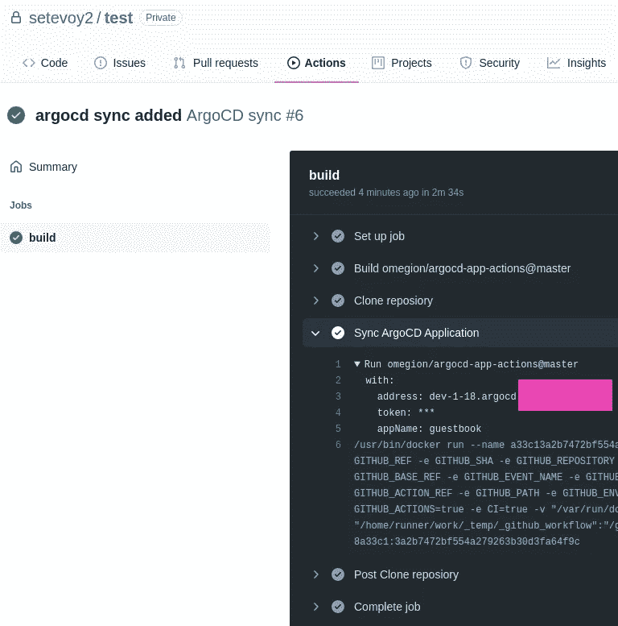

ArgoCD 中的应用程序现在是同步的:

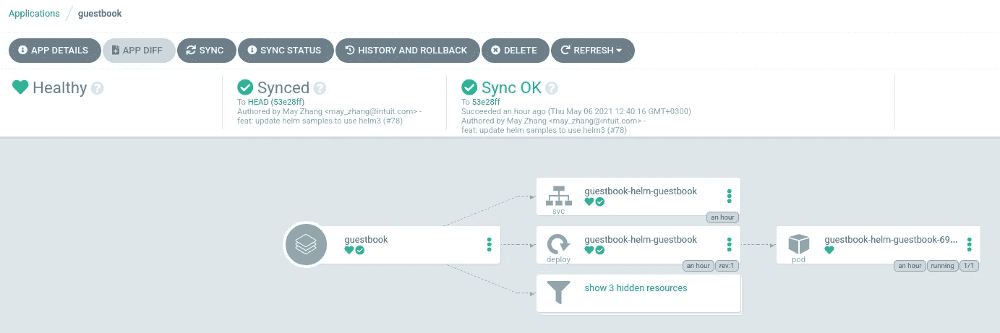

完成了。

*最初发布于* [*RTFM: Linux、DevOps、系统管理*](https://rtfm.co.ua/en/github-github-actions-overview-and-argocd-deployment-example/) *。*