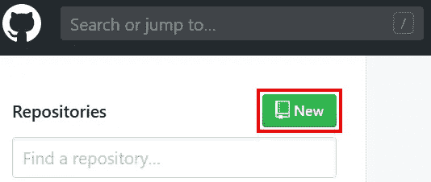
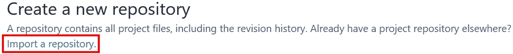
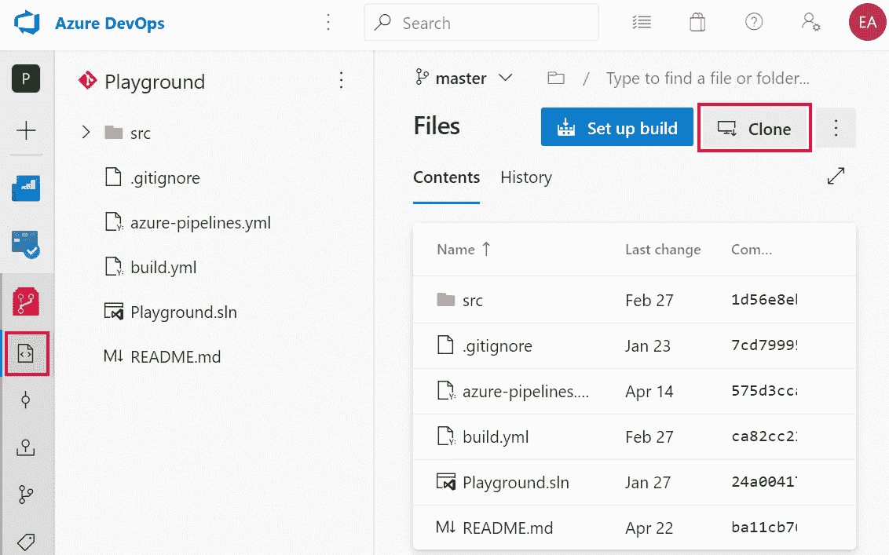
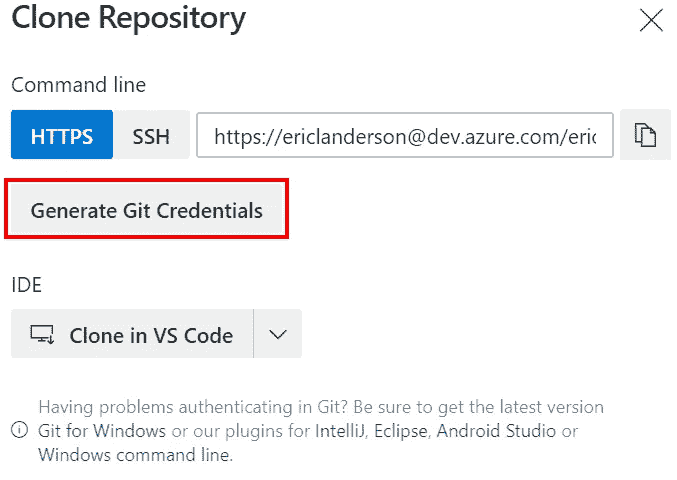
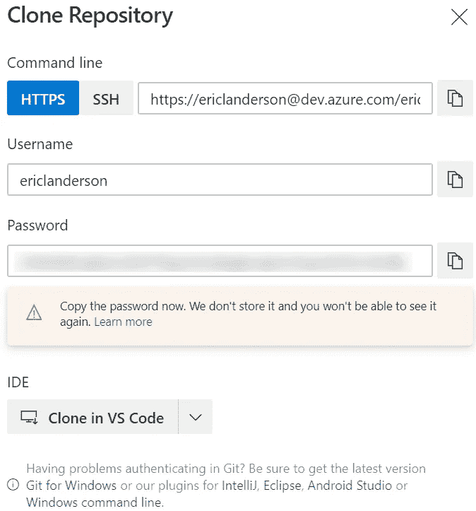
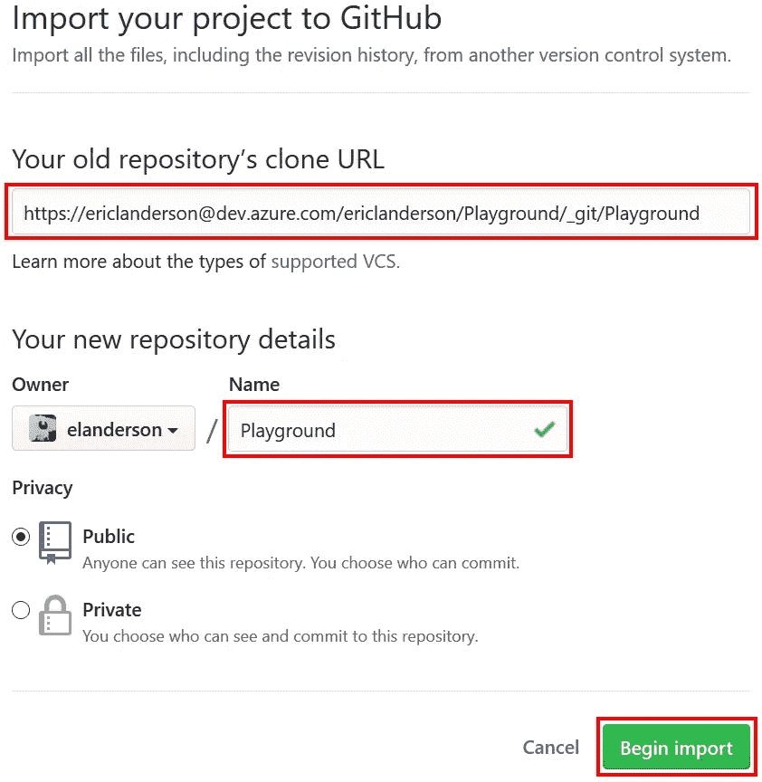
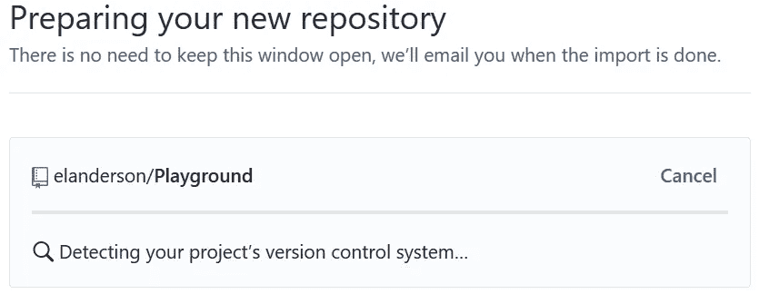
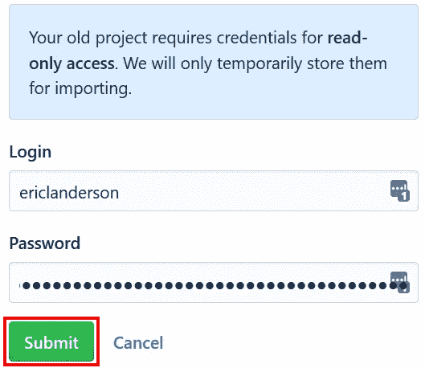
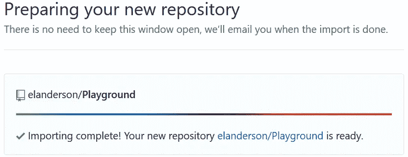

# GitHub:导入 Azure DevOps Repo

> 原文：<https://itnext.io/github-import-an-azure-devops-repo-1a3eb27ab06a?source=collection_archive---------3----------------------->

在过去的几个月里，我们一直在探索围绕[管道](https://elanderson.net/tag/azure-pipelines/)和[回购](https://elanderson.net/tag/azure-repos/)的 [Azure DevOps](https://elanderson.net/tag/azure-devops/) 的一些特性。我觉得用 GitHub 而不是 Azure DevOps 来看看相同类型的设置和流程会是什么样子会很有趣。我以前除了基本的回购之外没有使用过 GitHub，所以我不确定 Azure DevOps 帖子将会继续使用多少，但我们会找到答案的。在第一篇文章中，我们将从 Azure DevOps repo 中导入我们在 Azure DevOps 系列中使用的 Repo。

## 导入回购

要在项目中启动，请在您的 [GitHub](https://github.com/) 仪表板的**存储库**部分中单击**新建**按钮。

在下一页上，单击**导入存储库**链接。

导入过程想要知道的第一件事是旧存储库的 URL。要获得这一点，我们需要前往我们的 Azure DevOps 回购。一旦进入 Azure DevOps Repo，单击**克隆**按钮。

当克隆对话框显示时，您将看到 URL，但在复制 URL 之前，点击**生成 Git 凭证**按钮。这将创建一个用户名和密码，我们在 GitHub 导入回购时也需要输入。

以下是生成凭证后的对话框。

使用 URL 旁边的按钮复制 URL 并返回 GitHub，然后将其粘贴到 URL 框中。接下来，输入回购的名称，并单击**开始导入**。

下面是 GitHub 处理导入时您将看到的下一个屏幕。由于我们从其导入的回购需要凭据，几分钟后它将失败，并要求登录和密码。如果你点击刷新，它会立即提示你，而不必等待。

将我们在上面的 Azure DevOps 中生成的值复制并粘贴到**登录**和**密码**框中，然后单击**提交**。

该过程完成后，页面将会更新。GitHub 还会给你发一封电子邮件，所以在运行过程中，不要觉得有必要保持页面打开。

## GitHub 回购清理

现在我们的 repo 在 GitHub 中，我们可以清理一些特定于 Azure DevOps 的项目。对于示例项目，这将包括在我们的构建管道中使用和/或定义的文件。以下是可以删除的文件。

*   天蓝管道
*   构建. yml

## 包扎

正如你所看到的，从 Azure DevOps 到 GitHub 的回购过渡是一个简单的过程。我很期待探索 GitHub 如何处理 Azure DevOps 系列的一些场景。我打赌 GitHub 已经支持了其中的大部分，尤其是自从引入了[动作](https://help.github.com/en/actions/getting-started-with-github-actions)之后。

*原载于* [*安德森*](https://elanderson.net/2020/06/github-import-an-azure-devops-repo/) *。*