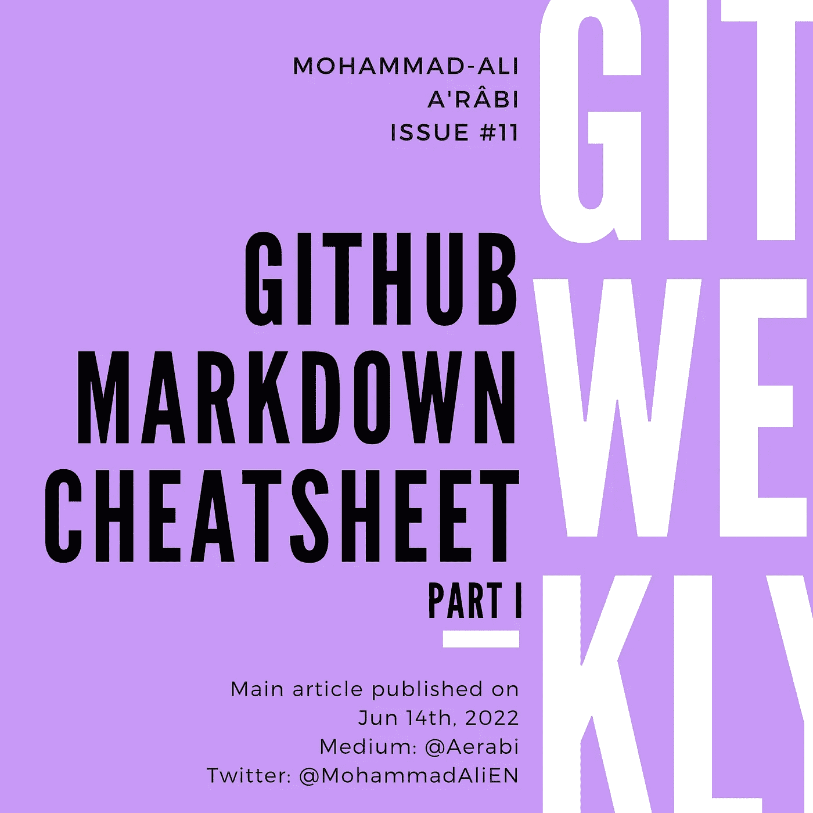

# GitHub 降价备忘单

> 原文：<https://itnext.io/github-markdown-cheatsheet-50642835effa?source=collection_archive---------1----------------------->

Markdown 是一种轻量级标记语言，主要用于编写 readmes，但也用于编写博客和书籍。每个支持 Markdown 的平台通常都会加入自己的特色。GitHub 也不例外，只是最近增加了对编写数学公式的支持。

这篇文章将是一个简短的降价指南，强调 GitHub 风格的降价的鲜为人知的方面，同时试图涵盖所有的基本功能。它从最基本的功能开始，但随着阅读的深入会变得越来越有趣。

# TL；速度三角形定位法(dead reckoning)

这 s **i** s a **吉斯** ub- **风味**ed**Markdo**wn**cheat she**et**focusi**ng**o**n**les**s-**kno**wn**featur**es

This**artic**le**wa**s**original**ly**writ**en**I**n**Markdo**wn**o**n**吉斯** ub。**Th**e**sour**ce**fil**e**ca**n**b**e**fou**nd[here](https://github.com/aerabi/markdown-cheatsheet)。



# 目录

*   [标题](#7b96)
*   [备选标题](#5016)
*   [段落](#64e8)
*   [换行](#9063)
*   [强调](#c681)
*   [内嵌代码](#04ed)
*   [代码块](#ab37)
*   [语法高亮显示的代码块](#8e7b)
*   [大宗报价](#5efa)
*   [有序列表](#7bff)
*   [无序列表](#a009)
*   [任务列表](#32a7)
*   [水平线](#28e4)
*   [网址和电子邮件地址](#0cdf)
*   [链接](#c1bc)
*   [图片](#175f)
*   [下标和上标](#e9d9)
*   [数学](#6644)
*   [表](#6e40)
*   [表情符号](#4292)
*   [HTML](#34de)
*   [注释](#d3bb)
*   [遗言](#4f91)
*   [参考文献](#6d8d)

# 标题

与 HTML 类似，Markdown 中有 6 个标题:

```
# H1
## H2
### H3
#### H4
##### H5
###### H6
```

尝试使用标题级别 1 作为文档的标题，h2 作为章节的标题，h3 作为子章节的标题，以此类推。

# 替代标题

创建标题的另一种方法只支持两个级别:

```
Heading Level 1
===============Heading Level 2
---------------
```

# 段落

段落是由至少一个空行分隔的文本块:

```
This is paragraph 1.This is paragraph 2.
```

# 换行

在 Markdown 世界中，换行符语法不太为人所知。
通过在行尾添加至少两个空格来实现:

```
This is line 1\.  
This is line 2.
```

因为看不见所以不太为人所知。

# 强调

有三种方式来强调:

*   大胆的
*   意大利语族的
*   粗体和斜体

可以用双下划线或双星号来加粗:

```
This is **__bold__**, so is ****this****.
```

但是在一个单词中，只有星号起作用:

```
****Thi****s ****i****s a ****GitH****ub-**flavor****ed **Markdo****wn ****cheatshe****et ****focusi****ng ****o****n ****les****s-**kno****wn **featur****es.
```

要生成斜体，请使用一个下划线或一个星号，同样，在中间只有星号语法有效:

```
This is *_italic_*, so is **this**. And it's not **un**important.
```

为了使某些东西变得粗体和斜体，可以混合使用这两种语法:

```
All of these are: *****bandi*****, *_******bandi******_*, *****_bandi_*****, **__**bandi**__**, ******__bandi__******, **___bandi___**.
And inside the word: b*****and*****i which means bold*****and*****italic.
```

# 内嵌代码

要在常规文本中以等宽字体编写代码，请用反斜杠将它括起来:

```
This is `code` inside text.
```

如果要编写包含反斜线的代码，可以使用双反斜线:

```
This is the syntax: ``This is `code` inside a text.``
```

# 码组

要创建代码块，请在它前面放置四行或一个制表符:

```
This is the code: for i in range(10):
        pass
```

另一种语法是用三个反斜线将代码包装起来。

```
This is the code:```
for i in range(10):
    pass
```
```

若要在代码块中显示三个反斜线，请将它们放在四个反斜线内。

```
The alternative syntax is wrapping the code in three backticks.``‌``
This is the code:```
for i in range(10):
    pass
```
``‌``
```

要在一个代码块中显示三元和四元反勾号，将它们放在四元反勾号中，并在想要显示的四元反勾号中放置一个[零宽度非连接符](https://unicode-explorer.com/c/200C)。

# 带有语法突出显示的代码块

要创建带有语法突出显示的代码块，可以使用三个反斜杠语法，并在其前面写入语言名称:

```
This is the code:`‌`‌`python
for i in range(10):
    pass
`‌`‌`
```

到目前为止，大约有 583 种语言支持语法高亮显示。您可以点击查看完整列表[。](https://github.com/github/linguist/blob/master/vendor/README.md)

# 大宗报价

块引号由前面的`>`表示:

```
> Veniet tempus quo ista quae nunc latent in lucem dies extrahat et longioris aevi diligentia.
```

使用双`>`创建嵌套的块引号。

# 有序列表

要创建有序列表:

```
1\. First item
2\. Second item
3\. Third item
```

号码可能有问题:

```
1\. First item (indexed 1)
1\. Second item (indexed 1)
5\. Third item (indexed 5)
```

Markdown 仍然修复计数器并输出正确的数字:

1.  第一项(索引为 1)
2.  第二项(索引为 1)
3.  第三项(索引为 5)

# 无序列表

要创建无序列表，请使用以下任何“项目符号”:连字符`-`、星号`*`或加号`+`:

```
- Item
- Another item
- Yet another item
```

可以在一个列表中混合使用项目符号字符，但这是一种不好的做法。

# 任务列表

任务列表(又名*清单*或*待办事项列表*)是一个无序列表，每个项目前面都有一个复选框，要么选中，要么不选中。在 GitHub 上写问题时，任务列表是非常有用的，因为人们可以检查或取消检查它们，而无需手动编辑评论或描述的标记源。

```
- [x] Write the tests
- [ ] Implement the functions
- [ ] Fix the code formatting
```

# 水平线

要创建水平线，请使用三个或更多星号(`***`)、连字符(`---`)或下划线(`___`):

```
Some text!---Next chapter or something!
```

# URL 和电子邮件地址

要将 URL 和电子邮件地址转换为链接，只需将它们用尖括号括起来:

```
Take a look at my Medium posts: <https://aerabi.medium.com>
You can also email me at <mohammad-ali@aerabi.com>
```

# 链接

要创建链接，请将链接的文本括在括号中，然后立即将 URL 括在括号中:

```
Take a look at my [Medium posts](https://aerabi.medium.com/).
```

您也可以给链接添加标题，显示为工具提示:

```
Take a look at my [Medium posts](https://aerabi.medium.com/ "Git Weekly is published there!").
```

看看我的[中帖](https://aerabi.medium.com/)。

# 形象

图像语法类似于链接的语法，只是它前面有一个感叹号，并且文本是替代文本:

```

```

# 下标和上标

化学中使用下标和上标，*等等*:

```
One might want to write about H<sub>2</sub>O or Batman<sup>TM</sup>.
```

# 数学

现在，人们可以在 GitHub 风格的 Markdown 中编写 LaTeX 风格的数学公式:

```
I know why $e^{i\pi} + 1 = 0$. And I also know that:$$ \frac{G}{\mathrm{Ker}(\phi)} \cong \mathrm{Im}(\phi). $$
```


数学公式如何在 GitHub 上呈现

# 桌子

桌子很酷:

```
| Tables        | Are           | Cool  |
| ------------- |:-------------:| -----:|
| col 3 is      | right-aligned | $1600 |
| col 2 is      | centered      |   $12 |
| zebra stripes | are neat      |    $1 |
```

# 表情符号

表情符号可以用冒号写，万岁！🎉

```
Emojis can be written by using colons, hurray! :tada:
```

[表情百科](https://emojipedia.org/)有表情符号的 GitHub 短码，例如🏖️ [带伞海滩](https://emojipedia.org/beach-with-umbrella/)。

# 超文本标记语言

也可以在 Markdown 中使用 **HTML** 标签。

```
One can use <b>HTML</b> tags in Markdown as well.
```

# 评论

要隐藏降价文档中的内容，可以使用 HTML 注释语法:

```
<!-- This is comment and won't be rendered! -->
```

# 最后的话

我将继续更新这篇文章，以跟上 GitHub 风格的 Markdown 的最新功能。如果我错过了什么，请告诉我。

这篇文章是用 Markdown 编写的，由 GitHub 呈现，然后作为富文本复制到 Medium 中。降价版本可在这里[访问，它展示了一些 Medium 不支持的功能，例如:](https://github.com/aerabi/markdown-cheatsheet)

*   数学公式
*   脚注
*   评论

查看 Markdown 源代码并将其与渲染版本进行比较也很有趣。

我每周在 git、GitHub 和 GitLab 上写文章。

*   订阅 my Medium publishes，以便在新的 Git 周刊发布时获得通知。
*   在 Twitter 上关注我，获取 git 上的每周文章和每日推文。
*   我还创办了一份时事通讯，将我的博客文章和我的推文结合在一起。你可以从[我的推特个人资料](https://twitter.com/MohammadAliEN)订阅，或者直接从[这里](https://www.getrevue.co/profile/aerabi)订阅。请尝试一下，并给我反馈。

# 参考

*   [降价指南>基本语法](https://www.markdownguide.org/basic-syntax)
*   [降价指南>降价备忘单](https://www.markdownguide.org/cheat-sheet)
*   [GitHub 文档>基本编写和格式化语法](https://docs.github.com/en/get-started/writing-on-github/getting-started-with-writing-and-formatting-on-github/basic-writing-and-formatting-syntax)
*   [GitHub 风味降价规格](https://github.github.com/gfm)
*   [亚当·普里查德，“降价备忘单”](https://github.com/adam-p/markdown-here/wiki/Markdown-Cheatsheet)
*   [GitHub 博客>Markdown 中的数学支持](https://github.blog/2022-05-19-math-support-in-markdown/)