# Github: SAML Okta 和 Github 企业云—组织单点登录配置

> 原文：<https://itnext.io/github-saml-okta-and-github-enterprise-cloud-organization-sso-configurartion-f09f2727196d?source=collection_archive---------7----------------------->

作为 SSO、Okta 和 SAML 的后续。

我们已经为我们的 Jenkins 做了一切(参见 [Jenkins: SAML、Okta、用户组和基于角色的安全插件帖子](https://rtfm.co.ua/en/jenkins-saml-okta-users-groups-and-role-based-security-plugin/))——现在是时候对我们的 Github 组织做同样的事情了。

这个想法与 Jenkins 的设置相同:在 Github(我们的服务提供商， *SP* )登录期间，将所有用户保留在 Okta 中——它必须要求我们的身份提供商， *IDP* (本例中为 Okta)使用 SAML 对该用户进行身份验证。

让我们使用 [Okta Github 企业云—组织](https://www.okta.com/integrations/github-enterprise-cloud-organization/)应用程序。

文档:

*   [如何为 GitHub 企业云—组织配置 SAML 2.0](https://saml-doc.okta.com/SAML_Docs/How-to-Configure-SAML-2.0-for-Github-com.html)
*   [关于 SAML 单点登录认证](https://help.github.com/en/github/authenticating-to-github/about-authentication-with-saml-single-sign-on)

我还没有找到如何实现从 Okta 用户帐户到 Github 的分组，但我相信这是可以做到的。

## 试用 Github 企业云—组织

为了能够在 Github 的组织中使用 SAML，需要拥有 [Github 企业云—组织](https://help.github.com/articles/githubs-products)。

去你的 Github 的组织，*设置>安全*:

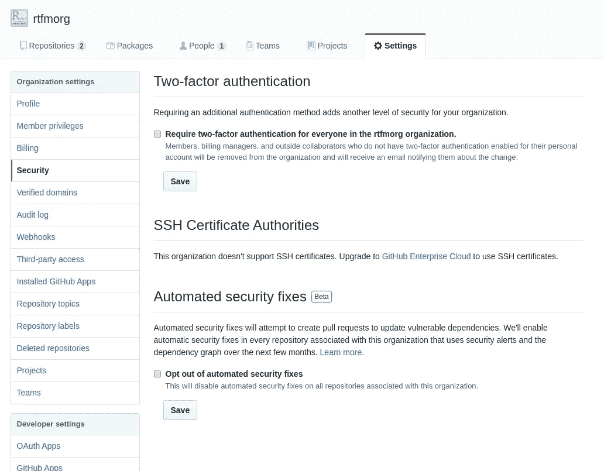

现在没有可用的 SAML。

出于测试目的，让我们用企业试用订阅创建一个新的 Github 组织。

转到 [GitHub 企业云](https://github.com/enterprise):

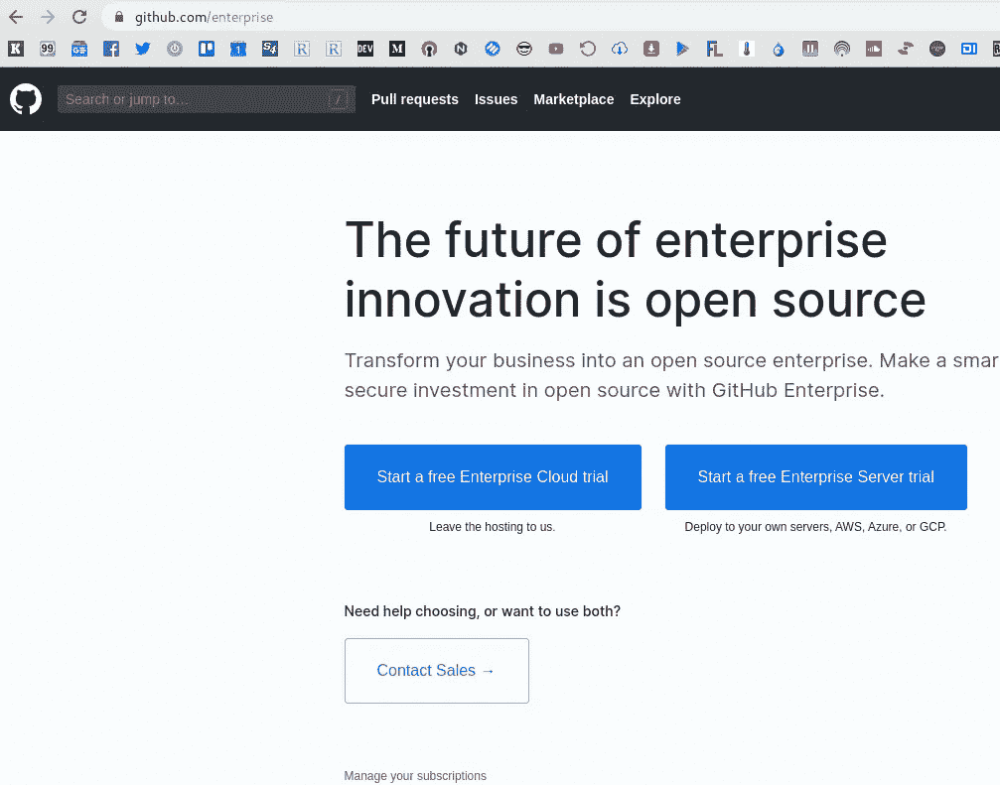

点击试用，创建新组织:

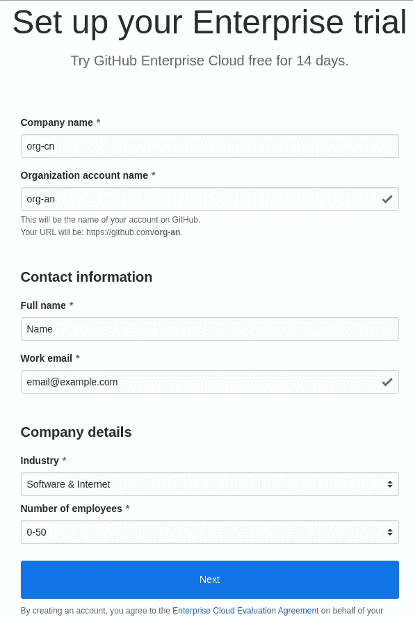

可以从这里添加用户:

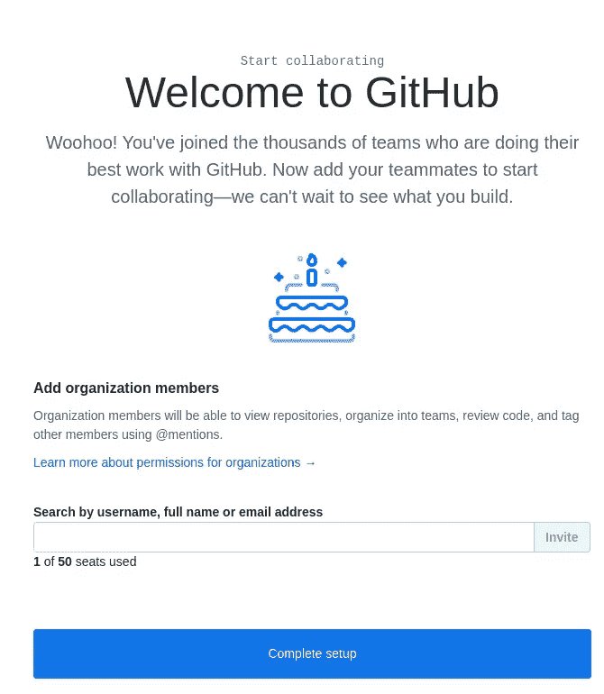

现在，我的用户(在组织创建期间使用)可以访问三个组织——工作、RTFM 和刚刚创建的测试:

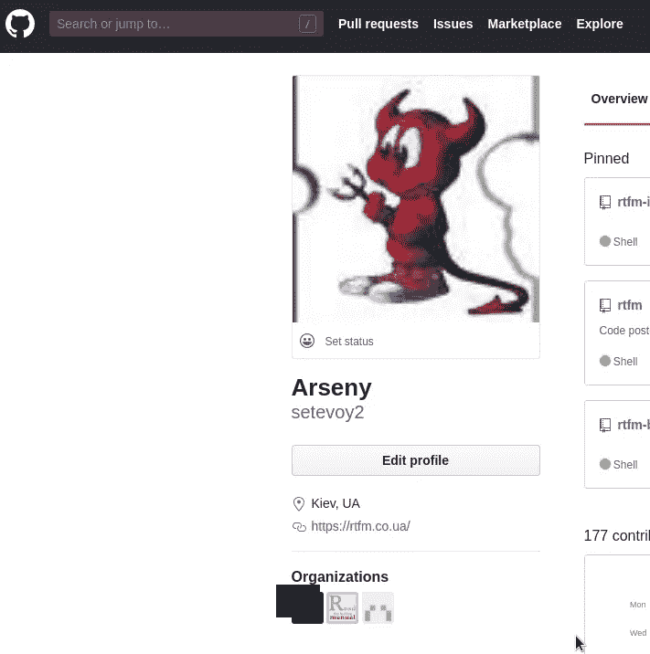

现在，转到组织创建的*设置—安全性，*您可以看到现在 SAML 在此处可用:

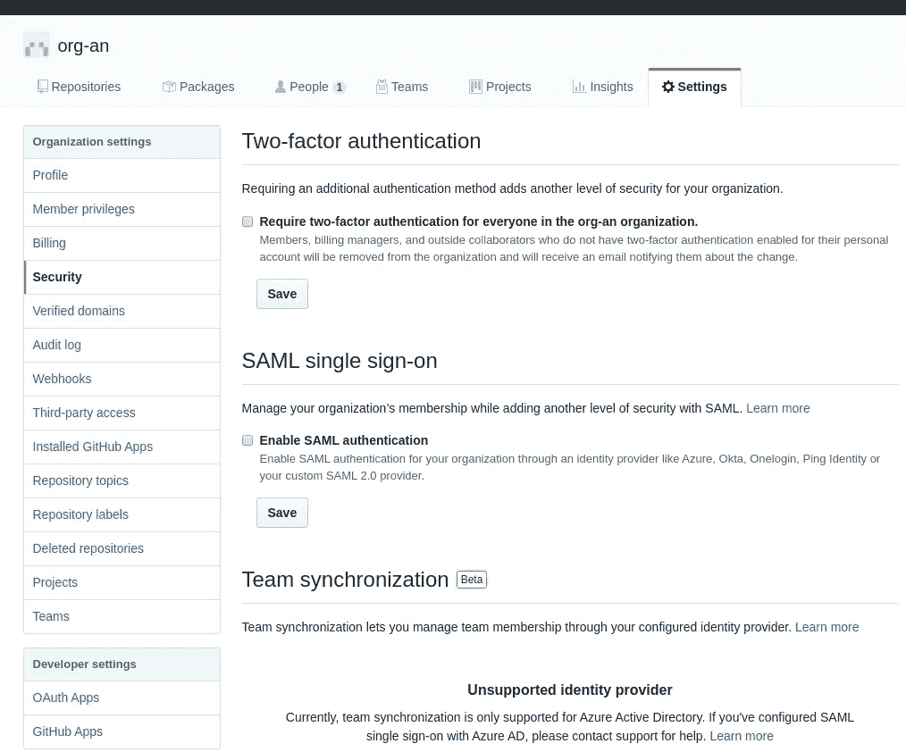

## Okta SAML — Github 企业云—组织配置

进入 Okta *—应用—添加应用*，找到 *Github 企业云—组织*:

在与 Github 相同的视图中设置组织名称:

转到标签上的*标志:*

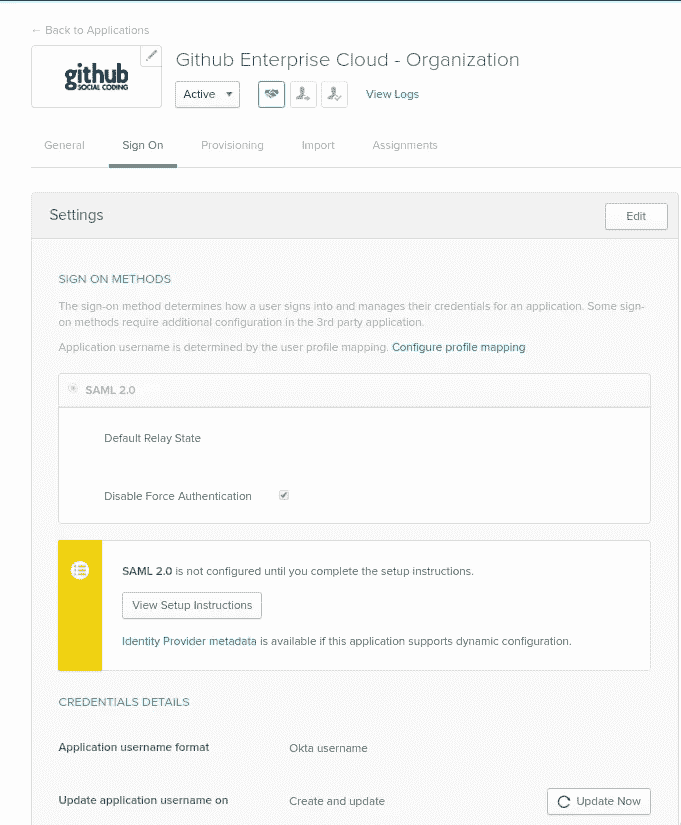

点击*查看设置说明* —您将被重定向到一个页面，该页面已经为您的 SAML 定义了设置:

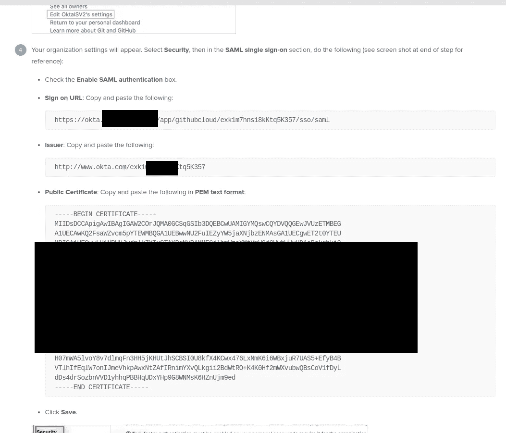

## Github 组织中的 SAML 配置

转到 Github，点击 *Enable SAML authentication* ，用来自*查看设置说明*页面的数据填充字段，这里有三个字段需要复制粘贴:

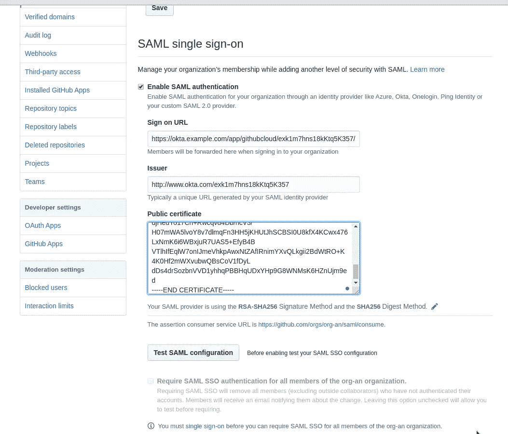

回到 Okta 中的 Github 应用程序，切换到*分配*选项卡，分配一个用户:

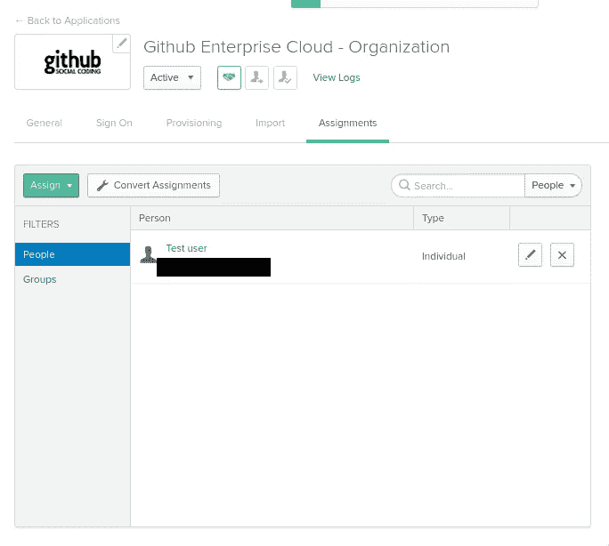

在 Github 中，单击*测试 SAML 配置* —您将被重定向到 Okta 进行身份验证:

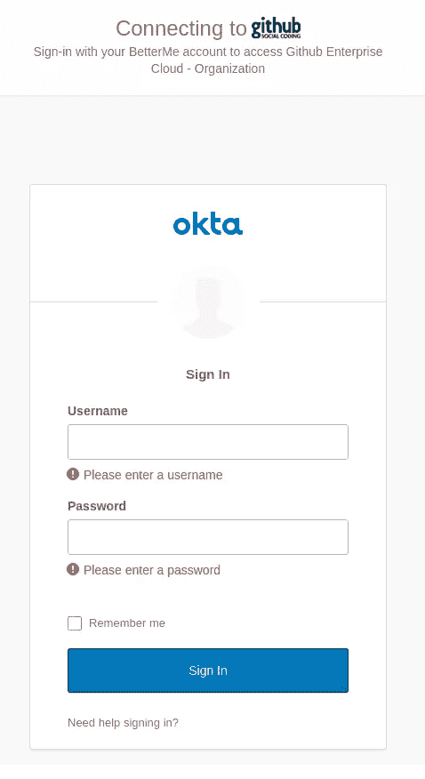

使用*测试*用户登录—测试通过:

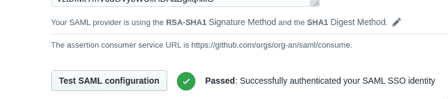

不要忘记按下底部的*保存*。

## SAML 检查

查找您的单点登录 URL:

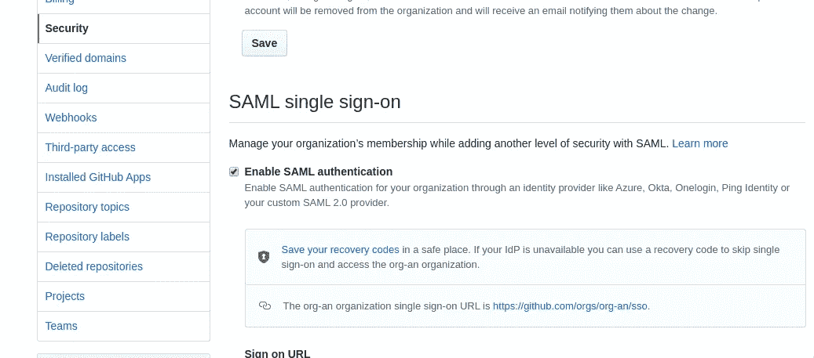

隐姓埋名地打开它:

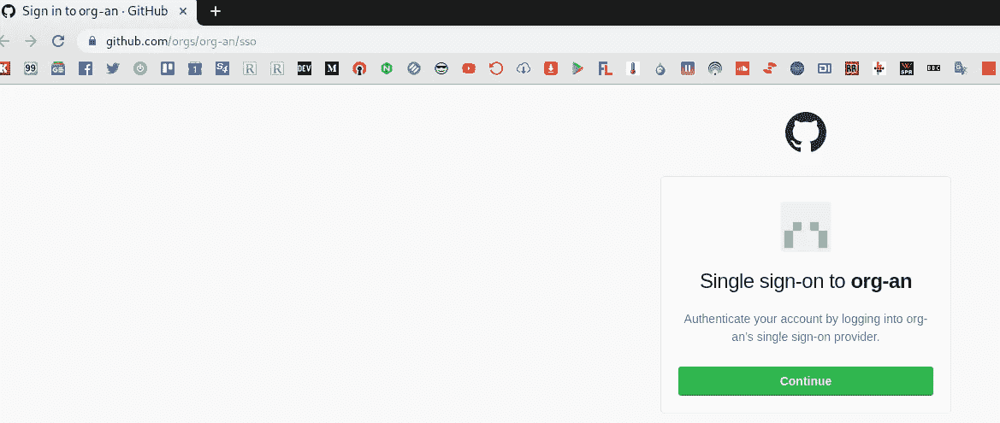

点击*继续*按钮—必须重定向到 Okta:

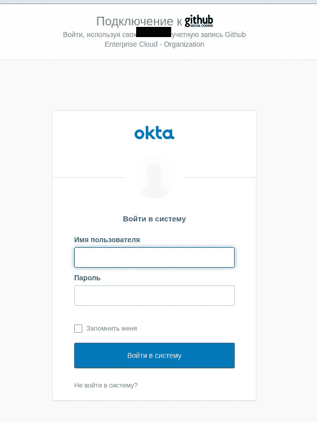

在这里你可以创建一个新的 Github 用户——或者用一个已经存在的用户登录。

在任何情况下— Okta 将使用 Just In Time ( *JIT* )供应将该用户添加到 Github 的组织中:

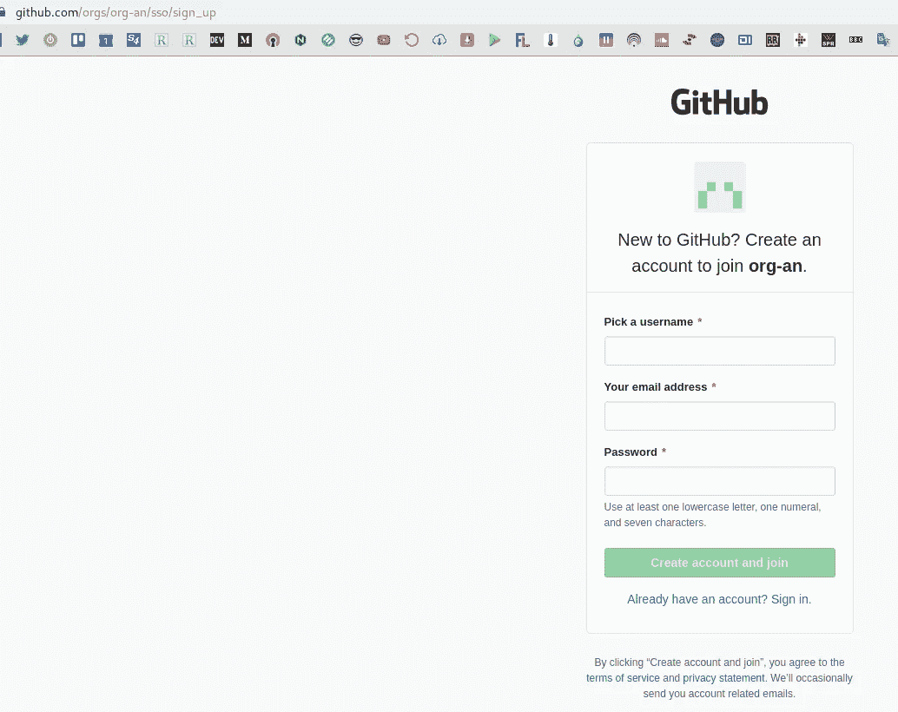

登录:

现在，您可以看到该组织的数据:

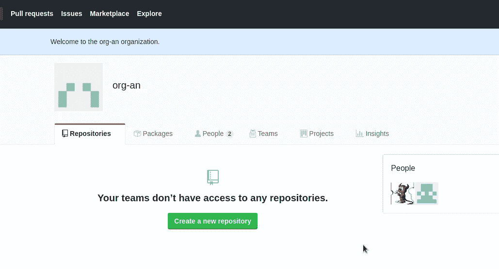

完成了。

*最初发表于* [*RTFM: Linux、DevOps 和系统管理*](https://rtfm.co.ua/en/github-saml-okta-and-github-enterprise-cloud-organization-sso-configurartion/) *。*