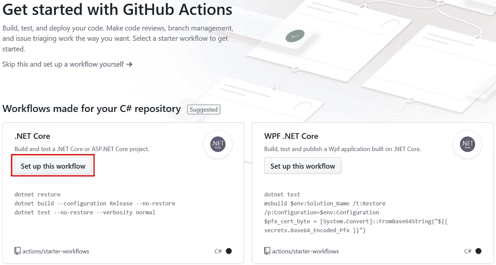
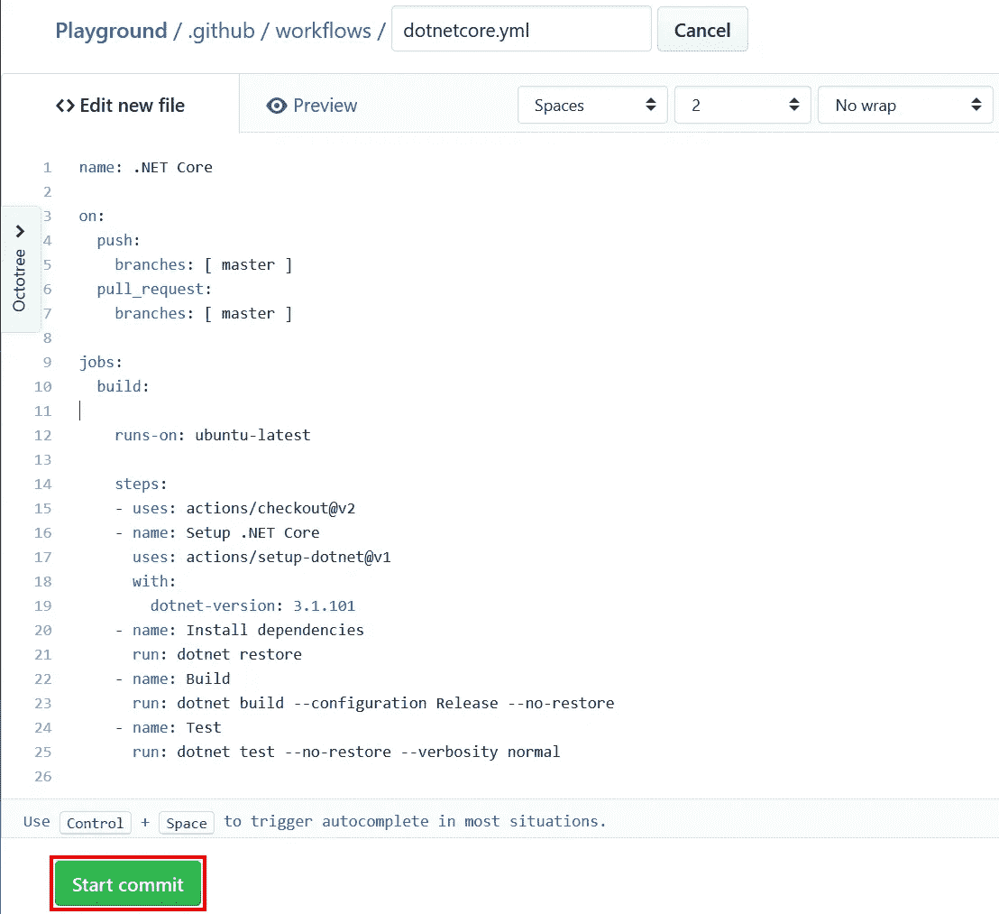
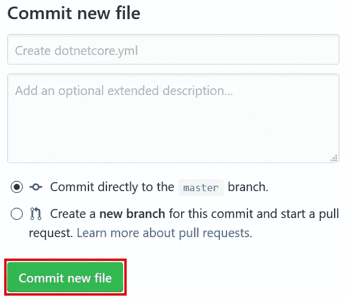
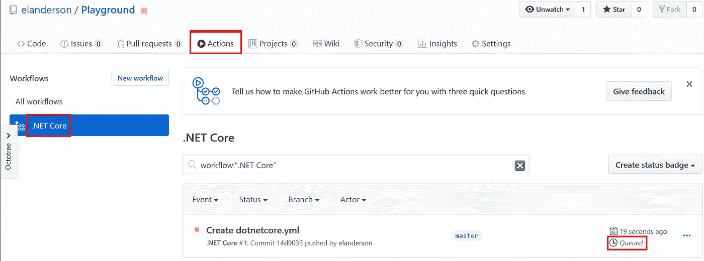
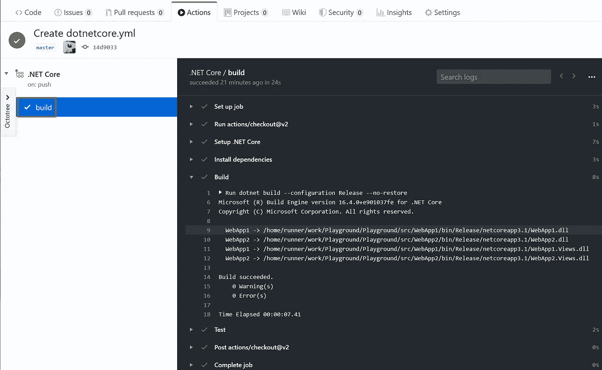

# GitHub:用行动打造 ASP.NET 核心应用

> 原文：<https://itnext.io/github-use-actions-to-build-asp-net-core-application-bdf3139d613f?source=collection_archive---------4----------------------->

在本周的帖子中，我们将使用 GitHub 的操作来构建我们从 Azure DevOps Repo 导入的应用程序之一。我们正在使用的回购样本可以在[这里](https://github.com/elanderson/Playground)找到。

## 创建操作工作流

在 GitHub 的 repo 中点击屏幕上方中央的**动作**选项。

“操作”页面将根据您正在处理的回购的内容提出建议。在我们的例子中。NET 核心工作流是我们感兴趣的一个。点击**设置该工作流程**按钮。

显示的下一个屏幕将是一个编辑器，其中加载了。NET 核心工作流。现在，我们将保留默认的 YAML，并单击**开始提交**按钮。这个工作流程可能适用于我们的回购，也可能不适用。在这一点上，我们仍在探索，在我们对行动的工作方式有所了解后，可以根据需要进行更改。

下一个对话框是提交细节。对于这个初始更改，我们将使用默认提交消息直接提交给 master。点击**提交新文件**继续。

## 查看工作流状态

现在我们已经设置了工作流，再次单击 repo 的**操作**选项卡，查看工作流列表及其状态。正如您在该屏幕截图中看到的，提交将我们的新工作流排队等待运行。

工作流完成得很快，因此我无法在它运行时看到详细信息，但如果您单击 commit title，在本例中为 Create dotnetcore.yml，它会将您带到此工作流运行的详细信息。从这个视图中，您将看到工作流的作业列在屏幕的左侧，我们只有一个作业，即构建。单击某个作业时，您将看到该作业的日志。下面的屏幕截图是示例构建作业，其中扩展了构建步骤的细节，以显示 WebApp1 和 WebApp2 都已构建。

## 包扎

希望这篇文章能给你一个很好的起点来创建你自己的 GitHub 动作。我对它的易用性和支持的语言多样性印象深刻，尤其是对于一个推出不到一年的特性集。下周再来查看更多的行动探索。

*最初发表于* [*埃里克·安德森*](https://elanderson.net/2020/06/github-use-actions-to-build-asp-net-core-application/) *。*