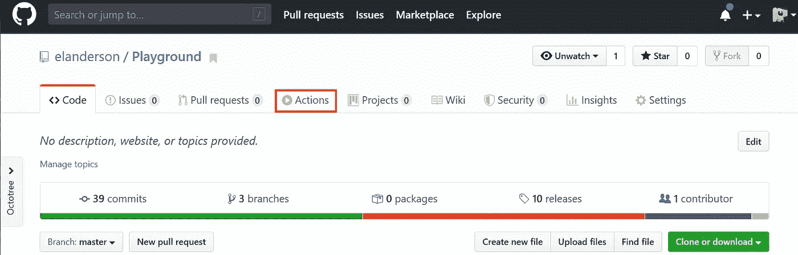
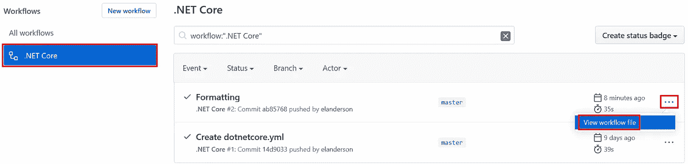
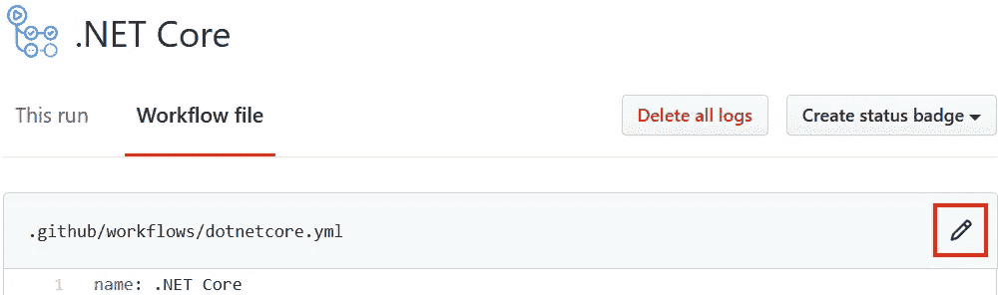
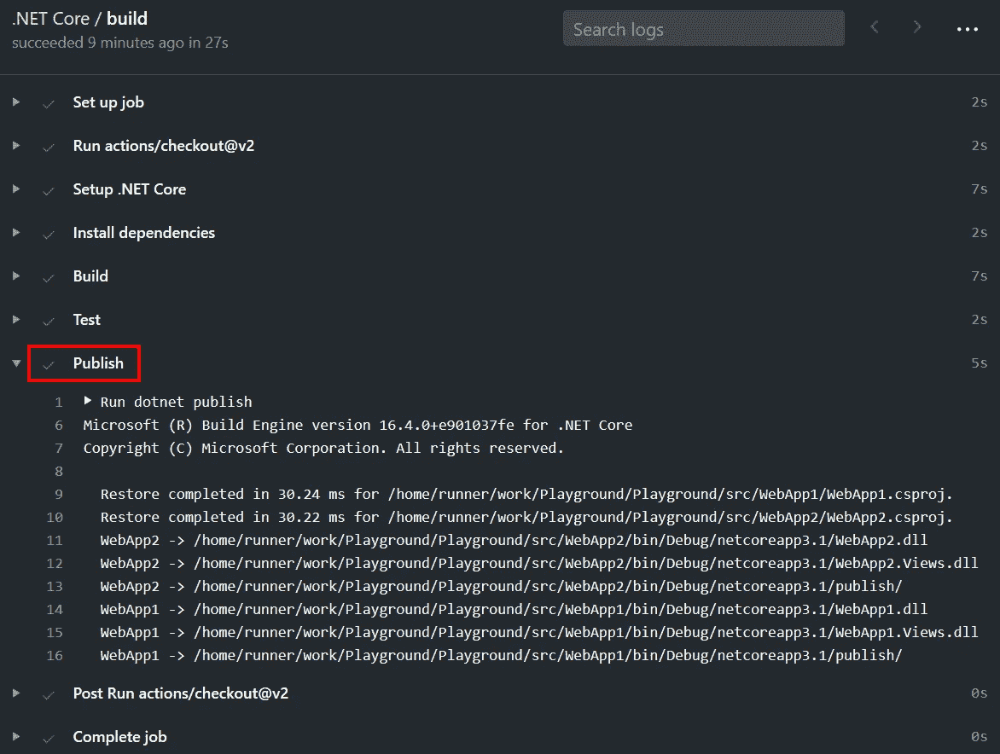
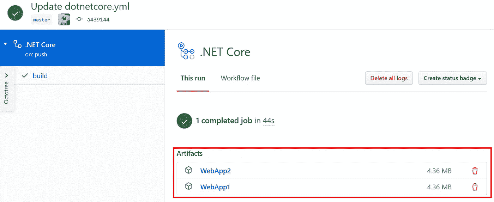

# GitHub:使用动作发布工件

> 原文：<https://itnext.io/github-use-actions-to-publish-artifacts-e42fc76a8a63?source=collection_archive---------2----------------------->

这篇文章将采用我们在上一篇文章中设置的 GitHub Actions 工作流，并添加几个步骤，为我们提供对应用程序二进制文件的访问。如果你是这个系列的新手，如果需要的话，下面的帖子会帮你跟上。

[GitHub:导入 Azure devo PS Repo](https://elanderson.net/2020/06/github-import-an-azure-devops-repo/)
[GitHub:用动作构建 ASP.NET 核心应用](https://elanderson.net/2020/06/github-use-actions-to-build-asp-net-core-application/)


## 编辑工作流程

我们的第一步是回到我们想要编辑的工作流程。在回购顶部点击**动作**。



在屏幕左侧选择具体的工作流程，**。这种情况下的网芯**。现在列表已经过滤为我们感兴趣的工作流程，选择最近运行的三个点，然后点击**查看工作流程文件**。



在下一个屏幕上，单击工作流文件上方的铅笔以编辑工作流。



添加文件的结尾添加对。NET CLI 来发布。下面是完整的文件，最后两行是发布步骤。

```
name: .NET Core

on:
  push:
    branches: [ master ]
  pull_request:
    branches: [ master ]

jobs:
  build:

    runs-on: ubuntu-latest

    steps:
    - uses: actions/checkout@v2

    - name: Setup .NET Core
      uses: actions/setup-dotnet@v1
      with:
        dotnet-version: 3.1.101

    - name: Install dependencies
      run: dotnet restore

    - name: Build
      run: dotnet build --configuration Release --no-restore

    - name: Test
      run: dotnet test --no-restore --verbosity normal

    - name: Publish
      run: dotnet publish
```

点击**开始提交**按钮，将更改提交到您选择的分支。我将更改直接提交给 master，这触发了工作流的运行。从工作流的日志中，您可以看到发布步骤成功执行。



## 发布构建工件

现在我们已经发布了两个 web 应用程序，我们需要一种方法来获取应用程序的文件。为此，我们将使用[上传工件动作](https://github.com/marketplace/actions/upload-a-build-artifact)。我使用上面发布步骤的输出来为每个应用程序找到到 **publish** 文件夹的路径，然后为每个应用程序使用一个 Upload Artifacts 动作。以下是添加到我们现有工作流程底部的两个步骤。

```
- name: Upload WebApp1 Build Artifact
  uses: actions/upload-artifact@v2
  with:
    name: WebApp1
    path: /home/runner/work/Playground/Playground/src/WebApp1/bin/Debug/netcoreapp3.1/publish/

- name: Upload WebApp2 Build Artifact
  uses: actions/upload-artifact@v2
  with:
    name: WebApp2
    path: /home/runner/work/Playground/Playground/src/WebApp2/bin/Debug/netcoreapp3.1/publish/
```

签入更改后，让工作流运行。完成后，如果您单击工作流运行的详细信息，您将看到它现在有可以下载的工件。



## 包扎

我们现在有了一个工作流，它产生了我们可以在验证应用程序构建和测试通过的基础上实际部署的文件。我希望这给了你一个很好的起点来构建你自己的工作流。我们只是触及了 GitHub Actions 的皮毛，我期待着看到我们还能做些什么。

*原载于*[](https://elanderson.net/2020/06/github-use-actions-to-publish-artifacts/)**。**