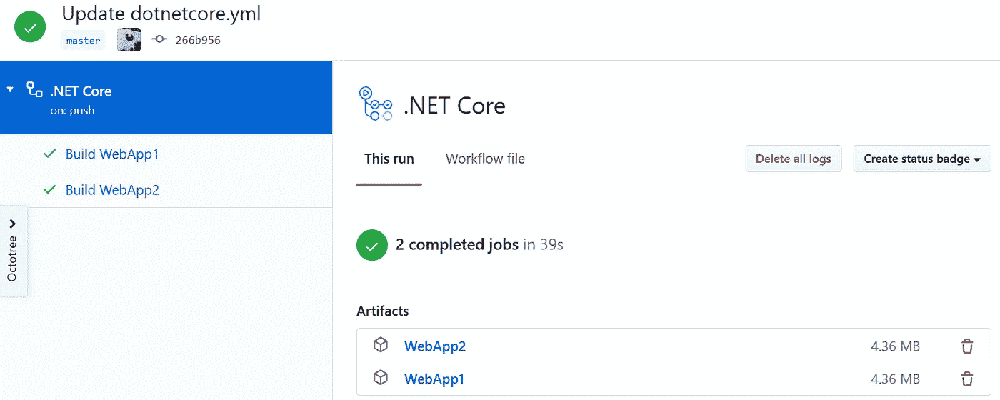

# GitHub:使用动作运行多个作业

> 原文：<https://itnext.io/github-use-actions-to-run-multiple-jobs-d85914ae5b27?source=collection_archive---------6----------------------->

在这篇文章中，我们将采用构建两个 split 核心 web 应用程序的示例工作流，并将其拆分，这样每个 web 应用程序都是单独构建的。如果你需要赶上进度，这篇文章使用了以下文章中的回购和工作流程。

[GitHub:导入一个 Azure devo PS Repo](https://elanderson.net/2020/06/github-import-an-azure-devops-repo/)
[GitHub:使用动作构建 ASP.NET 核心应用](https://elanderson.net/2020/06/github-use-actions-to-build-asp-net-core-application/)
[GitHub:使用动作发布工件](https://elanderson.net/2020/06/github-use-actions-to-publish-artifacts/)


## 起点和计划

我们的工作流目前包含一个作业，这个作业恰好构建了两个 ASP.NET 核心 web 应用程序。NET CLI 选择并构建这两个应用程序。以下是我们当前工作流程的 YAML。

```
name: .NET Core

on:
  push:
    branches: [ master ]
  pull_request:
    branches: [ master ]

jobs:
  build:

    runs-on: ubuntu-latest

    steps:
    - uses: actions/checkout@v2

    - name: Setup .NET Core
      uses: actions/setup-dotnet@v1
      with:
        dotnet-version: 3.1.101

    - name: Install dependencies
      run: dotnet restore

    - name: Build
      run: dotnet build --configuration Release --no-restore

    - name: Test
      run: dotnet test --no-restore --verbosity normal

    - name: Publish
      run: dotnet publish 

    - name: Upload WebApp1 Build Artifact
      uses: actions/upload-artifact@v2
      with:
        name: WebApp1
        path: /home/runner/work/Playground/Playground/src/WebApp1/bin/Debug/netcoreapp3.1/publish/

    - name: Upload WebApp2 Build Artifact
      uses: actions/upload-artifact@v2
      with:
        name: WebApp2
        path: /home/runner/work/Playground/Playground/src/WebApp2/bin/Debug/netcoreapp3.1/publish/
```

这篇文章将采用这个工作流，将两个 web 应用程序的构建和发布分成两个任务。通过将工作流分割成多个作业，我们打开了作业并行运行的可能性。这样做的一个原因是，如果您的构建部分是独立的，那么可以加快整个工作流的运行时间。为什么需要多个作业的另一个例子是，如果不同的作业需要在不同的操作系统上运行，例如一个需要运行 Windows，另一个需要运行 Linux。

## 创造就业机会

下面是构建第一个 web 应用程序的工作流程。第一个变化是从 **build** 到 **build_web_app1** 的 ID，因为每个作业必须有一个唯一的 ID。其余大部分突出显示的更改都与。现在针对特定项目的. NET CLI 命令。还要注意，我们从硬编码路径改为使用表达式来获取工作空间路径，该路径是 **${{ github.workspace }}** 位，而不是**/home/runner/work/Playground/Playground/**。更多信息见[表达式语法文档](https://help.github.com/en/actions/reference/context-and-expression-syntax-for-github-actions)。

```
name: .NET Core

on:
  push:
    branches: [ master ]
  pull_request:
    branches: [ master ]

jobs:
  build_web_app1:

    name: Build WebApp1
    runs-on: ubuntu-latest

    steps:
    - uses: actions/checkout@v2

    - name: Setup .NET Core
      uses: actions/setup-dotnet@v1
      with:
        dotnet-version: 3.1.101

    - name: Install dependencies
      run: dotnet restore ${{ github.workspace }}/src/WebApp1/WebApp1.csproj

    - name: Build
      run: dotnet build ${{ github.workspace }}/src/WebApp1/WebApp1.csproj --configuration Release --no-restore

    - name: Test
      run: dotnet test ${{ github.workspace }}/src/WebApp1/WebApp1.csproj --no-restore --verbosity normal

    - name: Publish
      run: dotnet publish ${{ github.workspace }}/src/WebApp1/WebApp1.csproj

    - name: Upload Build Artifact
      uses: actions/upload-artifact@v2
      with:
        name: WebApp1
        path: ${{ github.workspace }}/src/WebApp1/bin/Debug/netcoreapp3.1/publish/
```

这是定义了两个作业的完整文件。正如您所看到的，第二个作业与第一个作业基本相同，只是 ID、名称和项目不同。

```
name: .NET Core

on:
  push:
    branches: [ master ]
  pull_request:
    branches: [ master ]

jobs:
  build_web_app1:

    name: Build WebApp1
    runs-on: ubuntu-latest

    steps:
    - uses: actions/checkout@v2

    - name: Setup .NET Core
      uses: actions/setup-dotnet@v1
      with:
        dotnet-version: 3.1.101

    - name: Install dependencies
      run: dotnet restore ${{ github.workspace }}/src/WebApp1/WebApp1.csproj

    - name: Build
      run: dotnet build ${{ github.workspace }}/src/WebApp1/WebApp1.csproj --configuration Release --no-restore

    - name: Test
      run: dotnet test ${{ github.workspace }}/src/WebApp1/WebApp1.csproj --no-restore --verbosity normal

    - name: Publish
      run: dotnet publish ${{ github.workspace }}/src/WebApp1/WebApp1.csproj

    - name: Upload Build Artifact
      uses: actions/upload-artifact@v2
      with:
        name: WebApp1
        path: ${{ github.workspace }}/src/WebApp1/bin/Debug/netcoreapp3.1/publish/

  build_web_app2:

    name: Build WebApp2
    runs-on: ubuntu-latest

    steps:
    - uses: actions/checkout@v2

    - name: Setup .NET Core
      uses: actions/setup-dotnet@v1
      with:
        dotnet-version: 3.1.101

    - name: Install dependencies
      run: dotnet restore ${{ github.workspace }}/src/WebApp2/WebApp2.csproj

    - name: Build
      run: dotnet build ${{ github.workspace }}/src/WebApp2/WebApp2.csproj --configuration Release --no-restore

    - name: Test
      run: dotnet test ${{ github.workspace }}/src/WebApp2/WebApp2.csproj --no-restore --verbosity normal

    - name: Publish
      run: dotnet publish ${{ github.workspace }}/src/WebApp2/WebApp2.csproj

    - name: Upload Build Artifact
      uses: actions/upload-artifact@v2
      with:
        name: WebApp2
        path: ${{ github.workspace }}/src/WebApp2/bin/Debug/netcoreapp3.1/publish/
```

完成所有编辑后，提交对 repo 的更改以运行工作流。从工作流运行的结果中，您将看到它现在有两个作业，并且我们仍然像以前一样为两个应用程序获得工件。



## 包扎

如果您的应用程序需要，将它们分成不同的任务不仅对工作流运行时有帮助，而且还能帮助您推理构建过程的每个部分正在做什么。

*原载于*[](https://elanderson.net/2020/06/github-use-actions-to-run-multiple-jobs/)**。**