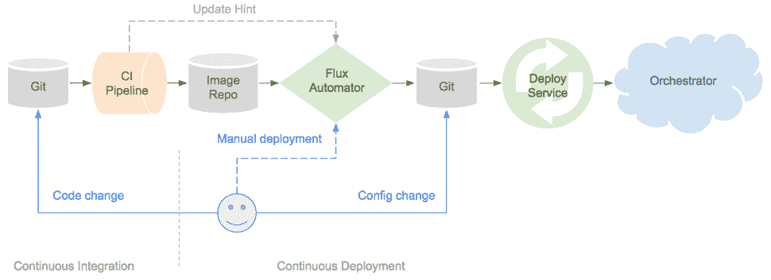

# GitOps 功能强大；但是，您的组织准备好了吗？

> 原文：<https://itnext.io/gitops-is-powerful-but-is-your-organization-ready-a18288238a21?source=collection_archive---------0----------------------->

## 软件交付

## GitOps 为什么强大？采用 GitOps 之前的主要考虑事项。

安迪·凯利在 [Unsplash](https://unsplash.com/s/photos/automation?utm_source=unsplash&utm_medium=referral&utm_content=creditCopyText) 上的照片

*‘GitOps’是一种在 Kubernetes 上交付和管理云原生应用的运营模式。它可以被认为是对基于 Kubernetes 系统的 DevOps 和 SRE(现场可靠性工程)最佳实践的优化。*

考虑到“GitOps”是一个在 weaver works 上创造的术语，并且它源于 weaver works 运行基于 Kubernetes 的系统的历史，GitOps 通常在 Kubernetes 的上下文中被提及。但是，现在 GitOps 作为一个基本概念或最佳实践正在扩展到各种其他平台和工具，如 Nomad、Terraform、Ansible、Chef、Pulumi 等。也是。除了技术方面之外，成功地完成 GitOps 还非常依赖于*人员*和*流程*方面。

在本帖中，我们将探讨为什么我们需要 gitop，gitop 的优势，以及在组织内成功采用 gitop 需要解决的一些挑战。

# “Git”代表“Ops”？

GitOps 的基本思想可以概括为以声明方式管理和执行的操作，使用 [Git](https://git-scm.com/) 作为事实的来源系统。

GitOps 是基于 *Git 拉请求工作流、持续集成&持续部署(CICD)、配置管理、基础设施即代码、容器不变性、监控*、*和可观察性*的构建块构建的。

让我们从下面的图表中来理解它，我借用了亚历克西斯·理查森的一篇旧的 Weaveworks [博客文章](https://www.weave.works/blog/the-gitops-pipeline)。现在，您将看到 GitOps 管道的许多变体，它们具有各种工具和实现，但我只想坚持基本原则，保持简单。

图片提供:[https://www.weave.works/blog/the-gitops-pipeline](https://www.weave.works/blog/the-gitops-pipeline)

**简单来说，GitOps 管道就是这样工作的—**

> 工程师向 Git 存储库提交代码(审查并合并一个拉请求)。
> 
> CI 管道基于检测到的 Git 变化被触发，在成功完成所有需要的 CI 步骤后，一个新的[版本的](https://semver.org/)容器映像被上传到映像存储库。
> 
> 一个部署自动机/ [操作符](https://github.com/operator-framework)(在上图的例子中是 Flux)在映像 repo 中获取更改，并更新 Git repo 中的配置。
> 
> 更新完成后，运营商将启动 Kubernetes 的部署流程。

GitOps 可以看作是一个基于事件的系统。每个阶段都是基于前一个阶段中的更改事件触发的。部署和系统状态同步通过部署自动机以拉模式进行。管道中引入的任何基于推送的机制，无论是手动 CI 触发器，还是部署触发器，或者任何“kubectl”命令，都可以使 GitOps 的整个概念变得多余。

GitOps 可以与任何基于 Git 的系统一起工作，如 [GitHub](http://github.com/) 、 [Bitbucket](https://bitbucket.org/product) 或 [GitLab](https://about.gitlab.com/) 。对目标系统的任何更改都通过更改 Git 中的声明性配置来控制和执行。GitOps 不推荐使用任何特定的工具，比如 CI 服务器、映像存储库，甚至是部署自动机/操作员。

我希望下面我从[https://fluxcd.io/](https://fluxcd.io/)那里借用的流量定义将有助于更好地理解部署操作员在 GitOps 中的角色和重要性—

*"Flux 是一个工具，它可以自动确保您的*[*Kubernetes*](https://kubernetes.io/)*集群的状态与您在 Git 中提供的配置相匹配。它在集群中使用一个* [*操作符*](https://github.com/operator-framework/awesome-operators) *来触发 Kubernetes 内部的部署，这意味着您不需要单独的持续交付工具。”*

# 我们真的需要 GitOps 吗？

由[奥斯汀·迪斯特尔](https://unsplash.com/@austindistel?utm_source=unsplash&utm_medium=referral&utm_content=creditCopyText)在 [Unsplash](https://unsplash.com/s/photos/meeting?utm_source=unsplash&utm_medium=referral&utm_content=creditCopyText) 上拍摄的照片

我们还没有足够的工具、流程和最佳实践来管理容器编排系统吗？是，也不是。

多年来，一些组织成功地设计了他们的 CICD 管道，使其尽可能高效地满足组织的要求。其他的仍在这个过程中发展。随着这一领域不断推出新的、更好的自动化产品，不断需要尽快适应和发展，以企业保持市场相关性所需的快速步伐进行构建和创新。开发运维实践和随之而来的技术流程创新让许多组织实现了他们的目标。

## 新技术带来新挑战

*创新是一个迭代的过程。*组织开始采用高度可扩展的云平台、云原生开发、容器、微服务和无服务器技术来构建更好的系统。为了管理容器工作负载，容器编排系统如[*【Kubernetes】*](https://kubernetes.io/)*[*中间层 DC/OS*](https://dcos.io/)*[*Nomad*](https://www.nomadproject.io/)*等。被收养了。这种范式的转变给工程师们带来了一种新的挑战。系统变得更加分布式、松散耦合、异步和动态。***

******基于分布式容器的微服务系统很难管理。早期的软件开发、交付和管理实践被认为无法处理分布式和云原生系统关于如何开发、交付和管理软件的需求。软件开发、代码评审、代码合并、代码升级、测试、发布管理和操作都必须采用更好的方法。******

**基于 DevOps 的实践成为快速、大规模管理和操作系统的关键。在交付管道中，*基于 Git 的版本控制系统*和工作流帮助开发人员扩展开发流程，并使其更加高效。*通过安全扫描持续集成和测试管道*使得软件交付更加可靠和安全。*基础设施即代码*和*配置管理工具*使基础设施和平台更加稳定、可靠、可扩展，并且更易于供应。*容器*提供了“不可变的服务器”,配置管理工具试图通过最小化配置漂移来交付这些服务器。*持续部署工具*有助于高效的软件交付和发布管理过程。虽然 CICD 工具链和管道必须实施一些软件交付标准，但是它们必须足够灵活以处理各种技术和语言。标准化的管道对于确保交付安全和高质量的软件至关重要，要有适当的访问和审计控制。**

*****基于分布式容器的微服务系统比较复杂，识别故障点、监控指标、告警阈值都比较复杂。这引入了对构成任何给定系统的分布式组件和服务的内部更好的可见性的需求。*服务/功能级别的可观察性*对于理解整个系统的行为和健康变得更加重要。虽然仍然需要*黑盒监控*来了解整体系统健康状况，但是*白盒监控*和*可观察性(* [*日志记录、指标收集和跟踪*](https://www.oreilly.com/library/view/distributed-systems-observability/9781492033431/ch04.html) *)* 对于云原生系统来说更加重要，以便更好地了解各个服务是如何工作的。出现了许多新的工具，它们能够处理高度分布式系统的高日志量、可伸缩性、粒度和可跟踪性需求。*****

*对于新的云原生应用程序，我们需要监控、收集和查看洞察的方式必须有所不同。虽然某些监控指标，如*延迟、错误、请求率和饱和度* [*(监控的 4 个黄金信号)*](https://landing.google.com/sre/sre-book/chapters/monitoring-distributed-systems/) 对于任何面向用户的系统来说都是至关重要的，但从日志、系统指标和跟踪中获取其他详细的信息也同样重要。有了这些认识，就有可能*理解和观察系统在运行时的行为，任何依赖关系的变化的影响，识别可能的性能瓶颈，依赖关系图*等等。*借助合适的工具，它可以帮助确定特定的使用和依赖模式，预测可能的影响，并进行容量和资源规划。**

**监控和警报的另一个重要方面是知道监控什么以及何时通知。*随着时间的推移，微调指标、阈值和警报可能是一项艰巨的任务。理解系统的正常和异常行为和模式需要付出大量的努力。一些最新工具的 AI/ML 功能可以在这方面有所帮助。但是，如果做得不好，可能会导致*警报疲劳*并最终导致关键警报被忽略并淹没在噪音中。*

****应用和平台安全需求也必须发展*** 以应对由系统、容器、API、大量上游/下游依赖项的高度分布式特性引入的*新攻击媒介*。早期的访问控制、南北网络安全的安全模型不足以保护高度分布和动态的系统。专家开发了零信任安全模型来解决这些问题。*

## *重新思考运营策略*

*因此，我们可能需要重新审视我们管理容器、微服务和 Kubernetes 或 Nomad 等平台的实践。*

*Kubernetes 允许团队彼此独立地执行开发和操作活动。开发人员不必担心他们的发布周期会受到服务器修补、备份/恢复、容量供应/取消供应等操作活动的影响。系统工程师能够在不停机和不中断应用程序可用性的情况下执行操作活动。Kubernetes 的声明式配置方法使工程师能够以声明方式推出应用程序版本、管理策略、定义资源配置和集群状态。这反过来也允许对它们进行版本控制。*

*GitOps 建立在这些版本控制的基本概念之上，现在它不仅适用于应用程序代码本身，还扩展到维护整个集群状态。*

****那么，到底有什么不同呢？*** 嗯，根本的区别是，GitOps 应该是*事件驱动，拉式，*而集群状态是*可观测的。**

*是的，GitOps 当然不是解决管理基于 Kubernetes 的系统的所有复杂性的灵丹妙药。但是，它肯定可以简化很多。不管 GitOps 的方法有多好，除非事先把一些事情理顺，否则你不会从中获益。相反，你可能会遇到其他风险，我将在下面的*“在做 GitOps 之前整理一些事情”*小节中介绍这些风险。*

# *GitOps 的优势*

**

*布雷特·乔丹在 [Unsplash](https://unsplash.com/s/photos/win?utm_source=unsplash&utm_medium=referral&utm_content=creditCopyText) 上拍摄的照片*

## *基于现有的最佳实践*

*由于 GitOps 是建立在围绕 Git 工作流、基础设施即代码、CICD 管道、不可变服务器、监控和可观察性的现有最佳实践基础上的模式，它只是在 Kubernetes 上管理云原生应用程序的更成熟状态的一种演变。因此，可以在很大程度上利用组织内现有的工具链和知识。采用 GitOps 可能需要在某些流程领域进行一些调整。*

## *简化了自动化的“连续部署”问题*

**持续集成容易；持续部署很难。* GitOps 能够通过自动化以结构化、明确定义的方式解决持续部署问题。这是由“部署运营商”实现的，如 FluxCD、ArgoCD 等。由于各种原因，如应用程序的状态、停机容限、上游/下游依赖性以及许多其他组织特定的流程和依赖性，正确的连续部署一直是一项具有挑战性的任务。GitOps 最佳实践以及云原生应用开发实践(如 [12 因素应用](https://12factor.net/)方法)解决了许多此类问题，反过来也简化了部署流程。*

## *简化 Kubernetes 集群管理*

*由于 Kubernetes 集群配置是通过 Git 中受版本控制的代码以声明方式定义的，因此它提供了针对期望状态的最大可见性和可审计性。Git 提交历史允许识别任何问题，甚至将集群状态回滚/恢复到特定的提交散列。GitOps 增强了针对特定目标环境的自动化应用程序部署、蓝/绿和 canary 版本等部署方法、管理多个集群以及自动化配置偏差检测和补救方面的功能。*

## *减少的 [MTTR](https://en.wikipedia.org/wiki/Mean_time_to_repair) (平均修复时间)*

*一小段糟糕的代码或一个错误的配置可能会对您的生产系统造成严重破坏。此外，对于基于分布式微服务的系统，调试、故障排除和修复问题可能会非常具有挑战性。所有这些加起来需要很长时间来修复和恢复系统。由于在 GitOps 中，每个更改都是受版本控制的，并且整个系统管理是自动化的，因此 MTTR 可以大大减少。下 MTTR 区对于良好的客户体验至关重要。*

# ***做 GitOps 之前先理清几件事***

## *1.代码评审和[拉请求](https://help.github.com/en/github/collaborating-with-issues-and-pull-requests/about-pull-requests)文化*

**

*约翰·施诺布里奇在 [Unsplash](https://unsplash.com/s/photos/meeting?utm_source=unsplash&utm_medium=referral&utm_content=creditCopyText) 上拍摄的照片*

*代码审查在整个软件交付过程中扮演着重要的角色，尤其是在 CICD 自动化支持的频繁发布中。如果没有一个适当的代码审查过程，坏代码发布的机会就会成倍增加。构建和测试失败是非常明显的，在管道的早期很容易被发现。但是同样重要的是观察代码变更对应用程序的非功能性需求的其他影响。比如，我们能否避免新的嵌套“for”循环，因为它会对性能产生重大影响？我们真的需要一个全局变量吗？对于手头的问题，使用了正确的数据结构吗？一个函数/方法应该变得更细粒度吗？定义的接口契约足够好吗？代码是否具有足够的可扩展性？诸如此类。有时，通过仔细检查代码更改可以找到这样的答案。有时，这很难做到，我们需要依靠可观察性度量来进一步改进。*

*Git pull-requests 提供了一种提交经过验证的高质量代码的好方法，这些代码可以合并到分支中。重要的是要建立一种“拉请求”的文化，在这种文化中，不允许任何开发人员将任何代码更改直接提交给任何 Git 分支。当“拉”请求被验证、检查和合并时，它可以触发 CI 管道。一个成功的 CI 构建和测试步骤可以导致新的工件版本被上传到工件存储库中。*

*因此，作为拉取请求本身的一部分，拥有一个良好的构建和测试流程是非常重要的。这是确保良好代码质量和最终系统稳定性的第一步。*

## *2.持续测试非常重要*

**

*由[尼古拉斯·托马斯](https://unsplash.com/@nicolasthomas?utm_source=unsplash&utm_medium=referral&utm_content=creditCopyText)在 [Unsplash](https://unsplash.com/s/photos/test?utm_source=unsplash&utm_medium=referral&utm_content=creditCopyText) 上拍摄的照片*

*我再怎么强调好的测试用例对于 CICD 自动化的成功和构建一个可靠的系统是多么的重要也不为过。对于 GitOps，我们谈论的是基于拉的端到端自动化，如此高度的自动化要求对通过管道发布的软件进行健壮的测试。当然，使用 GitOps 也可以实现更好的回滚功能。但是，只有编写好的代码和好的测试用例才能确保代码本身更好的可靠性。*

*许多人仍然依赖手工测试来测试产品的各个关键部分。这不仅是一个不可靠的过程，而且不可扩展。它会导致片状产品。*因此，测试覆盖是一个关键的部分，在做 GitOps 之前需要正确地解决。相信我，你会睡得更好，而且不会在半夜修理问题。**

*很难想象并捕捉到应用程序的每一个失败场景，因为有太多超出应用程序范围的东西会导致失败。随着云原生开发、微服务和动态云基础设施的增长，[混沌工程](https://medium.com/@bbideep/why-should-chaos-be-part-of-your-distributed-systems-engineering-5bcb21497660)正在获得一些重要的动力。并非所有架构都需要如此有弹性，以适应极端的规模和可靠性要求。根据您的可用性和正常运行时间要求，您不需要过度优化。但是，有资格在 Kubernetes 等平台上运行的复杂分布式微服务也需要大量的弹性测试。正如我们已经讨论过的，另一个基本的好处是开发和业务活动的分离。为了无缝地执行操作活动，应用程序和平台在本质上需要足够的弹性，以便 Kubernetes 对象可以在集群中自由移动和重新配置。*

**所以，准备好弹性测试吧。**

## *3.安全执行需要向左转*

**

*照片由[乔恩·摩尔](https://unsplash.com/@thejmoore?utm_source=unsplash&utm_medium=referral&utm_content=creditCopyText)在 [Unsplash](https://unsplash.com/s/photos/security?utm_source=unsplash&utm_medium=referral&utm_content=creditCopyText) 拍摄*

*在分布式系统中，安全性不再是事后才考虑的问题。作为 CICD 管道的一部分，它必须与开发和测试活动相结合。云原生应用的高度分布式特性为不良行为者创造了许多新的攻击媒介。传统的访问控制、外围防火墙、基于 IP/主机的权限模型不再能够守住堡垒。零信任模型通过各种方法来解决这些问题，例如基于服务的身份验证、最小访问权限、基于资源的访问控制、服务级 web 应用防火墙和策略等等。*

*要在体系结构和服务的每一层整合安全控制，it 必须向左转。开发人员、系统工程师和安全工程师要理解这种变化的重要性，软件和系统需要设计成满足新的安全相关要求。最近，我们已经听说了很多数据泄露事件、勒索软件和其他安全漏洞。不幸的是，其中很多也与构建在云上的系统有关。尽管云提供商受到了负面报道，但基本问题可以缩小到错误配置的安全策略，要么是由于无知，要么是他们的自动化和安全控制不够好。有时，存在忽视安全最佳实践和妥协以满足交付目标和时间表的趋势。但是，无论如何都要避免。更确切地说，在考虑安全性的情况下规划交付内容是非常重要的。*

## *4.卓越运营—监控和可观察性*

**

*艾伦·j·亨德利在 [Unsplash](https://unsplash.com/s/photos/security?utm_source=unsplash&utm_medium=referral&utm_content=creditCopyText) 上的照片*

*在“我们真的需要 GitOps 吗？”上一节中，我们讨论了分布式微服务架构如何变得非常复杂，以及为什么适当的监控和可观察性如此重要。*

*虽然监控对于了解系统的当前健康状况很重要，但可观察性对于更好地了解系统内部并帮助识别模式和改进区域也很重要。*

*由于基础设施即代码和版本控制是 GitOps 的基础，它支持可重复的操作过程、可跟踪的系统状态更改、推出和回滚。实时系统的可观察性有助于检测任何意外的配置偏差和系统变化并发出警报。从根本上说，由于集群/系统状态应该与 Git 中控制的状态定义版本同步，因此需要仔细研究任何偏差，并采取适当的措施。基本上，传统的运营实践需要在 SRE 原则的基础上发展到下一个层次。这可能是一个组织内部的重大文化转变。*

**因此，建议仔细评估现有的监控和可观察性工具和能力以及相关流程是否足以处理此类系统和剧烈变化。**

## *5.利用 DevOps 的力量——文化转变*

**

*[Cytonn 摄影](https://unsplash.com/@cytonn_photography?utm_source=unsplash&utm_medium=referral&utm_content=creditCopyText)在 [Unsplash](https://unsplash.com/s/photos/agreement?utm_source=unsplash&utm_medium=referral&utm_content=creditCopyText) 上拍照*

*不用说，GitOps 是基于 DevOps 的原理。虽然，每个组织都在采用 DevOps 原则和最佳实践来满足更快的上市时间表，但是，由于各种原因，许多组织仍然无法利用 DevOps 的强大功能。我不想掉进这个帖子里的那个兔子洞。但是，主要原因可能与*人*和*过程*方面有关。*

*传统的发布周期长的流程壁垒只能阻碍开发速度和创新速度。是的，需要满足安全性和法规遵从性要求。但是，需要通过围绕安全控制、可见性和可审核性的更好自动化来解决这些问题，而不是传统的手动流程。*

*DevOps 不是让每个团队成员都做“开发”和“运营”的事情。它不是关于 CICD 管道、发布管理、技术实现或操作程序本身。DevOps 是关于最佳实践的，它可以使团队认识到所执行的开发和操作活动的重要性，一起工作来构建一个整体可靠的系统，更快和无缝地交付软件，并有效地管理系统。*

**如果没有必要的文化转变，现有的限制只会阻碍流程，并且不可能实现 GitOps 的全部潜力以及随之而来的福利。**

# *总结想法*

*分别来自 Weaveworks 和 [Intuit](https://www.intuit.com/) 的 Flux CD 和 Argo CD 团队正在积极工作，通过引入两个项目的最佳功能来构建最佳 GitOps 解决方案( [Flux CD](https://fluxcd.io/) 和 [Argo CD](https://argoproj.github.io/projects/argo-cd/) )。这个联合项目叫做 [GitOps 引擎](https://github.com/argoproj/gitops-engine)。虽然 GitOps 最初是由 Weaveworks 品牌的，但大多数流行的 CI 工具、配置管理工具和容器编排平台提供商已经加入到我们今天所知的“GitOps”中。*

*许多组织仍然坚持将基于推送的部署作为一个过程、一个护栏、一个更好的控制机制，或者用于审计目的。当然，考虑到特定组织的环境，这些可能是非常有效的理由。基于推送的部署过程在大多数组织中仍然很普遍，可以推测，到目前为止，这种过程对他们来说工作得很好。*

*对于一些组织来说，采用 GitOps 并实现其优势可能需要一些时间。毕竟，这样的计划涉及到重大的文化和流程变化。所以，从小规模开始，然后扩大规模！*

*GitOps 可能是一个有趣的空间，可以观察事物如何随着时间的推移而演变。*

# *参考*

* [## 谷歌网站可靠性工程

### 谷歌的 SRE 团队有一些基本原则和最佳实践来建立成功的监控和警报…

landing.google.com](https://landing.google.com/sre/sre-book/chapters/monitoring-distributed-systems/)  [## 监控和可观察性

### 在 7 月下旬与几个朋友共进午餐时，可观察性的话题被提了出来。我有一个关于速度的演讲…

medium.com](https://medium.com/@copyconstruct/monitoring-and-observability-8417d1952e1c)  [## 云原生时代的监控

### 注意——非常感谢杰米·威尔金森和朱利叶斯·沃尔茨,《谷歌的现在和过去》,他们阅读了这篇文章的草稿…

medium.com](https://medium.com/@copyconstruct/monitoring-in-the-time-of-cloud-native-c87c7a5bfa3e)  [## GitOps 管道-第 2 部分

### GitOps 依赖于你的整个系统来声明性地表达。GitOps 管道模型将 Git 置于设计阶段…

www.weave.works](https://www.weave.works/blog/the-gitops-pipeline)  [## GitOps 第 3 部分-可观察性

### 可观察性可以被视为 Kubernetes 持续交付周期的一部分。观察到的状态必须与…

www.weave.works](https://www.weave.works/blog/gitops-part-3-observability)  [## 分布式系统可观测性

### 网络基础设施正处于范式转变之中。随着系统变得更加分布式，构建的方法…

www.oreilly.com](https://www.oreilly.com/library/view/distributed-systems-observability/9781492033431/)  [## argoproj/gitops-引擎

### 两个最大的 GitOps 项目正在联手。Argo CD 和 Flux CD 已经问世多年，使得……

github.com](https://github.com/argoproj/gitops-engine) 

*跟我上* [*LinkedIn*](https://www.linkedin.com/in/bideep/) *，*[*Twitter*](https://twitter.com/bbideep)*。*

[*在媒体上订阅*](https://bbideep.medium.com/subscribe) *更多此类帖子。**