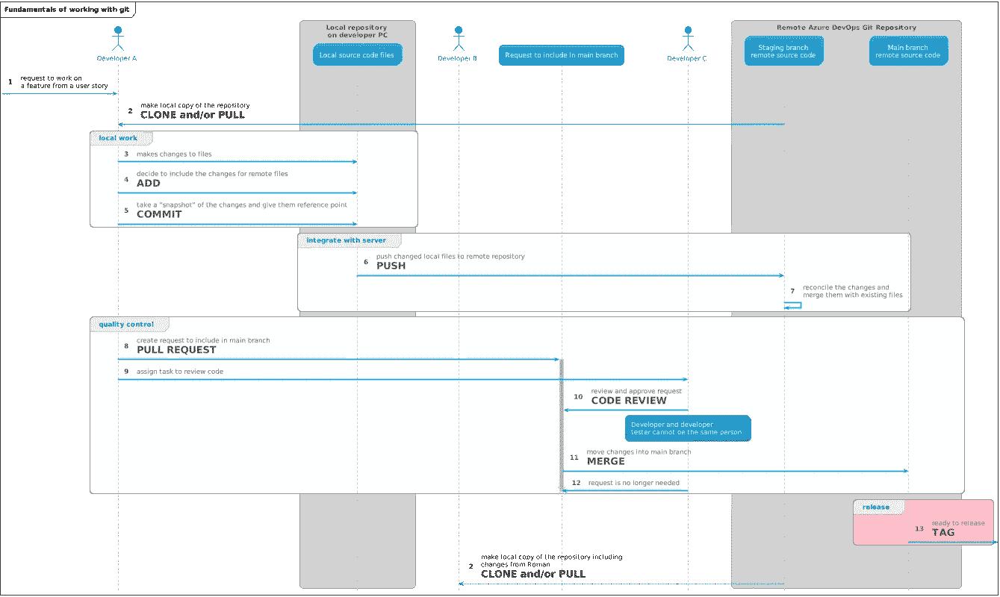
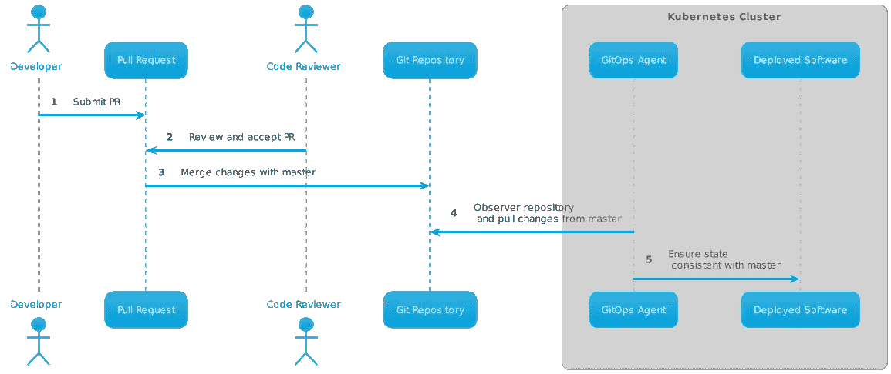
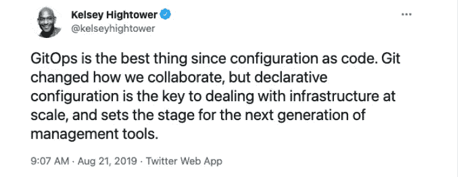

# 与 Kubernetes 的 GitOps

> 原文：<https://itnext.io/gitops-with-kubernetes-740f37ea015b?source=collection_archive---------2----------------------->

由 [Timelab Pro](https://unsplash.com/@timelabpro?utm_source=unsplash&utm_medium=referral&utm_content=creditCopyText) 在 [Unsplash](https://unsplash.com/s/photos/container?utm_source=unsplash&utm_medium=referral&utm_content=creditCopyText) 上拍摄的照片

## 介绍

2017 年，一家云原生公司[weaver works](https://www.weave.works/)发布了一篇名为“[GitOps——通过拉式请求进行操作](https://www.weave.works/blog/gitops-operations-by-pull-request)”的博文。这篇文章引入了术语 **g itOps** 将其定义为*使用 Git 作为真理的来源来操作几乎任何事情。*从那以后，GitOps 运动不断发展壮大，越来越受欢迎。

我们将进一步了解什么是 GitOps 以及它如何应用于 Kubernetes。应用 GitOps 原则我们能获得什么好处？简单用 Git 部署东西和 GitOps 有什么区别？我们能大规模使用 GitOps 吗？

## 饭桶

GitOps，顾名思义，和 Git 有关系。有趣的事实是，GitOps 不一定是真正的(Git)Ops，它也可以是(SVN)Ops 或(Mercurial)Ops，甚至是(版本控制系统)Ops…，但 GitOps 只是更好地脱口而出；)

无论如何，我们都知道并喜欢 Git(当它刚刚工作时)或讨厌它(当我们需要解决合并冲突时)。让我们快速回顾一下，现代的基于 Git 的开发人员工作流是什么样子的。显然，像 Pull 请求这样的特性不属于 Git 版本控制系统，而是属于 GitHub、GitLab 等。在图中，我们看到了开发人员执行的活动，包括作为管理代码变更的良好实践的拉请求。

示例 Git 工作流

上面的例子以一种简化的方式展示了开发人员的工作流程，但是考虑到现在大部分工作是如何通过 Git 库完成的。

## 等等，我们不是一直在做 GitOps 吗？

你可能会问自己，你是不是一直都在做 GitOps？有什么大惊小怪的？你一直在使用 Git，每天都在提交/推送变更！关键的区别是**协调循环**持续发生，确保使用 Kubernetes 集群上的自动化代理**在基础设施端**反映 Git repos 中定义的任何内容。

换句话说； **GitOps =连续交付+连续运营。**

让我们看看 GitOps 原则如何与 Kubernetes 一起工作。假设您的应用程序在 Kubernetes 集群中运行，并且您想要更新其部署清单以增加 CPU 资源余量。以“传统”的方式，你会:

*   修改舵图，kustomize 文件或平面部署 YAML，改变 CPU 的要求和限制，为一个特定的部署
*   使用 kubectl 将更改后的 YAML 应用到集群中

在 GitOps 世界中，不是手动(或通过脚本或管道)将资源应用到集群，而是由一个专门的代理将更改拉入集群并代表您应用它们。

使用 Kubernetes 的 GitOps 流

## 吉托普在库伯内特的优势

Kubernetes 为大规模管理工作负载带来了巨大的力量，但这种力量也伴随着复杂性的代价。人工干预越少，自动化程度越高越好。GitOps 实现了非常高的自动化程度，在我看来这是它最大的好处。

这是凯尔西·海托华对吉托普斯的评价。

## GitOps 工具

GitOps 工具正在迅速成熟，并提供了广泛的功能，涵盖了安全性和第 2 天的操作。我熟悉并且强烈推荐的工具是 [Flux](https://www.weave.works/oss/flux/) 以及 [GitOps Core](https://www.weave.works/product/gitops-core/) (这两款工具都来自 Weaveworks)。同类别还有一个很流行的工具 [ArgoCD](https://argoproj.github.io/argo-cd/) ，但是我不太熟悉。

云提供商也开发他们自己的 GitOps 相关工具。例如，Azure 使用 [Azure Arc](https://docs.microsoft.com/en-us/azure/azure-arc/kubernetes/conceptual-configurations) 和启用 Azure Arc 的 Kubernetes，Google Cloud 使用[云构建](https://cloud.google.com/kubernetes-engine/docs/tutorials/gitops-cloud-build)。

## Kubernetes 清单应用内回购或专用回购

与 GitOps 相关的一个问题是:我应该将我的 Kubernetes YAML 清单放在与我的应用程序(微服务)相同的 repo 中，还是放在专用的 repo 中？

答案取决于你的 app 在做什么，你有多少集群，你的平台团队有多成熟。如果您是一个小团队，并且在一个 Kubernetes 集群上只部署了少数应用程序，那么让您的 Kubernetes 清单与您的应用程序在同一个 repo 中是有意义的。

如果您是一个拥有多个集群的大型团队，那么将特定于集群的 YAML 文件从您的应用程序文件中分离到一个单独的 repo 中可能是一个更好的选择。

最后，请记住，所有 YAML 文件、舵图或其他应用更改到集群的方式都将从这些 Git repos 进行管理，因此请确保您的分支策略是正确的，您会没事的。

## 如果我有 100 多个集群会怎样

Kubernetes on the edge，在规模上，正在成为常态，但是我如何在只有 2 名团队成员的情况下管理多个 Kubernetes 集群？显然，自动化是关键。一个非常有趣的解决方案是[牧场主舰队。](https://fleet.rancher.io/)

牧场船队

使用 GitOps 原则和 Rancher 惊人的大规模管理任何 Kubernetes 集群的功能，我们现在可以同时将 GitOps 原则应用于许多集群。

## 我可以在哪里了解更多信息

了解 GitOps 的最好方法是查看 Weaveworks 博客和资源，例如，[GitOps 指南](https://www.weave.works/technologies/gitops/)，你也可以参与 [GitOps 工作组](https://github.com/gitops-working-group/gitops-working-group)。

你想说服你的团队或老板试一试 GitOps 吗？查看 [GitOps 对话工具包](https://gitops-community.github.io/kit/#need-help-or-want-updates)。

## 结论

我们只是触及了 GitOps 实践如何用于 Kubernetes 应用和基础设施的表面。GitOps 是在云本地空间中越来越流行的一种趋势。值得你花点时间研究一下，看看它能给你和你的团队带来什么好处。