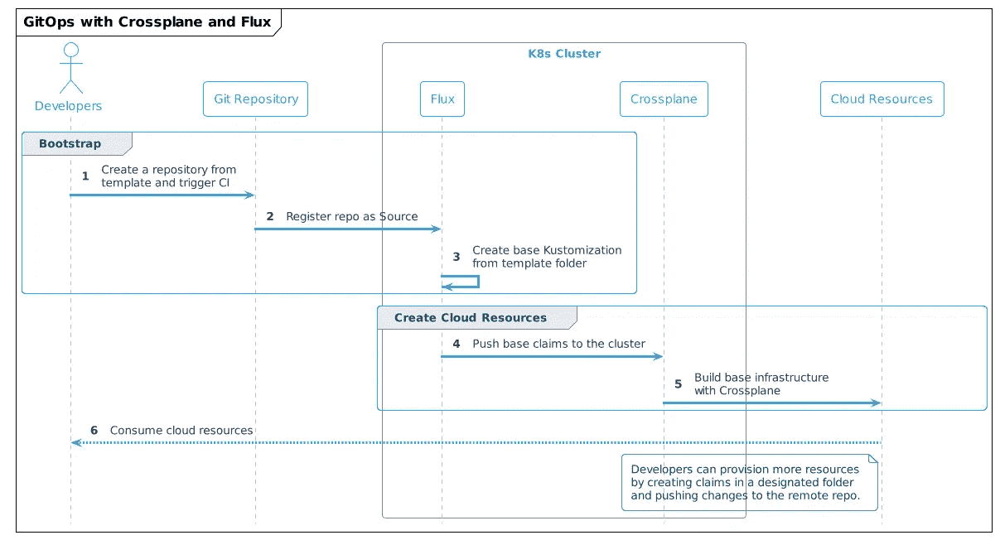
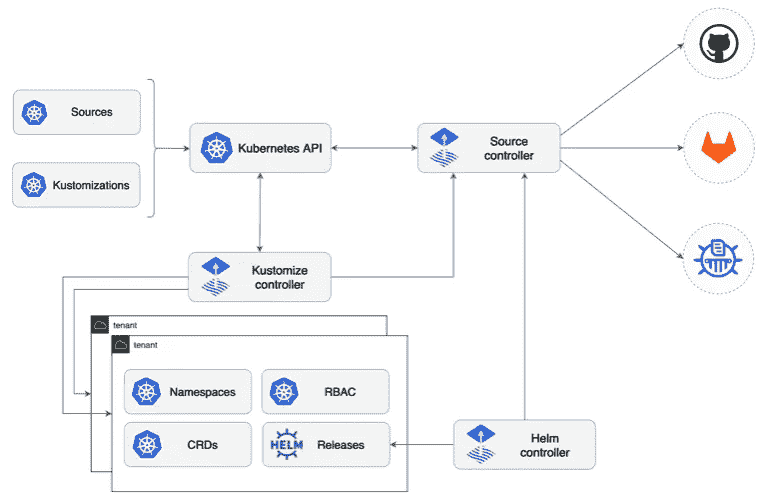
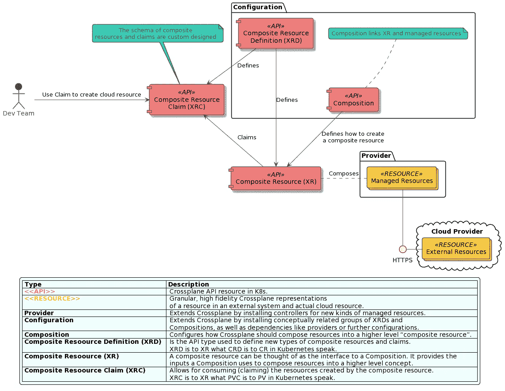
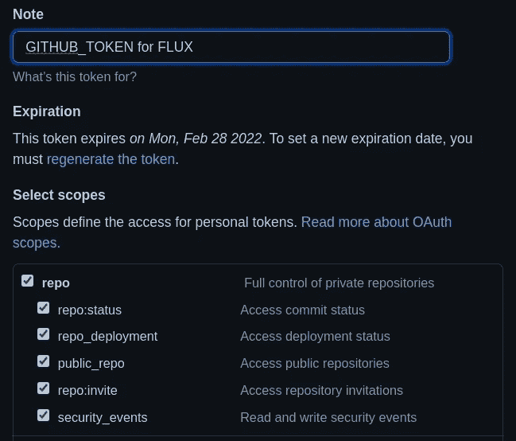
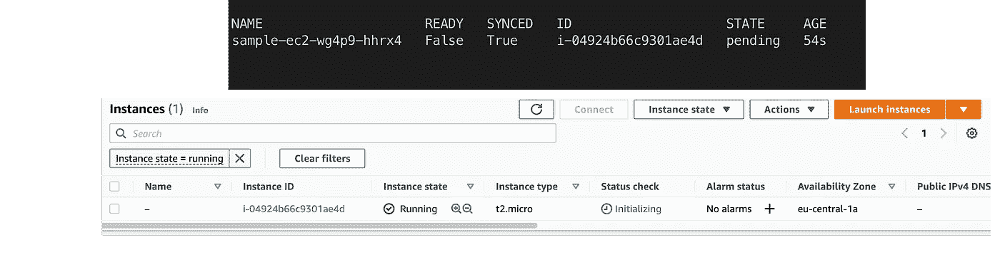
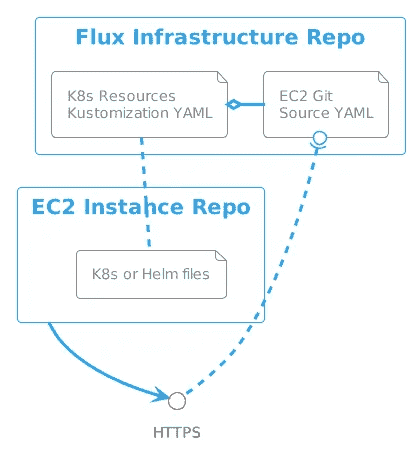

# 具有交叉平面和通量的 GitOpsify 云基础架构

> 原文：<https://itnext.io/gitopsify-cloud-infrastructure-with-crossplane-and-flux-d605d3043452?source=collection_archive---------1----------------------->


在 [Unsplash](https://unsplash.com?utm_source=medium&utm_medium=referral) 上 [Sai Kiran Anagani](https://unsplash.com/@anagani_saikiran?utm_source=medium&utm_medium=referral) 拍摄的照片

在本文中，我们将学习如何通过 Crossplane 自动配置云资源，并将其与 GitOps 实践相结合。

如果你是一名平台或开发工程师、基础设施架构师或运营专家，你将从这个博客中获益匪浅。

> *如果你是 GitOps 的新用户，请在我的博客*[*GitOps with Kubernetes*](/gitops-with-kubernetes-740f37ea015b)中阅读更多信息

让我们通过想象以下背景来搭建舞台。我们是一个大型组织中平台团队的一员。我们的目标是帮助开发团队快速使用我们的云基础设施。以下是一些基本要求:

*   平台团队没有资源来单独处理每个请求，所以必须有非常高的自动化程度
*   公司政策是采用最小特权原则。我们应该只在需要时以最低的权限公开云资源。
*   开发人员对管理云不感兴趣，他们应该只**消耗云资源**，甚至不需要登录云控制台。
*   新团队应该获得**他们自己的**云资源集，以便**在加入平台时进行自我管理**。
*   按需提供新的云资源**应该很容易。**

## **初始架构**

**这些需求引导我们使用以下高级解决方案策略制定初始架构提案。**

*   **为各种类型的工作负载创建模板库(使用后台软件模板会有所帮助)**
*   **一旦新团队加入并从模板创建了第一个存储库，它将触发 CI 管道，并通过将存储库作为源添加到 Flux infrastructure repo 来部署公共基础架构组件**
*   **一旦一个团队想要创建更多的云基础设施，他们可以将跨平面声明 YAMLs 放在其存储库中的指定文件夹中**
*   **使用交叉平面组合很容易实现对这一过程的调整**

> ***在实际场景中，我们也可以使用 Flux 管理交叉平面，但出于演示目的，我们只关注应用程序级别。***

**开发人员的体验应该与此类似:**

****

**来源:作者**

# **工具和实施**

**了解了需求和初始架构，我们就可以开始选择工具了。对于我们的例子，我们将使用的工具是[通量](https://fluxcd.io/)和[交叉平面](https://crossplane.io/)。**

> ***我们将使用 Flux 作为 GitOps 引擎，但同样可以用 ArgoCD 或 Rancher Fleet 实现。***

**让我们看看这两种工具支持的架构和用例。**

## **Flux 架构概述**

**Flux 以 Kubernetes CRDs 和控制器的形式公开了几个组件，这些组件有助于用 GitOps 模型表达工作流。3 个主要组件的简短描述。所有这些组件都有相应的 CRD。**

****

**来源:[https://github.com/fluxcd/flux2](https://github.com/fluxcd/flux2)**

**源控制器的主要作用是提供一个标准化的 API 来管理 Kubernetes 部署的源；Git 和 Helm 库。**

```
apiVersion: source.toolkit.fluxcd.io/v1beta1
kind: GitRepository
metadata:
  name: podinfo
  namespace: default
spec:
  interval: 1m
  url: [https://github.com/stefanprodan/podinfo](https://github.com/stefanprodan/podinfo)
```

**[Kustomize 控制器](https://fluxcd.io/docs/components/kustomize/)这是工作流程中的 CD 部分。源控制器指定数据源，这个控制器指定从存储库中运行什么工件。**

```
apiVersion: kustomize.toolkit.fluxcd.io/v1beta2
kind: Kustomization
metadata:
  name: webapp
  namespace: apps
spec:
  interval: 5m
  path: "./deploy"
  sourceRef:
    kind: GitRepository
    name: webapp
    namespace: shared
```

> **这个控制器可以处理 kustomization 文件，也可以处理普通的 Kubernetes 清单**

**[Helm Controller](https://fluxcd.io/docs/components/helm/) 该操作员帮助管理包含 Kubernetes 清单的 Helm chart 发布，并将它们部署到集群上。**

```
apiVersion: helm.toolkit.fluxcd.io/v2beta1
kind: HelmRelease
metadata:
  name: backend
  namespace: default
spec:
  interval: 5m
  chart:
    spec:
      chart: podinfo
      version: ">=4.0.0 <5.0.0"
      sourceRef:
        kind: HelmRepository
        name: podinfo
        namespace: default
      interval: 1m
  upgrade:
    remediation:
      remediateLastFailure: true
  test:
    enable: true
  values:
    service:
      grpcService: backend
    resources:
      requests:
        cpu: 100m
        memory: 64Mi
```

## **交叉平面架构概述**

**让我们看看交叉板组件模型是什么样子的。一句警告，如果你是 Kubernetes 的新手，这可能是压倒性的，但努力理解它是有价值的。下图显示了交叉面板组件模型及其基本交互。**

****

**来源:作者基于 Crossplane.io**

> ***在我的博客中了解更多关于 Crossplane 的信息* [*基础设施即代码:下一个大转变就在这里*](/infrastructure-as-code-the-next-big-shift-is-here-9215f0bda7ce)**

# ***演示***

***如果你想跟随演示，克隆这个库，它包含了运行演示代码的所有脚本。***

## ***先决条件***

***在这个演示中，我们将展示如何使用 Flux 和 Crossplane 从一个新的 GitHub 存储库中直接提供一个 EC2 实例。这模拟了一个新团队加入我们的平台。***

***要继续操作，您需要在本地机器上配置 AWS CLI。***

> ****获得凭证后，按照本教程* *中的* [*为 AWS CLI 配置默认配置文件。*](https://docs.aws.amazon.com/cli/latest/userguide/cli-configure-quickstart.html#cli-configure-quickstart-config)***

***本地安装您将需要:***

*   ***Docker 桌面或其他容器运行时***
*   ***使用 Windows 时的 WSL2***
*   ***库贝特尔***

***在项目的根文件夹中运行`make`，这将:***

> ****如果你在 Mac 上运行，用* `*make setup_mac*` *代替* `*make*` *。****

*   ***如果尚未安装，安装[种类](https://kind.sigs.k8s.io/)(Docker 中的 Kubernetes)***
*   ***创建一种称为交叉平面集群集群，并向其交换上下文***
*   ***使用舵安装交叉板***
*   ***如果尚未安装，请安装交叉面板 CLI***
*   ***如果尚未安装 flux CLI，请安装它***
*   ***在群集上安装 AWS 提供程序***
*   ***基于默认 CLI 配置文件创建一个带有 AWS 凭据的临时文件***
*   ***在交叉平面系统名称空间中使用 AWS 凭证创建一个秘密***
*   ***将 AWS 提供程序配置为使用秘密来提供基础设施***
*   ***删除带有凭证的临时文件，这样它就不会被意外签入存储库中***

***以下工具需要手动安装***

*   ***[GitHub CLI gh](https://github.com/cli/cli#installation)***

> ******重要提示:演示代码将在 eu-centra-1 地区创建一个小型 EC2 实例。作为演示的一部分，将删除实例和底层基础结构，但请确保所有资源都已成功删除，如果演示流程出现任何中断，请准备好手动删除资源。******

## ***设置通量储存库***

*   ***使用`make`创建一个新的集群，这将安装带有 AWS 提供者的交叉面板，并配置密码以访问选定的 AWS 帐户***
*   ***Flux CLI 是作为 Makefile 脚本的 put 安装的，但是您也可以选择为 CLI 配置 shell 完成功能`. <(flux completion zsh)`***
*   ***更多安装选项参考[焊剂文件](https://fluxcd.io/docs/installation/#install-the-flux-cli)页***
*   ***在 GitHub 中创建一个拥有完全回购权限的[访问令牌](https://github.com/settings/tokens)。***

******

*   ***为您的 GitHub 用户和新创建的令牌导出变量***

***`export GITHUB_TOKEN=<token copied form GitHub>`***

***`export GITHUB_USER=<your user name>`***

*   ***使用 flux 引导一个新的 GitHub 库，这样 flux 可以管理自己和底层基础设施***

> ***Flux 将寻找 GITHUB_USER 和 GITHUB_TOKEN 变量，一旦找到，将在 GITHUB 上创建一个私有存储库，Flux 的基础设施将被跟踪。***

```
*flux bootstrap github  \
        --owner=${GITHUB_USER} \
        --repository=flux-infra \
        --path=clusters/crossplane-cluster  \
        --personal*
```

## ***设置交叉平面 EC2 组合***

***现在，我们将安装一个[交叉平面组合](https://crossplane.io/docs/v1.6/concepts/composition.html#configuring-composition),它定义当有人请求 EC2 声明时创建什么样的云资源。***

*   ***为创建 EC2 实例设置交叉平面组合和定义***
*   ***`kubectl crossplane install configuration piotrzan/crossplane-ec2-instance:v1`***
*   ***使用 EC2 声明`gh repo fork https://github.com/Piotr1215/crossplane-ec2`派生存储库，并在提示是否克隆存储库时回答 YES***

## ***克隆 Flux 基础知识库***

*   ***克隆在您的个人存储库中创建的 flux infra 存储库***
*   ***`git clone git@github.com:${GITHUB_USER}/flux-infra.git`***
*   ***`cd flux-infra`***

## ***添加源***

*   ***添加源代码库来告诉 Flux 要观察和同步什么***
*   ***Flux 将注册这个库，并每 30 秒检查一次变化。***
*   ***在 flux-infra 存储库中执行下面的命令，它将添加一个 Git 源***

```
*flux create source git crossplane-demo \
   --url=[https://github.com/${GITHUB_USER}/crossplane-ec2.git](https://github.com/${GITHUB_USER}/crossplane-ec2.git) \
   --branch=master \
   --interval=30s \
   --export > clusters/crossplane-cluster/demo-source.yaml*
```

*   ***前面的命令在 clusters/crossplane-cluster 子文件夹中创建了一个文件，提交该文件***

***`git add .`***

***`git commit -m "Adding Source Repository"`***

***`git push`***

*   ***执行`kubectl get gitrepositories.source.toolkit.fluxcd.io -A`查看动态的 Git 存储库源代码***

## ***创建通量库管理***

*   ***AWS 托管资源上的设置监视，目前应该没有***
*   ***`watch kubectl get managed`***
*   ***创建 Flux Kustomization，通过交叉平面 EC2 声明监视存储库中的特定文件夹***

```
*flux create kustomization crossplane-demo \
  --target-namespace=default \
  --source=crossplane-demo \
  --path="./ec2-claim" \
  --prune=true \
  --interval=1m \
  --export > clusters/crossplane-cluster/crossplane-demo.yaml*
```

***`git add .`***

***`git commit -m "Adding EC2 Instance"`***

***`git push`***

*   ***大约一分钟后，您应该会看到一个新的 EC2 实例与 AWS 中的 Crossplane 和 resources 同步***

******

## ***概述***

***让我们后退一步，确保我们理解所有使用的资源和存储库。***

******

***我们创建的第一个存储库是 Flux 用来在集群上管理自身以及其他存储库的。为了告诉 Flux 关于具有交叉平面 EC2 声明的存储库，我们创建了一个`GitSource` YAML 文件，它指向具有 EC2 声明的存储库的 HTTPS 地址。***

***EC2 声明存储库包含一个文件夹，普通 Kubernetes 清单文件就位于其中。为了告诉 Flux 观察什么文件，我们创建了一个`Kustomization`，并通过它的名字将它与`GitSource`链接起来。`Kustomization`指向包含 K8s 清单的文件夹。***

## ***清除***

*   ***要清理 EC2 实例和底层基础设施，请从 crossplane-ec2 存储库中删除 claim-aws.yaml 演示***

***`rm ec2-claim/claim-aws.yaml`***

***`git add .`***

***`git commit -m "EC2 instance removed"`***

*   ***在提交或定时器失效后，Flux 将同步，Crossplane 将拾取移除的伪影并删除云资源***

> ***在索赔 yaml 被删除后，ec2-claim 文件夹必须存在于 repo 中，否则 Flux 无法协调***

## ***手动清理***

> ****如果您无法使用存储库，可以通过从 flux 中删除它们来清理资源。****

*   ***删除 Flux kustomization `flux delete kustomization crossplane-demo`将从集群和 AWS 中删除所有资源***
*   ***为了清理 ec2 实例和底层基础设施，从集群中删除 EC2 声明`kubectl delete VirtualMachineInstance sample-ec2`***

## ***集群清理***

*   ***等到`watch kubectl get managed`输出不包含任何 AWS 资源***
*   ***用`make cleanup`删除集群***
*   ***选择性地移除`flux-infra`储存库***

# ***摘要***

***带有 Flux 或 Argo CD 和 Crossplane 的 GitOps 为平台构建者提供了一个非常强大和灵活的模型。在本演示中，我们将重点放在 Kubernetes 集群的应用程序方面，这些集群以其他方式部署，包括交叉平面、机群或集群 API 等。***

***在使用 Crossplane 的资源模型的基础上，我们实现了这样一个事实，即我们不再直接与 kubectl 交互来管理资源，而是将此活动委托给 Flux。交叉平面仍然在集群上运行，并协调所有资源。换句话说，我们已经将 API 表面从 kubectl 转移到 Git。***