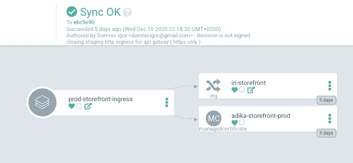
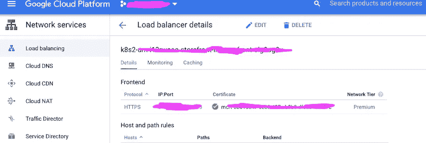

# GKE 管理的 SSL 证书——实际应用

> 原文：<https://itnext.io/gke-managed-ssl-certificates-in-action-4b533fb3ca22?source=collection_archive---------5----------------------->


由 [Unsplash](https://unsplash.com?utm_source=medium&utm_medium=referral) 上的 [Loic Leray](https://unsplash.com/@loicleray?utm_source=medium&utm_medium=referral) 拍摄的照片

如果你正在编写一个 api 网关，你需要 TLS 终止(https 请求)，你可能不想自己管理 SSL 证书(由所有互联网信任的人签名的公钥)。如果你用 GKE。一个简单的解决方案是使用一个 k8s 入口一个名为***managed certificate****的 CRD 和几个注释，所有[你需要做的就是按照文档](https://cloud.google.com/kubernetes-engine/docs/how-to/managed-certs)做，我就是这么做的，并且偶然发现了如此多的问题，这变得非常痛苦。谷歌在实现这个功能方面做得很好，但是在记录方面做得很差。在这篇文章中，我将尝试走一遍设置过程。*

> *TL；dr — [这是这篇文章描述的所有内容的导航图。](https://github.com/viggin543/gke_managed_ssl_ingress_chart)——(可与 [argocd](https://argoproj.github.io/argo-cd/) 一起使用，可视化游戏中的实体)*

**

*argocd 在集群上应用舵图*

## *静态 ip*

*简单的部分，保留一个 IP 在 GCP，并分配给它一个 DNS 记录。*

```
**gcloud* compute addresses create reserved-ip-name--global
*gcloud* compute addresses describe reserved-ip-name--global

*gcloud* dns record-sets transaction start --zone=*<*ZONE NAME*>
gcloud* dns record-sets transaction add 79.179.75.123 --name=*bannana.com* --ttl=300  --type=A --zone=*<*ZONE NAME*>
gcloud* dns record-sets transaction execute --zone=*<*ZONE NAME*>**
```

**ZONE_NAME* 是 GCP dns 托管区域的名称，这里唯一值得一提的是，GCP DNS 托管区域应该连接到某个公共 DNS 服务器。(托管区域应连接到互联网……)*

## *托管证书资源*

*如果你正在使用 GKE，谷歌在你不知情的情况下在你的集群中安装了一个名为***managed certificate****的 CRD。这个资源真的很简单。**

```
***apiVersion*: networking.gke.io/v1
*kind*: ManagedCertificate
*metadata*:
  *name*: banana-cert
*spec*:
  *domains*:
    - banana.com**
```

**当您将它应用到集群时，它应该立即反映以下事件。**

```
**kubectl apply -f managedCert.yamlkubectl describe ManagedCertificate some-valid-dns-nameAPI Version:  networking.gke.io/v1
Kind:         ManagedCertificate
Metadata:
  Creation Timestamp:  2020-12-16T10:13:12Z
  Generation:          2
  Resource Version:    57704800
  Self Link:           /apis/networking.gke.io/v1/namespaces/******/managedcertificates/adika-storefront-prod
  UID:                 *****
Spec:
  Domains:
    banana.com
Status:
  Certificate Name:    mcrt-*******************
  Certificate Status:  Provisioning
  Domain Status:
    Domain:  banana.com
    Status:  Provisioning
Events:
  Type    Reason  Age   From                            Message
  ----    ------  ----  ----                            -------
  Normal  Create  32s   managed-certificate-controller  Create SslCertificate mcrt-some-uuid-here**
```

****“创建”**事件，通知 ***状态:准备*** 。这意味着 ***托管证书控制器、***k8s 控制器[(链接到回购)](https://github.com/GoogleCloudPlatform/gke-managed-certs)。那就是管理***managed certificate***资源。开始工作。如果在***kubectl describe***命令的 events 部分看不到任何东西，这意味着有问题。要么您的集群版本不是最新的，要么您今天运气不好，您需要以某种方式唤醒这个控制器，例如通过升级您的集群版本(这是我必须做的)。**

**在应用 k8s 资源之后，应该立即在 GCP 创建一个托管证书实体。你可以通过跑步得到它**

```
**gcloud beta compute ssl-certificates list**
```

**这应该会打印出您的 kubectl describe 命令中列出的证书名称***mcrt-some-uuid-here***。此外，证书名称应该是一个有效的 dns 名称，除了[a-z][A-z]之外不能有其他字符。-[0–9].如果这不起作用，并且在应用了***managed certificate***之后，GCP 负载平衡器证书未被创建。不要继续。**

## **入口**

**接下来您需要的是一个 ***K8S 入口*** ，它将通过一个注释链接到***managed certificate***，并链接到一个节点端口服务(不要尝试其他服务类型..)将在端口 80 上侦听，并在“/”路径上用 200 来回答 GET 请求。(你希望他们把它写在文件里……)**

```
***apiVersion*: networking.k8s.io/v1beta1
*kind*: Ingress
*metadata*:
  *name*: ingress-name
  *annotations*:
    *kubernetes.io/ingress.global-static-ip-name*: reserved-ip-name
    *networking.gke.io/managed-certificates*: banana-cert
    *kubernetes.io/ingress.allow-http*: "false" 
# a bonus, disablles http on the load balancer
*spec*:
  *rules*:
  - *host*: banana.com
    *http*:
      *paths*:
        - *path*: /*
          *backend*:
            *serviceName*: banan-service
            *servicePort*: 80**
```

**现在，这里发生了一些事情。**

****证书可以被激活(记住*状态:供应..)*****

**此外，配置托管证书的 dns 应该指向我们示例中的【kubernetes.io/ingress.global-static-ip-name.】***dig bannana.com，*** 应该解析为您预先创建的保留静态 ip。**

**最后，入口指向的服务应该是 ***节点端口*** 服务，它应该监听端口 80。将创建一个 GCP 负载平衡器，它将通过在“/”路径上调用该服务来检查该服务的运行状况。所以确保它返回 200。**

**如果一切正常，您创建的入口应该会收到 GKE 魔术的两个附加注释。**

```
**ingress.gcp.kubernetes.io/pre-shared-cert: mcrt-some-uuid-here
      ingress.kubernetes.io/backends:'{"k8sbe-":"HEALTHY","k8sbe":"HEALTHY"}'**
```

**第一个注释将入口与 GCP 负载平衡器证书链接起来，第二个注释描述了与其连接的健康后端。**

**如果你幸存了这么久。恭喜，您已经有了一个连接到 k8s 集群中所有节点的 GCP 负载平衡器，它执行 ssl 终止和自动证书供应和轮换。**

****

**ssl 终端负载平衡器**

**干杯！**