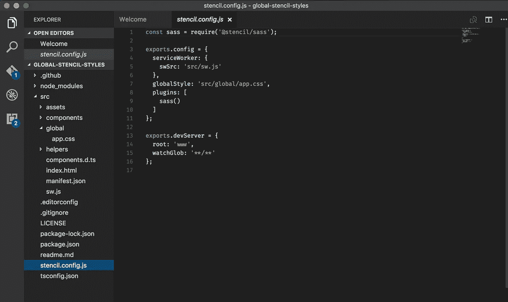

# 带有模板的全局 CSS 和 SASS 变量

> 原文：<https://itnext.io/global-css-sass-variables-with-stencil-7e7bc08ec659?source=collection_archive---------7----------------------->

为你的应用程序创建一个全局风格对于优秀的设计和快速增量变化的能力都是至关重要的。它有助于创建一个有凝聚力的 SPA，让所有的组件和功能具有相似的重要性和相同的风格，这样用户就可以直观地看到每个部分是做什么的。然后，当你的产品所有者决定改变他们所有的商标和配色方案时，你只需要编辑一个变量文件和 viola！应用程序的全新外观。你甚至可以设置你的应用程序，让用户可以在不同的配色方案之间切换！‍(你好黑暗模式)

# 前情提要

如果你来自离子应用或角度应用，你可能见过类似这样的全局样式。

爱奥尼亚角的全球风格

这里有两种格式。一个是设置颜色“函数”,另一个是覆盖 Ionic 为其组件引入的本地全局样式。我们将向您展示如何在模板 PWA 中实现相同的功能

# 节点 Sass

Stencil 使用一个名为 [node-sass](https://github.com/sass/node-sass) 的插件让你在 pwa 中编写 sass，然后在 node 中编译成 css。现在你不会从文档中知道它(虽然在一些 ionic 文档中隐藏了一行)，但是其中一个可用的特性是能够设置将被添加到每个 css 文件中的全局路径。这允许您将变量、混合和全局样式包含到您的项目中，以便在任何地方都可以访问。

为此，我们将从 [ionic-pwa-toolkit](https://github.com/ionic-team/ionic-pwa-toolkit) 开始。按照回购中的说明下载它，或者如果你已经有一个模板项目放在一起，你可以从我们在一个类似的目录结构。我们将从编辑 stencil.config.js 文件开始

模具配置和目录结构

首先，我们需要配置 node-sass 插件来找到我们的变量文件，并将其插入到所有其他 scss 文件之前。为此，我们将“injectGlobalStyles”参数添加到我们的配置中。

‍

现在我们需要实际创建刚才引用的文件。在 src/global 目录中，创建一个名为 variables.scss 的文件，我们将在其中存放所有的全局样式变量。当我们这样做时，我们将从创建 sass 变量开始，这些变量可以在我们的 pwa 中的任何地方被引用。‍

我们的第一个全球风格！

# 设置色彩映射表

重复 ionic-angular 早期颜色功能的最佳方式是使用 Sass 中的 map-get 操作符。要设置一个类似于我们之前的颜色映射，在您的 variables.scss 文件中，添加一个如下所示的映射，然后使用 map-get 引用该映射。

# 覆盖离子全局变量

你可能想在你的应用程序中做的事情是覆盖某些 Ionic 全局样式和变量。让我们通过将 ionic 的默认应用程序颜色更改为我们现在设置的主要和次要颜色来做到这一点。这里的主要区别是，要覆盖变量，应该在“:root”选择器上使用 css 变量，而不是 sass 变量。

覆盖 ionic 全局样式

# 了解更多信息

如果你有兴趣学习更多关于用模板开发组件的知识，或者用模板和角度构建 PWA，去我的课程区[注册](https://www.pwatoday.com/pricing)参加我们的教程。‍

*最初发表于*[T5【www.pwatoday.com】](https://www.pwatoday.com/post/global-css-sass-variables-with-stencil)*。*