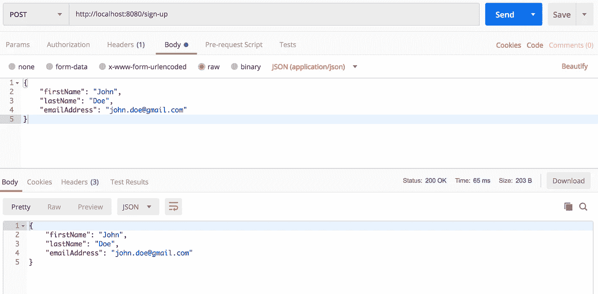
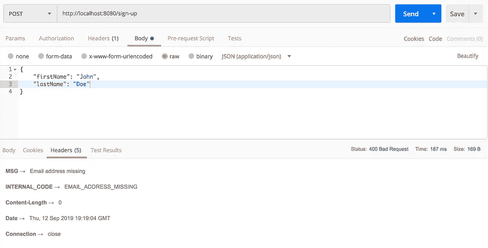
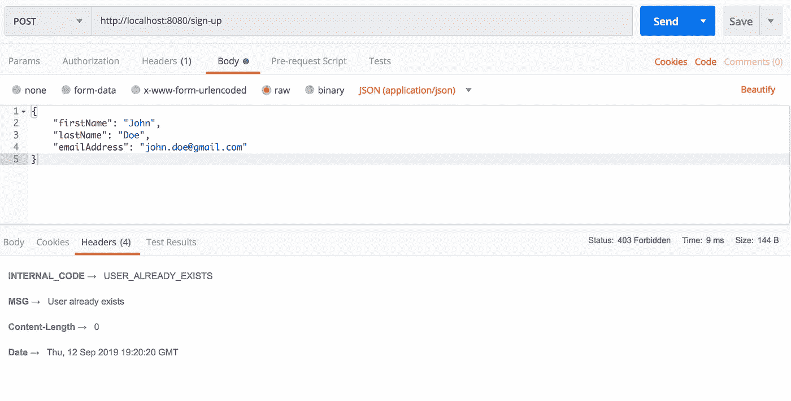

# REST 的全局错误处理

> 原文：<https://itnext.io/global-error-handling-for-rest-ba708f790679?source=collection_archive---------1----------------------->

## 用 Spring 处理 REST 异常的集中式系统

> **场景**。前端正在向后端服务执行 REST，但出现了错误。我们如何通知最终用户是什么导致了服务器端的特定错误？

由[内森·杜姆劳](https://unsplash.com/@nate_dumlao?utm_source=medium&utm_medium=referral)在 [Unsplash](https://unsplash.com?utm_source=medium&utm_medium=referral) 上拍摄的照片

当我们开发后端服务，为 REST 请求服务时，总是建议考虑一个正确的，或者至少是集中式的异常处理系统，能够处理在业务逻辑执行期间出现的异常。

在大多数情况下，不仅要告知最终用户由于执行请求而导致的一般性错误，更具体地说，还要告知最终用户在执行过程中到底出了什么问题。

例如，我们可以考虑一个注册流程，通过该流程，用户可以通过提供他们的*名*、*姓*和*电子邮件地址*进行注册。
在此阶段，如果没有提供强制数据，或者如果两个不同的用户试图用相同的电子邮件地址注册，服务器端业务逻辑可能会引发特定的异常。

显然，我们需要向前端发送一个自定义消息和内部错误代码以及通常的 *400 错误请求* [HTTP 状态代码](https://en.wikipedia.org/wiki/List_of_HTTP_status_codes)或其他。(对于每个缺失的强制信息或执行的禁止操作，都会发送一个特定的内部错误代码)

在这个故事中，定制代码和消息通过响应头流动。

因此，我们如何聪明地捕捉异常，保持系统的集中化，并提供内部代码来定制针对用户的错误消息呢？
答案是**异常处理程序**！

通过异常处理程序，可以处理和集中后端服务在执行期间引发的每个自定义异常。

让我们看看它是如何工作的。

首先，有必要创建我们要处理的异常。

之后，让我们创建异常处理程序组件。

1.  @ *ControllerAdvice* 注释允许将多个 *@ExceptionHandler* 合并到一个单一的全局错误处理组件中
2.  @ *ExceptionHandler* 注释，由于有了 *value* 属性，允许定义对于一个特定的引发异常必须调用哪个方法
3.  总是需要定义一个特定的 HTTP 响应状态代码；
    我们用*不好请求*和*禁止*
4.  使用自定义内部错误代码和消息定义自定义响应标头

现在，让我们创建一个模拟用户的 POJO

…包含内部错误代码的枚举…

…和一个处理注册请求的 REST 控制器。

如果成功，控制器与注册用户进行应答。

## 测试和结论

现在，我们可以用[邮递员](https://www.getpostman.com/downloads/)来测试 REST 控制器。

成功案例—响应正文中没有自定义标头和 200 个 HTTP 响应代码，并且保存了用户

在下面的快照中，我们可以注意到响应正文是空的，而标题中则填充了内部错误代码和消息。

通过这种方式，前端知道服务器端具体出了什么问题，并可以用明确的响应消息通知最终用户。

1.缺少电子邮件地址 2。缺少姓氏 400 HTTP 错误请求状态代码

我们正在尝试保存两个具有相同电子邮件的用户— 403 HTTP 禁止状态代码

最后，在这个故事中，我们学习了如何创建一个能够处理自定义异常的集中式系统。此外，我们还学习了如何通过响应头传输定制的内部服务器错误代码和消息。

你可以在这里从 GitHub 资源库下载项目。