# gloo:Kubernetes 上的功能网关、服务发现和服务路由

> 原文：<https://itnext.io/gloo-function-gateway-service-discovery-and-service-routing-on-kubernetes-8d6416af2c95?source=collection_archive---------0----------------------->

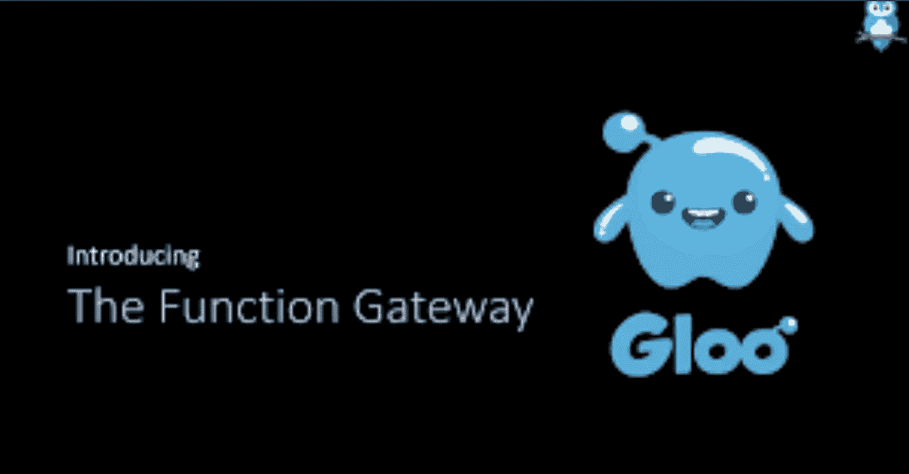

gloo.solo.io

混合部署由微服务、单片和无服务器功能组成。跨多个平台的服务在技术上需要多个 API 构造，这就要求 API 网关模式在客户端和与之通信的后端服务之间提供一个抽象层。

考虑到微服务，API 网关模式主要解决“基于微服务的应用程序的客户端如何访问单个服务？”它处理第一层身份验证，并根据其服务注册中心中的映射将传入的请求(类似于反向代理)路由到相应的服务。认证、监控和流量管理等功能在 API Gateway 中实现，这样服务就不会知道这些细节，并对消费者隐藏这些细节。

Solo 的 Gloo 是一个建立在[特使代理](https://www.envoyproxy.io/)之上的功能网关。Envoy 在服务或 IP 级别上路由，并且可以通过编写过滤器来扩展，Gloo 使用这些过滤器在功能级别上工作。与所有其他网关一样，Gloo 执行类似的功能(发现、路由、功能到功能的转换),在功能级别将传入的请求和事件路由到上游功能。

Gloo 为访问所有服务提供了一个统一的/全局的入口点，可以从客户端使用的任何接口翻译到后端使用的任何接口。Gloo 添加了与后端服务交互的基础设施，知道服务所期望的特定 API，这将 Gloo 与简单地将 API 调用路由到服务的其他网关区分开来。

Envoy 与 Gloo 一起运行，并通过以平台无关的方式提供通用功能来抽象网络。Gloo 聚合了来自客户端的 REST APIs 和事件调用，将集群内、集群外、跨集群的服务以及任何无服务器功能提供者“粘合”在一起。

Gloo 控制平面组件部署为 Kubernetes 部署:

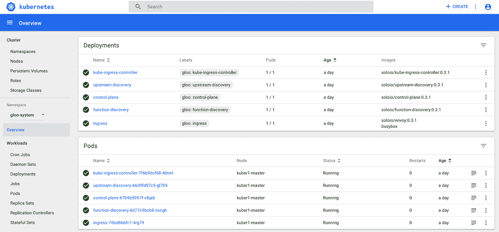

Kubernetes 上的 Gloo 控制飞机

Gloo 的功能发现不断地观察功能和功能更新，并创建一个上游。

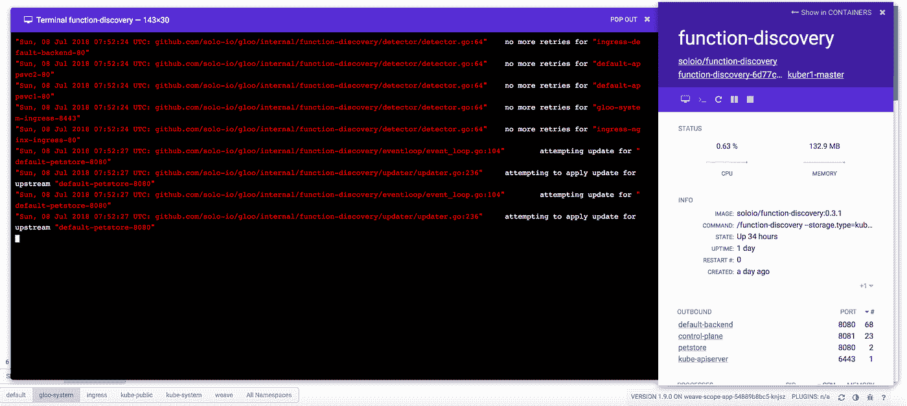

Gloo —功能发现

上游发现轮询主机从 Envoy 接收和请求的所有上游连接，并返回响应。

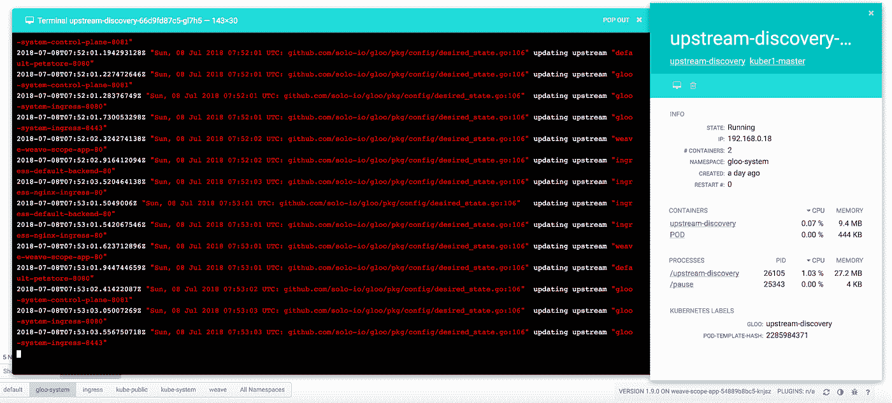

Gloo —上游发现

Kubernetes Ingress 控制器扩展了 Gloo 配置语言以支持 Kubernetes Ingress 语言，使 Gloo(和 Envoy)能够监控和应用 [Kubernetes Ingress 规则](https://kubernetes.io/docs/concepts/services-networking/ingress/)。

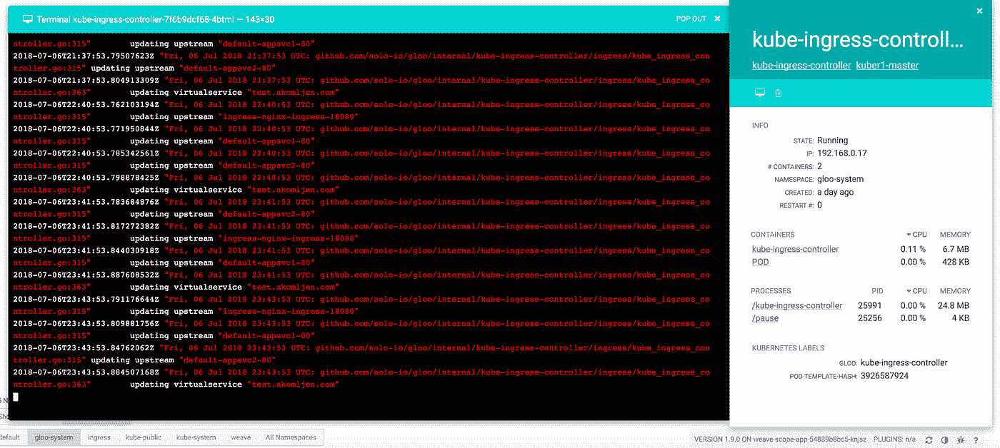

入口控制器

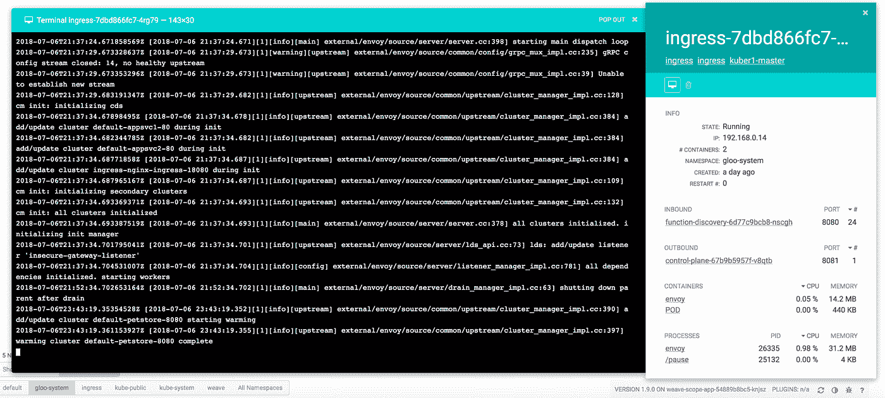

Gloo —入口控制器

Envoy 容器被部署为 application-pod 的一部分，并与 Gloo 的控制器进行交互，以将请求路由到 Kubernetes 服务以及 Gloo 的基于用户定义的规则的功能。

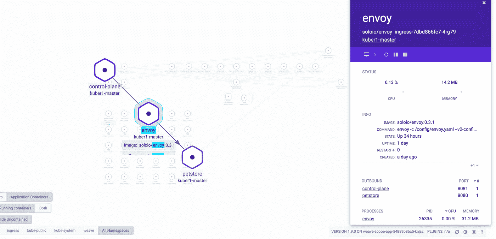

路由请求特使

# Kubernetes 上 Gloo 的基本路由(API 到服务)

Gloo 方便用户实现基本的服务发现，并将请求路由到创建的服务，实现基于应用规范的可用功能。在本例中，使用 Gloo 的官方示例实现了一个基本路由。

petstore 部署与指向该部署的服务一起创建。该部署是一个具有 API (swagger)端点的应用程序，Gloo 将自动识别该应用程序。

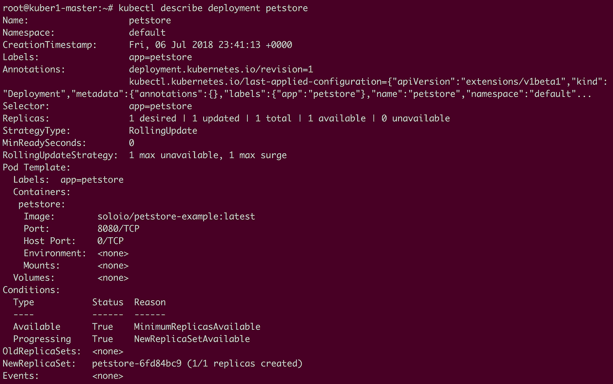

示例部署

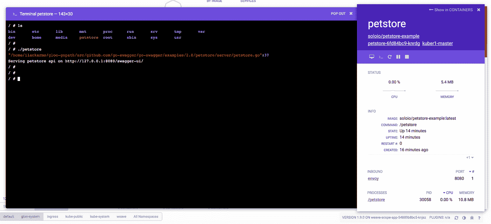

Petstore 示例

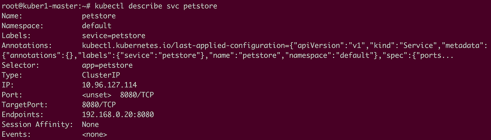

Petstore Kubernetes 服务

发现服务会自动创建一个上游。上游只不过是路由的目的地。在这种情况下，将为上面创建的 petstore 应用程序创建一个上游。glooctl 提供了一个用于查询 Gloo 对象的 CLI。

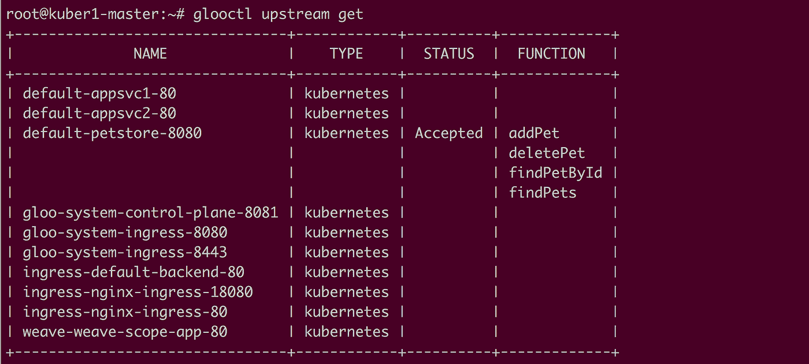

Gloo —上游

如上所示，Gloo 的功能发现服务自动识别所有可用的 rest 端点。应用程序的功能规范已确定，所有端点都在 Gloo 的功能规范中配置。

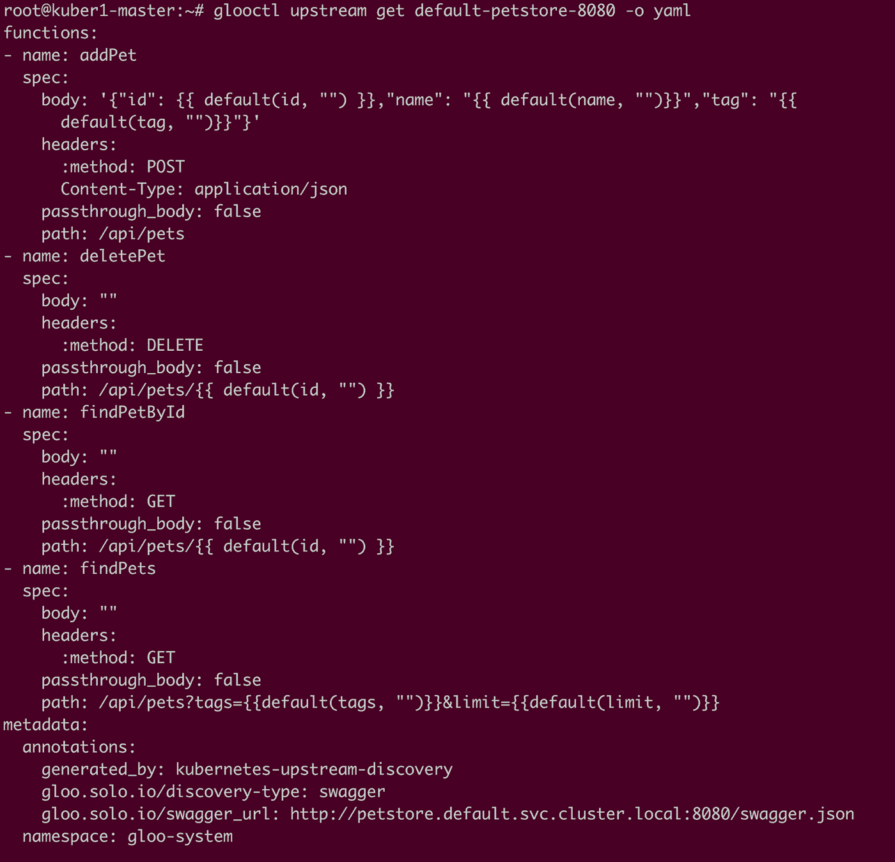

Gloo —端点发现

可以使用 glooctl 创建一个带有前缀重写标志的路由，使 Envoy 能够更改上述服务的传出请求的路径:

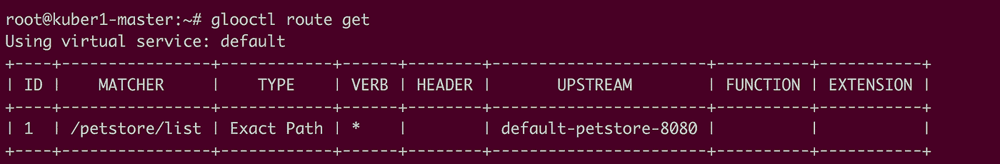

Gloo —路线

虚拟服务与上面创建的路由一起被创建。

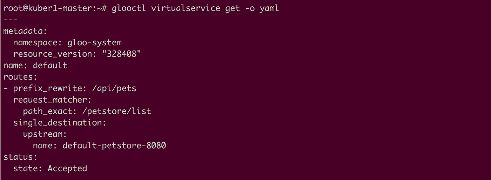

Gloo —虚拟服务

如上所示，在这种情况下，上游的单个目的地与请求匹配器“/列表”一起配置。这应该能够使用在虚拟服务配置中创建的特定匹配器路径与上面创建的服务进行通信。

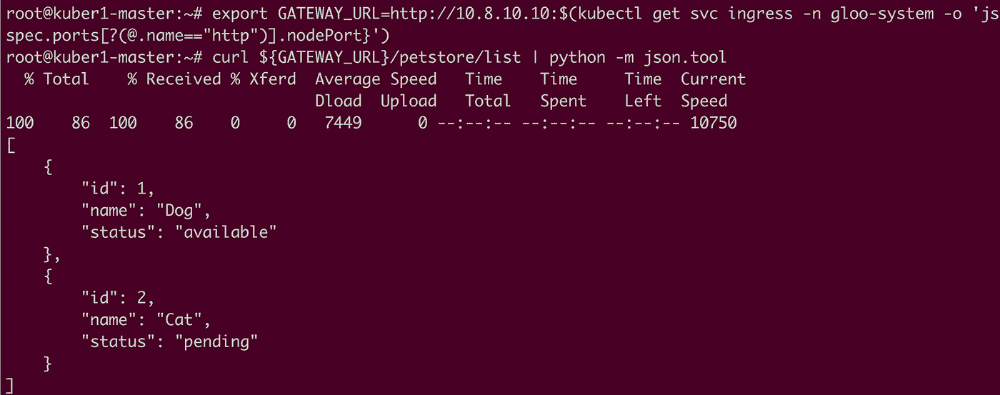

Gloo —目的地服务

如下所示，请求被重定向到 petstore 应用程序。

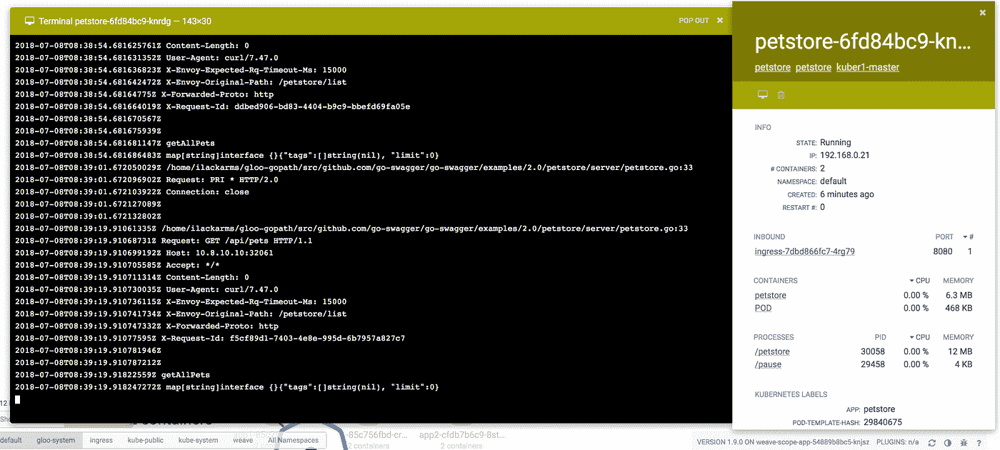

这显示了服务路由的传统 API。

# Kubernetes 上 Gloo 的功能路由(功能到服务)

Gloo 使用户能够传递一个函数，同时创建一个便于函数级路由的路由。

函数由路由中的名称引用。Gloo 的函数规范是 google.protobuf.struct 类型，由上游插件为上游的类型指定。

```
name: string
spec: {google.protobuf.Struct}
```

用 route 定义函数:

```
*glooctl* *route* *create* *\*--*path*-*exact* */petstore/findPet* *\*--*upstream* *default*-*petstore*-*8080* *\*--*function* *findPetById*
```

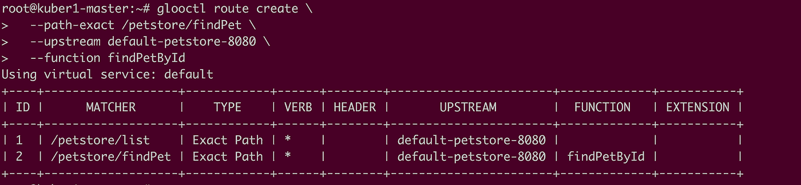

Gloo 创建路线

这将创建一个新的匹配器和一个函数参数。现在定义的函数是“findPetById”

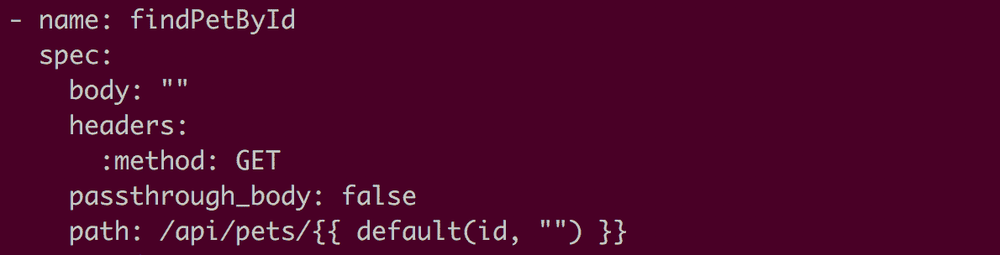

匹配器配置

这样，可以使用 ID 字段进行请求:

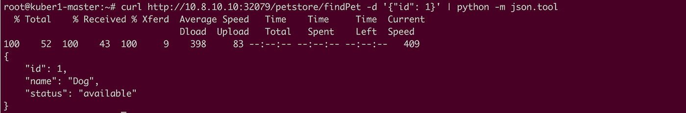

使用 ID 的请求

也可以使用参数来提供基于标题的分类。可以将参数字段添加到现有的路由配置中。

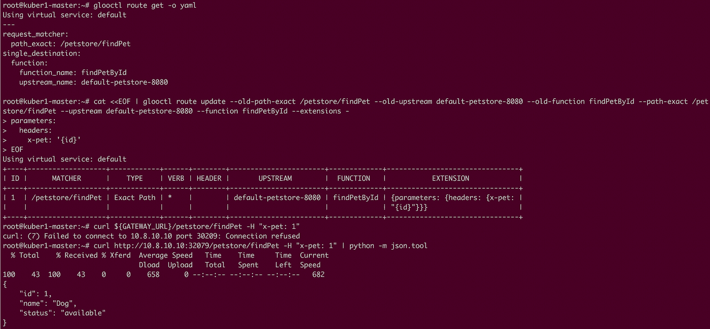

使用标题的请求

在上面的例子中，请求可以使用一个头字段。

Gloo 将任意数量的后端提供的单个功能聚合到前端的单个 API 中，使开发人员能够与跨多个平台的服务进行交互，而无需担心平台特定的信息。Gloo 有助于复杂的功能级路由、功能级流量分离、功能扇出和功能级鸭翼。