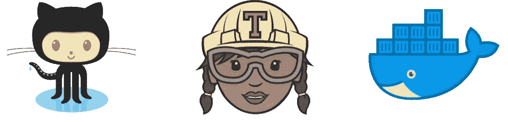
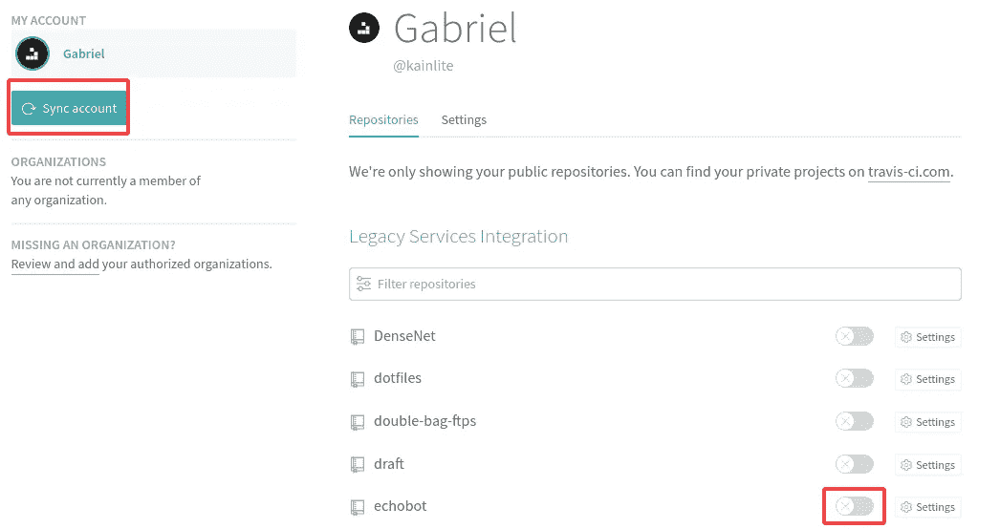
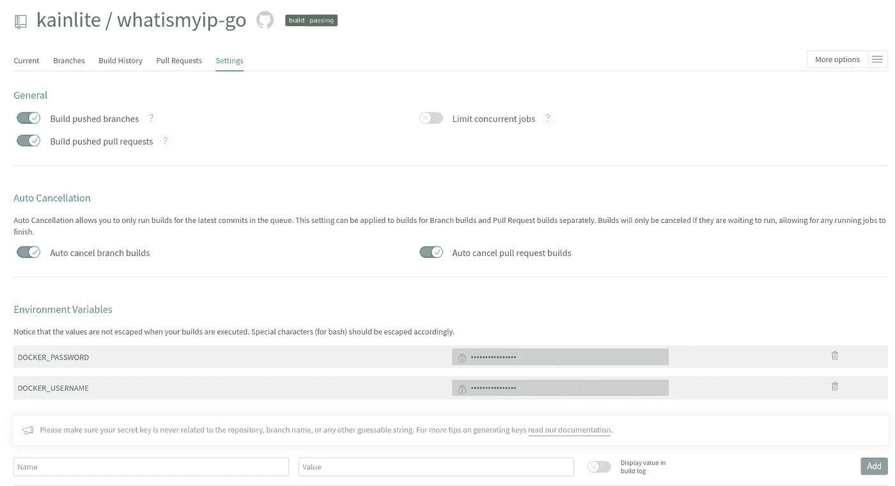
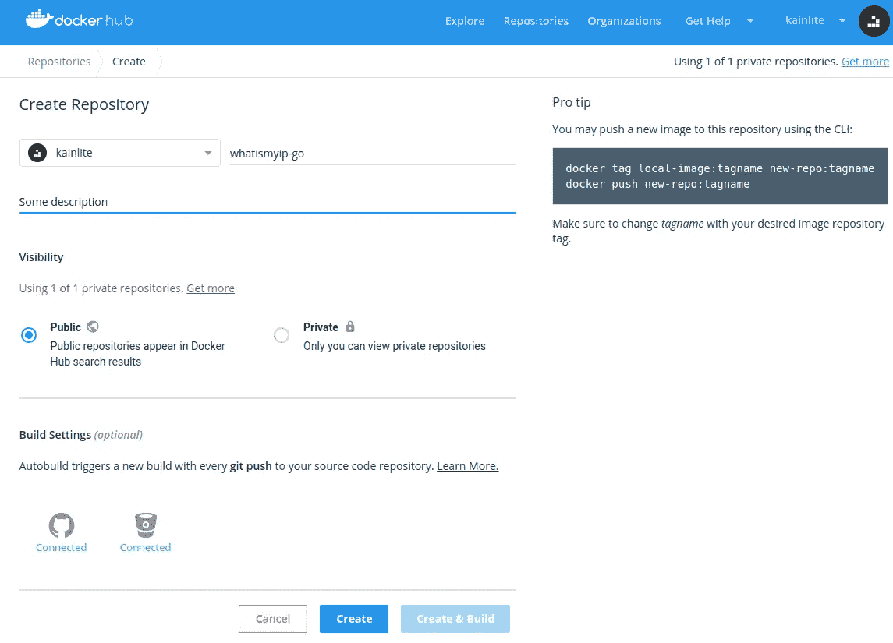
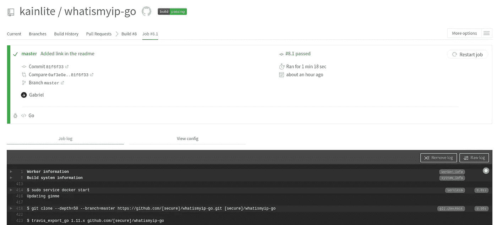
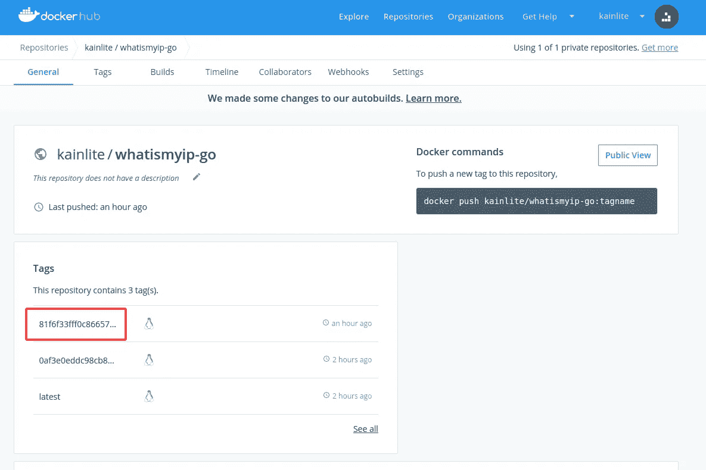

# 继续与 Travis CI 和 Docker 集成

> 原文：<https://itnext.io/go-continuous-integration-with-travis-ci-and-docker-4b26379e54b7?source=collection_archive---------3----------------------->

**简介**

在本文中，我们将了解如何使用 [Github](https://github.com) 、 [Travis-CI](https://travis-ci.org) 和 [Docker HUB](https://cloud.docker.com) 创建一个简单的持续集成流程，这里使用的文件可以在[这里找到](https://github.com/kainlite/whatismyip-go)，在下一篇文章中，我们将继续使用这里的内容来提供持续部署，可能使用 Jenkins，也可能使用 Travis，请告诉我您更喜欢哪一个。

要查看第 2 部分[请点击此处](https://medium.com/@kainlite_32799/go-continuous-delivery-with-terraform-and-kubernetes-c088a65534f1)

**首先要做的事情**

应用

我们将回顾 docker 文件、应用程序代码和 travis-ci 文件，所以让我们从应用程序`main.go`开始:

让我们快速检查一下这段代码做了什么，首先我们检查要使用的端口，然后将它转换成一个数字，为我们的 HTTP 函数注册处理程序并监听请求，这段代码应该打印出我们的 ip 地址，正如您所期望的那样。

然后是`main_test.go`代码:

测试相当简单，它只是通过尝试获取`/`并检查空主体和`200`状态代码来检查 web 服务器是否工作。

码头工人

下一个`Dockerfile`:

我们将工作目录设置为 please go，然后获取依赖项并安装我们的二进制文件，我们还生成一个测试二进制文件，暴露我们想要使用的端口，并将用户设置为 nobody，以防有人可以利用我们的应用程序并跳入我们的容器，然后只需设置命令在`docker run`执行。

特拉维斯

最后但同样重要的是`.travis.yml`文件:

我们让 travis 知道，我们将运行一些 go 代码和 docker，然后构建映像，运行测试，然后初始化应用程序，之后我们验证应用程序是否工作，最后登录 dockerhub 并推送映像，这里需要记住的重要事情是，我们以安全的方式使用变量，例如回购名称、提交 SHA 以及 docker 用户名和密码，因为 travis-ci 隐藏了我们告诉它们的值。

**把所有东西放在一起**

到目前为止，我们已经完成了 [repo](https://github.com/kainlite/whatismyip-go) 的运行、travis 的配置、dockerfile、app，但是现在我们需要使用它，因此您需要创建一个 travis 帐户来运行它，然后将您的 github 帐户链接到它，然后您将能够同步您的存储库，您应该会看到类似这样的内容:

一旦你有你的帐户链接，你将能够同步和启用仓库建立。

启用存储库后，您可以配置一些细节，如环境变量，这里我们将为 dockerhub 设置凭证。

现在我们将在 dockerhub 中创建存储库:

创建存储库后，我们可以从 travis 触发构建，或者将提交推送到 repo，以便触发构建并验证一切正常。

如果一切顺利，你应该在特拉维斯身上看到这样的东西:

您可以通过检查触发构建的提交 SHA 来验证一切顺利。

和 dockerhub:

相同的 SHA 将用于标记图像。

**闭幕词**

我将发布一些关于 CI 和 CD 的文章，以及 DevOps/SREs 应该记住的良好实践、提示、技巧和完整的部署示例，这是可能的两到三篇文章系列的第一部分，首先是 CI 的完整但基本的示例，然后是 CD。这当然可以改变，任何反馈都将不胜感激:)。

一些对特拉维斯和 [docker](https://docs.travis-ci.com/user/docker/) 有用的链接和[环境变量列表](https://docs.travis-ci.com/user/environment-variables/)可以使用。

# 正误表

如果您发现任何错误或有任何建议，请给我发消息，以便解决问题。

此外，您可以在这里查看源代码和[生成代码](https://github.com/kainlite/kainlite.github.io)和[源代码](https://github.com/kainlite/blog)的变化

*最初发布于*[*https://tech squad . rocks*](https://techsquad.rocks/blog/go_continuous_integration_with_travis_ci_and_docker/)*。*