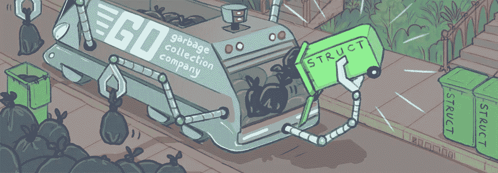
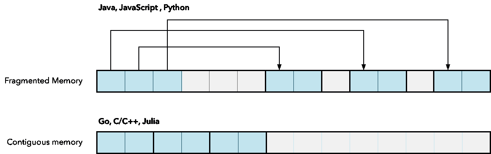
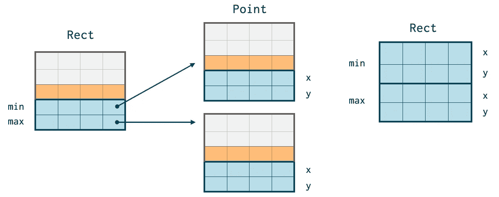

# Go 不需要 Java 风格的 GC

> 原文：<https://itnext.io/go-does-not-need-a-java-style-gc-ac99b8d26c60?source=collection_archive---------0----------------------->

## 为什么 Go 不需要 Java、C#这样花哨昂贵的垃圾收集器？



像 Go、Julia 和 Rust 这样的现代语言不需要像 Java C#那样复杂的垃圾收集器。但是为什么呢？

为了解释原因，我们需要了解垃圾收集器是如何工作的，以及不同的语言如何以不同的方式分配内存。然而，我们将从为什么 Java 特别需要如此复杂的垃圾收集器开始。

我将在这里讨论许多不同的垃圾收集器主题:

*   为什么 Java 如此依赖快速 GC。我将介绍 Java 语言本身的一些设计选择，它们给 GC 带来了很大的压力。
*   内存碎片及其对 GC 设计的影响。为什么这对 Java 很重要，但对 Go 却没那么重要。
*   值类型以及它们如何改变 GC 游戏。
*   分代垃圾收集器和为什么 Go 不需要一个。
*   逸出分析——Go 用来减轻 GC 压力的一个技巧。
*   压缩垃圾收集器——在 Java 世界中很重要，但 Go 却不需要它。为什么？
*   并发垃圾收集——How Go 通过使用多线程运行并发垃圾收集器解决了许多垃圾收集难题。为什么用 Java 很难做到这点。
*   对 Go GC 的常见批评，以及为什么这种批评背后的许多假设往往是有缺陷的或完全错误的。

# 为什么 Java 比任何人都更需要快速 GC

Java 是一种基本上将内存管理完全外包给垃圾收集器的语言。这被证明是一个大错误。然而，为了能够解释为什么，我需要涵盖更多的细节。

让我们从头开始。现在是 1991 年，关于 Java 的工作已经开始。垃圾收集者风靡一时。研究看起来很有希望，Java 的设计者们把赌注压在了高级垃圾收集器上，它们能够解决管理内存中的所有挑战。

因此，Java 中的所有对象都被设计为在堆上分配，整数和浮点值等基本类型除外。当谈到内存分配时，我们通常会区分堆和栈。堆栈使用起来非常快，但是空间有限，并且只能用于在函数调用的生存期之后不需要存在的对象。它只适用于局部变量。堆可用于所有对象。Java 基本上忽略了栈，选择在堆上分配所有东西，除了像整数和浮点数这样的原语。每当你用 Java 写`new Something()`的时候，你都在消耗堆上的内存。

然而，这种类型的内存管理实际上在内存使用方面是相当昂贵的。您可能认为创建一个只有 32 位整数的对象只需要 4 个字节的内存。

```
class Knight {
   int health;
}
```

然而，为了让垃圾收集器工作，Java 存储了一个带有如下信息的头:

*   类型—标识对象的类别或类型。
*   锁定—用于同步语句。
*   标记-在垃圾收集器的标记和扫描面期间使用。

该数据通常总计 16 个字节。因此，标题数据与实际数据的比率为 4:1。Java 对象的 C++源代码定义为: [OpenJDK 基类](http://hg.openjdk.java.net/jdk8/jdk8/hotspot/file/87ee5ee27509/src/share/vm/oops/oop.hpp)。

```
class oopDesc {
    volatile markOop  _mark;   // for mark and sweep
    Klass*           _klass;   // the type
}
```

## 内存碎片

下一个问题是内存碎片。当 Java 分配一个对象数组时，它真正做的是创建一个引用数组，指向内存中其他位置的对象。这些对象最终可能会分散在堆内存中。这对性能不利，因为现代微处理器不读取单个字节的数据。因为启动内存传输很慢，所以每当微处理器试图访问一个特定的内存位置时，它总是读取一个大的连续内存块。



这个内存块被称为缓存行。CPU 有自己的高速内存，称为高速缓存。这比主存小得多。它用于存储最近访问的对象，因为这些对象可能会再次被访问。如果主内存被碎片化，这意味着缓存线将被碎片化，CPU 缓存将被大量无用数据填满。

## Java 如何克服内存碎片

为了解决这些主要的缺点，Java 维护者在高级垃圾收集器上投入了大量的资金。这些做的事情叫做*压实*。压缩包括在内存中移动对象，并将它们收集到内存中的连续块中。这个不便宜。不仅将块从一个内存位置移动到另一个内存位置会消耗 CPU 周期，而且更新对这些对象的每个引用以指向新的位置也会消耗 CPU 周期。

进行这些更新需要冻结所有线程。您不能更新正在使用的参考。这通常会导致 Java 程序完全冻结数百毫秒，在此期间，对象被四处移动，引用被更新，未使用的内存被回收。

## 增加复杂性

为了减少这些长时间的停顿，Java 使用了所谓的*分代垃圾收集器*。这些都基于以下前提:

> 程序中分配的大部分值很快就被用完了，所以 GC 花更多的时间查看最近分配的对象是有好处的。

这就是为什么 Java 把它们分配对象分成两组:

*   旧对象—经历了 GC 的多次标记和清除操作的对象。在每次标记和扫描时更新世代计数器，以跟踪对象的年龄。
*   年轻对象—这些对象的世代计数器较低。这意味着它们是最近才被分配的。

Java 更主动地调查最近分配的对象，并检查它们是否应该被回收或移动。随着对象的老化，它们被移出年轻一代区域。

所有这些自然会增加复杂性。它需要更多的发展。它需要为更有才华的开发人员付费，花费更多的钱。

# 现代语言如何避免和 Java 一样的陷阱

现代语言不需要像 Java 和 C#那样复杂的垃圾收集器。这是因为它们没有被设计成在相同程度上依赖它们。

```
// Go: Make an an array of 15 000 Point objects in**type** Point **struct** {
    X, Y int
}**var** points [15000]Point
```

在上面的 Go 代码示例中，我们分配了 15 000 个`Point`对象。这只是一次分配，产生一个指针。在 Java 中，这需要 15 000 个单独的分配，每个分配产生一个必须被管理的单独的引用。每个`Point`对象都会得到我之前提到的 16 字节的头开销。无论是在围棋，朱莉娅或 Rust 你得到这个开销。这些对象通常是无头的。

在 Java 中，GC 需要跟踪和管理 15 000 个独立的对象。Go 只有一个要跟踪的对象。

## 值类型

这在其他语言中之所以可能，是因为它们支持值类型。下面的代码定义了一个矩形，用一个`Min`和`Max`点定义它的范围。

```
**type** Rect **struct** {
   Min, Max Point
}
```

这成为一个连续的内存块。在 Java 中，这将变成一个引用两个独立对象的`Rect`对象，即`Min`和`Max`点对象。因此，在 Java 中，`Rect`的一个实例需要 3 次分配，但在 Go、Rust、C/C++和 Julia 中只需要 1 次分配。



左边是 Java 风格的内存碎片。在右边连续的内存块可能在 Go，C/C++，Julia 等。

将 Git 移植到 Java 时，值类型的缺乏造成了严重的问题。没有值类型，很难获得好的性能。正如 Shawn O. Pearce [在 JGit 开发者邮件列表上的评论](https://marc.info/?l=git&m=124111702609723):

> JGit 苦于没有有效的方法来表示阿沙-1。c 可以只说`unsigned char[20]`并将它内联到容器的内存分配中。Java 中的一个`byte[20]`将消耗*额外的* 16 字节内存，并且访问速度较慢，因为字节本身与容器对象位于不同的内存区域。我们试图通过将一个`byte[20]`转换为 5 个整数来解决这个问题，但这需要我们花费机器指令。

我们在那里谈论什么？在 Go 中，我可以做和 C/C++一样的事情，定义一个这样的结构:

```
**type** Sha1 **struct** {
   data [20]byte
}
```

这些字节将成为一块内存的一部分。Java 会创建一个指向内存中其他地方的指针。

Java 开发人员意识到他们搞砸了，并且你真的需要值类型来获得好的性能。你可以说这种说法有些夸张，但是你需要解释一下瓦尔哈拉项目。这是 Oracle 为 Java 提供值类型而率先做出的努力，他们阐述的这样做的原因正是我在这里所说的。

## 值类型是不够的

那么*项目会解决 Java 的问题吗？不完全是。它将简单地把 Java 放在与 C#平等的地位上。C#比 Java 晚出现了几年，并且已经意识到垃圾收集器并不像大家想象的那么神奇。因此他们增加了值类型。*

然而，就内存管理灵活性而言，这并没有将 C#和 Java 与 Go 和 C/C++等语言放在同等的位置上。Java 不支持真正的指针。在围棋中，我可以写出这样的东西:

```
// Go pointer usage**var** ptr *Point = &rect.Min // Store pointer to Min in ptr
*ptr = Point(2, 4)         // replace rect.Min
```

你可以像在 C/C++中一样，在 Go 中获取对象或对象字段的地址，并将其存储在一个指针中。然后，您可以传递这个指针，并使用它来修改它所指向的字段。这意味着您可以在 Go 中创建大值对象，并将其作为指针传递给函数以优化性能。对于 C#来说，情况稍微好一点，因为它对指针的支持*有限*。前面的 Go 示例可以用 C#写成:

```
// C# pointer usage**unsafe** **void** foo() {
   Rect* ptr = &rect.Min;
   *ptr = new Point(2, 4);
}
```

然而，C#指针支持附带了许多不适用于 Go 的警告:

1.  代码使用点必须标记为**不安全**。这使得代码安全性更低，更有可能崩溃。
2.  在堆栈上分配的纯值类型(所有结构字段必须是值类型)。
3.  在**固定的**范围内，使用 fixed 关键字关闭垃圾收集。

因此，在 C#中使用值类型的正常而安全的方法是复制它们，因为这不需要定义不安全或固定的代码区域。但是对于较大的值类型，这可能会产生性能问题。围棋没有这些问题。您可以在 Go 中创建由垃圾收集器管理的对象的指针。你不需要像在 C#中一样，在 Go 中使用指针来隔离代码。

## 自定义辅助分配器

有了合适的指针，你可以做很多事情，这在你只有值类型时是不可能的。一个例子是创建次级分配器。[这里的](https://github.com/ordovician/arena)是一个使用 Go 泛型创建的竞技场分配器的例子。

```
**type** Arena[T any] **struct** {
    blocks Stack[*T]
}**func** (arena *Arena[T]) Alloc() *T {
    **if** arena.blocks.IsEmpty() {
        **var** blocks [32]T     // allocate 32 elements at a time
        **for** i, _ := **range** blocks {
            arena.blocks.Push(&blocks[i])
        }
    }
    b, _ := arena.blocks.Top()
    arena.blocks.Pop() **return** b
}
```

这些为什么有用？如果你查看生成二叉树的算法的微基准，你通常会发现 Java 比 Go 有很大的优势。这是因为二叉树算法通常用于测试垃圾收集器在分配对象时的速度。Java 在这方面非常快，因为它使用了我们所说的 bump 指针。它只是增加一个指针，而 Go 将在内存中搜索合适的位置来分配对象。然而，使用 Arena 分配器，您也可以在 Go 中快速构建二叉树。

```
**import** "golang.org/x/exp/constraints"**type** Tree[K constraints.Ordered, V any] **struct** {
    Root      *TreeNode[K, V]
    allocator Arena[TreeNode[K, V]]
}**func** (tree *Tree[K, V]) NewNode(key K, value V) *TreeNode[K, V] {
    n := tree.allocator.Alloc()
    n.Key = key
    n.Value = value
    n.left = nil
    n.right = nil **return** n
}**func** (tree *Tree[K, V]) Insert(key K, value V) {
    n := tree.NewNode(key, value) **if** tree.Root == nil {
        tree.Root = n
    } **else** {
        tree.Root.Insert(n)
    }
}
```

这就是为什么拥有真正的指针有好处。没有它，就不能在连续的内存块中创建指向某个元素的指针。在`Alloc`方法中，我们创建了一个由 32 个元素组成的连续块。然后，我们将指向该块中每个元素的指针存储在一个堆栈中，该堆栈包含一个可供分配的块列表。

```
**var** blocks [32]T
**for** i, _ := **range** blocks {
    arena.blocks.Push(&blocks[i])
}
```

这是唯一可能的，因为我可以选择一个任意元素`blocks[i]`并获得指向该元素`&blocks[i]`的指针。Java 没有给你这种可能性。

# Java 缓冲分配器的问题

Java GC 使用的 bump 分配器类似于 Arena 分配器，只是增加一个指针来获得下一个值。除了你不需要自己建造它。这似乎更聪明。但是它导致了 Go 中避免的几个问题:

1.  迟早你需要做*压缩*，这涉及到移动数据和固定指针。竞技场分配者不需要这么做。
2.  在多线程程序中，冲击分配器需要锁(除非您使用线程本地存储)。这扼杀了它们的性能优势，要么是因为锁降低了性能，要么是线程本地存储将导致碎片，这需要稍后进行压缩。

Go [的创始人之一伊恩·兰斯·泰勒澄清了凹凸分配器](https://groups.google.com/g/golang-nuts/c/KJiyv2mV2pU)的问题:

> 一般来说，使用一组基于线程的缓存来分配内存可能会更有效，此时您就失去了 bump 分配器的优势。所以我断言，总的来说，虽然有很多警告，但是现在对多线程程序使用压缩内存分配器并没有真正的优势。

# 分代 GC 和逸出分析

Java 垃圾收集器有更多的工作要做，因为它分配了更多的对象。为什么？我们刚刚讨论过了。如果没有值对象和真正的指针，在分配大型数组或复杂的数据结构时，最终总是会有大量的对象。因此，它需要一个分代 GC。

分配更少对象的需求对 Go 有利。但是围棋还有另外一个技巧。Go 和 Java 在编译函数时都会做所谓的*转义分析*。

逸出分析包括查看在函数内部创建的指针，并确定该指针是否逸出了函数范围。

```
**func** escapingPtr() []int {
   values := []int{4, 5, 10}
   **return** values
}

**fun** nonEscapingPtr() int {
    values = []int{4, 5, 10}
    **var** total int = addUp(values)
    **return** total
}
```

在第一个例子中，`values`指向一个片，本质上与指向数组的指针相同。它因为被返回而转义。这意味着`values`必须在堆上分配。

然而，在第二个例子中，没有指向`values`的指针离开过`nonEscapingPtr`函数。因此`values`可以在堆栈上分配，这是非常快速和廉价的。转义分析本身只是分析一个指针是否转义。

## Java 转义分析的局限性

Java 也能逃脱分析，但是对它的使用有更多的限制。[摘自 Java SE 16 Oracle 文档](https://docs.oracle.com/en/java/javase/16/vm/java-hotspot-virtual-machine-performance-enhancements.html#GUID-6BD8FCB5-995B-4AE9-BFAA-B2C7DE2BA5CD)，涵盖了 HotSpot 虚拟机:

> 对于没有全局转义的对象，它不会用堆栈分配替换堆分配。

然而，Java 使用了另一种叫做*标量替换的技巧，*它避免了将对象放入堆栈的需要。本质上，它分解 object 并将其原始成员放入堆栈。记住 Java 已经可以把原始值比如`int`和`float`放到堆栈上了。然而，实际上标量替换即使在非常小的情况下也不起作用，正如[Piotr koaczkowski](https://pkolaczk.github.io/)在 2021 年发现的。

相反，主要优点是避免了锁定。如果你知道指针不在函数外使用，你也可以确定它不需要锁。

## Go 转义分析的优势

但是，Go 使用转义分析来确定哪些对象可以分配到堆栈上。这大大减少了受益于分代 GC 的短命对象的数量。请记住，分代式 GC 的全部意义在于利用最近分配的对象存在时间很短这一事实。然而，Go 中的大多数对象很可能会长寿，因为短命的对象很可能会被转义分析捕获。

与 Java 不同，这也适用于复杂对象。Java 通常只能成功地对像字节数组这样的简单对象进行转义分析。即使内置的`ByteBuffer`也不能使用标量替换在堆栈上分配。

# 现代语言不需要压缩 GC

你可以读到很多垃圾收集器方面的专家声称，由于内存碎片，Go 比 Java 更有可能耗尽内存。争论大概是这样的:因为 Go 没有压缩垃圾收集器，所以随着时间的推移，内存会变得支离破碎。当记忆碎片化的时候，你将会到达一个点，在那里将一个新的物体放入记忆变得困难。

然而，由于两个原因，这个问题大大减少了:

1.  Go 不像 Java 那样分配那么多微小的对象。它可以将大型对象数组作为单个内存块来分配。
2.  现代的内存分配器，如谷歌的 TCMalloc 或英特尔的可扩展 Malloc，不会对内存进行分段。

回到 Java 设计的时候，内存碎片是内存分配器的一个大问题。人们认为这个问题无法解决。但是甚至早在 1998 年，Java 问世后不久，研究人员就开始解决这个问题。这里有一篇来自马克·s·约翰斯通和保罗·r·威尔逊的论文:

> 这大大加强了我们以前的结果，表明内存碎片问题通常被误解，良好的分配器策略可以为大多数程序提供良好的内存使用。

因此，为 Java 设计内存分配策略的许多假设已经不再成立。

# 分代 GC 与并发 GC 暂停

使用分代 GC 的 Java 策略旨在缩短垃圾收集周期。记住 Java 必须停止一切来移动数据和修复指针。如果持续时间太长，会降低性能和响应能力。有了分代 GC，每次检查的数据就更少了，从而减少了检查时间。

然而，Go 通过许多替代策略解决了相同的问题:

1.  因为不需要移动内存，也不需要固定指针，所以在 GC 运行期间需要做的工作更少。Go GC 只做标记和扫描:它在对象图中寻找应该释放的对象。
2.  它同时运行。因此，一个单独的 GC 线程可以在不停止其他线程的情况下寻找要释放的对象。

为什么可以同时运行 GC 而不是 Java？因为 Go 不修复任何指针，也不移动内存中的任何对象。因此，尝试访问指向刚被移动的对象的指针是没有风险的，但是该指针还没有被更新。不再对其有任何引用的对象不会由于一些并发线程的运行而突然获得引用。因此，并行移除死物体是没有危险的。

这将如何发展？假设你有 4 个线程在一个 Go 程序中工作。其中一个线程在某个任意的时间段`T`秒内进行了总计 4 秒的临时 GC 工作。

现在想象一个 Java 程序，一个 GC 只做了 2 秒钟的 GC 工作。哪个程序挤出的性能最多？谁在`T`秒内完成的工作最多？听起来像 Java 程序，对吗？不对！

Java 程序中的 4 个工作线程的所有工作都停止了 2 秒钟。这意味着 2×4 = 8 秒的工作在`T`间隔中丢失。因此，虽然 Go 停止的时间更长，但每次停止影响的工作更少，因为不是所有的线程都停止了。因此，一个缓慢的并发 GC 可能会优于一个依靠停止所有线程来完成工作的快速 GC。

## 如果垃圾产生的速度比 Go 清理垃圾的速度还快怎么办？

反对当前垃圾收集器的一个流行观点是，活动工作线程产生垃圾的速度可能会快于垃圾收集器线程收集垃圾的速度。在 Java 世界中，这被称为“并发模式故障”。

据称，在这种情况下，运行时别无选择，只能完全停止程序，等待 GC 周期完成。因此，当 Go 声称 GC 暂停非常低时，这种说法只适用于 GC 有足够的 CPU 时间和空间来超过主程序的情况。

但是 Go 有一个巧妙的技巧来绕过这种由 Go GC 大师 Rick Hudson 描述的[。围棋使用的是所谓的步行者。](https://blog.golang.org/ismmkeynote)

> 如果需要，步行者在加速标记的同时减慢分配。在一个高层次上，步行者停止了正在进行大量分配的 Goroutine，并让它进行标记工作。工作量与 Goroutine 的分配成正比。这加快了垃圾收集器的速度，同时降低了变异函数的速度。

Goroutines 有点像线程池中复用的绿色线程。基本上，Go 接管运行产生大量垃圾的工作负载的线程，并让它们帮助 GC 清理垃圾。它将继续接管线程，直到 GC 运行得比产生垃圾的例程更快。

# 总之

虽然高级垃圾收集器解决了 Java 中的实际问题，但现代语言如 Go 和 Julia 已经简单地避免了在一开始就产生这些问题，从而消除了使用劳斯莱斯垃圾收集器的需要。当您拥有值类型、转义分析、指针、多核处理器和现代分配器时，那么 Java 设计背后的许多假设都将不复存在。它们不再适用。

# 假设的 GC 权衡不再适用

迈克·赫恩在 Medium 上有一个非常受欢迎的故事，批评关于 Go GC 的说法:[现代垃圾收集。](https://blog.plan99.net/modern-garbage-collection-911ef4f8bd8e)。

赫恩的关键信息是，在 GC 设计中总是有权衡。他的观点是，由于 Go 的目标是低延迟收集，他们将在许多其他指标上受到影响。这是一篇有趣的文章，因为它涵盖了很多关于 GC 设计中权衡的细节。

首先，我所说的低延迟是什么意思？与花费数百毫秒的各种 Java 收集器相比，Go GC 平均只暂停大约 0.5 毫秒。

我认为 Mike Hearn 的论点的问题在于，它们基于一个有缺陷的前提，即所有语言的内存访问模式都是相同的。正如我在这篇文章中提到的，这是不正确的。Go 将产生更少的由 GC 管理的对象，并且它将使用 escape 分析尽早清理它们。

## 老技术本来就不好？

赫恩提出的论点表明，简单的收集从某种程度上来说是有害的:

> Stop-the-world (STW)标记/清扫是大学计算机科学课程中最常教授的 GC 算法。在做工作面试的时候，我有时会让候选人谈一点关于 GC 的事情，几乎总是，他们要么把 GC 看作一个黑箱，对它一无所知，要么认为它仍然使用这种非常古老的技术。

是的，它可能已经过时了，但是这种技术允许您同时运行 GC，这是“现代”技术所不允许的。在现代多核硬件世界中，这一点更为重要。

## Go 不是 C#

另一个说法:

> 由于 Go 是一种具有值类型的相对普通的命令式语言，它的内存访问模式可能与 C#相当，在 C #中世代假设肯定成立，因此。NET 使用分代收集器。

事实并非如此。C#开发人员会尽量减少使用较大值的对象，因为与指针相关的代码不能安全使用。我们必须假设 C#开发人员更喜欢复制值类型，而不是使用指针，因为这可以在 CLR 中安全地完成。这自然会带来更高的开销。

据我所知，C#也没有利用转义分析来减少堆上短期对象的产生。其次， [C#不擅长同时运行许多任务](https://alexyakunin.medium.com/go-vs-c-part-1-goroutines-vs-async-await-ac909c651c11)。Go 可以利用它们的协同程序来加速并发收集，就像 Pacer 提到的那样。

## 压紧

> 压缩:因为没有压缩，你的程序最终会把它的堆分成碎片。我将在下面详细讨论堆碎片。将东西整齐地放在缓存中也不会让你受益。

在这里，Mike Hearn 只是没有更新分配器的当前状态。TCMalloc 等现代分配器基本消除了这个问题。

> 程序吞吐量:由于 GC 必须在每个周期做大量的工作，这从程序本身窃取了 CPU 时间，降低了程序的速度。

当您有并发 GC 时，这并不适用。所有其他线程都可以在 GC 工作的时候继续运行——不像 Java，它必须停止整个世界。

## 堆开销

赫恩提出了“并发模式失败”的问题，假设 Go GC 将冒跟不上垃圾产生者的风险。

> 堆开销:因为通过标记/清除收集堆非常慢，所以您需要大量的空闲空间来确保您不会遭受“并发模式故障”。Go 默认的堆开销是 100% …它使你的程序需要的内存加倍。

我对这种说法持怀疑态度，因为我看到的许多现实世界的例子似乎表明围棋程序使用更少的内存。更不用说这忽略了步行者的存在，步行者会抓取产生大量垃圾的 Goroutines 并让它们去清理。

# 为什么低延迟对 Java 也很重要

我们生活在一个 docker 容器和微服务的世界里。这意味着许多更小的程序相互通信和工作。想象一下工作通过几个服务。每当一个链中的其中一个服务出现重大停顿时，就会产生连锁反应。它会导致所有其他进程停止工作。如果管道中的下一个服务正在等待一个忙于垃圾收集的服务，则该服务无法工作。

因此，延迟/吞吐量的权衡不再是 GC 设计中的权衡。多个服务协同工作时，高延迟将导致吞吐量下降。Java 对高吞吐量和高延迟 GC 的偏好适用于 monolith 世界。它不再适用于微服务领域。

这是迈克·赫恩的论点的一个根本问题，即没有灵丹妙药，只有权衡。它试图给人这样一种印象，即 Java 权衡同样有效。但是权衡必须适应我们生活的世界。

简而言之，我认为可以公平地说，Go 做出了许多明智的举动和战略选择。就像这只是任何人都可能做出的权衡一样，挥挥手，并不能解决问题。