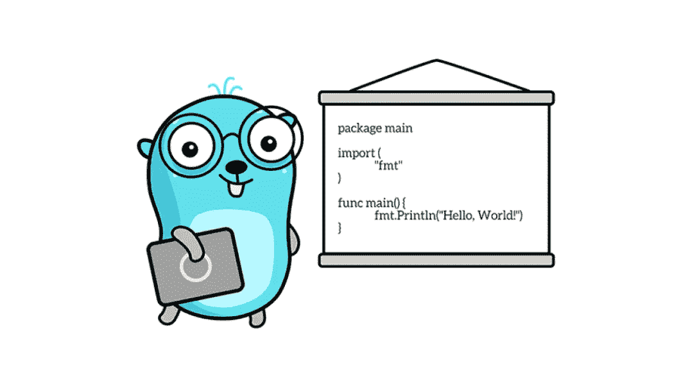

# Go:函数、方法、指针和接口

> 原文：<https://itnext.io/go-functions-methods-pointers-and-interfaces-1c034fd198d3?source=collection_archive---------0----------------------->

## 在一个简单的例子中



由 Renee French 创建的原始地鼠图像，使用由 Maria Letta 创建的地鼠图像

这篇文章是专门为我的儿子写的，他很难理解如何使用指针和接口。

为了使解释完整，我(在他的帮助下)添加了两件事:函数和方法。我认为这两个是指针和/或接口的补充。反之亦然。

本解释分为六个部分，每一部分都是对前一部分的补充。我试图让一切尽可能简单。如果您发现错误，请不要犹豫，提出意见。

# 1.基础知识

我们将从非常简单的事情开始。我们正在创建两个结构:`Car`和`Truck`。两者都有一个领域`name`。

在一个代码中，我们将创建两个变量，即`bmw`和`volvo`，并带有一个字段`name`。然后我们将打印变量`name`。

如你所见，这里没什么特别的。希望这是您在运行代码时看到的结果。

```
bmw is the best car
volvo is the best truck
```

# 2.用函数改变名字，传递一个值

假设我们想要更改`name`字段，并再次打印结果。我们有多种选择，如何做到这一点，在这个特定的例子中，我们将使用简单的函数“传递值”，或“传递整个结构”。

如你所见，我们需要创建两个函数，即`changeNameOfCar()`和`changeNameOfTruck()`。

在代码中(第 17、18 行),我们使用这些新函数改变了这两个变量的`name`字段。

这两个函数返回带有附加信息`“\n\t… changed with simple function`的名称。

如果您运行代码，这就是您将看到的结果。

```
bmw is the best car
        ... changed with simple function
volvo is the best truck
        ... changed with simple function
```

正如您所看到的，我们通过调用适当的函数并将值传递给它，成功地更改了变量`bmw`和`volvo`的字段`name`。

在这种情况下，我们传递了整个变量`bmw`和`volvo`。在这两个函数`changeNameOfCar()` 和`changeNameOfTruck()`中，我们使用`bmw`和`volvo`变量的副本来处理**。**

为了对原来的变量进行更改，我们需要将更改后的`name`返回，并将其赋给原来的`bmw.name`和`volvo.name`。

先前方法的“问题”是基于“记忆”的。如果你有一个包含数百万个字段的巨大结构，将包含数百万个字段的变量传递给那个函数是不明智的。第一种方法是只传递您想要更改的字段，如`bmw.name`，第二种方法是传递一个指向该变量的指针。

# 3.使用指针通过函数更改名称

首先，什么是指针？

想象一下。你有辆车，那辆宝马。那是一个物理对象。那辆车就停在某个地方。某个地方有地址，比如 123 城市 12 街。

这个地址是一个指针，指向汽车的物理位置。

从这个角度来看，如果你有你的车停在那个地址的家里，你希望有人只是检查一下，如果车是好的(因为你在度假)，你可以简单地告诉某人“你能检查一下，我的车在 123 城市 12 街真的在那里吗？”。123 城市的 12 号街道是你汽车的指针。你开车的地方是物理上的，嗯，那是宇宙中的一个物理位置。

如果你有一个变量 bmw，它在你的计算机内存中占据了一个位置，你也有一个地址，一个指向那个位置的指针。

这意味着:如果你有一个有数百万字段的变量，你想用一个函数来使用和/或改变这个变量，你可以简单地传递一个指针到内存中的一个位置，这个变量的位置。不需要传递整个变量。

下面是第 19–20 行的两个新函数的代码。

这两个新功能`changeNameOfCarUsingPointer()`和`changeNameOfTruckUsingPointer()`。如你所见，你没有将变量`bmw`和`volvo`传递给这些函数，而是传递了指针`&bmw`和`&volvo`。只是这两个变量所在的内存位置的地址。仅此而已。

因为你传递的是指向你的变量的指针，所以你是在这两个新函数中直接使用原来的变量，而不是使用一个副本！

这意味着没有必要像我们在第 17–18 行所做的那样，将`bmw.name`和`volvo.name`改回来。这也意味着不需要从这两个新函数返回一些东西。

通过传递一个值，您正在使用原始变量的副本。要对原始变量进行更改，您需要从函数发回更改的内容。

通过传递一个指针，你就可以使用那个原始变量的内存位置。您在此函数中所做的任何更改都会影响原始变量。

也许你在问，哪种方法更好。传递值，还是传递指针？答案是:都不是。两者各有利弊。

我个人的简单方法是这样的:如果变量很小(从内存的角度来看)，就像那个`volvo`和`bmw`变量，我会一直传递值。以确保函数不会影响原始变量。假设这是我的安全视角。

但是如果我有一个很大的变量，比如一个 10MB 的变量，有几百万个字段(请举例说明)，我想改变其中的很多字段，我会传递指针，因为我不想在内存中再复制一个 10MB 的变量。

如果您运行上面的代码，您将看到结果。

```
bmw is the best car
 … changed with simple function
 … changed using pointer
volvo is the best truck
 … changed with simple function
 … changed using pointer
```

# 4.用方法改变名字，传递一个值

首先，我们需要区分方法和函数。这种差异主要是语法上的，但也有一个微妙的功能上的差异，您将在后面看到。

如果使用函数来处理结构变量，语法如下:

```
nameOfFunction(variable)
```

如果使用方法处理结构变量，语法如下:

```
variable.nameOfMethod()
```

正如您所看到的，从文本的角度来看，我们只是交换了变量的位置和函数/方法的名称。一般来说，这就是区别所在，因为你可以用函数做的一切，都可以用方法来做。但是正如我所写的，有一个小的不同，你会看到。

现在，我们将使用一种方法通过传递值来更改变量名。参见下面的代码。

这两个新方法在第 21–22 行。当你在第 44–50 行检查它们的实现时，你可以观察到它们的实现和函数一样，都是传递值。

从这个角度来看，功能是相同的，当您运行代码时，您将看到结果。

```
bmw is the best car
        ... changed with simple function
        ... changed using pointer
        ... changed with method
volvo is the best truck
        ... changed with simple function
        ... changed using pointer
        ... changed with method
```

但是现在关于这些差异。

我们写道，我们的第一个函数是`changeNameOfCar()`，我们在其中传递了整个`volvo`变量，所以它看起来和功能都像`changeNameOfCar(volvo)`。但是不需要传递整个变量，你可以做一个类似于`changeNameOfCar(volvo.name`的函数，只把`volvo.name`传递给那个函数(当然，你必须适当地调整函数。

但是通过使用方法`volvo.changeNameUsingMethod`，你不可能只传递名字，你不能像`volvo.name.changeNameUsingMethod()`那样使用它。

通过使用方法，您正在处理整个变量。因为我们传递的是值，所以你是在处理这个变量的一个新副本。就像函数一样，我们需要返回一些东西，并把它们赋回给原来的函数。

也许你已经发现了另一个不同之处。对于函数，通常不能对两种不同类型的变量使用相同的名称。您不能将`changeName()`用于`Truck`和`Car`。

但是，如您所见，您可以对不同类型的变量使用相同的方法名。但是您需要为这两个变量实现这个方法(第 44–50 行)。两个方法，名称相同，输入类型不同。

所以你可以有`volvo.ChangeName()`、`bmw.ChangeName()`、`elonMusk.ChangeName()`和/或`Quercus.ChangeName()`、*。*四种不同方法的一个名称。

当我们稍后处理接口时，这将是有用的。

# 5.用方法改变名字，传递一个指针

到目前为止，您有望理解传递值和传递指针之间以及函数和方法之间的区别。

还缺少最后一部分:使用方法和传递指针。就像是利用了那两个世界的精华。

这是更新后的代码，在第 23–24 行有这两个新函数。

代码几乎是一样的，但是因为我们传递的是指针，所以不需要从方法返回一些东西，并把这些东西赋给原始变量。

此外，我们在实现中没有使用`(t Truck)`，而是使用了指针，即`(t *Truck)`。请确保在使用方法时总是检查这一点，因为在使用方法时没有像在`changeNameOfCarUsingPointer(&bmw)`中那样传递指针`&variable`。使用方法时没有`&`。

运行代码并查看结果。

```
bmw is the best car
        ... changed with simple function
        ... changed using pointer
        ... changed with method
        ... changed with method using pointer
volvo is the best truck
        ... changed with simple function
        ... changed using pointer
        ... changed with method
        ... changed with method using pointer
```

# 间奏曲

到目前为止，我们有四种可能的方法来处理一个问题，改变一个变量的名字，在这种情况下:

1.  函数，值(更安全，但是复制数据)
2.  函数，指针(不安全—您正在更改原始数据，但不是复制数据)
3.  方法，值(相同的 like 函数，但是你总是复制整个变量，你可以对不同类型的变量使用相同的名字)
4.  方法、指针(与函数和指针一样，与 previous 一样，您可以反复使用相同的名称)

# 6.使用界面

假设您想创建一个带有“子类型”的类型`Vehicle`，比如`Car`、`Truck`、`Motorcycle`等等。你想创建这种类型`Vehicle`的原因是:在代码的某个地方，你想创建一个所有这些车辆的数组，并在一个循环中改变它们的名字，使用已经为`Car`和`Truck`编写的方法。

如下面的代码所示，我们正在创建一个数组`vehicles`并添加已经创建的`volvo`和`bmw`。

```
var vehicles []Vehicle
vehicles = append(vehicles, &bmw)
vehicles = append(vehicles, &volvo)

for _, vehicle := range vehicles {
   vehicle.changeNameUsingMethodWithPointer()
}
```

问题是，我们的代码中没有类型`Vehicle`。第二个问题是…我们如何将已经编写好的`Car`和`Truck`方法与不存在的`Vehicle`方法结合起来。

如果你插入代码，你会看到红色的曲线，表明有问题。

去救援吧。

上面是完整的代码，如你所见，除了上面的 7 行(数组和循环)，我们在第 13-15 行只添加了三行:

```
type Vehicle interface {
   changeNameUsingMethodWithPointer()
}
```

这三行新代码创建了一个名为`Vehicle`的接口。把它当作所有标准结构的“主类型”，在这个例子中是`car`和`truck`。这个接口只有一个方法`changeNameUsingMethodWithPointer()`。我们已经为`Car`和`Truck`实现了这个方法。

也就是说，你现在可以把`bmw`和`volvo`当成`Vehicle`了。

这也意味着，你可以创建一个不同类型变量的数组，你可以把所有这些不同类型的变量当作一类，也就是`Vehicle`，在这种情况下。

如果您现在运行代码，您可以看到我们使用指针的方法为`bmw`和`volvo`分别调用了两次。第一次在第 27–28 行，第二次在第 35 行的循环中。

```
bmw is the best car
        ... changed with simple function
        ... changed using pointer
        ... changed with method
        ... changed with method using pointer
        ... changed with method using pointer
volvo is the best truck
        ... changed with simple function
        ... changed using pointer
        ... changed with method
        ... changed with method using pointer
        ... changed with method using pointer
```

# 摘要

这是停下来让你试验的恰当时机。没有必要让这篇文章变得更复杂。

您可以同时使用传递值和指针。

您可以尝试返回多个值。

可以玩围棋的`reflect`。

你可以把更多的东西组合在一起，以`bmw.ChangePatrametersTo(name: “My brand new car”, date: "14.8.2021", diary: &allCarsIHave)`结束。

你可以做很多事情。

但是你需要从头开始理解它，我希望这篇文章能帮助你。

如果你想了解围棋，你可以阅读[彼得·贾霍达](/7-reasons-you-should-try-use-go-5fb4714015d1)写的这篇文章。

而且如果想查一些实际的东西，还有[彼得·贾霍达](https://medium.com/u/6f72c855da06?source=post_page-----1c034fd198d3--------------------------------)的 [10 集教程](https://medium.com/swlh/create-go-service-the-easy-way-de827d7f07cf)。